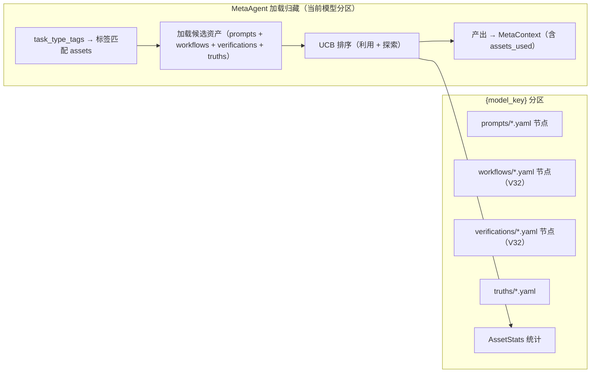
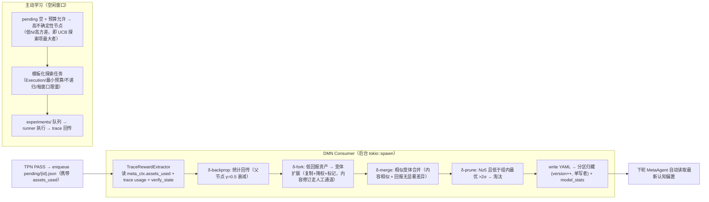

# BCP-DMN：归藏认知演化（Deep Memory Network）

> 本文档是 taiji 蓝图 DMN 部分的完整设计，与 [`BCP-蓝图-完型协议.md`](./BCP-蓝图-完型协议.md)（设计哲学 + TPN↔DMN 关系 + 版本历史）和 [`BCP-TPN.md`](./BCP-TPN.md)（任务处理网络）配套。
> **§ 编号全局唯一**（延续主 BCP 编号体系），跨文档引用不变；§1 设计哲学与 §2 系统概览见主 BCP。

---

## 6. 归藏 (Guizang) 认知仓库

> 归藏 = 规范性本体论（验证契约库 + 生成资产库）。TPN 执行期只读，DMN Consumer 单写者（§8.3）；检索 / 演化 / 贝叶斯后验 / 真值维护见下。验证消费侧（ContractEngine 执行）见 [`BCP-TPN.md`](./BCP-TPN.md) §6 / §8.22。

### 6.0 本体论定性（V33 重构）

**归藏 = 本体论工程：验证契约库 + 生成资产库。** 归藏不是 RAG 知识库（检索→增强→生成的单向管线），而是 TPN 阴面收敛验证的符号基础——领域的形式化表示：

| 本体论概念 | 归藏载体 | 工程含义 |
|------|------|------|
| **TBox**（概念/类/属性/关系/公理） | `verifications/`（结构化 checks）+ `truths/`（硬约束） | 「什么算验证通过」是**形式化声明**，不是 LLM 的自由裁量 |
| **ABox**（实例断言） | 每次 TPN 执行产生的 deliverables / trace / ContractReport | 每次执行 = 一次 ABox 填充 + 一次契约判定 |
| **规则/公理** | CheckSpec（可机械执行的检查项） | 条件 + 检查动作 + 通过标准，机器可执行 |

**ABox 证据链（V34，委托-代理机制设计）**：ABox 断言（产出中的事实性陈述）必须与**执行轨迹**（trace.jsonl `tool_call::*` 记录）绑定——「声称调研了 5 个竞品」须有 webfetch/search 记录佐证。这是博弈论**机制设计**（激励相容：让诚实成为占优策略，非均衡求解）在 taiji 的落位：委托-代理框架下用户（委托人）无法观察 agent（代理人）努力程度，代理人有权偷懒（编造代替调研）——解决不靠更强 LLM 裁决，而靠**把编造成本显式化**：虚假证据引用 = 机械失败（hard 短路）；无证据 = 必须标 `(推测)` + 推测占比进质量信号（DMN 降权）；真实证据 = 唯一稳定通过路径。**V33 定论划界**：事实真伪裁决（需 ground truth）仍不可由同源 LLM 完成，但**一致性检查（断言 vs 执行轨迹）不需要 ground truth**——恰好落在定论边界之外，机械可判定。

**阴轨资产升级为结构化契约（V33）**：verifications/ 资产从自由文本（验证工具选择 + 验收判据）升级为 `checks: Vec<CheckSpec>`（§4 VerificationAsset/CheckSpec）——契约的最小单元是**检查项**，每个检查项有 kind（file_exists / schema_valid / reference_resolves / command_succeeds / llm_judgement）、target（相对 deliverables/ 的路径或 glob）、severity（hard/soft）。**hard 检查项失败 = 验证失败，LLM 不可翻案；llm_judgement 是唯一留给 LLM 的检查项类型**（语义合理性、设计决策评审等符号层无法表达的部分）。

**DMN 演化的对象是契约有效性，不是提示词文本（V33 修正）**：MCTS 统计精确到检查项（每项通过率 / 耗时 / token 成本），四算子操作契约空间——backprop = 检查项通过率回传，fork = 新的契约假设（放宽/收紧判据），merge = 相似契约合并，prune = 低效/无效契约淘汰（§6.4 修订 / §8.21）。

**与数据本体论（Palantir 五层）的边界（V33 澄清，防误搬）**：taiji 的「本体论工程」是**规范性本体论**（规范行为验证：什么算通过、什么工作流有效），不是数据本体论（如 Palantir 五层——描述外部实体及其关系的升维架构）。镜像映射：

| Palantir 五层（数据升维） | taiji 对应物 | 吸收/拒绝 |
|---|---|---|
| L1 存在层：数据→对象双射 | truths/ 硬约束 + TPN 产出的 ABox 实例（deliverables） | 对应：概念存在与实例断言 |
| L2 关系层：属性图 G=(V,E) | 资产树 parent_id/variant_of + tags 索引 | **拒绝图结构**：V22 已删关系引擎，MCTS 树 + 标签索引足够，图引入无谓复杂度 |
| L3 时间层：状态空间演化 | AssetStats 随版本累积（backprop γ=0.5 衰减） | 对应：统计即时间沉淀，不做时序模型 |
| L4 逻辑层：FOL 公理 + 推理器 | CheckSpec + ConstraintEngine 机械执行 | 部分吸收：检查项是**可判定断言**的子集——符号层只做机械可判定检查，不做演绎推理（无推理器） |
| L5 智能层：嵌入向量空间 | LLM（唯一嵌入源） | 对应：不建向量库，语义层即 LLM |

**关键差异**：① 描述性 vs 规范性——Palantir 回答「世界是什么」，taiji 回答「什么算验证通过」；② 外部数据源 vs 自我执行轨迹——taiji 本体论从自身 TPN 轨迹统计演化（DMN），不依赖外部知识注入；③ 静态基础设施 vs 演化对象——Palantir 图谱稳定，taiji 资产是 MCTS 变体竞争。**吸收的洞察**：L4「公理完备性 vs 数据沼泽」↔ 契约覆盖不足则 LLM 兜底 = 概率沼泽（MVP-1 种子契约优先通用性，5-10 条覆盖 80% 场景）；L2「关系语义优先级」↔ 契约间刻意不做依赖图（检查项独立执行、聚合裁决）。**拒绝的迁移**：图数据库 / 向量库 / 推理器一律不引入归藏。


### 6.1 按模型分区的资产树模型（V32 重构 / V36 实现层定稿）

> **状态：V36 落地**（V32 蓝图承诺，V33-35 未兑现，V36 实现）。落地要点：① `LiluoClient` 支持 `root_dir`（knowledge 根）+ `data_dir`（活动目录）双路径——根 client 的 `for_model(key)` 派生分区 client（`data_dir = root/{model_key}`），`model_stats.yaml` 恒在根级；② 迁移函数 `migrate_to_partitioned(root, default_key)`（幂等：旧根资产目录 → 默认模型分区）；③ 检索/写回均走分区 client——MetaAgent 按路由结果分区检索（§8.8），DMN 按 pending 的 `model_key` 分区回传（§6.4）；④ `MetaContext.model` 是分区唯一载体（§8.3 分区一致性）。

**归藏按模型分区**：不同模型预训练地形不同——模型 A 的稳定涌现文本在模型 B 上不涌现，验证契约也未必适用。资产必须与模型地形匹配，因此每个模型（`model_key = {provider}-{model}` slug）拥有独立的资产树：

```
.taiji/knowledge/
├── {model_key}/                 ← 该模型的资产树分区
│   ├── prompts/          ← 角色模板（标签匹配 + UCB 选择 → LLM 编排 system prompt。心流深层消溶）
│   ├── workflows/        ← V32 阳轨：特殊工作流 + 稳定涌现文本 + 可执行脚本模板
│   ├── verifications/    ← V32 阴轨：收敛验证契约（验证工具选择 + 特定工作流验收判据）
│   ├── truths/           ← 硬约束（severity + justification + env_tags。心流全程持续）
│   ├── models/           ← 预留层（待连山流型系统接入——当前为空目录）
│   └── index.yaml        ← tag 反向索引（自动维护，每分区独立）
├── model_stats.yaml      ← V32 元权重表：(model_key × tag) → 统计，ModelRouter 数据源
└── (旧单根目录资产 → 迁移到默认模型分区，迁移幂等)
```

**分区运行时行为：**

| 层 | 资产 | 舒张期（浅层 TPN 循环） | 收缩期（深层 Flow） | 落点 |
|:---:|------|------|------|------|
| **Prompts** | 角色模板 | MetaAgent 查询（**UCB**）→ LLM 编排 → MetaContext 注入 | 消溶：角色叙事溶解，不显式出现于 prompt | 归藏文件系统（下次浅层加载） |
| **Workflows**（V32） | 阳轨·流程模板 | 与 Prompts 同通道检索，注入 fitting prompt | 消溶 | 归藏文件系统 |
| **Verifications**（V32） | 阴轨·验证契约 | 注入 verify/converge prompt，指导验证工具选择 | 持续 | 归藏文件系统 |
| **Truths** | 硬约束 | ConstraintEngine 前置检查 → Hard 短路 | 持续：背景基线，全程运行 | 归藏文件系统 |
| **models/** | 预留 | 无 | 预留：连山流型发现的落点 | 预留（未来：模型权重） |
| **Skills** | 可执行工具（硬编码） | LLM 工具调用 | 沉淀：统计更新写回归藏，success_rate 更新 | 归藏文件系统 |

TPN 执行期间只读，DMN Consumer 单写者更新（**分区维度：一个任务内所有 Agent 使用同一分区**——按路由模型的 model_key，MetaContext.model 是唯一载体）。

**Skills 与归藏的关系：** 5 个内置 Skill（read/write/bash/search/webfetch）在 Rust 中硬编码注册到 FittingAgent，**不读取** `skills/` 目录。归藏中的技能统计（success_rate/use_count）作为元数据由 DMN Consumer 维护。


### 6.2 资产字段契约

**通用字段（所有层共享）：**

| 字段 | 类型 | 说明 |
|------|------|------|
| `id` | String | 唯一标识（如 `prompt:orch-fitting`） |
| `type` | String | prompt / truth（由目录隐式确定） |
| `layer` | u32 | 4 / 5（沿用原层号，目录为 prompts/truths） |
| `name` | String | 名称 |
| `description` | String | 描述 |
| `tags` | Vec[String] | 搜索标签 |
| `confidence` | f64 | [0, 1] 置信度 |
| `version` | u32 | 版本号（保存时递增） |

**类型特有字段：**

| 层 | 额外字段 |
|----|---------|
| Prompts | `content: String`（行为模板正文，含角色定义 + 工作流）, `agent_target: String`（"FittingAgent" \| "CausalAgent"）, `temperature: Option<f32>`（可选温度覆盖，None 时使用 Base 模板默认值）, `usage_count: u32`, `success_rate: f64`, **`stats: AssetStats`（V35：任务级 MCTS 统计，实现层补齐 §6.2 通用树字段承诺——MVP-6 回传写入）** |
| Workflows（V32） | `content: String`（步骤序列/命令/验收要点）, `agent_target: String`, `usage_count: u32`, `success_rate: f64` |
| Verifications（V32/V33） | `content: String`（契约语义描述，人读）, **`checks: Vec[CheckSpec]`（V33：结构化检查项，机器执行——§4）**, `agent_target: String`（"CausalAgent" 为主）, `usage_count: u32`, `success_rate: f64` |
| Truths | `severity: String`（"Hard" \| "Soft"）; `justification: Option<String>`（此约束为什么成立——供审计，不参与运行时传播）, `env_tags: Vec<String>`（V32） |
| models/ | **贝叶斯后验层（MVP-3.5 激活，原「预留层」）** — 每验证契约一个资产（id 与 verification 同名关联）：`alpha: f64`, `beta: f64`（Beta-Bernoulli 共轭后验），`steering_vector: Option<Vec<f32>>`（介入向量，仍预留） |

**V32 通用树结构字段（所有可检索资产层共享，serde default 零迁移）：**

| 字段 | 类型 | 说明 |
|------|------|------|
| `env_tags` | `Vec<String>` | 环境维度（空 = 环境无关）；检索时与当前环境指纹不匹配则降权 |
| `parent_id` | `Option<String>` | fork 来源（None = 根资产） |
| `variant_of` | `Option<String>` | 同源变体组 id（fork 树分组） |
| `stats` | AssetStats | MCTS 统计块：`n / pass_count / cost_tokens_sum / cost_tokens_sq_sum / quality_sum / verify_rounds_sum` |

index.yaml 仅保留 `tag_index`（反向索引）。`relations`、`justification_depends_on`、`dependency_index` 不在资产模型中。


### 6.3 检索（V32：UCB 选择替代纯 confidence 排序）



检索策略：标签精确匹配 → 关键词子串搜索 → **UCB 排序**（非纯 confidence）：

```
score = avg_reward + C · √(ln N_total / N_node)
        └─利用：已验证好资产─┘ └───探索：样本少/新变体的加分──┘
```

- `avg_reward` 来自 AssetStats（§6.4 回报函数）；`N_total` 为候选集总采样数，`N_node` 为节点采样数
- **N=0 新资产给最大探索分**——保证冷启动资产能被采样，避免好资产被饿死
- **统计选择门槛**：`n < min_samples`（默认 3）的资产不参与利用排序，只走探索分——防止小样本假置信
- `confidence` 字段保留为**初始先验**（人工种子/经验值），进入利用排序后由 avg_reward 主导
- env_tags 与当前环境指纹不匹配的候选降权（V32 环境维度）
- 不支持向量嵌入，无关系图扩散

**实现层定稿（V35，MVP-5：检索数学化）**——prompts 检索排序兑现上述 UCB 设计（meta.rs 现状为手填 confidence 降序，非学习统计）：

```
score(id) = μ(id) + C · √( ln N_total / (n_id + 1) )

μ(id) = models/{id}.yaml 后验均值      （存在 ModelAsset）
      | §6.4.1 先验映射 α=1+k·c, β=1+k·(1−c) → μ=α/(α+β)（无 ModelAsset，未采样）
n_id  = usage_count（prompts 任务级回传计数，MVP-6 起增长）
C     = 1.414（常量，不随资产量调整——UCB1 渐近最优性，§6.3 设计不变）
```

**确定性保证（硬约束）**：n+1 平滑而非 n=0→∞ 特判——全冷启动时 score = 先验 μ 降序（确定性二级键，与 read_dir 顺序无关）；μ 缺失时回退 confidence 直接映射（同一公式，非新先验）。**过滤防线保留**：confidence ≥ 0.3 阈值过滤仍先于排序执行（零资产降级路径不变）。排序位置：knowledge.rs `search_prompts` 调用后（返回前），MetaAgent 消费顺序即 UCB 序——装配顺序：`tags 匹配 → 阈值过滤 → 加载 → UCB 排序`。

**信号粒度说明（V35）**：prompts 的采样信号是**任务级**（任务 PASS → 该任务编排所选 prompts 各记一次成功；FAIL/BACK_TO_META → 记失败），与 verifications 的**检查项级**（CheckResult 逐项）粒度不同——同一 backprop 管道、两套信号源（§8.21 MVP-6）。


### 6.4 DMN 演化（V32：MCTS 四算子 + 被动/主动双轨）

> **状态：** `dmn_consumer.rs` + `cognition_evolver.rs` 已实现（V31 及之前为占位/部分实现），V32 将占位算子升级为真实 MCTS 实现。纯云端架构下 DMN 在符号层（YAML）独立运作，不依赖本地模型。日常 `taiji run` 默认不激活以保持 TPN 只读模式，可通过 `--with-dmn` flag 启用。
>
> **激活条件：** 归藏各层有足够资产（每层至少 5 个）+ 累积 50+ TPN 执行轨迹；统计选择需 `n ≥ min_samples`（3）。

**回报函数（写死进 BCP，config `runtime.dmn.reward_weights` 可覆盖）：**

```
reward = w_pass·pass_rate + w_quality·avg_quality − w_cost·avg_cost_tokens − w_rounds·avg_verify_rounds
默认: w_pass=0.5  w_quality=0.3  w_cost=0.2  w_rounds=0.1
```

- `pass_rate`：PASS 占比（stats.pass_count / n）
- `avg_quality`：质量分均值——**派生而非新增字段**：route 映射（PASS=1.0 / BACK_TO_TPN=0.4 / BACK_TO_META=0.2）× VerificationReport.confidence（不改 VerificationReport schema）
- `avg_cost_tokens`：trace `completion_response.usage.input_tokens` 累加均值（已在记录，零新增）
- `avg_verify_rounds`：BACK_TO_TPN 次数均值（验证轮数 = 收敛速度倒数）

**四维信号全部来自既有数据——零新增持久化文件。** 回报函数即 DMN 的改进方向（更省 token / 更精准 / 更快收敛 / 更高通过率），由系统价值判断写死，不由 LLM 自定。**V33 统计粒度：** 统计对象从「资产」精确到「检查项」（CheckResult 逐项通过率 / 耗时，随 verify_state.json 既有路径回传）——MCTS 演化的对象是契约有效性空间（fork/merge/prune 操作契约），资产级统计由检查项聚合（§8.21）。



**被动学习（任务驱动）**：TPN PASS → pending 入队 → 统计回传——只能在任务发生时学习。

**主动学习（信息增益驱动）**：DMN 在 **pending 空 + 预算内**的空闲窗口，选择高不确定性节点（低 N / 高方差——即 UCB 探索项最大者）→ 生成**模板化探索任务**（静态模板，不调 LLM："用工作流 W 完成类型 X 的最小任务并记录 token 消耗与结果"）→ 入 experiments/ 队列执行（Execution 模式 + 最小预算 + **不递归** + 每窗口限量 + token 成本上限）→ trace 照常回传。**护栏：探索任务不产生新探索任务（无递归）；DMN 纯符号层承诺保持（不调 LLM 生成资产内容）。**

**时序分离**：TPN 执行与 DMN 写入不并发（TPN 只读，单写者互斥，§8.3）；主动学习在空闲窗口进行。

**元权重表（model_stats.yaml，V36 落地）**：`model_key → StatsRow(n/pass_count/cost_sum/quality_sum/rounds_sum)`（serde default 零迁移），存于 knowledge 根（跨分区共享），由 DMN 回传更新（dmn_consumer 在 backprop 分支读取 pending 的 `model_key` + checks 首项四维聚合——同任务摊派值一致，与 CheckResult 摊派同构），ModelRouter 读取（§8.8）——同一 UCB/bandit 机制服务资产选择与模型路由。**回传数据源全部来自既有 pending 负载**（`model_key`/`checks[].cost_tokens|verify_rounds|quality`），零新增持久化文件。模型级 `quality` 用任务级 passed 映射（PASS=1.0，pending 仅 PASS 入队 → 恒 1.0，字段保留供未来 FAIL 入队扩展）。


### 6.4.1 贝叶斯后验接入（MVP-3.5，models/ 层激活）

> **状态：** `ModelAsset`（header + alpha/beta）V22 已定义，本轮激活写入者与消费方（`bayesian_update` 由 log-only 占位升级为持久化）。频率统计（CheckStats）保留——n/pass_count 仍是贝叶斯更新的数据源，兼容既有消费方。

**Beta-Bernoulli 共轭更新**（每验证契约一个后验，id 同名关联）：

```
先验映射（ModelAsset 初始化，§6.3 confidence=初始先验语义落地）：
  α = 1 + k·confidence    β = 1 + k·(1 − confidence)   （k = prior_strength，默认 10）
后验更新（backprop 双轨写入）：
  α += success    β += fail    （success/fail 为该资产全部检查项的聚合成败）
后验均值：  μ = α / (α + β)
后验标准差：σ = √( α·β / ((α+β)² · (α+β+1)) )
```

**演化决策升级**（`bayesian_enabled` 默认 true；false 时回退频率路径）：

| 算子 | 频率版（MVP-3，既有） | 贝叶斯版（MVP-3.5） |
|------|------|------|
| fork 阈值 | pass_rate < 0.6 | 后验均值 < 0.6（低采样自动收缩向先验，偶然失败不误触发） |
| merge 判定 | 通过率差 < 0.1 | 后验均值差 < 0.1（同分根优先保留，既有规则不变） |
| prune 淘汰 | 组内最优 − 2σ（组内率标准差） | 组内最优后验均值 − 2·σ(候选自身 Beta 后验) |

**设计要点**：① 先验强度 k 配置化（`runtime.dmn.prior_strength`），k 大 → 低采样结果更贴先验；② fork 变体（`{root}-v1`）对应独立 ModelAsset（同名 id）——变体后验天然隔离，与 check_id 重命名机制同构；③ 主动学习探索分的 avg_reward 用后验均值（`bayesian_enabled` 开时）；④ 单写者约束保持——`bayesian_update` 仅在 `backprop_checks` 内被调用，backprop 仅被 DMN Consumer 调用；⑤ **惩罚通道（V34）**：TraceConsistency 机械 FAIL 的 CheckResult（passed=false）经既有 pending/backprop 路径 β++ ——编造诱发的资产自动降权，无需新算子。


### 6.5 真值维护 (Truth Maintenance — 精简版)

真值维护采用**精简版**：无依赖传播（PROPAGATE/dependency_index/stale 标记不存在），仅保留 ASSERT/RETRACT 两种状态操作。连山接入或 Truths 资产累积后再评估恢复传播机制。

**精简理由（原 §8.13 并入）：**
> - **空集运行** — L4 Truths 目录当前为空，TMS 传播引擎从未被真实数据触发，复杂性未经验证
> - **与 ConstraintEngine 职责重叠** — ConstraintEngine 已通过 Hard/Soft severity + active/retracted 状态过滤实现核心校验，TMS 的依赖传播是叠加的增量收益
> - **连山接入后重新评估** — 若未来 Truths 资产累积且需要跨约束依赖推理，再恢复 PROPAGATE 机制

**保留的机制：**

```
ASSERT:  写入新 Truth 资产 → 标记 active → ConstraintEngine 下次加载可见
RETRACT: 手动标记 truth 为 retracted → ConstraintEngine 不再加载
```

**与 ConstraintEngine 的关系：** ConstraintEngine 只加载 `active` 状态的 Truth。`retracted` 或 `stale` 的 Truth 不参与前置检查，防止过时约束错误拒绝合法输出。状态持久化于 YAML `status` 字段。

**移除的机制：** `justification_depends_on` 依赖链、`dependency_index` 反向索引、PROPAGATE BFS 传播、跨层权重几何平均聚合。`justification` 字段保留作为审计信息。


> **原 §8.13（真值维护精简）已并入本节**——「TruthConstraint 无 `justification_depends_on` 字段；`PropagationEngine` / `GridRewireEngine` / `RelationEngine` 模块不存在于代码中」。

## DMN 关键架构决策（摘自原 §8）

### 8.3 TPN 只读 / DMN 单写者（V32：分区维度）

TPN 执行期间只读归藏。DMN Consumer 设计为唯一的写者（单线程后台任务），避免读写竞争。**当前 DMN Consumer 代码已实现但未激活（参见 §8.12）**——日常 TPN 运行中归藏为完全只读模式。激活后，TPN PASS → enqueue DMN → 单写者更新归藏资产（**按模型分区写入**，一个任务只触碰其路由模型的分区），下轮 MetaAgent 加载时自动获取最新认知基础。

**分区一致性**：一个任务内所有 Agent（Meta/Fitting/Causal）必须使用同一分区（按路由模型的 model_key）——MetaContext.model 是唯一载体（与 mode 同机制传播），防止跨分区资产混编。


### 8.8 动态提示词编排（V32：元权重 = 模式决策 + 模型路由 + UCB 检索）

所有 Agent 的 system prompt 不再硬编码在 `src/agents/*.rs` 中，而是由 MetaAgent 在每次 TPN 循环开始时动态编排：

1. **模型路由（V36 定稿，先于检索）** — 纯符号层先行（V32 plan.md 阻塞点 #1 修正：分区检索依赖路由结果，而路由是读 model_stats 的符号决策，不需要 LLM）：读根级 model_stats 元权重表，经 **ModelRouter（bandit/UCB）** 决策 `model_key`。候选 = 配置 providers × models（default + `llm.providers` 中 deepseek 系条目）；score = avg_reward（w_pass·pass_rate + w_quality·avg_quality − w_cost·avg_cost_norm − w_rounds·avg_rounds，成本组内归一化）+ C·√(ln N_total/(n+1))；**全部无统计 → 配置默认模型**（探索由 MetaAgent 首次采样开启）；tie 按候选声明顺序（确定性）。路由失败（model_stats 损坏）→ 空表 + warn 按未采样处理（衍生数据，无重建源）
2. **查询归藏** — 按路由结果经 `LiluoClient::for_model(model_key)` 分区检索**该模型分区**（`{model_key}/`）的资产（prompts + workflows + verifications），按 §6.3 **UCB 排序**（利用 avg_reward + 探索项；`n < min_samples` 只走探索分；env_tags 不匹配降权）
3. **置信度过滤** — `confidence >= 0.3` 作为**初始先验门槛**（新资产/无统计资产仍有探索机会）
4. **模式决策** — 结合递归层数规则（builder 注入 depth / max_depth：`depth+1 >= max_depth` 必须 Execution，其余按深度倾向）+ 任务难易程度（复杂/多步/跨多维→Orchestration，原子/单步→Execution），决策当前节点 `mode`
5. **LLM 编排** — 将匹配的 prompt 资产、任务描述、深度规则与难度评估一起传给 LLM，**按所选模式配对**组合三份完整 system prompt：Orchestration → 编排拟合 + 收敛（verify 可省略）；Execution → 执行拟合 + 验证（converge 可省略）。输出含 `mode` 字段
6. **温度提取** — 从最高置信度的匹配 PromptAsset 提取 `temperature` 字段；若未设置，回退到 Base 模板默认温度（见 §8.10）
7. **注入 MetaContext** — 三份提示词作为 `Option<String>` 字段 + `mode` + `model`（第 1 步路由结果）+ **`assets_used`**（本次选用资产引用列表，DMN 回传依据，serde default）注入 MetaContext，传递到下游 Agent
8. **降级路径** — 无归藏资产或 LLM 编排失败时，提示词全部设为 `None`、mode 默认 Orchestration；**model 保持路由结果**（模型选择与资产编排解耦——降级的是资产编排，不是模型路由；Fitting/Causal 仍按路由模型执行）；仅当路由本身异常（model_stats 读失败）时 model=None（配置默认），下游 Agent 按 mode 自动使用对应的内置硬编码模板

**下游消费规则：**

| Agent | 方法 | 优先级 | 降级 |
|-------|------|--------|------|
| FittingAgent | `build_system_prompt()` | `meta_ctx.fitting_system_prompt` → `Some` 时直接返回，不编译模板 | 按 `meta_ctx.mode` 选编排模板 / 执行模板；recursive_decompose 仅编排模式注册 |
| CausalAgent.verify | `verify(output, ..., meta_ctx)` | `meta_ctx.verify_system_prompt` → 作为 system prompt | 按 `meta_ctx.mode` 选 `VERIFY_ORC_SYSTEM_PROMPT` / `VERIFY_EXEC_SYSTEM_PROMPT` |
| CausalAgent.converge | `converge(results, ..., meta_ctx)` | `meta_ctx.converge_system_prompt` → 作为 system prompt | 按 `meta_ctx.mode` 选 `CONVERGE_ORC_SYSTEM_PROMPT` / `CONVERGE_EXEC_SYSTEM_PROMPT` |


### 8.12 DMN 延迟接入 (DMN Deferral)

DMN Consumer 代码已完整实现并测试通过，但日常 `taiji run` 不启动。延迟原因：

1. **DMN 的运作依赖符号层统计数据** — V32 MCTS 四算子（backprop/fork/merge/prune）需要充分的执行轨迹积累（回报信号、模型路由统计）。纯云端架构下 DMN 在 YAML 符号层独立运作，不依赖本地模型
2. **归藏的填充需要积累** — DMN Consumer 写回资产的前提是有足够执行轨迹。当前归藏只有 6 个手动种子 Prompt，Truths 层为空，models/ 预留。过早激活 DMN 会产生空操作（无资产可回传、无统计可对比）
3. **不影响核心 TPN 循环** — MetaAgent → FittingAgent → CausalAgent 三相循环完全自洽。DMN 是增强层而非基础层

**激活条件（V32 修订）：** 归藏各层有足够资产（每层至少 5 个） + 累积 50+ TPN 执行轨迹；统计选择启用门槛 `n ≥ min_samples`（3）。激活方式：`taiji run` 命令行增加 `--with-dmn` flag。**主动学习**需 pending 空 + 预算内（`runtime.dmn.active_learning`：每窗口限量 + token 成本上限）才在空闲窗口发起。


### 8.21 DMN-MCTS 认知树：归藏按模型分区的蒙特卡洛学习

**设计原则（与生成式模型一体两面）**：LLM 只能接龙（预测下一项），其能力上限由预训练地形决定且无法后训练。taiji 不改变模型，而是**配合模型的生成范式**——把任务组织成模型训练过的任务形式（完形填空/接龙），并用**系统结构**（验证/回退/拆解/沉淀）补偿模型的结构性缺陷。DMN-MCTS 就是这套结构的训练侧：**TPN 是执行的马尔可夫链（每次执行 = 一次 rollout），DMN 是蒙特卡洛探索 fork 树（持久累积认知）**，共用同一棵资产树——训练与生成一体两面（回报函数 / UCB 选择 / 四算子定义见 §6.3 / §6.4）。

**归藏记录什么（选择标准）**：只记录**模型仍未覆盖且已验证**的知识——① 模型覆盖度低（私有环境、时效知识、长尾技能、特定工作流）；② 复用频次高；③ 已验证（多次复现 + 验证通过）；④ 稳定（易变知识带 env_tags 或时效标记）。模型已经会的（通用知识）不记——记录会与模型自身知识冲突。

| 轨道 | 资产层 | 记录内容 | 消费方 |
|------|--------|----------|--------|
| 阳轨（生成侧） | prompts/ | 角色模板（行为风格） | MetaAgent 编排 → Fitting |
| 阳轨（生成侧） | workflows/（V32） | 特殊工作流 + 稳定涌现文本 + 可执行脚本模板 | MetaAgent 编排 → Fitting |
| 阴轨（验证侧） | verifications/（V32/V33） | 收敛验证契约：结构化 checks（file_exists / schema_valid / reference_resolves / command_succeeds / llm_judgement） | ContractEngine 机械执行（L0/L1）→ LLM 只裁决 llm_judgement（L2，§6.6） |
| 硬约束 | truths/ | 环境事实 + 不可违反规则（env_tags 环境维度） | ConstraintEngine + MetaAgent |
| 统计层 | models/ | 激活（MVP-3.5）：alpha/beta 贝叶斯后验，steering_vector 仍预留 | 激活 |

**V33/MVP-3 契约空间定量化（实现层定稿）**：
- **δ-fork**：资产级通过率 < 0.6 且采样 ≥ `min_samples`（3）的**根资产**（含 llm_judgement 项）→ 生成 strict 档变体——复制 + `params.strictness="strict"`（CausalAgent 按档位注入从严裁决指令）+ check id 重命名 `{base}@{variant}`（防 backprop 撞名，回传精确落位变体）+ stats 清零（独立采样）+ confidence×0.8 + `variant_of` 链接。防重复：已有变体的根不重复 fork；变体不 fork 变体。
- **δ-merge**：同组（variant_of 同根）双方采样 ≥ `min_samples` 且通过率差 < 0.1 → 统计按 check 位置并入最优者，次者 `status="pruned"`。**同分时根资产优先保留**（read_dir 顺序不确定，无二级键会把根误淘汰）。
- **δ-prune**：组内采样 ≥ `min_samples` 成员中通过率低于组内最优 > 2σ（σ = 组内通过率标准差）→ `status="pruned"`——保留文件供审计，加载/回传一律过滤（`load_all_verifications` 只返回 active）。
- **激活门槛**（§8.12）：backprop 无条件（数据积累期）；fork/merge/prune 需资产 ≥5 且总采样 ≥50（`runtime.dmn.activation_min_assets/activation_min_samples` 可覆盖）。
- **四维统计**：`CheckStats = { n, pass_count, cost_sum, rounds_sum, quality_sum }`——cost/rounds/quality 为任务级信号（trace usage / verify_state.round / route×confidence 派生）摊派给同任务所有检查项，随 CheckResult 入队（§6.4 零新增持久化文件承诺保持）。

**主动学习契约化定稿（V33/MVP-3）**：探索目标 = **活跃变体资产**（variant_of 存在）中 UCB 探索分最大者（N_node=0 → 最大探索分）；探索任务 = **静态模板**（注入变体契约 target/pass_condition，零 LLM 调用）写入 `experiments/` 队列（单执行器防堆积：队列非空不再入队，每窗口限量）；执行器消费：RecursiveRunner（Execution 最小预算）执行 → **产物由 ContractEngine 机械检查变体契约（零 LLM 裁决，§6.6 探索裁决符号化）** → CheckResult 入队 pending 回传 → 删除 experiments 文件；失败任务改名 `.failed` 留证。默认关闭（`runtime.dmn.active_learning_enabled=false`）；探索任务描述教学层含「不递归、不分解、完成即止」。护栏：探索任务不产生新探索任务；学习环有界。

**元权重 = 模式决策 + 模型路由**：MetaAgent 权重更新时一并决策 `MetaContext.model`——ModelRouter 读 model_stats.yaml（`(model_key × tag)` 统计，同一 UCB 机制）按任务标签/难度路由到最优模型；多小模型分治（便宜模型兜底简单任务，强模型只留给难任务，成本感知）。模型路由与资产选择共用 bandit 机制，模型路由本身不进探索任务实验对象（防自指循环）。

**数据流断点修复**：`MetaContext.assets_used`（serde default）记录本次编排选用的资产引用列表（含分区）→ enqueue pending 时携带 → TraceRewardExtractor 据此回传——**这是 DMN 回传的唯一依据，缺失则无法学习**。token 成本（trace usage）与质量信号（VerificationReport 派生）已在既有数据中。

**V35/MVP-6 定稿：assets_used 接线 + prompts 对称演化**：
- **接线**：MetaAgent 编排时将选中资产（prompts + verifications，UCB 序消费的引用）写入 `MetaContext.assets_used`（`Vec<AssetRef>`：type/id/partition 三元组）→ enqueue_dmn_pending 携带 → backprop 按 assets_used 分发：verifications 走检查项级（既有 `backprop_checks` 按 check_id 匹配），prompts 走**任务级信号**（任务 PASS → 引用 prompts 各记 success；FAIL/BACK_TO_META → 记 fail）——同一 pending 负载、两套信号源（§6.3 实现层定稿）。
- **任务级信号源**：enqueue_dmn_pending 现有入参（checks）之外增加 task 结果信号（`passed: bool`）与 assets_used；无 assets_used 的历史 pending 零迁移（serde default 空 → 仅 checks 路径）。
- **四算子对称**：fork/merge/prune 同一 reward 函数（§6.4）作用于 prompts——fork 门槛改由 prompts 的任务级 pass_rate 判定（同一 `FORK_PASS_RATE_THRESHOLD=0.6`）；merge 同组差 < 0.1；prune `μ < best − 2σ`（贝叶斯版，与 verifications 同式）；激活门槛（资产 ≥5 / 总采样 ≥50）两层分别独立判定。prompts 的 ModelAsset 同名 id 关联同样生效（先验映射同 §6.4.1）。
- **演化顺序**：verifications 四算子 → prompts 四算子（同一次 evolve_contracts 调用内串行，单写者保持）。

**激活条件**：§8.12（每层 ≥5 资产 + 50+ 轨迹 + `--with-dmn`）。


### 8.23 归藏重构 MVP 路径（V33 三步走，最小 MVP 开发范式）

**开发范式确认（BCP 演进本质 = 最小可行闭环）**：V28→V32 的每次迭代都是一个最小 MVP——先让闭环跑通、再逐步完备（产物契约 → 上下文预算 → 分封会盟 → MCTS 认知树）。归藏重构同样**不推倒重来**，分三个最小 MVP，每一步可独立交付、可验收：

| 步骤 | 范围 | 依赖 | 验收标准 |
|------|------|------|------|
| **MVP-1 契约化（V33 起）** | verifications/ 结构化 schema（checks）+ ContractEngine（L0 机械 + L1 契约执行）+ 种子契约 5-10 条（通用收敛契约：产出存在 / schema 合法 / 引用解析）+ CausalAgent 接线（verify 前置 + ContractReport 注入） | **不依赖 DMN**（人工种子 + 代码实现） | `cargo test` 通过；verify 流程机械检查先于 LLM；种子契约可对简单任务真实执行并短路失败 |
| **MVP-2 统计回传** | DMN 被动学习激活：ContractReport 检查项统计 → pending 入队 → backprop 回传检查项通过率 | MVP-1（契约执行记录）+ 50+ 轨迹 | 检查项通过率可见；`--with-dmn` 激活后归藏 YAML 统计更新 |
| **MVP-3 契约演化** | MCTS 完整四算子作用于契约空间（fork 契约假设 / merge 相似 / prune 低效）+ 主动学习 | MVP-2 | 低效契约被淘汰、变体契约优胜劣汰有统计支撑 |
| **MVP-4 断言证据链（V34）✅ 已实现** | TraceConsistency 检查项（CheckKind 第 6 类）+ 断言分级教学段 + 种子契约 v-assertion-evidence（severity=soft 起步）+ 推测占比质量信号 | MVP-1（ContractEngine）/ MVP-3（贝叶斯惩罚通道） | 虚假证据引用被机械 FAIL；推测标记计数进 CheckResult.detail；无标记产出零误报通过；`cargo test --lib` ≥ 243 + 新增 ≥5 |
| **MVP-5 UCB 检索落地（V35）✅ 已实现** | prompts 检索排序从 confidence 降序升级为 `score = μ + C·√(ln N_total/(n+1))`（后验 μ + (n+1) 平滑，§6.3 实现层定稿） | MVP-3.5（ModelAsset 后验通道） | 冷启动退化为先验 μ 降序（确定性）；n>0 资产按 UCB 序消费；检索确定性单测；`cargo test --lib` 无回归 |
| **MVP-6 prompts 对称演化（V35）✅ 已实现** | PromptAsset 补 stats + `MetaContext.assets_used` 接线（enqueue 携带 + 任务级 PASS/FAIL 回传）+ 四算子对称作用于 prompts（同一 reward/阈值/贝叶斯框架） | MVP-2（pending 回传通道）/ MVP-5（UCB 检索提供排序消费面） | 任务 PASS 后引用 prompt 的 stats.n++/pass_count++；prompts fork/merge/prune 与 verifications 同式；`cargo test --lib` 新增 ≥4 |

**MVP-1 是纯 TPN 侧改动**：不激活 DMN、不依赖轨迹积累——补齐「LLM 泛化执行与 LLM 收敛验证不可靠」的符号验证根基（§1.3），是 TPN 收尾的最后一块拼图，也是归藏从「知识库」到「本体论工程」的转型起点。

---


---


