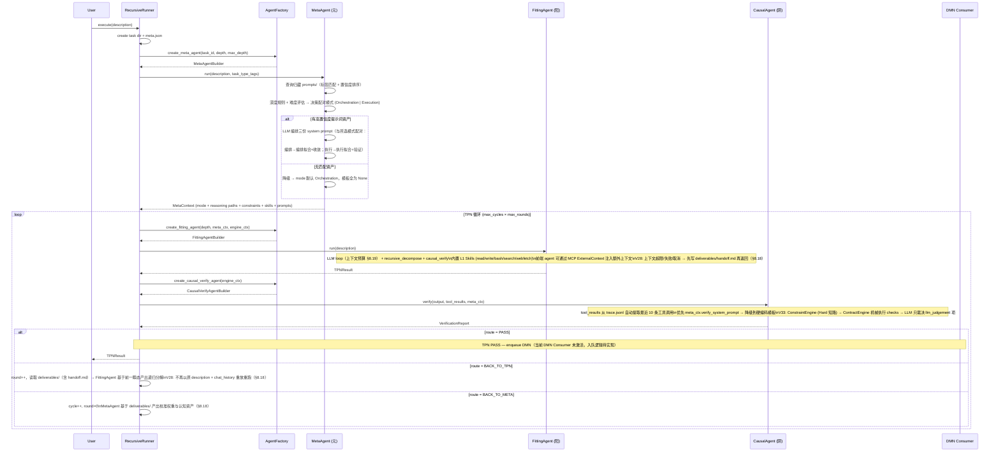
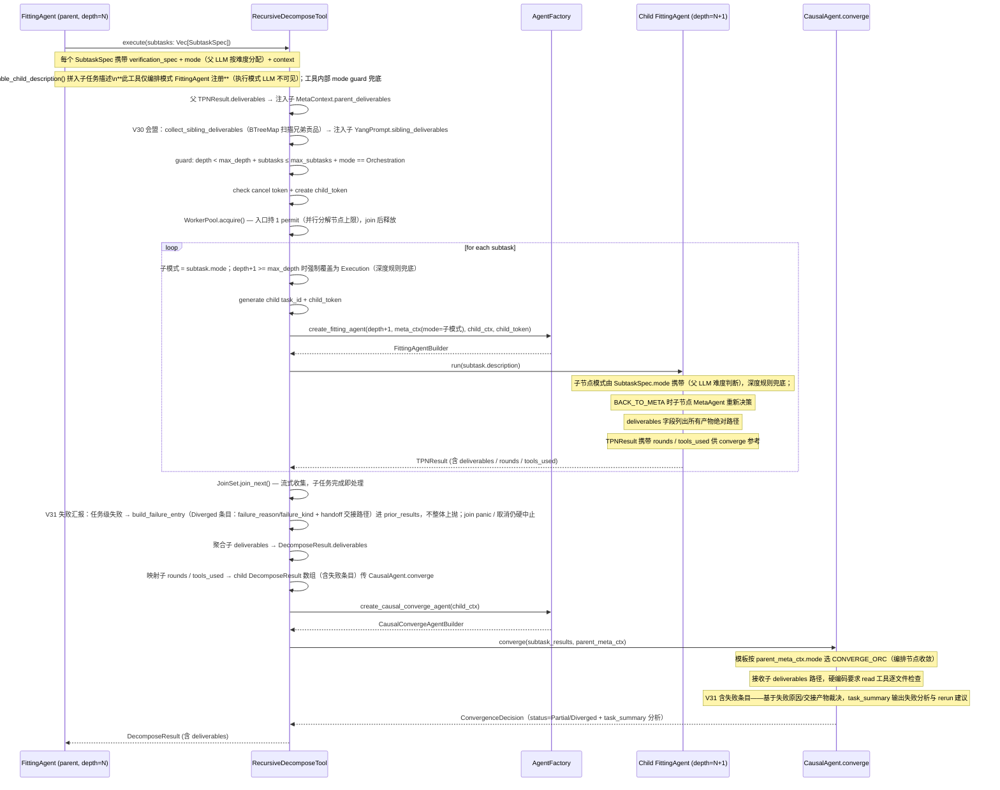

# BCP-TPN：任务处理网络（Task Processing Network）

> 本文档是 taiji 蓝图 TPN 部分的完整设计，与 [`BCP-蓝图-完型协议.md`](./BCP-蓝图-完型协议.md)（设计哲学 + TPN↔DMN 关系 + 版本历史）和 [`BCP-DMN.md`](./BCP-DMN.md)（归藏认知演化）配套。
> **§ 编号全局唯一**（延续主 BCP 编号体系），跨文档引用不变；§1 设计哲学与 §2 系统概览见主 BCP。

---

## 3. 模块架构

### 七层模块图

```mermaid
flowchart TB
    subgraph "L6 入口"
        MAIN["main.rs — clap CLI"]
    end

    subgraph "L5 MCP"
        MCP_SRV["mcp/server.rs — 暴露 taiji 工具"]
        MCP_CLI["mcp/client.rs — 消费外部 MCP 工具"]
    end

    subgraph "L4 编排"
        RUNNER["runner — RecursiveRunner (薄包装)"]
        CONST["constraint_engine — ConstraintEngine"]
        CONTRACT["contract_engine — ContractEngine (V33 验证契约机械执行)"]
        TRIG["trigger_engine — SkillTriggerEngine"]
        WORKER["worker_pool — WorkerPool"]
        DMN["dmn_consumer — DMN Consumer (后台，可激活)"]
    end

    subgraph "L3 Agent"
        FACTORY["factory — AgentFactory (中枢)"]
        META_B["meta — MetaAgent 构建器"]
        FIT_B["fitting — FittingAgent 构建器"]
        CAUSAL_B["causal — CausalAgent 构建器"]
        PLAN_B["plan — PlanBuilder (预演编排)"]
        CHAT_B["chat — ChatAgentBuilder (聊天面板)"]
        TOOLS["tools/ — recursive_decompose, causal_verify"]
    end

    subgraph "L2 Hook"
        SAFETY["safety — ToolSafetyGuard (AgentHook)"]
        TRACE_H["trace — TraceHook (AgentHook)"]
    end

    subgraph "L1 基础设施"
        PROVIDER["provider — ProviderRegistry"]
        GUIZANG["knowledge — GuizangClient (文件系统读写)"]
        CONFIG["config — TaijiConfig"]
        ERR["error — TaijiError"]
        TRACE_W["trace — TraceWriter (JSONL)"]
        TSPEC["task_spec — TaskSpec 解析"]
    end

    subgraph "L7 前端"
        WEB["taiji-web React App (浏览器)"]
    end

    subgraph "L6 实时事件 + HTTP"
        WS_SRV["ws/server.rs — WebSocket 事件推送 + 请求响应"]
        WS_HANDLER["ws/handler.rs — 客户端请求分发"]
        WS_TYPES["ws/types.rs — TaskTreeSnapshot / TpnPhaseState / ClientMessage / ServerResponse"]
        HTTP_SRV["main.rs serve — axum HTTP 静态托管 (dist/)"]
    end

    subgraph "L0 基础类型"
        TYPES["types/ — task, agent, verification, execution, frontend"]
    end

    MAIN --> CONFIG & RUNNER
    RUNNER --> FACTORY
    FACTORY --> PROVIDER & GUIZANG & TRIG & TYPES
    FACTORY --> META_B & FIT_B & CAUSAL_B & PLAN_B
    FIT_B --> TOOLS & SAFETY & TRACE_H
    TOOLS --> FACTORY
    META_B --> GUIZANG
    CAUSAL_B --> CONST
    CAUSAL_B --> CONTRACT
    DMN --> GUIZANG
    MCP_SRV --> FACTORY
    MCP_CLI --> FIT_B
    WS_SRV --> RUNNER & FACTORY & TYPES
    WS_HANDLER --> FACTORY & TYPES
    WS_HANDLER --> CHAT_B
    CHAT_B --> FACTORY
    CHAT_B --> SAFETY
    WEB --> WS_SRV
    HTTP_SRV --> WEB
```



### 模块职责

| 层 | 模块 | 职责 |
|----|------|------|
| L0 | types/ | Task, MetaContext, VerificationReport, TaskTreeSnapshot, TpnPhaseState 等核心类型定义 |
| L1 | infra/config | TaijiConfig 加载与验证 |
| L1 | infra/error | TaijiError 枚举（含 context 字段） |
| L1 | infra/provider | ProviderRegistry：Rig client 管理（创建/复用/fallback） |
| L1 | infra/knowledge | KnowledgeStore：**按模型分区的归藏读写 + 标签搜索 + UCB 聚合查询 + model_stats 读写 + 验证契约加载**（V32 重构 / V33 契约读取） |
| L1 | infra/trace | TraceWriter：JSONL 写入 + 10MB 轮转 + read_tree 合并 |
| L2 | hooks/safety | ToolSafetyGuard：路径穿越 / 命令注入 / SSRF 拦截 |
| L2 | hooks/trace | TraceHook：自动捕获 StepEvent 写入 trace.jsonl |
| L3 | agents/factory | AgentFactory：持有所有 Arc 引用，创建三种瞬态 Agent |
| L3 | agents/meta | MetaAgentBuilder：动态上下文注入，**UCB 检索归藏 + 模型路由决策**（V32） |
| L3 | agents/fitting | FittingAgentBuilder：recursive_decompose + causal_verify + 5 个内置 Skills（read/write/bash/search/webfetch），同时支持前端 agent 通过 MCP ExternalContext 注入额外上下文 |
| L3 | agents/causal | CausalAgentBuilder：verify 模式 + converge 模式。verify 前置 ContractEngine（L0/L1 机械检查）→ LLM 只裁决 llm_judgement 项（L2 兜底，V33 §6.6） |
| L3 | agents/chat | ChatAgentBuilder：前端聊天面板 Rig Agent。组装 5 个 L1 Skills + SafetyHook，`stream_chat()` 推流，`max_turns=20`。会话持久化到 `chat_history.json`。与 TPN 循环完全解耦 |
| L3 | agents/tools | recursive_decompose / causal_verify（Skills 不再内置于此模块） |
| L3 | agents/plan | PlanBuilder：MetaAgent + LLM 编排执行计划，输出 PlanSummary（不进 TPN 循环） |
| L4 | orchestration/runner | RecursiveRunner：创建根任务 + TPN 循环 |
| L4 | orchestration/constraint_engine | 加载 Truths 约束 + 前置检查 |
| L4 | orchestration/contract_engine | **V33 新增**：加载 verifications/ 结构化验证契约 → 机械执行 checks（file_exists / schema_valid / reference_resolves / command_succeeds / llm_judgement）→ 产出 ContractReport（L0 机械 + L1 契约确定性裁决，hard 失败直接短路，LLM 不可翻案——§6.6/§8.22） |
| L4 | orchestration/trigger_engine | 正则 + 标签匹配 Skills |
| L4 | orchestration/worker_pool | Semaphore 限并发 + RateLimiter |
| L4 | orchestration/dmn_consumer | 后台轮询 pending 队列（被动学习）+ experiments 队列（主动学习，空闲窗口+预算），执行 MCTS 四算子 + model_stats 更新（代码已实现，可激活 — 见 §8.12/§8.21） |
| L5 | mcp/server | MCP Server：暴露 TPN/DMN/归藏 操作，6 个工具（taiji_plan / taiji_run / taiji_explain / taiji_trace / taiji_list / taiji_status） |
| L5 | mcp/client | MCP Client Manager：连接外部服务器 |
| L6 | ws/server | WebSocket Server：接受客户端连接，广播 TaskEvent 事件 + 接收 ClientMessage 请求，通过 handler 分发并返回 ServerResponse |
| L6 | ws/handler | WS 请求分发器：execute_task / submit_review / list_tasks / get_task_tree / get_tpn_state / chat_message（委托 ChatAgent，通过 mpsc 逐 chunk 推流） |
| L6 | ws/types | WebSocket 消息类型：`TaskEvent`（广播）、`ClientMessage`（前端→核心）、`ServerResponse`（请求响应） |
| L6 | main.rs serve | axum HTTP 服务器：托管 `taiji-web/dist/` 静态文件 + 可选自动打开浏览器（xdg-open） |
| L7 | taiji-web | 纯浏览器 React 前端：纺锤树（SpindleTree）、TPN 弹窗（TpnPopup）、太极背景（TaijiBg）、聊天面板（ChatPanel） |

### 关键接口契约

| # | 契约 | 说明 |
|---|------|------|
| 1 | `RecursiveDecomposeTool.execute(subtasks: Vec[SubtaskSpec]) -> DecomposeResult` | 输入 LLM 拆解的子任务 → spawn 子 FittingAgent → JoinSet 收集 → CausalAgent.converge() → 返回收敛结果。**仅编排模式 FittingAgent 注册**（执行模式 LLM 不可见拆解工具）；递归终止由 depth guard 保证；WorkerPool permit 在工具入口 acquire（并行分解节点上限），join 完成后释放，无嵌套持有 → 无死锁。**V30 会盟**：spawn 时收集兄弟贡品索引注入子 `YangPrompt.sibling_deliverables`（BTreeMap 有序扫描，排除自身，失败上抛——无降级 §8.20）。**V31 失败汇报**：子任务任务级失败**不整体上抛**——构造 Diverged 失败条目（`failure_reason`/`failure_kind` + handoff 交接产物路径）进 child_results，收敛树不中断；取消/panic 仍硬中止（§8.18） |
| 2 | `AgentFactory.create_fitting_agent(depth, meta_ctx, engine_ctx, cancel) -> FittingAgentBuilder` | 从 MetaContext（含 `mode`）+ EngineContext + CancellationToken + 归藏 创建阳 Agent，模式随 meta_ctx 传递 |
| 3 | `FittingAgentBuilder { depth, mode, meta_ctx, engine_ctx, factory, model, cancel: CancellationToken }` | 阳 Agent 构建器，**按模式选模板**（编排模板 / 执行模板）；recursive_decompose 仅编排模式注册。**V30 身份自觉**：run() 注入「身份与地位」段（身份册 + mode + 兄弟贡品索引，`build_identity_section`，读册失败上抛——无降级 §8.20） |
| 4 | `SafetyHook (AgentHook)` | 在 ToolCall 事件上检查路径穿越/命令注入/SSRF，返回 Flow::cont() 或 Flow::skip() |
| 5 | `ConstraintEngine.check_constraints(output, constraints) -> ConstraintResult` | CausalAgent.verify 前置检查，Hard 违反直接短路返回 BACK_TO_META |
| 6 | `MetaAgentBuilder.run(task_description, task_type_tags, handoff: Option<HandoffContext>) -> MetaContext`（builder 经 `depth()` / `max_depth()` 注入递归层数规则） | 查询归藏 Prompts 标签匹配 → 置信度排序 → **按深度规则 + 难度决策配对模式** → LLM 编排三份 system prompt（fitting/verify/converge，与所选模式配对）→ 注入 MetaContext（含 mode）；无归藏资产时降级返回 MetaContext::empty()（mode 默认 Orchestration）。**V28：BACK_TO_META 重跑时 `handoff` 注入前一瞬态产出摘要**（deliverables/ 索引 + handoff.md 内容），基于产出校准权重与资产，不再空手重跑 |
| 7 | `DMN Consumer (独立 tokio::spawn)` | 指数退避轮询 pending/ 队列（被动学习）+ experiments/ 队列（主动学习，空闲窗口 + 预算上限），执行 **MCTS 四算子**：δ-backprop（trace 统计回传，父节点 γ=0.5 衰减）→ δ-fork（低回报资产扩展变体，复制+降权，内容修订走人工通道）→ δ-merge（相似变体合并）→ δ-prune（N≥5 且低于组内最优 >2σ 淘汰）——单写者更新归藏 + model_stats。**纯符号层确定性操作，不涉及 LLM**。数据源：`pending/{id}.json` 携带 assets_used 链 → TraceRewardExtractor 提取 (资产 × 回报) |
| 8 | `CausalVerifyAgentBuilder.verify(output, tool_results, meta_ctx) -> VerificationReport` | **V33 前置管线（§6.6/§8.22）**：ConstraintEngine（Truths Hard 短路）→ ContractEngine 机械执行 verifications checks（hard 失败直接短路，LLM 不可翻案）→ 剩余 llm_judgement 项 + ContractReport 注入 LLM 裁决。优先使用 meta_ctx.verify_system_prompt，None 时按 `meta_ctx.mode` 降级到 VERIFY_ORC / VERIFY_EXEC 硬编码模板（编排-验证 / 执行-验证配对）。`tool_results` 由 `TpnCycle.collect_tool_results()` 从 trace.jsonl 自动提取最近 10 条工具调用输出，非空数组 |
| 9 | `CausalConvergeAgentBuilder.converge(subtask_results, meta_ctx) -> ConvergenceDecision` | 优先使用 meta_ctx.converge_system_prompt，None 时按 `meta_ctx.mode` 降级到 CONVERGE_ORC / CONVERGE_EXEC 硬编码模板（编排-收敛 / 执行-收敛配对）。**V31 完整汇报输入**：subtask_results 含成功与失败（Diverged）条目——LLM 基于失败原因/交接产物裁决 Partial/Diverged，并把**失败分析与 rerun 建议输出到 task_summary**（决策进 LLM，不加结构化字段）；父阳（阳·管理）据此 rerun_of 再启用或接受残缺综合 |
| 10 | `RecursiveRunner.execute(description, external_ctx, max_depth) -> TPNResult` | runner.execute() 的增强版本，接受来自前端 agent 的 ExternalContext（文件、工具结果、对话总结），将文件物化到 `task_dir/context/files/` 并写入 `context/meta.json`，设置 `engine_ctx.context_dir` → FittingAgent 模板注入 External Context 节。可选 `max_depth` 参数覆盖配置中的递归深度限制 |
| 11 | `PlanBuilder.plan(description, task_type_tags) -> PlanSummary` | 运行 MetaAgent（权重更新+提示词编排）获取 MetaContext，随后调用 LLM 将 MetaContext + 任务描述编排为结构化的 PlanSummary（含子任务预估、技能推荐、复杂度评估），**不进 TPN 循环**，不触发 FittingAgent/CausalAgent |
| 12 | `TaijiMcpServer.handle_explain(task_id) -> ExplainReport` | 读取 `meta.json` + 递归 `trace.jsonl` + `deliverables/` 目录，解析 TraceRecord 的 phase/cycle/round 字段构建阶段时间线和路由决策树，产出人类可读 ExplainReport（含 summary 自然语言总结） |
| 13 | `AgentFactory.create_chat_agent(session_id, context_task_id, model, provider_name) -> ChatAgentBuilder` | 创建前端聊天面板的 ChatAgent builder。LLM 配置从 `agent_overrides["chat"]` 解析（model/provider_name 为 None 时使用解析后的默认值）。构造出的 builder 持有 `session_id`、`context_task_id`、`providers: Arc<ProviderRegistry>`、`safety_hook`、`config`、`data_root`、`model`、`provider_name` 八个字段（**不持有 AgentFactory 引用**——AgentFactory 无 Clone）。自动注册 5 个 L1 Skills + SafetyHook。`max_turns=20`。**不进 TPN 循环** |
| 14 | `ChatAgentBuilder.chat(message, chat_history: &mut Vec<Message>, on_chunk: Box<dyn Fn(String) + Send + Sync>) -> Result<String, TaijiError>` | 单轮对话执行。`on_chunk` 回调接收每个文本 delta（Rig `StreamedAssistantContent::Text` 解包后的纯文本），需 `Send + Sync` 以跨 await 传递到 WS mpsc 通道。内部使用 `agent.stream_chat()` → 遍历 `MultiTurnStreamItem` → 提取 Text/ReasoningDelta → 回调。`chat_history` 可变借用，完成后内部自动 `save_json_atomic` 持久化。返回完整响应文本。`context_task_id` 是 builder 构造时字段，非 per-message 参数 |
| 15 | `ChatAgentBuilder.build_system_prompt() -> String`（`async fn`） | 构建 ChatAgent 的 system prompt。若 `context_task_id` 非空，注入任务描述（从 `{data_root}/tasks/{id}/meta.json` 读取 description/status/depth）+ 归藏知识摘要（内部调用 `async fn guizang_digest(&self) -> Option<String>`：使用 `LiluoClient::new_sparse` 降级扫描 `prompts/` 目录按 confidence 降序取 top-3 Prompts + `load_active_truths` 取前 5，拼接 "## 归藏知识摘要" 段落；knowledge 目录缺失或任何步骤失败时 warn + 返回 None 降级）。无 context_task_id 时使用通用助手模板 |

---


## 4. 核心类型契约

```mermaid
classDiagram
    class Task {
        +id: String
        +description: String
        +depth: u32
        +status: TaskStatus
        +parent_id: Option[String]
        +subtask_ids: Vec[String]
    }

    class SubtaskSpec {
        +description: String
        +verification_spec: String
        +mode: AgentMode
        +context: Value
        +rerun_of: Option[usize]
    }

    class DecomposeResult {
        +summary: String
        +status: ConvergenceStatus
        +subtask_count: u32
        +deliverables: Vec[String]
        +task_id: String
        +rounds: u32
        +tools_used: Vec[String]
    }

    class TPNResult {
        +task_id: String
        +content: String
        +tools_used: Vec[String]
        +deliverables: Vec[String]
        +depth: u32
        +rounds: u32
    }

    class MetaContext {
        +constraints: Vec[TruthConstraint]
        +matched_skills: Vec[SkillRef]
        +yang_prompt: YangPrompt
        +mode: AgentMode
        +model: Option[ModelKey]  %% V32: 元权重模型路由结果 (None=配置默认)
        +assets_used: Vec[AssetRef]  %% V32: 本次编排选用的资产引用（含分区，DMN 回传依据）
        +temperature: Option[f32]
        +fitting_system_prompt: Option[String]
        +verify_system_prompt: Option[String]
        +converge_system_prompt: Option[String]
    }

    class AgentMode {
        <<enum>>
        Orchestration
        Execution
    }

    class PromptAsset {
        +asset_type: String
        +layer: u32
        +id: String
        +name: String
        +description: String
        +tags: Vec[String]
        +confidence: f64
        +version: u32
        +content: String
        +agent_target: String
        +temperature: Option[f32]
        +usage_count: u32
        +success_rate: f64
        +env_tags: Vec[String]  %% V32: 环境维度 (空=环境无关)
        +parent_id: Option[String]  %% V32: fork 来源 (None=根资产)
        +variant_of: Option[String]  %% V32: 同源变体组
        +stats: AssetStats  %% V32: MCTS 统计（V35/MVP-6 回传写入，serde default 零迁移）
    }

    class WorkflowAsset {
        %% V32 新增·阳轨: 特殊工作流+稳定涌现文本+脚本模板
        +id: String
        +tags: Vec[String]
        +confidence: f64
        +version: u32
        +content: String  %% 步骤序列/命令/验收要点
        +agent_target: String
        +env_tags: Vec[String]
        +parent_id: Option[String]
        +variant_of: Option[String]
        +stats: AssetStats
    }

    class VerificationAsset {
        %% V32 新增·阴轨: 收敛验证契约
        %% V33 结构化: checks 可机械执行（本体论 TBox 的最小形式，§6.0）
        +id: String
        +tags: Vec[String]
        +confidence: f64
        +version: u32
        +content: String  %% 契约语义描述（人读）
        +checks: Vec[CheckSpec]  %% V33: 结构化检查项（机器执行）
        +env_tags: Vec[String]
        +parent_id: Option[String]
        +variant_of: Option[String]
        +stats: AssetStats
    }

    class CheckSpec {
        %% V33 新增·验证契约的最小单元（本体论规则/公理）
        +id: String
        +kind: CheckKind  %% file_exists|schema_valid|reference_resolves|command_succeeds|llm_judgement
        +target: String  %% 相对 deliverables/ 的路径或 glob
        +params: Value  %% kind 相关参数（schema 路径 / 命令 / 引用规则）
        +severity: CheckSeverity  %% hard|soft（hard 失败 = 验证失败，LLM 不可翻案）
        +pass_condition: String  %% 人读判据（llm_judgement 类注入 LLM prompt）
    }

    class CheckKind {
        <<enum>>
        %% V33 新增；V34: TraceConsistency（断言引用完整性）
        FileExists
        SchemaValid
        ReferenceResolves
        CommandSucceeds
        LlmJudgement
        TraceConsistency  %% V34: [证据: 工具名] 引用 → trace tool_call::* 存在性（§8.22）
    }

    class CheckResult {
        %% V33 新增·契约执行记录（随 verify_state.json 持久化，零新增文件）
        +check_id: String
        +kind: CheckKind
        +passed: bool
        +detail: String
        +duration_ms: u64
    }

    class ContractReport {
        %% V33 新增·ContractEngine 输出（注入 verify LLM prompt）
        +passed: bool  %% 任一 hard 项失败 → false
        +results: Vec[CheckResult]
        +summary: String
    }

    class SkillRef {
        +id: String
        +name: String
        +tool_name: String
        +match_weight: f64
    }

    class YangPrompt {
        +task_description: String
        +constraint_summaries: Vec[String]
        +parent_deliverables: Vec[String]
        +sibling_deliverables: Vec[String]  %% V30 会盟：兄弟贡品索引（serde default 空）
    }

    class TruthConstraint {
        +id: String
        +name: String
        +description: String
        +severity: ConstraintSeverity
        +justification: Option[String]
    }

    class ConstraintSeverity {
        <<enum>>
        Hard
        Soft
    }

    class VerificationReport {
        +route: VerificationRoute
        +confidence: f64
        +summary: String
        +constraint_violations: Vec[String]
    }

    class ConvergenceDecision {
        +status: ConvergenceStatus
        +task_summary: String
    }

    class ExternalContext {
        +files: Vec[ExternalFile]
        +tool_results: Vec[ExternalToolResult]
        +session_summary: Option[String]
    }

    class ExternalFile {
        +path: String
        +content: String
    }

    class ExternalToolResult {
        +tool: String
        +output: String
    }

    class EngineContext {
        +task_id: String
        +depth: u32
        +task_dir: PathBuf
        +cycle: u32
        +round: u32
        +context_dir: Option[PathBuf]
    }

    class VerificationRoute {
        <<enum>>
        Pass
        BackToTpn
        BackToMeta
    }

    class PlanSummary {
        +task_analysis: String
        +estimated_subtasks: Vec[SubtaskPlan]
        +recommended_skills: Vec[String]
        +expected_deliverables: Vec[String]
        +estimated_complexity: String
        +matched_prompts_summary: String
        +relevant_constraints: Vec[String]
    }

    class SubtaskPlan {
        +description: String
        +verification_approach: String
        +required_skills: Vec[String]
    }

    class ExplainReport {
        +task_id: String
        +description: String
        +status: String
        +total_cycles: u32
        +total_rounds: u32
        +total_depth: u32
        +total_duration_ms: u64
        +timeline: Vec[PhaseSummary]
        +decisions: Vec[DecisionSummary]
        +final_deliverables: Vec[String]
        +summary: String
    }

    class PhaseSummary {
        +phase: String
        +cycle: u32
        +round: u32
        +depth: u32
        +duration_ms: u64
        +tools_used: Vec[String]
        +key_output: String
    }

    class DecisionSummary {
        +cycle: u32
        +round: u32
        +verdict: String
        +reason: String
        +constraint_violations: Vec[String]
    }

    class ConvergenceStatus {
        <<enum>>
        Converged
        Partial
        Diverged
    }

    class AssetStats {
        %% V32 新增·serde default 零迁移
        +n: u64  %% 采样次数
        +pass_count: u64
        +cost_tokens_sum: u64  %% trace usage.input_tokens 累加
        +cost_tokens_sq_sum: u64  %% 增量方差
        +quality_sum: f64  %% 质量分累加
        +verify_rounds_sum: u64  %% BACK_TO_TPN 次数
        +avg_reward(): f64
        +pass_rate(): f64
    }

    class AssetRef {
        %% V32 新增
        +partition: ModelKey
        +id: String
        +kind: String  %% prompt|workflow|verification
    }

    class ModelStats {
        %% V32 新增·元权重表
        +rows: BTreeMap[(ModelKey × Tag), StatsRow]
        %% StatsRow: n / pass_count / cost_sum / quality_sum
    }

    class ModelRouter {
        %% V32 新增·bandit 路由
        +route(tag, task_desc) -> ModelKey
        %% UCB: avg_reward + C·√(ln N_total / N_model_tag)；成本感知：贵模型需通过率显著更高
    }

    class UcbRanker {
        %% V32 新增
        +rank(candidates: Vec[AssetNode], c: f64 = 1.414) -> Vec[AssetNode]
        %% score = avg_reward + C·√(ln N_total / N_node)；N=0 → 最大探索分
    }

    MetaContext --> TruthConstraint : contains
    MetaContext --> SkillRef : contains
    MetaContext --> YangPrompt : contains
    MetaContext --> AgentMode : decides
    MetaContext --> ModelRouter : routes (V32)
    PromptAsset --> AssetStats : tracks (V32)
    WorkflowAsset --> AssetStats : tracks (V32)
    VerificationAsset --> AssetStats : tracks (V32)
    ModelRouter --> ModelStats : reads (V32)
    UcbRanker --> AssetStats : ranks (V32)
    ContractEngine --> VerificationAsset : loads (V33)
    ContractEngine --> CheckSpec : executes (V33)
    PlanSummary --> SubtaskPlan : contains
    ExplainReport --> PhaseSummary : contains
    ExplainReport --> DecisionSummary : contains
    PlanBuilder ..> PlanSummary : produces
    TPNResult ..> ExplainReport : analyzed by
```



---


## 5. TPN 执行流

### 5.1 根任务执行序列



### 5.2 递归分解序列



### 5.3 TPN 路由决策

| 路由 | 触发条件 | 行为 | 计数器 |
|------|---------|------|--------|
| **PASS** | 交付件通过 L4 Truth 约束检查 + **ContractEngine 契约检查全过（V33：hard 项零失败）** + LLM 裁决 llm_judgement 项收敛 | 输出 TPNResult → 入队 DMN | — |
| **BACK_TO_TPN** | 执行偏差（交付件不满足验证规格）或 **V28 结构化信号：`failure_reason = context_overflow / output_missing`**（任务粒度错误） | 读取 `deliverables/`（含 `handoff.md`），FittingAgent **基于前一瞬态产出递归分解**（V28：不再以原 description + chat_history 重放重跑）；验证报告注入作定向修正参考 | `round++`，达 max_rounds → FAIL |
| **BACK_TO_META** | 认知偏差（推理路径错误、缺少必要约束）或 **V28 结构化信号：`failure_reason = constraint_violation(Hard) / cognitive`** | 读取 `deliverables/`（含 `handoff.md`），重新运行 MetaAgent **基于产出校准权重与认知资产**（V28：不再空手重跑），重新获取推理路径 | `cycle++` / `round=0`，达 max_cycles → FAIL |

路由判定 = **V28 结构化失败信号优先 + CausalAgent LLM 裁决兜底**（§8.18 分流表）。约束检查（ConstraintEngine.check_constraints）在 LLM 调用之前执行：Hard 违反直接返回 BACK_TO_META，Soft 违反注入 LLM prompt 由 LLM 裁定。**V33：ContractEngine 机械检查（L0/L1）先于 LLM 裁决，hard 项失败直接短路，LLM 的 PASS 不可覆盖机械 FAIL（§6.6）**。

CausalAgent.verify() 接收的 `tool_results` 由 `TpnCycle.collect_tool_results()` 从 `trace.jsonl` 中自动提取最近 10 条工具调用输出，确保验证 LLM 可交叉比对工具结果与任务输出。

---


## 6. 验证三权分立（§6.6，TPN 验证机制）


阴面验证分为三层，**确定性优先、概率兜底**：

| 层 | 执行者 | 内容 | 失败语义 |
|:---:|------|------|------|
| **L0 机械验证** | ContractEngine（确定性，零 LLM） | file_exists / schema_valid / reference_resolves / command_succeeds 类检查项——文件存在性、schema 校验、引用完整性、可执行命令 | hard 失败 → 直接短路（BACK_TO_META / FAIL），**LLM 不可翻案** |
| **L1 契约验证** | ContractEngine 加载 verifications/ + truths/ 结构化契约 | 契约条件匹配 → 断言机械执行 → 结构化通过/失败记录（CheckResult）；**含 TraceConsistency（V34：断言引用 → trace 工具调用存在性，§8.22）** | 同上；soft 失败注入 LLM prompt 供参考 |
| **L2 LLM 验证** | CausalAgent LLM（概率层，最后兜底） | 仅 llm_judgement 类检查项（语义合理性 / 设计决策 / 跨领域一致性） | LLM 裁决只影响 llm_judgement 项；机械检查失败时 LLM 的 PASS 无效 |

**裁决优先级（硬约束）**：`L0/L1 机械失败 > LLM 任何裁决`。机械检查失败直接短路（不经 LLM），LLM 只对剩余项裁决；LLM 的 PASS 不能覆盖机械 FAIL。

**反偏置注入（L2 对抗）**：llm_judgement 检查项的 pass_condition 注入 verify prompt 时附带反偏置指令（「表面流畅不算数，必须引用具体证据；禁止因篇幅长 / 风格好加分」），并要求 read 工具逐文件取证——降低 verbosity / self-preference 偏置（§1.3 实证）。

**契约执行记录**：CheckResult 数组随 verify_state.json 持久化（复用既有文件，§8.1 清单不变），供恢复链与 DMN 回传消费。

---


## 7. 运行时布局

### 7.1 递归同构目录树

```
data/                               ← 默认 data_root
├── .taiji/
│   ├── config.json                 ← TaijiConfig
│   ├── pending/                    ← DMN 任务队列
│   │   └── dead/                   ← 死信队列
│   ├── knowledge/                  ← 归藏 认知仓库 (§6)
│   └── tasks/
│       └── {task_id}/            ← 根任务（`{简述slug}-{YYYYMMDD-HHMMSS}`，见 §8.1）
│           ├── meta.json           ← Task { id, depth:0, status }
│           ├── trace.jsonl         ← 根层执行轨迹
│           ├── deliverables/       ← LLM 产出（含 handoff.md 交接物，V28 §8.18）
│           └── children/           ← 递归子任务
│               ├── 0/              ← depth:1
│               │   ├── meta.json
│               │   ├── trace.jsonl
│               │   ├── deliverables/
│               │   └── children/   ← 可继续递归
│               └── 1/
│                   └── ...
```

### 7.2 追踪系统

双层追踪，与递归目录树同构：

| 组件 | 追踪方式 |
|------|---------|
| 权重更新 (元) | 手动 TraceWriter::write() — 单条记录 |
| 概率拟合 (阳) | Rig TraceHook — 自动捕获所有 StepEvent |
| 因果验证 (阴) | 手动 TraceWriter::write() — 结构化输出 |

每层任务目录独立 `trace.jsonl`。`read_tree()` 递归遍历所有 `**/trace.jsonl` 按时间戳合并。单文件超过 10MB 自动轮转，保留最近 5 代。敏感信息（API Key）写入前脱敏。

TraceHook 的 `on_tool_call` 同时收集**真实工具调用名**：FittingAgent 的 `tools_used` 统计读此记录（不解析 LLM 响应文本，避免 LLM 正文提及工具名的伪阳性）。对话历史快照职责见 §8.1（ChatHistorySnapshotHook）。

---


## 8. 关键架构决策

### 8.1 瞬态任务节点生命周期

**任务节点 = 单个三相循环（TpnCycle 实例），而非循环内的某个 Agent。** 生成树 / 收敛树的每个节点是完整的「权重更新 → 概率拟合 → 因果验证 → 路由决策」循环（`TpnCycle.execute()`），递归分解 spawn 的是**子循环节点**（`TpnCycle::new`，同一段代码），不是子 Agent。

循环内的 Agent（Meta / Fitting / Causal）是节点的**相位执行器**，生命周期从属于所属节点：

```
AgentFactory.create_*_agent() → AgentBuilder.run() → 结构化输出 → AgentBuilder drop
```

- 每轮循环（round）新建 FittingAgent 与 CausalAgent 实例；每次 BACK_TO_META（cycle++）重建 MetaAgent 实例——用完即弃，状态不跨调用保留
- 认知更新通过归藏 YAML 文件持久化，下轮加载时自动生效
- 整个系统 = 多瞬态任务节点系统：节点实例 = round × cycle × depth 的笛卡尔积，沿生成树展开（蒙特卡洛树式概率探索）、沿收敛树归并（马尔可夫链式状态转移与收敛），每一层递归与每一轮循环都是一次概率采样

瞬态性保证：节点销毁后磁盘状态（checkpoint / deliverables / trace）按 §7 原子持久化，崩溃恢复按恢复优先级链重建节点。**V28 恢复优先级链 = 产出继承**：`deliverables/`（含 `handoff.md`）> `decompose_result.json` > 重跑（`resume_history`/`chat_history` 仅作本节点断点续聊的最终兜底，**不再作为结果重建来源**——执行事实是唯一记忆，§1.4）。

**恢复链对根任务与子任务同构生效**：子任务恢复由 RecursiveDecomposeTool 扫描 `children/` 时复用旧结果（rerun_of 索引）；根任务恢复由 `taiji run --resume <task_id>` 触发——runner 复用既有 task_id（不生成新 UUID），恢复 EngineContext（depth 从 meta.json 读取）后进入同一 `TpnCycle.execute` 恢复链。根/子共享同一段恢复代码，无特例。

**对话历史增量快照**：Rig `chat()` 在 LLM 调用出错时提前返回、不回写 `chat_history`（仅成功时 `extend`）——仅靠 FittingAgent 成功路径的全量 save 会导致失败任务磁盘上恒为空历史，`--resume` 只能从空历史重跑整个 Fitting 阶段。为此在 FittingAgent 注册 **ChatHistorySnapshotHook**：每次 LLM 调用前（`on_completion_call`，含工具循环内每次调用）将完整对话（调用前 `history` + 本轮 `prompt`，均为 `rig::completion::Message`）按 `save_json_atomic` 原子快照到 `{task_dir}/chat_history.json`。失败/超时任务最多丢失最后一轮 in-flight 请求；成功路径的全量 save 保留作为最终一致性收尾。快照对根任务 `--resume` 与子任务 rerun 恢复同样生效。**V28 定位降级**：chat_history 仅为本节点断点续聊兜底（省 token），不作为跨层传递物、不作为结果事实来源（§1.4 / §8.18）。

**任务目录持久化文件清单（唯一事实——新增文件必须先入此清单，只写不读者禁止引入）**：

| 文件 | 内容 | 写者 | 读者 | 用途 |
|------|------|------|------|------|
| `meta.json` | Task{id,desc,depth,status,parent_id,subtask_ids} | runner / TpnCycle | 前端、恢复链 | 任务元数据 + 生命周期状态 |
| `checkpoint.json` | {phase,round,cycle} | TpnCycle 每阶段 | TpnCycle 崩溃恢复 | 循环进度（PASS 后删除） |
| `meta_ctx.json` | MetaContext | TpnCycle（MetaDone 后） | TpnCycle 崩溃恢复 | 元阶段产出上下文 |
| `chat_history.json` | Vec\<Message\> | SnapshotHook + Fitting 收尾 | resume 增量恢复 | Fitting 对话（失败点续跑） |
| `verify_state.json` | {report,round,cycle} | CausalAgent.verify | TpnCycle（VerifyDone 恢复） | 验证报告缓存（路由决策） |
| `decompose_result.json` | DecomposeResult/TPNResult | TpnCycle（PASS） | 缓存返回、子任务复用 | 完成标记 + 结果缓存 |
| `deliverables/` | 产物文件 | FittingAgent | 聚合、前端 | 交付物实体 |
| `children/` | 子任务目录 | RecursiveDecomposeTool | 扫描复用 | 递归树实体 |
| `trace.jsonl` | 事件审计（脱敏） | TraceHook / 手动 | read_tree | 审计与工具结果提取 |
| `deliverables/handoff.md` | 交接产出物：front matter 结构化字段（failure_reason/degraded/output_refs）+ 正文环境信息（进度/剩余/决策/约束状态） | Fitting 超限/失败/取消路径（V28） | 父层、verify/converge、Meta 校准、恢复链（均经 deliverables/ 既有路径发现） | 产出即交接，残缺产出继承载体（§8.18） |


**任务 ID 格式**：`{简述slug}-{YYYYMMDD-HHMMSS}`（如 `分析源码架构-20260807-061530`），由 `src/infra/task_id.rs` 生成——slug 取描述前 24 字符路径安全化（非字母数字→`-`、折叠连续破折号、去首尾破折号、空描述→`task`），时间戳为本地时间秒级。唯一性：根任务经 `ensure_unique` 检查 `tasks/` 目录已存在则追加 `-2/-3`；子任务追加 `-{index}`（同父并行不撞，跨父碰撞概率可忽略且无文件冲突——子任务目录在 `children/<idx>/`，task_id 仅作标识）。**chat session_id 保持 UUID**（`{data_root}/chat/{session_id}.json`，会话文件已持久化，不属任务 ID）。task_id 为纯字符串，无任何代码假设其 UUID 格式，`--resume`/`taiji trace` 输入与前端树显示同步可读化。

**子任务状态一致性**：RecursiveDecomposeTool 错误路径 `abort_all()` 终止子任务后，`children/` 下 status=Running 的子任务必须统一落盘为 Failed（写失败仅 warn，不阻断父任务错误传播）——「超时/失败/取消正确落盘」声明覆盖所有任务节点，含被父任务中止的子任务；中止不产生虚假的 Running 残留。

### 8.2 异层同构（结构同构，提示词按模式配对）

`depth` 只改变编号，不改变目录布局、TPN 循环结构、上下文预算与恢复路径。根任务和子任务执行**同一段代码、同一套配置**。但每个节点的**提示词与工具注册面由元 Agent 权重更新时决策的阴阳配对模式决定**：

- **模式决策**：MetaAgent 按递归层数规则（depth/max_depth，叶节点 `depth+1 >= max_depth` 硬性强制 Execution）+ 任务难易程度（复杂/多步/跨多维→Orchestration，原子/单步→Execution）决策 `MetaContext.mode`。根节点与 BACK_TO_META 重跑时由 MetaAgent 决策；子节点由父 LLM 在 `SubtaskSpec.mode` 按难度分配，`RecursiveDecomposeTool` 按深度规则兜底强制叶节点 Execution
- **配对提示词**：Orchestration → 阳用编排模板（拆解+综合）、阴用收敛模板；Execution → 阳用执行模板（直接产出）、阴用验证模板
- **工具面随模式分化**：`recursive_decompose` 仅编排模式注册（执行模式 LLM 不可见拆解工具，工具内部 mode guard 兜底）；5 L1 Skills + causal_verify 两模式均注册
- 单上下文预算：全相位（Meta / Fitting / Causal）统一 250k 交接 / 300k 硬截止（V29 §8.19）；不再使用 max_turns 轮次限制
- 递归层间通过 `MetaContext`（推理偏置注入 + mode）和 `ConvergenceDecision`（收敛结果上浮）传递信息
- 递归终止仅靠 depth guard：`depth >= max_depth` 时 RecursiveDecomposeTool 拒绝拆解（MaxDepthExceeded）

**权限同构（异层同构的权限维度）**：任务节点在任意深度保持相同的三相分工与权限配置——每个子循环节点与根节点一样：Fitting 相位持有执行工具（5 L1 Skills + causal_verify；编排模式另加 recursive_decompose）并受同一 SafetyHook 约束、Meta / Causal 相位持有只读收集工具（read / search / webfetch）且无执行工具。**权限模式与配置不随 depth 变化，权限边界随位置（task_dir）变化**（见 §8.9 工作区即权限边界）——不同深度不存在任何权限梯度，模式分化只影响提示词内容与拆解工具可见性。

### 8.4 路由内部化（结构化信号 + LLM 裁决）

TPN 循环的路由决策（PASS / BACK_TO_TPN / BACK_TO_META）由 CausalAgent 的 LLM 根据 VerificationReport 裁决。RecursiveRunner 只执行路由结果（递增循环计数器、重入对应阶段），不硬编码路由逻辑。**V28：结构化失败信号优先**——`failure_reason`（context_overflow / output_missing / constraint_violation / cognitive / degraded / other）由交接文件携带，命中分流表（§8.18）时直接路由；仅模糊地带（degraded / other）交 LLM 裁决兜底。

### 8.5 Hook 安全模型

SafetyHook 和 TraceHook 以 `AgentHook` trait 实现，注册到带工具的 Rig Agent 上（FittingAgent / MetaAgent / CausalAgent）。SafetyHook 在 ToolCall 事件上拦截危险操作（路径穿越、命令注入、SSRF），拦截时返回 `Flow::skip()`。非白名单 MCP 工具强制执行安全检查。

**循环内权限分工的实现机制**：SafetyHook 挂载在**所有注册了工具的相位**上（Fitting / Meta / Causal），因为收集工具虽然只读，仍持有文件系统访问面（read / search）——这是 §1.2 相位分工的安全落地，而非偶然：

| 相位 | 工具注册 | SafetyHook | 权限角色 |
|------|:---:|:---:|------|
| MetaAgent | read + search + webfetch（只读收集 / 联网核实） | **挂载** | 认知者 + 收集者：LLM 收集任务上下文 / 父层 deliverables / 归藏资产与网络信息后更新权重并决策配对模式，无执行面 |
| FittingAgent | 5 L1 Skills + causal_verify（两模式）；recursive_decompose（**仅编排模式**） | **挂载**（+ TraceHook） | 执行者：唯一持有变更世界工具、受安全约束的权限面；编排节点可拆解，执行节点专注直接产出 |
| CausalAgent | read + webfetch（只读验证 / 联网核实） | **挂载** | 裁判者 + 收集者：LLM 逐文件核验 deliverables、联网核实外部事实后裁决路由（编排节点收敛模板 / 执行节点验证模板），无执行面 |

**节点间权限同构**：所有任务节点（任意 depth / round / cycle）共享同一进程级 `SafetyHook` 单例（`build_engine` 创建一次，`Arc` 注入全部带工具的 Agent），规则一致、白名单一致——权限配置在节点间完全同构，不存在按深度 / 轮次 / 层级的权限分化。

**带工具必有安全钩子（硬约束）**：任何相位只要注册工具（含只读收集工具），就必须挂载 SafetyHook——「无工具的相位允许不挂载，带工具的相位必须挂载」是相位权限闭合的底线。CausalAgent 的 LLM 验证路径（verify / converge 真实 LLM 调用 + read 逐文件核验）已在此约束下落地。

**Rig 0.39 hook 挂载机制**：`AgentBuilder::hook()` 是单槽覆盖式——链式 `.hook(a).hook(b).hook(c)` 只有 `c` 生效，多 hook 必须组合为一次挂载。FittingAgent 的 safety / trace / snapshot 三个 hook 经 `FittingHookSet` 组合（safety 优先、首个非 Continue 短路，违规工具不进入 trace 记录）；Meta / Causal / Chat 单 hook 直接挂载。任何相位新增第二个 hook 必须先查现有挂载点是否单槽。

**L1 Skills 工具参数契约**：SkillTool 是单参 `input` 包装（Rig ToolDefinition 暴露 `input: string`，`call` 内对 input 值做二级 JSON 解析——JSON 字符串解析为对象，失败保留原文）。各内置工具的参数键必须与 LLM 可用的传参形式兼容：BashTool 读 `command`、ReadTool 读 `path`，**必须同时支持 `input` 键直读**（`args.get("input")` 为纯字符串时直接当命令/路径）——否则 LLM 按 schema 传 `{"input":"ls"}` 永远报 missing 参数，被迫试错摸索 `{"input":"{\"command\":\"ls\"}"}`（每次 resume 重跑重新踩坑，系统性吞噬预算）。ToolDefinition 的 description 必须包含用法示例（双保险：实现容错 + schema 引导）。write/search/webfetch 参数键同理自查。

### 8.6 递归防护

| 防护层 | 机制 | 默认值 |
|--------|------|--------|
| 深度限制 | `RecursiveDecomposeTool` 检查 `depth < max_depth` | 2 |
| 子任务上限 | `subtasks.len() ≤ max_subtasks` | 4 |
| TPN 轮次 | `round_counter ≤ max_rounds` | 10 |
| TPN 循环 | `cycle_counter ≤ max_cycles` | 3 |
| 上下文预算 | `usage.input_tokens ≥ handoff_tokens` → 交接（context_overflow）；`≥ hard_cutoff_tokens` → 硬截止 FAIL（V29 §8.19） | 250k / 300k |
| 取消传播 | `CancellationToken` 传递到所有递归层（parent→child_token 链接） | — |
| 嵌套 task_id | 每层使用可读 task_id（`{简述slug}-{时间戳}`，子任务追加 `-{index}`），`parent_id` 指向父层 | — |
| 执行超时 | tokio::timeout 包裹整个 execute()（超时 → cancel + 写 Failed） | 600s |

> 默认值统一以 `config.rs` RuntimeConfig 为准（此表为真实默认值），配置文件可覆盖。

### 8.9 绝对路径单向传递与权限收敛

多层递归中，每层 Agent 产出的文件路径必须在 prompt 中**硬编码传递**（不依赖 LLM 推测），遵循单向向下覆盖原则：

**传递链：**

```
父 Yang → 产出文件 → TPNResult.deliverables (绝对路径)
    │
    │ recursive_decompose 注入子 MetaContext
    ▼
子 YangPrompt.parent_deliverables → 子读取(只读) → 产出自己的 deliverables
    │
    │ 子 TPNResult.deliverables 向上聚合
    ▼
DecomposeResult.deliverables → 父 CausalAgent.converge() 逐文件检查
```

**权限模型：**

> 本节的路径权限与 §8.5 的相位权限分工共同构成节点间权限同构：每个任务节点（任意 depth）都遵循相同的「父→子只读、子→父聚合、兄弟隔离」目录规则——权限同构覆盖工具面（§8.5）与数据面（本节）两个维度。
>
> **工作区即权限边界**：节点权限范围 = 其 `task_dir`（根任务为 `{task_id}/`，子任务为 `children/N/`）——位置与权限一体两面：区内自由读写、区外不可达。本节路径规则（父→子只读、**V30：兄弟贡品公开只读**、绝对路径单向传递）正是这一边界的载体。

| 方向 | 规则 | 保证方式 |
|------|------|---------|
| 父→子 | 父 deliverables 绝对路径注入子 `YangPrompt.parent_deliverables`，**只读参照** | 硬编码模板指令：子只能 read，不能 write 父目录 |
| 子→父 | 子 deliverables 绝对路径通过 `DecomposeResult.deliverables` 返回父层 | `recursive_decompose` 中硬编码聚合 `tpn_result.deliverables` |
| 兄弟（V30 收窄） | 兄弟贡品（deliverables/）**公开可发现可读**（会盟注入目录 + read 工具）；**写入封闭**——write 目标必须在**本任务 task_dir 内**（封地自治，FittingHookSet 域校验强制）；兄弟任务目录内**非 deliverables 文件（中间记忆）不可见** | 文件系统布局保证：`children/{0}/` 与 `children/{1}/` 各自独立；SafetyHook 黑名单 + FittingHookSet 写路径域校验（§8.20 会盟） |

**硬编码保证（不可被 LLM 绕过）：**

1. **阳 Fitting 模板（按模式配对）**：必须明确列出所有产物文件的绝对路径。编排模板引导「拆解优先 + 综合」（recursive_decompose 可用，含子任务模式分配指南）；执行模板引导「直接产出」（无 recursive_decompose，专注 L1 工具完成）；子产物在 convergent 阶段可见。**V30 身份段**：模板注入「身份与地位」段（内容/类别/父/子/兄弟贡品索引/权限教学，§8.20）
3. **阴 verify 模板（按模式配对）**：接收 `deliverables` 路径，调用 `read` 工具逐文件检查（编排节点查 MECE 完备性与综合质量，执行节点查直接产出合规）
4. **阴 converge 模板（按模式配对）**：接收所有子 `deliverables`，调用 `read` 逐文件检查跨子任务一致性（编排节点收敛子结果）

绝对路径以 `task_dir` 为根——每层递归有独立的 `task_dir`（`data/tasks/{root}/children/{i}/...`），子层不会因为路径冲突覆盖父层文件。

### 8.10 四象温度（Base 模板默认温度）

六个 Base 硬编码模板（Fitting 编排/执行、Causal 验证/收敛各按模式配对）根据各自职责设置不同温度，引导 LLM 行为偏向：

| Base 模板 | 默认 temperature | 设计依据 |
|-----------|:---:|------|
| FittingAgent 编排（Orchestration） | `0.8` | 高温度鼓励拆解探索与多方案发散 |
| FittingAgent 执行（Execution） | `0.5` | 中低温度聚焦直接产出，减少漂移 |
| CausalAgent 验证（verify，两模式） | `0.2` | 低温度严格控制，严格对照约束逐条检查 |
| CausalAgent 收敛（converge，两模式） | `0.2` | 低温度严格判决，不引入额外噪声 |

温度优先级：`PromptAsset.temperature`（最高）→ Base 模板默认值 → `TaijiConfig` 全局默认值（`0.7`）。

### 8.11 心流分层通道 (Flow Channel)

分层资产全部运行在符号通道（归藏文件系统，V32 起按模型分区）。TPN 循环操作符号通道：Prompts/Workflows（行为与流程模板）是引导脚手架，在深层执行中消溶；Verifications（验证契约）与 Truths 持续；Skills 的统计信息通过 DMN Consumer 在 YAML 中维护和更新。纯云端架构下所有资产更新限于归藏文件系统，不涉及模型权重。

**选择理由：** Prompts（含原 L5 叙事 + L3 角色定义）是提示词层面的软引导——它们在任务开始时提供方向，但深层执行需要精准的、无干扰的纯技能驱动。消溶不是"移除"，而是"不再显式注入 prompt"——角色和叙事的信息密度已达到饱和，转为背景知识。

### 8.14 流式输出协议 (ChatAgent Streaming)

决策：ChatAgent 用 Rig 原生 `agent.stream_chat()` 实现逐 token 流式输出，经 WS 定向 mpsc 通道推送（不经过广播），`ServerResponse` 新增 `chunk` / `stream_done` 两个可选字段（`skip_serializing_if`），完全向后兼容。完整协议定义（struct + 前端消费逻辑）见 [`taiji-web/FRONTEND.md`](./taiji-web/FRONTEND.md) §4.2。

### 8.15 多 Provider 配置生态

从单一 `deepseek::Client` 扩展到 config 驱动的多 provider 注册表：

```rust
/// 配置文件中的 provider 条目。
pub struct ProviderEntry {
    pub name: String,        // "openai" | "anthropic" | "local-llama"
    pub base_url: String,    // API endpoint（OpenAI 兼容格式）
    pub api_key: String,     // 该 provider 的 API key（空则沿用全局 key）
    pub model: String,       // 默认模型名
}
```

`LlmConfig` 新增 `providers: Vec<ProviderEntry>` 字段。`ProviderRegistry` 内部分为两类客户端：
- **deepseek 客户端**：`HashMap<String, Arc<deepseek::Client>>`（现有，默认）
- **OpenAI 兼容客户端**：`HashMap<String, Arc<openai::Client>>`（新增，`ProviderEntry.name` 为 key）

选择理由：所有主流 LLM provider 均提供 OpenAI 兼容 API，`rig::providers::openai::Client` 配合自定义 `base_url` 即可覆盖 30+ provider。不做 trait object 动态派发（避免 `dyn CompletionClient` 的 Send + Sync 复杂度），保持简单。

### 8.16 ChatAgent 生命周期与隔离

ChatAgent 与 TPN Agent 的根本差异：

| 维度 | TPN FittingAgent | ChatAgent |
|------|-----------------|-----------|
| 生命周期 | 瞬态（单次 run() → drop） | 会话级（24h 超时，可跨多次对话） |
| 工具集 | 5 Skills + recursive_decompose + causal_verify | 5 Skills 纯（无递归拆解/因果验证工具） |
| 循环 | TPN 三相循环（Meta→Fitting→Causal） | 无循环（纯对话轮次，`max_turns=20`） |
| 历史 | task_dir/chat_history.json（TPN 内 STATE） | `{data_root}/chat/{session_id}.json`（会话独立） |
| 认知注入 | MetaAgent 编排的 MetaContext | 任务 meta + 归藏摘要（直接注入 system prompt） |

ChatAgent **不进 TPN 循环**：它是旁路对话系统，不参与三相递归。ChatMessage 处理中不注册 `recursive_decompose` 和 `causal_verify` 工具。

### 8.17 会话历史持久化

聊天会话历史独立于任务目录存储：

```
{data_root}/
├── chat/
│   └── {session_id}.json    ← Vec<Message>（Rig Chat 历史，JSON 序列化）
└── tasks/
    └── ...
```

- **session_id**：由前端生成（`crypto.randomUUID()`），首次聊天时发送到后端；后端无 session_id 时自动生成 UUID v4
- **写入模式**：每次 `ChatAgentBuilder.chat()` 调用完成后，`save_json_atomic()` 原子写入完整历史
- **读取模式**：ChatAgent 构造时从文件加载历史；文件不存在 → 空历史
- **24h 清理**：`chat/` 目录下超过 24h 未修改的 `.json` 文件可被后台 GC 清理（轻量实现：每次新连接时扫描删除过期文件）

### 8.18 交接文件机制与失败分流 (Artifact Handoff & Failure Routing)

**原则：执行事实是唯一记忆，产出即交接。** 瞬态 agent（Meta / Fitting / Causal 相位执行器）结束即弃，唯一留存是产出物。中间记忆（chat_history / meta_ctx 推理过程）不跨层传播、不作为恢复与路由的事实来源（§1.4）。

**交接物 = `deliverables/handoff.md`——产出物之一，不设独立交接文件。** 写者：Fitting 超限/失败/取消路径；读者：父层、同任务其他 agent、恢复链、MetaAgent 校准。置于 `deliverables/` 内保证**可发现性**：

- **父 agent**：RecursiveDecomposeTool 注入 `parent_deliverables`（目录索引）→ 交接物自动可见；**V31 失败汇报**：失败子任务的交接产物路径同时进入 `ChildResultSummary.deliverables`（失败条目）→ 父阳读交接产物后精准再指导
- **同任务其他 agent（阴侧）**：CausalAgent verify/converge 本来就逐文件核验 `deliverables/` → 自然读到；**V31**：converge 输入含失败条目（Diverged 状态 DecomposeResult）→ 基于失败原因/交接产物裁决 Partial/Diverged，task_summary 输出失败分析与 rerun 建议
- **元校准**：BACK_TO_META 读 `deliverables/` 全部产出（含 handoff.md）
- **同级任务 agent**：独立任务互不读取；需协作时信息经父层聚合传递
- **恢复链**：产出继承 = 读 `deliverables/`

```markdown
---
phase: fitting
failure_reason: context_overflow | output_missing | constraint_violation | cognitive | degraded | other
degraded: false
output_refs: [deliverables/xxx.md]
---
# 交接信息（环境信息）

## 进度
已完成 A、B，未完成 C

## 剩余工作
- C 需分解为 C1/C2

## 决策
- 选用方案 X

## 约束状态
无违规
```

- **触发**：FittingAgent 上下文长度 ≥ 250k（V29 精准 token 统计，替换 max_turns 轮次）、LLM 降级、失败、取消——一律先写 `deliverables/handoff.md` 再返回，禁止裸 `LLMCallFailed` 上抛（**残缺产出 > 无产出**）
- **收尾调用（LLM 压缩收尾，交接 = 压缩产物）**：交接文件是上下文压缩的产物——超限/失败时用**一次聚焦的瞬态调用**把本拟合对话压缩为结构化交接正文（进度 / 剩余 / 决策 / 约束 / 失败原因），只做「收尾写 handoff.md」不续聊。这与 Prime Agent compaction 同构（结构化摘要 + 保留执行状态），但**消费方向不同**（摘要回注入同会话 vs 跨层传给下一瞬态 agent 作恢复）且**多了编排失败语义**（超限触发本身就是任务粒度错误 = 编排失败的硬证据，驱动 BACK_TO_TPN / 连续超限强制残缺产出——Prime Agent 无此信号，其压缩是常规操作）。
  - **压缩输入**：chat_history 序列化（`[User]/[Assistant]/[Tool result]` 格式，工具结果截断 2000 字符）→ 截断到 `compress_input_tokens`（默认 20k，**首部 2k 保留任务目标 + 尾部最新状态**，中间省略标记）——超限路径不得再花一次大调用
  - **压缩输出**：结构化 Markdown 正文（## 进度 / ## 剩余工作 / ## 决策 / ## 约束状态 / ## 已产出文件），max_tokens 2048，temperature 0.2
  - **降级链**：LLM 压缩失败 / 超时（30s）→ 降级静态正文（v1 确定性收尾），仅 `warn!` 不阻断错误传播——交接文件写失败与压缩失败均不得阻断「残缺产出 > 无产出」
  - **禁止对话换皮**：交接正文只含从对话中可证实的执行事实（环境信息），不含对话过程本身——否则就是中间记忆跨层（§1.4 违规）
- **环境信息精炼**：handoff.md 只含环境事实（进度 / 剩余 / 决策 / 约束 / 失败原因）与产出引用，**不含对话过程**——否则就是中间记忆换皮（LLM 压缩收尾只做提取，不做转录）
- **连续超限上限**：同一路径连续 2 次因超限回退 → 强制「残缺产出即最终产出」，不再拆解（防止拆解粒度错误导致递归超限）

**失败分流（结构化信号运行时捕获优先，LLM 裁决兜底）**：failure_reason 由 Fitting 错误路径**运行时直接捕获**（≥ 250k → context_overflow、≥ 300k → hard_cutoff 等，V29 §8.19），随返回路径传给 TpnCycle 路由，**不依赖解析交接文件**；写入 handoff.md 仅作审计与 LLM 消费。

| failure_reason | 路由 | 语义 |
|---|---|---|
| context_overflow | BACK_TO_TPN | 粒度错误 → 阳基于产出递归分解 |
| output_missing | BACK_TO_TPN | 同上（无产出 = 任务未拆到位） |
| constraint_violation (Hard) | BACK_TO_META | 约束缺失 → 元校准 Truths 与权重 |
| cognitive | BACK_TO_META | 策略/资产问题 → 元基于产出校准 |
| degraded | LLM 裁决 | 降级产物质量存疑 |
| other | LLM 裁决 | 兜底 |

**恢复优先级链（V28 修订）**：`deliverables/`（含 handoff.md）> `decompose_result.json` > 重跑——chat_history 仅本节点断点续聊兜底，不再作为结果重建来源（§8.1 同步）。

**BACK_TO_TPN 语义（V28 修订）**：不再以「原 description + chat_history 重放」重跑——读取 `deliverables/`，FittingAgent **基于前一瞬态产出递归分解**。

**BACK_TO_META 语义（V28 修订）**：MetaAgent 输入增加前一瞬态产出摘要（`MetaAgentBuilder.run(description, tags, handoff)`，契约 6），基于失败产物**校准权重与认知资产**（归藏保持只读，校准结果注入 MetaContext），不再空手重跑。

**不做上下文压缩（特意设计）**：上下文窗口是单次概率拟合的采样空间。超限即粒度错误信号，动作为交接 + 拆解，而非压缩后续跑——压缩把过期中间记忆重新注入新采样，污染拟合（§1.4）。

### 8.19 上下文窗口预算 (Context Window Budget)

**轮次不反映上下文消耗，弃用 max_turns。** Rig `max_turns` 是 LLM 调用轮数计数器（旧默认：Meta 6 / Fitting 30 / Causal 10），与 token 消耗不对应——一次工具调用可返回 10k tokens 工具结果，30 轮可能远超窗口。V29 起 TPN 内瞬态 agent（Meta / Fitting / Causal）统一使用**精准上下文长度统计**：

- **统计源**：`CompletionResponse.usage.input_tokens`（provider 报告的真实请求 token 数，含历史重放与工具结果），经 `on_completion_response` hook 累计（FittingHookSet 内 ContextLimiter；Meta / Causal 同机制挂载）
- **阈值**（`config.json → context_limits`，默认值）：

| 阈值 | 动作 |
|---|---|
| `handoff_tokens` = 250k | 超限 → `HookAction::Terminate("context_overflow")` → **必须写 `deliverables/handoff.md`**（残缺产出 + 环境信息，§8.18）→ failure_reason=context_overflow → BACK_TO_TPN → 阳基于产出递归分解 |
| `hard_cutoff_tokens` = 300k | 硬截止 → `Terminate("hard_cutoff")` → 写交接文件 → **直接上报 FAIL**，不进 BACK_TO_* 循环（预算保护） |
| `compress_input_tokens` = 20k | 收尾压缩输入截断上限（§8.18 LLM 压缩收尾）：序列化对话截断到此量（首部 2k + 尾部，中间省略标记），防超限路径再花大调用 |

- **余量设计**：250k→300k 的 50k 余量即「收尾写交接」预算（§8.18 收尾调用）——触发后 LLM 状态已差也不影响交接落盘
- **路由信号**：failure_reason = context_overflow / hard_cutoff 由运行时捕获随返回路径传递（§8.18 分流表；hard_cutoff 等效 context_overflow 但强制 FAIL）
- **轮次计数器降级**：`max_rounds`（BACK_TO_TPN 重试上限）/ `max_cycles` 保留为循环防护（§8.6），不再承担上下文管理职责——计数器防死循环，token 预算管上下文，职责分离
- **ChatAgent 例外**：交互式对话保留 `max_turns=20`（单轮交互语义，非长程概率拟合，不适用交接/拆解回路）

---

### 8.20 分封制：任务自我认知（身份 + 地位）与会盟

**管理模型 = 分封制。** 根任务（天子）分封子任务（诸侯），诸侯可再分封；封地（task_dir）自治，贡品（deliverables/）公开陈列，中间记忆（chat_history / meta_ctx / trace 等）仅本节点可见；瞬态生命周期——任务即用即弃，唯一遗存是产出（§1.4）。

**双相位治理模型（V31 补全）**：阳相位 = **管理**（递归泛化拆解 / 接受汇报 / 汇总子任务产出 / 得出最终产出 / 子任务再恢复与再指导）；阴相位 = **裁判**（本任务节点收敛 converge / 本任务节点验证 verify / **向上父任务汇报**——裁决载体 = DecomposeResult 完整返回（含失败条目），失败场景不断流 / **路由重试本任务节点**——verify → route → BACK_TO_TPN/BACK_TO_META，本节点自我纠错回路）。子任务失败由父阳决策（rerun_of 再启用 + 修正指导 / 接受残缺综合 / 整体失败上抛），防护 = rerun_of 同轮去重 + max_rounds（§8.6）。

**任务自我认知**（注入阳 Agent system prompt 的「身份与地位」段，`build_identity_section`）：

| 要素 | 内容 | 来源（确定性） |
|------|------|------|
| 身份·内容 | task description | meta.json.description（创建时入册） |
| 身份·类别 | 编排/执行（阳）、验证/收敛（阴） | **元权重更新阶段确定**：MetaContext.mode（§8.8）；模板已教学 |
| 身份·兄弟 | 同级子任务贡品索引 | 会盟注入：YangPrompt.sibling_deliverables |
| 身份·父 | parent_id + 父 description | meta.json.parent_id → 父 meta.json（根任务注明「根任务（天子）」） |
| 身份·子 | subtask_ids | meta.json.subtask_ids |
| 地位·层级 | depth / max_depth | EngineContext + config（§8.6） |
| 地位·权限 | 可读写本任务 deliverables/；父产出与兄弟贡品只读；中间记忆仅本节点可见 | SafetyHook 执行层强制（§8.5/§8.9）+ 教学层显式告知 |

**确定性原则**：身份与地位全部由系统赋予——创建时入册（内容/父/子）、元阶段决策（类别）、递归结构派生（层级）、分封时快照（兄弟）——**禁止 LLM 分类或运行时推断**。同一条创建路径 → 同一身份，可复现、可审计。

**会盟（兄弟贡品发现）**：RecursiveDecomposeTool 分封时向子任务注入**兄弟贡品陈列室目录**（`children/<idx>/deliverables/` 绝对路径，BTreeMap 有序扫描，排除自身——注入目录而非文件快照：同批并行兄弟在分封时点尚无产出，目录 = 动态发现入口，子任务执行中可经 read 工具随时发现陆续陈列的贡品；跨轮/rerun 同样有效）。读取由子任务自行 read（贡品公开陈列语义）。

**能看不能写（执行层强制）**：兄弟关系是**单向观摩**——read 开放（贡品公开陈列，父产出与兄弟贡品可读），write 封闭（封地自治：写入必须落在本任务 `task_dir` 内）。执行层强制 = `FittingHookSet` 写路径域校验（`on_tool_call` 对 write 工具目标路径做归一化前缀检查，`task_dir` 外一律 `ToolCallHookAction::skip` + warn）——SafetyHook 黑名单只拦 `..`/`~`/`/etc` 等，绝对路径直写兄弟目录（无 `..`）不触发，必须域校验兜底（与全局单例 SafetyHook 不冲突：域校验持有 per-agent task_dir，放 FittingHookSet 转发链）。兄弟任务目录内非 deliverables 文件（中间记忆）不可读不可写；兄弟间一切通信汇总由父层处理（聚合 → converge → BACK_TO_TPN 注入）。

**贡品可见性修订（§8.9 兄弟隔离条款收窄）**：兄弟隔离收窄为「兄弟任务目录内非 deliverables 文件不可见」——贡品跨兄弟**公开可发现可读**；中间记忆仍隔离。SafetyHook 黑名单（`..` / `~` / 系统路径）不拦截任务树内贡品绝对路径。

**无降级原则（V30 起新代码）**：禁止降级兜底——新代码读身份册失败 / 会盟扫描失败一律错误上抛（`TaijiError`），问题暴露后修根因，不用默认值掩盖。「无父（根任务，parent_id=None）」与「无兄弟（children/ 为空）」是**状态分支**，非降级。既有降级点（MetaContext::empty、Base 模板、压缩静态正文、load_json_optional 等）维持现状，改造另立章节。

**注入实现**：`build_identity_section(engine_ctx, meta_ctx) -> Result<String>`（fitting.rs 同步函数）读本册 + 父册 + meta_ctx.mode + 兄弟索引 → 「身份与地位」段 push 到 system_prompt 末尾（归藏资产与 Base 模板统一生效，与 §8.19 预算纪律同模式）。不注入 Meta/Causal（Causal 核验本任务贡品无需兄弟；Meta 校准走既有 handoff 路径）。

### 8.22 验证契约引擎（ContractEngine）

**职责**：CausalAgent.verify 前置的确定性验证执行器——加载当前模型分区 `verifications/` 结构化契约，机械执行 checks，产出 ContractReport。**确定性保证：同一契约 + 同一产出 → 同一结果**，与 LLM 无关。

**执行顺序（verify 内部管线，V33 修订）**：

```
ConstraintEngine（Truths Hard 短路）→ ContractEngine（verifications checks 机械执行）
    → 若 hard 项全过 → LLM 裁决 llm_judgement 项 → VerificationReport
```

**LLM 输入**：ContractReport（passed + results + summary）注入 verify prompt——LLM 看到的不是「自由裁量」，而是「机械检查结果 + 待裁决项」（§6.6 L2）。

**工具注册**：ContractEngine 是 Rust 内部函数（非 LLM 工具）——LLM 不可调用、不可绕过。与 ConstraintEngine 同构（确定性引擎，hard 短路语义一致）。

**契约命令安全面（V33 预埋）**：CheckSpec 中 command_succeeds 类检查项可执行命令——**MVP-1 仅允许白名单安全命令**（编译 / 测试 / 静态检查），白名单与 SafetyHook 同源审批，禁止任意 shell 命令进契约——防契约资产被污染后变成任意代码执行面（契约由 DMN fork/人工种子写入，是潜在注入面）。

**TraceConsistency 检查项（V34，MVP-4：断言证据链）**：CheckKind 第 6 类，L1 扩展——**断言引用完整性**（reference_resolves 从文件推广到 trace 记录）：扫描产出文件（target glob）中 `[证据: 工具名]` 格式引用 → 校验任务 trace.jsonl `tool_call::*` 记录中存在该工具调用（存在性 + 类型匹配）。纯机械零 LLM；**只对精确格式引用做存在性判定，无匹配/无标记一律视为推测处理——宁漏勿误，零误报优先**（防硬短路误伤）。`(推测)` 标记计数（speculation_count）注入 CheckResult.detail 作质量信号。params 键约定（复用 `params: Value`，零 schema 变更）：`evidence_pattern`（默认 `[证据: {tool}]`）、`speculation_marker`（默认 `(推测)`）、`allowed_tools`（默认 webfetch/search/read/bash）、`trace_glob`（默认 trace.jsonl）。

**断言分级教学（V34，Fitting 侧）**：build_system_prompt 追加「断言分级规则」段（预算纪律后）：证据断言必须附 `[证据: 工具名]`（引用真实工具调用）、推测断言必须标 `(推测)`、禁止编造证据引用。教学层与检查层是双保险：检查层独立运作（对已有标记仍可判定），LLM 完全不标记时检查退化为空转——推测占比统计经 DMN 演化淘汰高推测诱发资产。**激励闭环**：虚假证据 = 机械 FAIL（hard 短路 → backprop 贝叶斯 β++ → 资产降权淘汰）；无证据 = 显式标注 + 统计降权；真实证据 = 唯一稳定通过策略——诚实成为占优策略（§6.0 ABox 证据链）。

**随机审计（V34 预留，P2）**：`runtime.dmn.audit_rate`（默认 0）——概率触发深度复查（webfetch 重放来源 URL + LLM 语义复核）。MVP-4 不实现（依赖网络 + LLM，成本高），字段预留、激活条件后置。

**与归藏的关系**：契约资产经 MetaAgent UCB 检索（与 prompts 同通道，§8.8），命中即注入 verify 流程；**无契约资产时 verify 退化为纯 LLM 验证（现状保留）**——降级路径不改，MVP-1 阶段种子契约逐步补齐（§8.23）。

**与 DMN 的关系**：CheckResult 随 verify_state.json 既有路径回传——检查项通过率是 DMN 统计与 MCTS 演化的数据源（§6.4 V33 统计粒度）。


## 9. 前端架构（taiji-web 纯 Web 应用）

> 详细设计见 [`taiji-web/FRONTEND.md`](./taiji-web/FRONTEND.md)。本节仅保留架构决策表与 WS 接口契约。

### 9.1 前台架构决策

| 决策 | 选择 | 理由 |
|------|------|------|
| 前端框架 | React + TypeScript | 生态最成熟，React Flow 原生支持 |
| 应用壳 | **无（纯浏览器）** | 绕过 WebKitGTK DMA-BUF bug，Chromium 不受影响 |
| HTTP 静态托管 | axum + tower-http（Rust 核心内嵌） | 单进程方案，零额外服务 |
| 图渲染 | React Flow | 自定义节点 + 自定义布局 + 动画支持 |
| 动画 | Framer Motion | 声明式动画，状态过渡自动处理 |
| CSS | TailwindCSS | 快速布局，暗色主题 |
| 通信 | WebSocket 双向（tokio-tungstenite） | 事件广播 + 请求响应同一连接，低延迟 |
| 太极图 | SVG + CSS Animations | 纯前端实现，无额外依赖 |
| 浏览器打开 | xdg-open | Linux 桌面标准，跨平台可扩展 |

### 9.2 接口契约（续 §3）

> 编号续接 §3 关键接口契约（1-15）。前端消费方的 TypeScript 接口见 FRONTEND.md。`ChatAgentBuilder.chat` / `build_system_prompt` 已在 §3 #14/#15 列出，此处不重复。

| # | 契约 | 说明 |
|---|------|------|
| 16 | `WsServer::broadcast(event: TaskEvent)` | WebSocket 广播：将 TaskEvent 推送至所有连接的 WebSocket 客户端（无变化） |
| 17 | `TaskTreeBuilder::build(root_task_id) -> TaskTreeSnapshot` | 扫描 `data/tasks/{root}/children/` 递归目录树，构建 SpindleNode 列表 + 边 |
| 18 | `WsHandler::submit_review(intervention: YinIntervention, data_root: &Path) -> Result<()>` | 前端审批提交：将人工干预写入 `review.json` |
| 19 | `WsHandler::handle_chat_message(message, session_id, context_task_id, state, on_chunk: Box<dyn Fn(String) + Send + Sync>) -> Result<(String, String), TaijiError>` | WS handler 层：解析/生成 session_id（session_id 为空时 `Uuid::new_v4()`），调用 `AgentFactory.create_chat_agent(session_id, context_task_id, None, None)` → `builder.chat()`。`on_chunk` 转发到 `WsServer::send_to` 逐 chunk 推送（`ServerResponse::chunk`）。完成时 `ServerResponse::stream_done` 携带 `{"text": final_text, "sessionId": resolved_session_id}`。返回 `(final_text, resolved_session_id)` |
| 20 | `WsHandler::get_task_tree(root_task_id: &str, data_root: &Path) -> Result<TaskTreeSnapshot>` | 前端主动拉取完整任务树快照 |
| 21 | `WsHandler::list_tasks(data_root: &Path) -> Result<Vec<String>>` | 列出所有根任务 ID（按 mtime 倒序） |
| 22 | `WsHandler::get_tpn_state(task_id: &str, data_root: &Path) -> Result<TpnPhaseState>` | 获取指定任务的 TPN 相位详情 |
| 23 | `WsHandler::execute_task(description: String, factory: &AgentFactory, config: &TaijiConfig, data_root: &Path) -> Result<TaskTreeSnapshot>` | 执行新任务并返回快照（异步，RecursiveRunner） |


---

---


---

## 工程基建（Rig 本地化，原 §8.7）

Rig 0.39（rig-core + rig-derive）已 vendor 到 `vendor/` 目录，Cargo.toml 通过 `[patch.crates-io]` 重定向。原因：

1. **Rig 仍处于 0.x 不稳定阶段** — 频繁 API 变更导致上游 breaking change 不可控
2. **简化依赖** — 剔除不需要的 feature flag 和可选依赖（qdrant、lancedb、fastembed 等）
3. **自定义修改** — 允许在 vendor 内对 Rig 源码做最小修补

Vendor 策略：

| 层 | 原始 crate | vendor 路径 | 说明 |
|----|------------|-------------|------|
| 应用入口 | `rig` | `vendor/rig/` | 薄 facade，re-export rig_core::* |
| 核心库 | `rig-core` | `vendor/rig-core/` | Agent/工具/提供者/补全核心 |
| 过程宏 | `rig-derive` | `vendor/rig-derive/` | Tool derive 宏 |

taiji 使用 `rig = { version = "0.39" }`（语法占位）+ `[patch.crates-io]` 指向 vendor。上游 Rig 的非核心可选依赖（companion crates）被剥离。
重新 vendor 的操作：`cargo package --allow-dirty` 可验证 vendor 目录自恰性。

