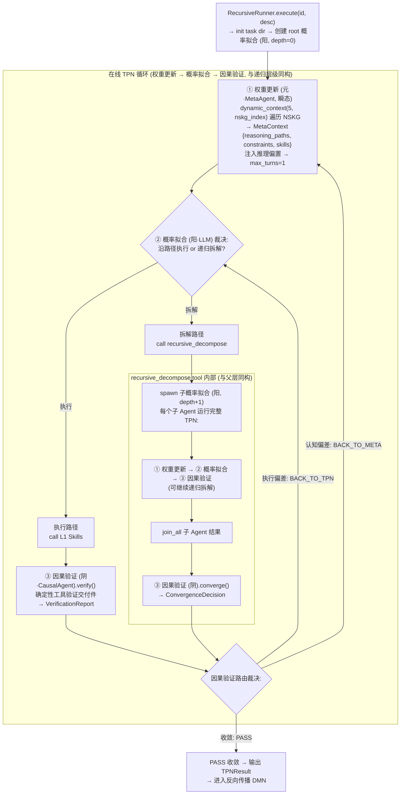
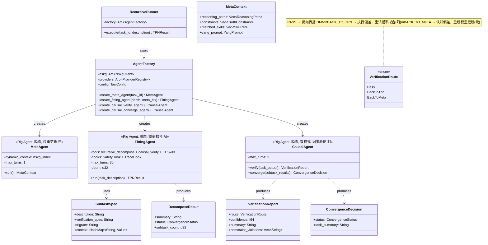
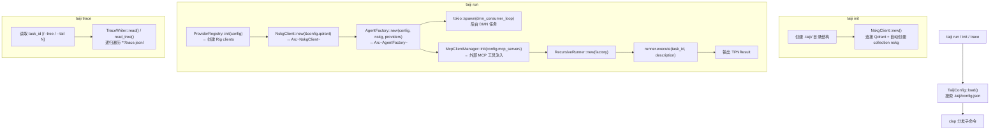
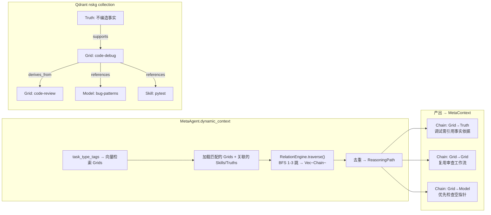
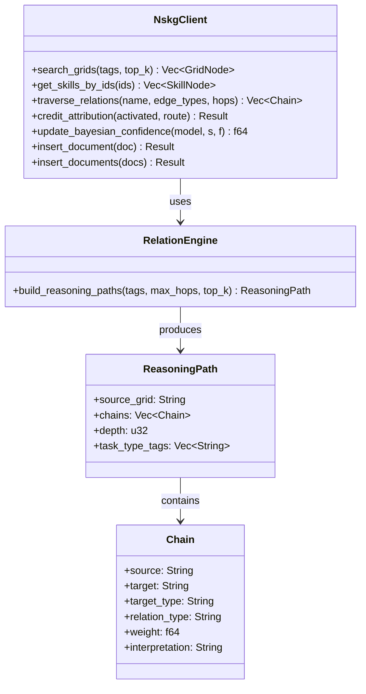

# taiji 架构蓝图 — TPN-DMN-NSKG 递归引擎（Rust / Rig + Qdrant）

> 蓝图-完型协议 V2（2026-07-08）。
>
> **本文件 = 总装图 + 部件图（给人看）。** 实施约束与避坑规则见 [`AGENTS.md`](./AGENTS.md)（给 AI 自检）。
>
> **V2 关键变更：** 三引擎改为瞬态 Rig Agent（权重更新·元 / 概率拟合·阳 / 因果验证·阴），概率拟合通过 `recursive_decompose` tool 拥有递归下发与回收，单层与多层递归同构。

---

## 0. 设计哲学

### 0.1 异层同构 (Isomorphic Recursion)

递归树的每一层结构完全相同。depth=0 的根节点和 depth=N 的子节点执行相同的 TPN 三阶段循环（元→阳→阴）、拥有相同的文件目录布局（`deliverables/` + `trace.jsonl` + `children/`）、收到相同的 system prompt 模板（唯一区别是 `task_dir` 指向不同路径）。

由简单传递结构化组成为复杂：只要一个节点的行为正确，整个递归树的行为就是正确的。不需要为不同深度设计不同的控制流。

### 0.2 三相互补 (Tri-Phase Complementarity — I Ching)

项目名"太極"直接映射到执行模态：

| 卦象 | Agent | 易经 | 相位 |
|------|-------|----------|------|
| **元** (Meta) | MetaAgent | 无极生太极 | 权重更新——从符号系统提取 reasoning paths，建立认知框架 |
| **阳** (Yang) | FittingAgent | 阳 | 概率拟合——沿路径发散探索，LLM 做微观概率性采样 |
| **阴** (Yin) | CausalAgent | 阴 | 因果验证——将结果收敛回符号约束，验证宏观因果性 |

TPN 循环是阴阳交替的算法实现：**阳生（概率采样）→ 阴克（验证驳回/通过）→ 元调（根据反馈调整权重）→ 再阳生...**，直到收敛。三个相位是同一个递归过程的不同阶段。

### 0.3 神经与符号的统一 (Neural-Symbolic Integration)

LLM 在系统中的角色是**微观概率性的体现**——每一次 prompt 调用是随机的、概率性的、不可精确重现的。LLM 如同神经突触，在符号系统的框架内产生原始认知波动。

NSKG（Qdrant 认知图谱）是**宏观因果性的体现**——reasoning paths、Truth 约束、L1 Skills 形成可追溯的符号推理网络。因果验证将 LLM 的概率输出锚定回符号空间。

TPN 循环就是这两层表象的交替：**概率采样 → 符号验证 → 权重调整 → 再采样...**，直到收敛。这对应认知科学中 System 1（直觉、概率）与 System 2（理性、符号）的协作。

### 0.4 第一性原理 (First Principles)

复杂事物是由简单事物结构化组成的。系统的复杂性不来自为每层写不同的逻辑，而来自同一个简单结构在不同深度/不同条件的重复应用：

- 一个 `FittingAgent` 节点可以执行，也可以递归拆解——不需要两种 agent 类型
- 一个 `EngineContext` 携带 `task_dir`，根节点和子节点用它做同一件事——创建目录、写 trace、通知 LLM
- 一个 `Task` 结构在不同层代表不同粒度的认知单元——但不改变结构
- 一个 TPN 循环在 depth=0 是根，在 depth=N 是叶——执行的是同一段代码

认知演化（DMN）遵循同一原则：δ₀→δ₃ 四步演化在每次后台触发时重复相同的过程，不因任务复杂度不同而变化。

> **总结：** 神有多种（LLM 作为概率引擎 + NSKG 作为符号引擎），理为一贯（异层同构的三相互补循环）。系统从不把同一件事写两遍。

---

## 1. 架构总纲

### 核心概念

| 层/组件 | 角色 | 说明 |
|---------|------|------|
| **L4 Truth** | 不变约束 | 硬性规约（不编造事实、有依据推理），不可覆盖，运行时加载为约束 |
| **L3 Grid** | 复合推理角色 | 含 role_prompt、workflow 步骤、关联 Skills/Models/Truths，`task_type_tags` 驱动向量检索 |
| **L2 Model** | 概率经验模式 | 从执行轨迹提取的模式，带 Bayesian 置信度（Beta 后验），存储于 Qdrant |
| **L1 Skill** | 可执行工具函数 | 包装具体工具调用，带 success_rate 和 use_count，作为 Rig Agent 的 Tool |
| **NSKG** | 认知图谱 | 四层存储在 Qdrant 单 collection `nskg`，`type`+`layer` 区分；RelationEdge 存储在 payload.relations 数组 |
| **权重更新 (元·MetaAgent)** | 遍历知识图谱注入推理偏置 | **瞬态 Rig Agent**：通过 `dynamic_context` 检索 NSKG Grid/Truth，BFS 遍历关系边生成 `ReasoningPath[]`，结构化输出 `MetaContext`。不执行工具，不递归。`max_turns=1` |
| **概率拟合 (阳·FittingAgent)** | 沿推理路径拆解或执行 | **瞬态 Rig Agent**：接收 MetaContext 推理偏置，L1 Skills 为 tools，`recursive_decompose` tool 驱动子递归下发与回收，`causal_verify` tool 驱动验证。路由决策由 Agent 内部 LLM 自行裁决。`max_turns=30` |
| **因果验证 (阴·CausalAgent)** | 确定性工具验证交付件 | **瞬态 Rig Agent（双模式）**：`create_causal_verify_agent()` 产出 `VerificationReport`（执行偏差→BACK_TO_TPN / 认知偏差→BACK_TO_META）；`create_causal_converge_agent()` 产出 `ConvergenceDecision`（收敛→完成）。`max_turns=3` |
| **AgentFactory** | 瞬态 Agent 工厂 | 中枢组件：持有 `Arc<NskgClient>` + `Arc<ProviderRegistry>` + Config，从任务文件系统状态创建三种 Agent |
| **反向传播 (DMN)** | 离线反思，信用归因与经验沉淀 | 独立 tokio::spawn 后台任务，轮询 pending 队列，调用 CognitionEvolver（δ₀ 修剪 / δ₁ 技能成功率 / δ₂ 贝叶斯更新 / δ₃ 网格重连），更新 NSKG 中的 L1-L4 资产 |
| **归藏 (Xiang)** | 推理时干预 | ⚠️ R1（待实现）三变接口：send_dong / send_zhang / recv_observation |

### 技术栈

| 组件 | 选型 | 说明 |
|------|------|------|
| 语言 | Rust 2024 edition | 1.95.0，零成本抽象 + 类型安全 |
| LLM Agent | Rig v0.39 | `Agent` + `AgentHook` + `dynamic_context` + structured output + `max_turns` |
| LLM Provider | Rig deepseek::Client | Chat Completions，备选 openai::Client |
| 向量库 | Qdrant v1.18 + rig-qdrant | 单 collection `nskg`（Cosine 距离，1536维）|
| 异步 | tokio | async/await，tokio::spawn 并发子任务 |
| CLI | clap | 派生宏子命令 (run/trace/list/init) |
| 序列化 | serde + serde_json + serde_yaml | 所有类型派生 Serialize/Deserialize |
| 追踪 | tracing | Hook 自动追踪 + 手动写入 trace.jsonl，10MB 轮转 |
| 安全 | regex | SkillTriggerEngine 正则匹配，ToolSafetyGuard 参数扫描 |

### 在线执行 TPN（瞬态代理：权重更新 → 概率拟合 → 因果验证）

```
用户 → taiji run <description>
  → TaijiConfig::load()
  → ProviderRegistry::init(config) → Rig clients
  → NskgClient::new(qdrant_url) → Arc<NskgClient>
  → AgentFactory::new(config, nskg, providers) → Arc<AgentFactory>
  → RecursiveRunner::new(factory)
  → runner.execute(task_id, description)
    → init task dir (.taiji/tasks/{task_id}/)
    → factory.create_fitting_agent(depth=0)  ← 瞬态：加载 meta.json + trace.jsonl + Qdrant
    → 权重更新 (元·MetaAgent, 瞬态, max_turns=1)
        → dynamic_context(5, nskg_index) → 遍历 NSKG 提取推理路径
        → 注入推理偏置 MetaContext {reasoning_paths, constraints, skills}
    → 概率拟合 (阳·FittingAgent) LLM loop (max_turns=30):
        ├─ 沿路径调用 L1 Skills（SkillTriggerEngine 匹配）
        ├─ recursive_decompose → 子递归下发与回收
        │     → each child: factory.create_fitting_agent(depth+1)
        │     → 子 Agent 运行完整循环（权重更新→概率拟合→因果验证，与父层同构）
        │     → join_all → CausalAgent.converge() → ConvergenceDecision
        └─ causal_verify → CausalAgent.verify() → VerificationReport
    → 因果验证路由:
        ├─ 执行偏差 (BACK_TO_TPN) → 回到概率拟合，重试执行
        ├─ 认知偏差 (BACK_TO_META) → 回到权重更新，重新推理
        └─ 任务收敛 (PASS)        → 输出 TPNResult
```

### 反向传播 DMN（离线反思：信用归因与经验沉淀）

```
CausalAgent 输出 PASS, 任务完成
  → enqueue DMN 任务到 pending/ 队列
  → 反向传播 (DMN Consumer, 后台 tokio::spawn):
      ├─ read trace + deliverables
      ├─ δ₀ 修剪: 移除 confidence < 0.1 的低信度资产
      ├─ δ₁ L1 技能调优: 更新 success_rate / use_count
      ├─ δ₂ L2 贝叶斯更新: alpha+=s, beta+=f
      └─ δ₃ L3 网格重连: 调整 relation 权重
      → write NSKG 更新 → Qdrant (version++)
      → 下一轮权重更新自动读取最新图谱
```

### 递归循环（单层与多层同构）

```
概率拟合 (阳·FittingAgent) LLM loop ─────────────────────────────────────────────────────────────┐
  权重更新 (元·MetaAgent) → MetaContext { reasoning_paths, constraints, skills }                  │
     │ 注入推理偏置                                                                               │
     ▼                                                                                            │
  ┌─ LLM 裁决: 沿路径执行 or 递归拆解?                                                            │
  │                                                                                               │
  ├─ 执行路径:                                                                                    │
  │     call L1 Skills → causal_verify (因果验证·阴)                                               │
  │     → 因果验证返回 VerificationReport                                                          │
  │     → 执行偏差? → BACK_TO_TPN → 重试概率拟合                                                   │
  │     → 认知偏差? → BACK_TO_META → 重新权重更新                                                   │
  │     → PASS 收敛? → 返回 TPNResult → 进入反向传播 DMN                                           │
  │                                                                                               │
  └─ 拆解路径:                                                                                    │
        call recursive_decompose({SubtaskSpec[]})                                                  │
        → 为每个子任务 spawn 概率拟合 (阳, depth+1) ◄────────┐                                     │
        → 子 Agent 运行完整 TPN ┐                              │ 递归层级                         │
        │   ① 权重更新 (遍历 NSKG)│                             │ 与父层完全同构                  │
        │   ② 概率拟合 (执行/再拆解)│                            │                                 │
        │   ③ 因果验证 (收敛判定)│                              │                                 │
        └───────────────────────┘                              │                                 │
        → join_all 子 Agent 结果                                │                                 │
        → 因果验证·阴 converge() → ConvergenceDecision ◄────────┘                                 │
        → 返回 DecomposeResult 给父 LLM                                                          │
        → LLM 读结果: PASS → 返回 / BACK_TO_TPN → 调整拆解 / BACK_TO_META → 重新权重更新            │
                                                                                                  │
  TraceHook 在每个 StepEvent 自动写入 trace.jsonl ◄──────────────────────────────────────────────┘
```

**关键：单层递归与多层递归结构同构（isomorphic）。** 每一层 FittingAgent 的内部循环完全一致：权重更新 → 概率拟合 → 因果验证 → 路由。唯一的区别是深度编号（depth），递归层之间的信息传递通过 `MetaContext`（推理偏置注入）和 `ConvergenceDecision`（收敛结果上浮）完成。无需为不同深度设计不同的控制流。

路由由 Agent 内部 LLM 根据 tool 返回的结构化输出自行裁决，不是外部控制流。`max_depth=2` 默认限制递归深度。

---

## 2. 模块依赖

### 七层模块结构

```mermaid
flowchart TB
    subgraph "L6 入口"
        MAIN["main.rs\nclap CLI"]
    end

    subgraph "L5 MCP"
        MCP_SRV["mcp/server.rs\n暴露 taiji 工具"]
        MCP_CLI["mcp/client.rs\n消费外部工具"]
    end

    subgraph "L4 编排"
        RUNNER["orchestration/runner.rs\nRecursiveRunner (薄包装)"]
        CONST["orchestration/constraint_engine.rs\nConstraintEngine"]
        TRIG["orchestration/trigger_engine.rs\nSkillTriggerEngine"]
        WORKER["orchestration/worker_pool.rs\nWorkerPool"]
        EVOLVER["orchestration/cognition_evolver.rs\nCognitionEvolver"]
        DMN["orchestration/dmn_consumer.rs\nDMN Consumer"]
    end

    subgraph "L3 Agent"
        FACTORY["agents/factory.rs\nAgentFactory (中枢)"]
        META_B["agents/meta.rs\nMetaAgent 构建器"]
        FIT_B["agents/fitting.rs\nFittingAgent 构建器"]
        CAUSAL_B["agents/causal.rs\nCausalAgent 构建器"]
        TOOLS["agents/tools/\nrecursive_decompose, causal_verify, L1 Skills"]
    end

    subgraph "L2 Hook"
        SAFETY["hooks/safety.rs\nToolSafetyGuard (AgentHook)"]
        TRACE_H["hooks/trace.rs\nTraceHook (AgentHook)"]
    end

    subgraph "L1 基础设施"
        PROVIDER["infra/provider.rs\nProviderRegistry"]
        QDRANT["infra/qdrant.rs\nNskgClient (Qdrant CRUD)"]
        REL["infra/relation_engine.rs\nRelationEngine (BFS→Chain)"]
        CONFIG["infra/config.rs\nTaijiConfig"]
        ERR["infra/error.rs\nTaijiError"]
        TRACE_W["infra/trace.rs\nTraceWriter (JSONL)"]
        RLIMIT["infra/rate_limiter.rs\nRateLimiter"]
        TSPEC["infra/task_spec.rs\nTaskSpec (YAML frontmatter)"]
    end

    subgraph "L0 基础类型"
        TYPES["types/\ntask, agent, verification, execution, meta_context"]
    end

    MAIN --> CONFIG & RUNNER
    RUNNER --> FACTORY
    FACTORY --> PROVIDER & QDRANT & TRIG & REL & TYPES
    FACTORY --> META_B & FIT_B & CAUSAL_B
    FIT_B --> TOOLS & SAFETY & TRACE_H
    TOOLS --> FACTORY  %% recursive_decompose 持有 AgentFactory 创建子 Agent
    META_B --> QDRANT
    CAUSAL_B --> CONST
    EVOLVER --> QDRANT & TRACE_W
    DMN --> EVOLVER
    MCP_SRV --> FACTORY
    MCP_CLI --> FIT_B
```

### 接口契约

| # | 涉及节点 | 契约 | 状态 |
|---|---------|------|------|
| 1 | **`recursive_decompose` tool** | 输入 `SubtaskSpec[]` → LLM 拆解 → `factory.create_fitting_agent(depth+1)` per subtask → join_all → `CausalAgent.converge()` → 返回 `DecomposeResult { ConvergenceDecision, summary }` | 设计完成 |
| 2 | **瞬态 Agent 实例化** | `AgentFactory.create_fitting_agent(depth, meta_ctx)` 从 `tasks/{id}/meta.json` + `trace.jsonl` + Qdrant 加载上下文，创建 Rig Agent，运行后销毁 | 设计完成 |
| 3 | **ToolSafetyGuard Hook** | `SafetyHook` 实现 `AgentHook`，在 `ToolCall` 事件上检查路径穿越/命令注入/SSRF，返回 `Flow::cont()` 或 `Flow::skip(reason)` | 设计完成 |
| 4 | **ConstraintEngine** | 两处集成：MetaAgent 加载约束到 `MetaContext.constraints`；CausalAgent 前置检查输出是否违反 L4 Truth，违反则直接返回 BACK_TO_META | 设计完成 |
| 5 | **DMN Consumer 生命周期** | `tokio::spawn` 后台任务，持有 `CancellationToken`，指数退避轮询 pending 队列，调用 `CognitionEvolver::evolve()` | 设计完成 |

---

## 3. 瞬态代理：在线执行 TPN（权重更新 → 概率拟合 → 因果验证）

### 单层递归与多层递归同构

每一层 FittingAgent 运行相同的 TPN 三阶段循环。`recursive_decompose` tool 内部的子递归与父层结构完全一致——唯一的变量是 `depth`。



### 核心类型



### 瞬态 Agent 生命周期（权重更新/概率拟合/因果验证 三者一致）

```
每个递归周期:
  1. AgentFactory.create_*_agent(task_id)
     ├─ 加载 tasks/{task_id}/meta.json → TaskMeta
     ├─ 加载 tasks/{task_id}/trace.jsonl (最近 N 条) → 历史上下文
     ├─ 加载 tasks/{task_id}/task-spec.md (若存在) → 目标规格
     └─ 查询 Qdrant nskg → 动态检索 grids/skills/truths
  2. agent.run(input)
     ├─ 权重更新 (元): dynamic_context → 遍历图谱 → 注入推理偏置
     ├─ 概率拟合 (阳): LLM + tools loop → 沿推理路径执行/拆解
     └─ 因果验证 (阴): 确定性工具 → 验证交付件/收敛判定
  3. 返回结构化输出 (MetaContext / TPNResult / VerificationReport)
  4. agent 被 drop（状态不保留；认知更新由 DMN 写入 Qdrant 后下一轮自动生效）
```

---

## 4. 系统启动流



---

## 5. 文件系统结构

```
taiji/                              ← project root
├── Cargo.toml                      ← rig + rig-qdrant + tokio + clap + serde + serde_yaml
├── Cargo.lock
├── BCP-蓝图-完型-契约.md            ← 本文档
├── 旧代码/                          ← Python 版归档
│
├── src/
│   ├── main.rs                     ← L6: clap CLI 入口
│   ├── lib.rs                      ← 公共重导
│   │
│   ├── types/                      ← L0 基础类型
│   │   ├── mod.rs
│   │   ├── task.rs                 ← Task, TPNResult, TaskStatus, SubtaskSpec, DecomposeResult
│   │   ├── agent.rs                ← Chain, ReasoningPath, YangPrompt, MetaContext
│   │   ├── verification.rs         ← VerificationReport, ConvergenceDecision, VerificationRoute
│   │   ├── execution.rs            ← EngineContext, ToolCallRecord
│   │   └── task_spec.rs            ← TaskSpec (YAML frontmatter + body)
│   │
│   ├── infra/                      ← L1 基础设施
│   │   ├── mod.rs
│   │   ├── config.rs               ← TaijiConfig (LLM / Qdrant / Runtime / Safety)
│   │   ├── error.rs                ← TaijiError 枚举
│   │   ├── provider.rs             ← ProviderRegistry (Rig client 管理)
│   │   ├── qdrant.rs               ← NskgClient (Qdrant CRUD + search)
│   │   ├── relation_engine.rs      ← RelationEngine (BFS → Chain)
│   │   ├── trace.rs                ← TraceWriter (JSONL + 10MB 轮转)
│   │   ├── rate_limiter.rs         ← Global rate limiter (token bucket)
│   │   ├── task_spec.rs            ← TaskSpec 解析器 (YAML frontmatter)
│   │   └── schema.rs               ← Qdrant payload schema 文档
│   │
│   ├── hooks/                      ← L2 Hook
│   │   ├── mod.rs
│   │   ├── safety.rs               ← ToolSafetyGuard (AgentHook impl)
│   │   └── trace.rs                ← TraceHook (AgentHook impl)
│   │
│   ├── agents/                     ← L3 Agent
│   │   ├── mod.rs
│   │   ├── factory.rs              ← AgentFactory (中枢)
│   │   ├── meta.rs                 ← MetaAgent 构建器 (dynamic_context)
│   │   ├── fitting.rs              ← FittingAgent 构建器 (tools + hooks)
│   │   ├── causal.rs               ← CausalAgent 构建器 (verify + converge)
│   │   └── tools/
│   │       ├── mod.rs              ← tool 注册
│   │       ├── recursive_decompose.rs  ← 递归拆解 tool
│   │       ├── causal_verify.rs    ← 验证 tool
│   │       └── skills/             ← L1 Skill tools
│   │           └── mod.rs          ← read, write, exec, web, search, bash...
│   │
│   ├── orchestration/              ← L4 编排
│   │   ├── mod.rs
│   │   ├── runner.rs               ← RecursiveRunner (薄包装)
│   │   ├── constraint_engine.rs    ← ConstraintEngine (L4 约束检查)
│   │   ├── trigger_engine.rs       ← SkillTriggerEngine (regex + 权重匹配)
│   │   ├── worker_pool.rs          ← WorkerPool (信号量 + 限流)
│   │   ├── cognition_evolver.rs    ← CognitionEvolver (δ₁-δ₄)
│   │   └── dmn_consumer.rs         ← DMN Consumer (后台 poll loop)
│   │
│   └── mcp/                        ← L5 MCP
│       ├── mod.rs
│       ├── server.rs               ← MCP Server (暴露 taiji 工具)
│       └── client.rs               ← MCP Client Manager (消费外部工具)
│
└── target/
```

### 运行时 `.taiji/` 布局（递归同构目录树）

```
.taiji/
├── config.json                     ← TaijiConfig
├── pending/                        ← DMN 任务队列
│   └── dead/                       ← 死信队列
└── tasks/
    └── {root_uuid}/                ← 根任务
        ├── meta.json               ← 任务元数据 (Task { id, depth:0, status })
        ├── trace.jsonl             ← 根 FittingAgent 执行轨迹
        ├── deliverables/           ← 根 LLM 产出目录
        └── children/               ← 递归子任务
            ├── 0/                  ← 子任务 (index from 0)
            │   ├── meta.json       ← depth:1, parent_id:{root}
            │   ├── trace.jsonl     ← 子 FittingAgent 轨迹
            │   ├── deliverables/   ← 子产出目录（与根同构）
            │   └── children/       ← 可继续递归
            ├── 1/
            └── ...
```

每个节点的目录结构完全相同（同构），`depth` 不改变布局。所有路径通过 `EngineContext.task_dir` 传播。

---

## 6. NSKG V4 — 认知知识图谱（Qdrant）

### 集合设计

单 Qdrant collection `nskg`，`type` + `layer` 字段区分四层认知资产：

| 字段 | 类型 | 说明 |
|------|------|------|
| `id` | str | 唯一标识 `grid:code-debug` |
| `type` | str | grid \| skill \| model \| truth |
| `layer` | str | L1 \| L2 \| L3 \| L4 |
| `name` | str | 节点名 |
| `confidence` | f64 | [0,1] 置信度 |
| `embedding` | Vec\<f32\> | 文本嵌入向量（1536 维） |
| `version` | u64 | 版本号 |
| `stats` | struct | `{success_count, fail_count, last_used}` |
| `relations` | array | `[{target, target_type, type, weight, interpretation}]` |

类型特有字段：
- **L1 Skill**: `tool` (工具名), `body` (代码), `phase` (meta/fitting/causal)
- **L2 Model**: `pattern` (模式描述), `alpha`/`beta` (Beta 分布参数)
- **L3 Grid**: `task_type_tags`, `role_prompt`, `workflow` (步骤列表)
- **L4 Truth**: `can_override` (bool), `interpretation` (语义解释)

### 推理路径遍历



### NskgClient 接口



**注意：** `credit_attribution()` 和 `update_bayesian_confidence()` 由后台 DMN Consumer（CognitionEvolver）调用，而非由 CausalAgent 直接调用。

---

## 7. 递归执行追踪系统

### 双层追踪

| 组件 | 追踪方式 | 说明 |
|------|---------|------|
| **概率拟合 (阳·FittingAgent)** | Rig `TraceHook`（AgentHook） | 自动捕获每个 `ToolCall`、`ToolResult`、`CompletionCall`、`CompletionResponse` 事件 |
| **权重更新 (元·MetaAgent)** | 手动 `TraceWriter::write()` | `max_turns=1`，无工具调用，单条记录 |
| **因果验证 (阴·CausalAgent)** | 手动 `TraceWriter::write()` | `max_turns=3`，结构化输出，单条记录 |

### TraceRecord 字段

| 字段 | 类型 | 说明 |
|------|------|------|
| `ts` | String | ISO8601 时间戳 |
| `cycle` | u32 | 外循环轮次 |
| `depth` | u32 | 递归深度 |
| `task_id` | String | 当前 task id |
| `phase` | String | 权重更新 \| 概率拟合·turn \| 工具调用 \| 因果验证 \| 收敛判定 |
| `provider_model` | String | 模型名 |
| `duration_ms` | u64 | 耗时 |
| `input` | Value | 摘要化输入 |
| `output` | Value | 摘要化输出 |
| `degraded` | bool | 是否降级 |
| `reasoning_path_ids` | Option\<Vec\<String\>\> | 仅 meta phase |
| `constraint_violations` | Option\<Vec\<String\>\> | 仅 causal phase |

### 嵌套 Trace 文件结构（与递归目录树同构）

```
tasks/
└── {task-uuid}/
    ├── trace.jsonl              ← 本层 TraceHook 写入
    ├── deliverables/            ← 本层 LLM 产出目录
    └── children/
        ├── 0/
        │   ├── trace.jsonl      ← 子层 TraceHook 写入
        │   └── deliverables/
        ├── 1/
        │   ├── trace.jsonl
        │   └── deliverables/
        └── ...
```

`read_tree()` 递归遍历所有 `**/trace.jsonl`，按时间戳合并排序。

---

## 8. 缺失模块（实施约束详见 AGENTS.md）

以下模块在图中已标注位置，详细实施约束（避坑规则、边界条件、自检清单）写入 [`AGENTS.md`](./AGENTS.md)。

| 模块 | 文件位置 | 在 AGENTS.md 中的条目 |
|------|---------|----------------------|
| ToolSafetyGuard | `hooks/safety.rs` | § 工具安全规则 |
| ConstraintEngine | `orchestration/constraint_engine.rs` | § 约束检查规则 |
| SkillTriggerEngine | `orchestration/trigger_engine.rs` | § 工具选择规则 |
| CognitionEvolver | `orchestration/cognition_evolver.rs` | § DMN 演化规则 |
| DMN Consumer | `orchestration/dmn_consumer.rs` | § 后台任务规则 |
| MCP Server | `mcp/server.rs` | § MCP 规则 |
| MCP Client | `mcp/client.rs` | § MCP 规则 |
| ProviderRegistry | `infra/provider.rs` | § LLM 调用规则 |
| WorkerPool + RateLimiter | `orchestration/worker_pool.rs` | § 并发与限流规则 |

---

## 9. 风险与缓解

| # | 风险 | 严重度 | 缓解 |
|---|------|--------|------|
| 1 | `recursive_decompose` tool 内创建子 Agent 导致栈溢出/死锁 | 高 | `max_depth=2` 默认限制 + `CancellationToken` 传递 + tokio spawn |
| 2 | 递归拆解 token 成本指数增长 | 高 | `MetaContext` 在兄弟子任务间共享；`max_subtasks=4`；`max_depth=2` |
| 3 | DeepSeek 结构化输出不可靠（JSON 格式漂移） | 中 | 重试层（最多 3 次）+ fallback 到 verbatim 提取 + regex JSON 修复 |
| 4 | CausalAgent 双模式（verify vs converge）的 tool 选择混淆 | 中 | 两个独立工厂函数：`create_causal_verify_agent()` 和 `create_causal_converge_agent()`，用不同 system prompt |
| 5 | 外部 MCP 工具绕过 SafetyHook | 中 | 非白名单服务器的 MCP 工具强制执行参数扫描；config.safety.trusted_mcp_servers 白名单 |
| 6 | 嵌套 Agent 的 trace 文件分散 | 低 | 每任务独立 trace.jsonl；`read_tree()` 递归合并 |
| 7 | ProviderRegistry 与 Rig 客户端生命周期 | 低 | `Arc<ProviderRegistry>` 持有 `HashMap<String, Arc<Client>>`；惰性初始化 + 连接池 |
| 8 | DMN Consumer 与 TPN 执行并发写入 Qdrant | 低 | Qdrant 自身的乐观并发控制；version 字段用于冲突检测 |

---

## 10. 路线图

| Phase | 范围 | 优先级 | 状态 |
|-------|------|--------|------|
| **R0a** | 基础设施：config, error, qdrant (NskgClient), relation_engine, trace, provider_registry, rate_limiter | P0 | Rust 实现完成 |
| **R0b** | AgentFactory + 三个瞬态 Rig Agent（Meta/Fitting/Causal）+ recursive_decompose tool + causal_verify tool + skills | P0 | Rust 实现完成 |
| **R0c** | Hooks: SafetyHook + TraceHook | P0 | Rust 实现完成 |
| **R0d** | ConstraintEngine + SkillTriggerEngine | P0 | Rust 实现完成 |
| **R0e** | CognitionEvolver + DMN Consumer (后台任务) | P0 | Rust 实现完成 |
| **R1a** | MCP Server（暴露 taiji 工具） | P1 | Rust 实现完成 |
| **R1b** | MCP Client Manager（消费外部工具） | P1 | Rust 实现完成 |
| **R1c** | WorkerPool + RateLimiter | P1 | Rust 实现完成 |
| **R1d** | TaskSpec 持久化（meta.json / task-spec.md）+ main.rs CLI | P1 | Rust 实现完成 |
| **R2a** | 归藏 Xiang（三变接口 HTTP） | P2 | 未设计 |
| **R2b** | 多 provider 动态切换 UI | P2 | 未设计 |

---

## 11. 架构演化记录

| 版本 | 日期 | 变更 |
|------|------|------|
| V1-V4 | 2026-07 | Python 原型（96 文件 / 17K 行），验证 TPN-DMN-NSKG 架构 |
| **Rust R0** | 2026-07-08 | Rust 重构初版：Rig + Qdrant + tokio。核心 TPN 三引擎、NSKG 向量检索与关系遍历、Trace 追踪系统。编译通过。 |
| **Rust V2** | 2026-07-08 | 架构重新设计：三引擎改瞬态 Rig Agent，概率拟合拥有递归，路由 LLM 内部化。补充 8 个缺失模块。7 层模块结构。 |
| **V3 协议** | **2026-07-08** | **降维为二层协议：** 文档改名为"蓝图-完型协议"（纯图，给人看）。移除契约表格，实施约束迁移至 `AGENTS.md`（AI 自检清单）。三引擎正式命名：权重更新·元 / 概率拟合·阳 / 因果验证·阴 / 反向传播·DMN。明确单层与多层递归同构。 |
| **Rust V4** | **2026-07-08** | **全模块 Rust 实现填坑：** 类型系统（L0）与基础设施层（L1, config/error/qdrant/relation_engine/trace/rate_limiter）实现完成。Agent 层（factory/meta/fitting/causal）、hooks、tools、orchestration 层、MCP 层、CLI 入口从设计阶段进入实现填坑阶段。 |
| **Rust V5** | **2026-07-08** | **全量代码完成（~93%）：** FittingAgent.run() 从 `todo!()` 替换为生产级 Rig Agent 构建代码（preamble → hooks → tools → build → prompt）。零 `todo!()` 残留。跨模块接口修复（causal_verify, recursive_decompose, hook imports）。Cargo.toml 依赖调优。113 个测试。 |
| **Rust V6** | **2026-07-08** | **37 项代码审查修复：** SafetyConfig 默认 true、governor 限流、安全钩子故障开放/SSRF/命令注入修复、TPN 循环、Qdrant 指数退避重连、Trace 脱敏、CancellationToken 传播、max_subtasks/turns 强制、降级置信度 0.0、DMN Qdrant 写入、BFS O(n²) 优化、TaskStatus::Cancelled、硬约束短路修复、ProviderRegistry fallback warn、DMN consumer retry、Tag map 1:N。 |
| **Rust V7** | **2026-07-09** | **递归目录树（异层同构布局）：** EngineContext 添加 `task_dir"` 字段、TraceHook 改为从 `engine_ctx.task_dir` 推导路径、RecursiveDecomposeTool 创建 `children/{i}/deliverables/`、System prompt 注入 `产出目录` 指令。补充设计哲学 §0。配置文件迁移完成，唯一配置来源。MCP 子命令添加。 |
