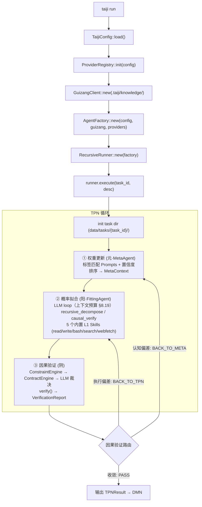

# taiji 架构蓝图 — 纯云端 MCP Agent 插件系统（Rust / Rig）

> 蓝图-完型协议 V36。

> **当前状态（2026-08）**：归藏本体论重构 MVP-1~6 全部落地（`cargo test --lib` 257 pass / 0 failed / 9 ignored）——契约化（ContractEngine L0/L1）→ 统计回传（四维 CheckStats）→ MCTS 四算子演化（fork/merge/prune + 贝叶斯后验 §6.4.1）→ 断言证据链（TraceConsistency §8.22）→ UCB 检索（§6.3）→ prompts 对称演化（§8.21）。
>
> **架构定论（不可推翻）**：① 概率系统不能验证概率系统——收敛验证符号化（L0/L1 机械失败 > LLM 任何裁决，§6.6）；② 归藏 = 规范性本体论（验证契约库 + 生成资产库），拒绝向量库/图库/推理器/分布式/并行写/随机采样（§6.0/§8.3）；③ 激励问题不需要 ground truth——断言证据链（断言 vs 执行轨迹一致性）机械可判定（§8.22）；④ 最小 MVP 开发范式：每步可独立验收（§8.23）。
>
> **版本历史**（全文见文末附录 A）：
> - **V36**：归藏按模型分区 + 分区路由（ModelRouter / model_stats / 分区回传）
> - **V35**：检索/演化侧数学化——UCB 检索落地 + prompts 对称演化（MVP-5/6）
> - **V34**：委托-代理机制设计——断言证据链 + TraceConsistency（MVP-4）
> - **V33**：归藏本体论重构——验证三权分立 + 结构化契约（MVP-1/2/3）
> - **V32**：DMN-MCTS 认知树——归藏按模型分区 + 蒙特卡洛学习
> - **V31**：收敛树补齐——阴·向上汇报 / 阳·接受汇报与再指导
> - **V30**：分封制——任务自我认知 + 会盟
> - **V29**：上下文窗口预算（token 计数替代 max_turns）
> - **V28**：产物契约（执行事实是唯一记忆，handoff 交接）
>
> **本文件 = 唯一事实。** 实施约束与避坑规则见 [`AGENTS.md`](./AGENTS.md)（给 AI 自检）。
>
> **文档体系**：设计哲学与全局关系 → 本文档；TPN 详细设计 → [`BCP-TPN.md`](./BCP-TPN.md)；DMN 详细设计 → [`BCP-DMN.md`](./BCP-DMN.md)。§ 编号全局唯一，跨文档引用不变。

---

---

---

## 1. 设计哲学

### 1.1 异层同构 (Isomorphic Recursion)

递归树的每一层结构完全相同。depth=0 的根节点和 depth=N 的子节点执行相同的 TPN 三阶段循环、拥有相同的文件目录布局、相同的恢复/持久化路径与相同的上下文预算——**不为不同深度写不同的控制流，不引入任何 depth 特例**。递归终止仅由 §8.6 的 depth guard 保证（`depth >= max_depth` 时 decompose 工具拒绝拆解）。

**异层同构 = 结构同构 + 权限同构 + 配置同构，但提示词按模式配对**：任务节点（单个三相循环，见 §8.1）在任意深度保持相同的三相相位分工（Meta 认知权 / Fitting 执行权 / Causal 裁判权，见 §8.5）、相同的权限配置（同一 SafetyHook 单例、相同白名单）与相同的运行参数（上下文预算 / 防护默认值，V29 §8.19）——**结构、权限与配置不随 depth / round / cycle 变化**。但每个节点由元 Agent 权重更新时按「递归层数规则 + 任务难易程度」决策**阴阳配对模式**（§8.8）：

- **编排模式（Orchestration）**：阳 Agent 注册 recursive_decompose + causal_verify + 5 L1 Skills，用编排模板（拆解 + 综合）；阴 Agent 用收敛模板（子结果聚合判决）
- **执行模式（Execution）**：阳 Agent 只注册 causal_verify + 5 L1 Skills（**不注册 recursive_decompose**，LLM 不可见拆解工具），用执行模板（直接产出）；阴 Agent 用验证模板（直接产出核验）

**提示词来源：** FittingAgent / CausalAgent 的 system prompt 由 MetaAgent 在每次 TPN 循环的开始阶段动态编排。MetaAgent 首先查询归藏 `prompts/` 层的提示词资产（标签匹配 + 置信度排序），结合深度规则与难度判断决策模式，若有高置信度匹配则调用 LLM 将**与所选模式配对**的资产组合为三份完整的 system prompt（fitting、verify、converge），注入 `MetaContext`（含 `mode`）传递到下游 Agent。无归藏匹配时降级到 6 个 Base 硬编码模板（FittingAgent 的编排/执行各一、CausalAgent 的 verify/converge 各按模式一），下游 Agent 按 `MetaContext.mode` 自动使用对应回退。

### 1.2 三相互补 (Tri-Phase Complementarity)

| Agent | 相位 | 易经 | 职责 | 权限面 |
|-------|------|------|------|--------|
| **MetaAgent** | 权重更新·元 | 无极生太极 | 遍历归藏图谱提取推理路径，注入认知偏置 | **认知权 + 收集权**：注册只读收集工具（read / search / webfetch，可联网核实），受 SafetyHook 约束；LLM 多轮收集任务上下文、父层 deliverables、归藏资产与网络信息后更新权重，**按递归层数规则 + 任务难易程度决策阴阳配对模式并编排配对提示词**；归藏只读 |
| **FittingAgent** | 概率拟合·阳 | 阳 | 沿路径发散探索，LLM 做微观概率采样，可递归拆解 | **执行权**：注册 5 个 L1 Skills + causal_verify（全节点）+ recursive_decompose（**仅编排模式节点**），受 SafetyHook + TraceHook 约束（全节点唯一持有变更世界工具的相位） |
| **CausalAgent** | 因果验证·阴 | 阴 | 将结果收敛回符号约束，验证宏观因果性 | **裁判权 + 收集权**：注册只读验证工具（read / webfetch，逐文件核验 + 联网核实），受 SafetyHook 约束；LLM 核验 deliverables 与外部事实后裁决路由（PASS / BACK_TO_TPN / BACK_TO_META）。**编排节点用收敛模板（converge），执行节点用验证模板（verify）** |

TPN 循环 = 阳生（概率采样）→ 阴克（验证驳回）→ 元调（调整权重）→ 再阳生...，直到收敛。

**循环内权限分工**：执行工具（write / bash / recursive_decompose / causal_verify——变更世界的工具面）收敛于 Fitting 相位；收集工具（read / search / webfetch——只读信息收集与网络核实）为三相共有，Meta / Causal 相位仅持有收集工具、无执行工具。分工是角色性的（执行者 / 认知者 / 裁判者），由工具注册面天然保证，不可被 LLM 动态改变。

### 1.3 神经与符号统一 (Neural-Symbolic Integration)

LLM 是微观概率性的体现——每次 prompt 调用随机、不可精确重现。归藏是宏观因果性的体现——reasoning paths、Truth 约束形成可追溯的符号推理网络。TPN 循环就是这两层表象的交替：概率采样 → 符号验证 → 权重调整 → 再采样。

**概率系统不能验证概率系统（V33 定论）**：CausalAgent（阴）验证 FittingAgent（阳）的输出，若验证本身也是 LLM 概率采样，则构成**同源概率回路**——阳与阴共享同一盲区（同语料 / 同训练分布 / 同风格偏好），验证结果不可靠且有实证：MM-JudgeBias（ACL 2026）26 个 SOTA judge 普遍存在**验证完整性失败**（judge 本职是 conditional verification，却退化为 unconditional prediction——按表面流畅度给分）；Reliability without Validity（arXiv 2606.19544）21 个裁判模型「高可靠性低有效性」（一致但不准确）；verbosity / self-preference / position 偏置系统性存在，**scale ≠ reliability**（判断可靠性与通用能力正交）。因此阴面的收敛验证必须**符号化**：确定性验证优先，LLM 验证只在符号层无法表达时介入（§6.6 验证三权分立）。

### 1.4 产物契约与交接文件 (Artifact Contract & Handoff)

**执行事实是唯一记忆。** 跨层、跨时间传递的只有产出物（deliverables / task_output / 交接文件）。中间记忆（chat_history、meta_ctx 推理过程）只服务于本节点内部，不得向上传播、不作为结果的事实来源。

**产出即交接：** 每个瞬态 agent（概率拟合）结束时有且仅有三种去向——完成（写最终产出）、上下文超限（写交接产出）、失败/取消（写交接产出）。**交接物 = `deliverables/handoff.md`，是产出物之一**——YAML front matter 携带结构化字段（failure_reason / degraded / output_refs），正文为环境信息（进度 / 剩余工作 / 决策 / 约束状态）。置于 `deliverables/` 内保证**可发现性**：父层（parent_deliverables 注入）、同任务其他 agent（verify/converge 逐文件核验）、元校准（BACK_TO_META 读产出）全部经既有路径自动可见，**不引入新的查找机制**。产出物是递归拆解、恢复、路由判定、元校准的唯一输入物。**V30 会盟扩展**：兄弟贡品（同级子任务 deliverables/）跨兄弟公开可发现可读——分封时注入兄弟贡品索引（`YangPrompt.sibling_deliverables`），读取经既有 read 工具，不引入新查找机制（§8.20）。

- **上下文窗口是单次拟合的采样空间，不是记忆仓库。** 上下文超限 = 采样空间装不下任务 = 任务粒度错误 = 编排失败的运行时硬证据 → 返回阳，阳基于产出文件递归分解
- **不做上下文压缩（特意设计）。** 压缩是把中间记忆塞回下一次拟合、污染新采样；交接是结束本次拟合、留下干净事实、开启新拟合
- **阴（验证/收敛）基于产出核验**：CausalAgent 只读产出文件与交接文件裁决，不消费对话过程
- **恢复 = 前一瞬态产出继承**：崩溃恢复从 `deliverables/`（含 handoff.md）重建，chat_history 仅作本节点断点续聊的最终兜底

### 1.5 第一性原理 (First Principles)

复杂事物由简单事物结构化组成。一个 FittingAgent 可以执行也可以递归拆解（不需要两种类型）、一个 EngineContext 携带 task_dir 根节点和子节点用它做同一件事、一个 Task 结构在不同层代表不同粒度但不改变结构。

### 1.6 心流 (Flow) — 分层模型

taiji 归藏资产按层组织（V32：按模型分区，§6.1），形成心流收缩-舒张节律：

| 层 | 资产 | 舒张期（浅层执行） | 收缩期（深层执行 / Flow） |
|:---:|------|:---:|:---:|
| **Prompts** | 角色模板（含角色定义） | 活跃注入 MetaContext，引导 LLM 行为 | **消溶** — 角色叙事溶解，不再显式出现于 prompt |
| **Workflows**（V32） | 阳轨流程模板（工作流+稳定涌现文本+脚本） | 与 Prompts 同通道 UCB 检索注入 | 消溶 |
| **Verifications**（V32） | 阴轨验证契约（验证工具选择+验收判据） | 注入 verify/converge prompt | 持续 |
| **Truths** | 硬约束 | 全程硬约束，TCS 前置检查 | **持续** — 作为背景基线不变 |
| **Skills** | 可执行工具（硬编码） | LLM 可调用工具 | **沉淀** — 高频模式统计积累 |

**消溶与沉淀：** 角色叙事（Prompts 中的行为引导）是浅层任务的脚手架。随着递归加深、同一任务的反复穿透（"心流"），这些显式引导逐步消溶——系统进入纯技能驱动模式：Skills 的成功率统计直接驱动行为，Truths 约束持续运行。此时不再有「我是谁」「我要做什么」的显式叙述，只剩下技能统计模式 + 硬约束。

**递归加深不是训练，是同一任务的反复穿透。** 每次穿透的产物：
1. **统计数据**（Skills 的 success_count/fail_count）→ DMN Consumer 写回归藏
2. **行为模板**（Prompts）→ 保存到归藏文件系统 → 下一次浅层执行时加载

所有资产更新通过 DMN Consumer 在符号层（YAML 文件）完成，纯云端架构无需本地模型。

### 1.7 类比与隐喻 (Analogies and Metaphors)

taiji 的核心理念植根于两个千年结构的统一：中国古典哲学（周易/归藏）中的变化与累积模型，以及现代概率算法（蒙特卡洛/知识图谱）。

#### 1.7.1 TPN / 递归树 — 周易 · 蒙特卡洛方法

TPN 三相位循环与周易三爻、MCMC 三步之间的结构同构：

| 周易 (Zhouyi) | TPN 递归树 | 现代算法 |
|---|---|---|
| **三爻** (初、中、上) | 三相位 (元Meta / 阳Fitting / 阴Causal) | MCMC 三步：proposal → sampling → acceptance |
| **六爻** (重卦：两经卦相叠) | 两层递归 × 三相位 = 6 步执行路径 | 2-level Monte Carlo rollout |
| **八卦** (2³ = 8 种卦象) | 路由三分支 (PASS/BACK_TO_TPN/BACK_TO_META) 在递归树中展开 = 8 种拓扑路径 | MCTS 8-node search frontier |
| **变卦** (爻变产生新卦) | BACK_TO_TPN / BACK_TO_META → 子任务重入 → 路径分叉 | MCTS backpropagation + re-route |

TPN 的每一次循环（权重更新 → 概率拟合 → 因果验证 → 路由决策）就是周易中的一次"起卦"——系统在不确定性中做一次概率采样，然后由因果验证裁定吉凶（PASS / 回退）。递归树的展开就是 MCTS 的 selection → expansion → simulation → backpropagation 循环：父任务选择子任务（selection）、spawn 子 Agent（expansion）、子 Agent 执行并产出收敛结果（simulation）、收敛结果上浮影响父层决策（backpropagation）。

#### 1.7.2 DMN / 归藏 — 蒙特卡洛认知树（V32 重构）

| 特征 | 归藏 / DMN | 现代对应 |
|---|---|---|
| **离散符号节点** | 资产节点（prompt / workflow / verification / truth） | MCTS 树节点（内容 + 统计） |
| **树结构** | 变体 fork 链（parent_id / variant_of）+ 标签索引 | MCTS 搜索树（选择-扩展-回传-剪枝） |
| **检索增强（TPN 执行期·前向）** | 标签匹配 → **UCB 选择**（利用+探索）→ MetaContext 注入 LLM prompt | RAG + bandit 探索（Active RAG） |
| **从执行中学习（DMN 后台·反向）** | **MCTS 四算子**：backprop（trace 统计回传）→ fork（变体扩展）→ merge（相似合并）→ prune（低回报剪枝） | **在线贝叶斯推理 / 多臂老虎机**——标准 RAG 没有这步（知识库静态） |
| **回报信号** | 通过率 / 质量分 / token 成本 / 验证轮数 四维加权（§6.4） | 强化学习 reward（由 TPN 执行数据天然产出） |
| **分层沉淀（心流深层）** | Truths 持续 → Prompts 消溶 → Skills 统计沉淀 | Self-Improving Knowledge Graph |

归藏常被类比为 RAG，但这只覆盖了 **TPN 执行期的检索增强**（retrieve → augment → generate）。RAG 的核心流程是单向的：检索 → 增强 → 生成。而归藏 + DMN 形成完整闭环：**retrieve → augment → execute → evaluate → update → re-retrieve**，其中更新由 **MCTS 统计（而非 LLM）** 驱动——V32 起 DMN 的演化不再是一组占位算子，而是蒙特卡洛树搜索：

- **TPN 是执行的马尔可夫链**（状态 = 上下文+产出，转移 = 三相循环+路由，顺序收敛）——每次执行 = 一次 rollout
- **DMN 是蒙特卡洛探索 fork 树**（节点 = 资产变体，统计驱动选择/扩展/回传/剪枝）——持久累积跨任务认知
- **一体两面**：同一棵资产树，TPN 消费（前向/生成），DMN 更新（反向/训练）——如 Transformer 的权重同时服务训练与生成
- **TPN 递归树验证 DMN 有效性**：DMN 的每次更新都被后续 TPN 执行的统计差异检验（省 token / 更高通过率），自我改进有数据支持

DMN 的 MCTS 四算子本质上是知识图谱上的**在线贝叶斯推理**——不需要重新训练模型，只在符号层更新统计，下一轮 TPN 自动加载更新后的认知偏置。

#### 1.7.3 变与藏的循环

taiji 的核心认知回路由两易构成：

```
周易（变）                         归藏（藏）
┌─────────────────────────┐       ┌─────────────────────────┐
│ TPN 递归树               │       │ DMN 认知仓库             │
│                          │       │                          │
│ 动态 / 概率 / 分叉       │───→  │ 静态 / 符号 / 累积       │
│ 概率采样（阳 FittingAgent）│      │ MCTS 四算子反向调权      │
│ 因果验证（阴 CausalAgent）│       │ Truth 真值维护（精简）     │
│ 路由决策（元 MetaAgent）  │◀───  │ 重新注入 MetaContext      │
│                          │       │                          │
└─────────────────────────┘       └─────────────────────────┘

   变 → 藏：TPN PASS → 执行产物入队 DMN，贝叶斯更新归藏资产
   藏 → 变：更新后的认知偏置重新注入 TPN MetaContext，引导下一轮采样
```

这个变-藏循环是 §1.3 神经与符号统一的运行根基：**周易（TPN）是神经侧的概率探索，归藏（DMN）是符号侧的认知沉淀。** 二者交替运作，形成自我改进的认知系统——不依赖外部微调，不依赖预设知识库。每个执行周期都在变中探索新可能，在藏中固化已验证，两者共同构成 taiji 的自我演化能力。

taiji 的智能来自云端 LLM（DeepSeek via Rig）的概率采样能力与归藏符号推理网络的交替运作。

---


## 2. 系统概览

### 核心概念

| 组件 | 角色 | 运行时行为 |
|------|------|------|
| **Prompts** | 行为模板（含角色定义） | MetaAgent 标签匹配 + 置信度排序 → LLM 编排 system prompt。**心流深层消溶**，不再显式出现于 prompt。|
| **Truths** | 硬约束层 | 全程硬约束，TCS 前置检查 + Hard 短路。**心流持续**，作为背景基线不变 |
| **Skills** | 可执行工具（硬编码） | 5 个内置真实工具（read/write/bash/search/webfetch）+ MCP 注入。带 success_rate/use_count。**心流深层沉淀**，统计更新写回归藏 |
| **models/** | 预留层（连山） | 连山流型系统接入前的占位。当前不参与任何运行时行为 |
| **归藏 (Guizang)** | 本体论工程（验证契约库 + 生成资产库，V33） | **按模型分区**的资产树 YAML 存储于 `.taiji/knowledge/{model_key}/`（prompts/workflows 阳轨生成资产 + **verifications/truths 阴轨验证契约（V33 结构化 checks）** + index.yaml），`model_stats.yaml`（元权重表）存于 knowledge 根。TPN 执行期间只读，DMN Consumer 单写者（V32 §6.1/§8.21；V33 §6.0/§6.6） |
| **MetaAgent** | 权重更新·元 | 瞬态 Rig Agent，查询归藏 **UCB 选择** + LLM 编排 system prompt（fitting/verify/converge），**按递归层数规则 + 任务难易程度决策阴阳配对模式（编排-收敛 / 执行-验证）+ 元权重模型路由（ModelRouter bandit，V32）**，产出 MetaContext（含 mode / model / assets_used）。受 §8.19 上下文预算约束（V29，替换 max_turns=6） |
| **FittingAgent** | 概率拟合·阳 | 瞬态 Rig Agent，内置 5 个 L1 Skills + `causal_verify`（任意深度注册）；`recursive_decompose` **仅编排模式注册**（执行模式 LLM 不可见）；前端通过 MCP ExternalContext 注入额外上下文。受 §8.19 上下文预算约束（V29，替换 max_turns=30）。模式由 MetaContext 携带（MetaAgent 决策） |
| **CausalAgent** | 因果验证·阴 | 瞬态 Rig Agent（双模式：verify / converge，**各自按节点模式选模板**）。verify 前置管线（V33 §6.6）：ConstraintEngine（Truths Hard 短路）→ **ContractEngine 机械执行验证契约 checks（L0 机械 + L1 契约，hard 失败直接短路，LLM 不可翻案）** → 剩余 llm_judgement 项 + ContractReport 注入 LLM 裁决（L2 兜底）；converge 聚合子结果判决收敛。受 §8.19 上下文预算约束（V29，替换 max_turns=10） |
| **AgentFactory** | 瞬态 Agent 工厂 | 中枢组件，持有基础设施 Arc 引用（ProviderRegistry / GuizangClient / WorkerPool / ConstraintEngine） |
| **ChatAgent** | 前端内嵌对话 Agent | 长生命周期 Rig Agent（24h 超时），注册 5 个 L1 Skills + SafetyHook，`max_turns=20`。`stream_chat()` 逐 token 推流到 WS 定向通道。聊天历史持久化到 `{data_root}/chat/{session_id}.json`。**与 TPN 循环完全解耦**（不进三相循环，不触发递归拆解） |
| **DMN Consumer** | 反向传播·调权 | 独立后台任务，轮询 pending 队列执行演化（**V32：MCTS 四算子** backprop/fork/merge/prune + model_stats 更新；**V33：统计对象精确到验证契约检查项**——backprop 回传检查项通过率，fork/merge/prune 在契约有效性空间操作）。**被动学习**（trace 回传）+ **主动学习**（空闲窗口探索任务）双轨。纯符号层 YAML 更新，不涉及 LLM。代码已实现，可随时激活 |

### 技术栈

| 组件 | 选型 |
|------|------|
| 语言 | Rust 2024 edition |
| LLM Agent | Rig v0.39（Agent + dynamic_context + structured output） |
| LLM Provider | Rig deepseek::Client |
| 知识库 | 文件系统 YAML（`.taiji/knowledge/`） |
| 异步 | tokio（spawn 并发子任务 + WebSocket + 流式 Agent） |
| 流式 | Rig `stream_chat()` → `MultiTurnStreamItem` → WS chunk 推送 |
| CLI | clap（run/trace/list/init/mcp/**serve**） |
| 序列化 | serde + serde_json + serde_yaml |
| 追踪 | tracing + TraceHook + 手动 TraceWriter |
| **Web 服务** | **axum + tower-http（Rust 核心进程内嵌 HTTP 静态托管 + WebSocket 双向）** |
| **前端 UI** | **React 18 + TypeScript + TailwindCSS（Vite 构建，纯浏览器运行）** |
| **图渲染** | **React Flow（纺锤树 + TPN 流程图）** |
| **动画** | **Framer Motion（节点生长 / 状态变色）** |
| **实时推送** | **WebSocket 双向（tokio-tungstenite，Rust ↔ React 事件 + 请求/响应）** |
| **太极图** | **纯 CSS/SVG 动画（60s 旋转 + 状态联动光晕）** |

### 架构总纲



---


---

## TPN 与 DMN 的关系

TPN（任务处理网络）与 DMN（归藏认知演化）是同一认知系统的两面：**TPN 消费认知，DMN 沉淀认知**（§1.7.2 一体两面）。

### 一体两面

| 维度 | TPN | DMN |
|------|-----|-----|
| 本质 | 执行的马尔可夫链——每次执行 = 一次 rollout | 蒙特卡洛探索 fork 树——持久累积跨任务认知 |
| 方向 | 前向 / 生成（retrieve → augment → execute） | 反向 / 训练（evaluate → update → re-retrieve） |
| 载体 | 递归树（任务节点 = TPN 三相循环） | 资产树（prompts / workflows / verifications / truths / models） |
| 比喻 | 周易（变）——概率采样与因果验证 | 归藏（藏）——符号累积与统计调权 |

同一棵资产树：TPN 在树上做检索消费（前向），DMN 在树上做统计更新（反向）——如 Transformer 权重同时服务训练与生成。**TPN 递归树验证 DMN 有效性**：DMN 的每次更新都被后续 TPN 执行的统计差异检验（省 token / 更高通过率），自我改进有数据支持。

### 权限关系（§8.3）

- **TPN 执行期只读归藏**——任何 Agent（Meta / Fitting / Causal / ContractEngine）不得写资产
- **DMN Consumer 是唯一写者**（单线程后台任务，`--with-dmn` 激活），写路径 = pending / experiments 队列
- **分区一致性**：一个任务内所有 Agent 使用同一分区（按路由模型 model_key），`MetaContext.model` 是唯一载体

### 数据流：DMN → TPN（前向 · 检索注入）

```
ModelRouter（读 model_stats 元权重表，纯符号层）
  → LiluoClient.for_model(model_key) 分区检索
  → UCB 排序（利用 + 探索，§6.3）
  → MetaAgent LLM 编排 system prompt（模式决策 + 资产组合）
  → MetaContext { mode, model, assets_used, prompts } 注入 Fitting / Causal
另外两路只读消费：
  → ContractEngine 加载 verifications/ 机械验证（§8.22）
  → ConstraintEngine 加载 truths/ 前置检查（Hard 短路）
```

### 数据流：TPN → DMN（反向 · 统计回传）

```
TPN PASS
  → enqueue_dmn_pending（pending/{task_id}.json：assets_used + checks + passed + model_key）
  → DMN Consumer 消费（单写者，指数退避轮询）
  → backprop：频率四维（n / pass_count / cost / rounds / quality）+ 贝叶斯后验（α/β，§6.4.1）
  → evolve_contracts：fork / merge / prune 四算子（verifications 与 prompts 对称）
  → model_stats 更新（元权重表，模型路由数据源）
  → 下轮 TPN 自动加载更新后的认知偏置（藏 → 变）
```

### 主动学习（DMN → TPN 反向触发）

空闲窗口（pending 空 + 预算内）→ DMN 选 UCB 探索分最大的活跃变体资产 → 写入 `experiments/` 队列 → TPN runner 执行模板化探索任务（Execution / 最小预算 / 不递归）→ ContractEngine 机械验证变体契约 → CheckResult 回传 pending → DMN 更新。护栏：探索任务不产生新探索任务，学习环有界（§6.4）。

### 触发链时序

```
TPN 执行（只读归藏）→ 产出 deliverables / trace / verify_state
  → PASS 入队 pending ──→ DMN Consumer 回传（backprop → evolve → model_stats）
  → 资产版本++（分区写入）──→ 下轮 MetaAgent 检索到新资产 → TPN 行为被引导
```

### 文档索引（§ 编号 → 文档）

| 编号 | 内容 | 文档 |
|------|------|------|
| §1 · §2 | 设计哲学 · 系统概览 | 本文档 |
| §3 · §4 · §5 | 模块架构 · 核心类型 · TPN 执行流 | [`BCP-TPN.md`](./BCP-TPN.md) |
| §6.6 | 验证三权分立（TPN 验证机制） | [`BCP-TPN.md`](./BCP-TPN.md) |
| §7 | 运行时布局 | [`BCP-TPN.md`](./BCP-TPN.md) |
| §8（TPN 侧 16 项） | 8.1/8.2/8.4-8.6/8.9-8.11/8.14-8.20/8.22 | [`BCP-TPN.md`](./BCP-TPN.md) |
| §8.7 | Rig Vendor（工程基建） | [`BCP-TPN.md`](./BCP-TPN.md) |
| §9 | 前端架构 | [`BCP-TPN.md`](./BCP-TPN.md) |
| §6（0-5, 6.4.1） | 归藏本体 · 检索 · 演化 · 真值维护 | [`BCP-DMN.md`](./BCP-DMN.md) |
| §8（DMN 侧 5 项） | 8.3/8.8/8.12/8.21/8.23（8.13 并入 §6.5） | [`BCP-DMN.md`](./BCP-DMN.md) |
| 附录 A | 版本历史 | 本文档 |

---

## 附录 A：版本历史（全文存档）

> 版本头仅保留摘要；以下为各版本完整变更记录，按版本倒序。

> **V36 变更（归藏按模型分区 + 分区路由落地，V32 蓝图承诺兑现）**：实现 V32 承诺、V33-35 未兑现的分区设计，使归藏资产按模型地形隔离。① **LiluoClient 双路径**：`root_dir`（knowledge 根，恒为根）+ `data_dir`（活动目录 = 根或 `root/{model_key}`）；`for_model(key)` 派生分区 client（自动建分区目录 + 五资产层 + 空 index），`partition_key()` 读回；model_stats.yaml 恒在根级（跨分区共享）。② **迁移**：`migrate_to_partitioned(root, default_key)` 幂等（目标已存在即跳过），main.rs build_engine 失败上抛 + cmd_init 失败仅提示，各调一次。③ **路由先于检索**（V32 plan.md 阻塞点 #1 修正）：MetaAgent.run() 第一步为 ModelRouter（纯符号层，读 model_stats，无 LLM）→ `for_model` 分区检索 → LLM 编排；MetaContext.model = 路由结果（降级路径也保持；None 仅当路由异常）。④ **路由候选仅 deepseek 系**（default + `llm.providers` 中 base_url 为空或 name=="deepseek" 的条目；OpenAI-compat 不参与，MVP 边界）；`resolve_model` 按候选表精确匹配。⑤ **DMN 回传分区**：pending 负载带 `model_key`（serde default 零迁移），dmn_consumer 按 `partition_liluo(model_key)` 派生回传，backprop 后按 checks 首项四维聚合回传 model_stats（失败仅 warn）。⑥ **`--with-dmn` 等待 pending 清空**（轮询 60s/1s，dead/ 不计）替代固定 3s（消费者指数退避下固定等待失效）。⑦ **探索任务回传**用 main.rs 传默认分区 client（§6.1/§6.4/§8.8）。
>
---

> **V35 变更（检索/演化侧数学化：UCB 检索落地 + 生成资产对称演化，MVP-5/MVP-6 设计定稿）**：兑现 §6.3/§8.21 已承诺后置的两块缺口，使归藏两层（生成 prompts / 判断 verifications）共享同一套数学结构——UCB 选择 + 贝叶斯后验 + 阈值算子。① **MVP-5 UCB 检索落地**：prompts 检索从「手填 confidence 降序」（meta.rs 现状，非学习统计）升级为 `score = μ + C·√(ln N_total / (n+1))`——μ 取 models/ 后验均值（无 model → §6.4.1 先验映射），n 从 usage_count 起步，(n+1) 平滑保证 n=0 时仍有有限探索分且退化为先验 μ 降序（确定性保持）；confidence 阈值过滤（0.3）保留为确定性防线。② **MVP-6 prompts 对称演化**：PromptAsset 补 `stats: AssetStats`（§6.2 契约本有，实现层补齐，serde default 零迁移）+ `MetaContext.assets_used` 接线（§8.21 数据流断点修复：编排所选资产引用 → pending 携带 → backprop 按任务级 PASS/FAIL 信号回传 prompts，粒度区别于 verifications 的检查项级）+ 四算子对称作用于 prompts（同一 reward 函数，§6.4）。③ **拒绝项防回归（架构定论重申）**：向量嵌入/向量库/图库/分布式归藏/并行写（破坏单写者 §8.3）/TS 随机采样（破坏决策确定性）一律不引入（§6.0/§6.3/§8.21）。
>

---

> **V34 变更（委托-代理机制设计：断言证据链 + 一致性检查，MVP-4）**：针对「agent 为偷懒蒙骗用户、编造虚假事实」的激励问题，引入博弈论**机制设计**（激励相容，非均衡求解）三件套：① **断言分级教学**（Fitting system prompt：证据断言必须附 `[证据: 工具名]`、推测断言必须标 `(推测)`）；② **TraceConsistency 检查项**（CheckKind 第 6 类，L1 扩展，纯机械零 LLM）——断言引用的工具调用必须在任务 trace.jsonl `tool_call::*` 记录中存在（引用完整性，reference_resolves 的推广），推测标记计数注入 CheckResult.detail 作质量信号；③ **惩罚闭环全复用既有管道**——虚假证据引用 = 机械 FAIL → hard 短路 → backprop 贝叶斯 β++ → 资产降权淘汰，零新增持久化文件（§6.0 / §6.6 / §8.22 / §8.23）。**V33 定论划界**：LLM 不能验证 LLM（事实真伪裁决需 ground truth）依旧成立，但**激励问题不需要 ground truth**——一致性检查（断言 vs 执行轨迹）是机械可判定的，恰好落在定论边界之外。种子契约 severity=soft 起步（防误伤纯推理任务），推测占比统计进 DMN 后按演化升级。
>

---

> **V33 变更（归藏本体论重构：验证三权分立 + 结构化验证契约）**：归藏重新定性为**本体论工程**——不是 RAG 知识库，而是「验证契约库 + 生成资产库」：阴轨资产（verifications/ + truths/）从自由文本升级为**结构化验证契约**（`checks: Vec<CheckSpec>`，可机械执行的检查项），新增 **ContractEngine** 在 CausalAgent LLM 调用之前执行 L0 机械验证 + L1 契约验证，LLM 验证降级为 L2 兜底（只裁决 llm_judgement 类检查项）——**机械检查失败直接短路，LLM 不可翻案**（§1.3 / §6.0 / §6.6 / §8.22）。实证依据：LLM-as-Judge 研究（MM-JudgeBias ACL 2026：26 个 SOTA judge 验证完整性失败——conditional verification 退化为 unconditional prediction；Reliability without Validity arXiv 2606.19544：21 个裁判模型「高可靠性低有效性」；verbosity / self-preference / position 偏置）——**概率系统不能验证概率系统**，收敛验证的符号化是阴面的本体论根基。DMN 统计对象从「资产」精确到「检查项」（契约通过率），MCTS 四算子作用于**契约有效性空间**（§6.4 / §8.21）。重构按 BCP 最小 MVP 开发范式分四步落地（§8.23）：MVP-1 契约 schema + ContractEngine（纯 TPN 侧，不依赖 DMN）→ MVP-2 DMN 被动学习统计回传 → MVP-3 MCTS 完整四算子 → **MVP-4 断言证据链（V34）**。**实现状态（2026-08 全落地）**：MVP-1/2/3 已实现并测试（四维 CheckStats 回传、fork/merge/prune 定量化、主动学习契约化、贝叶斯后验接入见 §6.4/§6.4.1/§8.21 定稿）；**MVP-4 断言证据链已实现并测试**（check_trace_consistency + 断言分级教学 + 种子契约 v-assertion-evidence，§8.22）；**MVP-5/6 已实现并测试（`cargo test --lib` 257 pass）**——UCB 检索（rank_prompts_by_ucb）与 prompts 对称演化（backprop_prompts + 四算子 + 共享公式 stats_pass_rate）见 §6.3/§8.21 定稿。V32 其余承诺（模型分区 / model_stats / 元权重模型路由）按最小 MVP 范式后置。
>

---

> **V32 变更（DMN-MCTS 认知树：归藏按模型分区 + 蒙特卡洛学习）**：归藏从静态知识库升级为**按模型分区的蒙特卡洛探索 fork 树**——TPN 是执行的马尔可夫链（生成侧/前向），DMN 是 MCTS 树（认知侧/反向），两者共用同一棵资产树（一体两面，§8.21）。核心变更：① 归藏按模型分区（`.taiji/knowledge/{model_key}/`，不同模型资产隔离——模型预训练地形不同，稳定涌现文本/验证契约不可跨模型混用，§6.1）；② **回报函数**驱动自我改进（通过率/质量分/token 成本/验证轮数四维，写死进 §6.4）；③ **UCB 选择**替代纯 confidence 排序（利用+探索，§6.3）；④ MCTS 四算子（backprop/fork/merge/prune）替换 δ₀-δ₂ 占位实现；⑤ **被动+主动学习双轨**（trace 回传 + 空闲窗口探索任务，§6.4）；⑥ **元权重 = 模式决策 + 模型路由**（MetaContext 新增 `model`，多小模型分治，§8.8）；⑦ 新增 workflows/（阳轨·生成工作流+稳定涌现文本）与 verifications/（阴轨·收敛验证契约）资产层 + env_tags 环境维度；⑧ 数据流断点修复：MetaContext 新增 `assets_used`（DMN 回传依据）。
>

---

> **V31 变更（收敛树补齐：阴·向上汇报 / 阳·接受汇报与再指导）**：子任务失败不再断流——任务级失败转为**结构化汇报条目**（`ChildResultSummary.failure_reason/failure_kind` + handoff 交接产物路径）进 child_results，不整体上抛；converge 收到完整汇报（成功+失败）裁决 Partial/Diverged + 失败分析与 rerun 建议（task_summary）；父阳（阳·管理：递归泛化/接受汇报/汇总产出/得出最终产出/子任务再恢复与再指导）读汇报后 rerun_of 再启用（注入修正指导）或接受残缺综合；阴（阴·裁判：本节点收敛/验证/**向上父任务汇报**/**路由重试本节点**）回路保持（verify→BACK_TO_*）。取消/panic 仍硬中止（§5.2/§8.18/§8.20）。
>

---

> **V30 变更（分封制：任务自我认知 + 会盟）**：管理模型 = 分封制——瞬态任务知道自己的身份（内容/类别/父/子/兄弟）与地位（层级/权限），全部系统确定性赋予（身份册 meta.json 既有字段 + MetaContext.mode + 分封时快照），禁止 LLM 分类；会盟：子任务注入兄弟贡品索引（YangPrompt.sibling_deliverables），贡品跨兄弟公开只读、中间记忆仍隔离（§8.9 修订）；**无降级原则**：新代码读册/扫描失败一律错误上抛，问题暴露后修根因（§8.20）。
>

---

> **V29 变更（上下文窗口预算）**：用精准 token 计数替换 max_turns 轮次机制——`usage.input_tokens` 累计，250k 超限必须写交接产出（context_overflow → 阳拆解）、300k 硬截止直接上报 FAIL；统一 Meta/Fitting/Causal 预算，轮次计数器降级为循环防护；ChatAgent 保留 max_turns=20（§8.19）。

---

> **V28 变更（产物契约）**：执行事实是唯一记忆——产出即交接：交接物 = `deliverables/handoff.md`（产出物之一，§1.4 / §8.18），上下文超限/失败一律先写交接产出再返回；恢复优先级链改为产出继承（deliverables → decompose_result → 重跑，chat_history 降级为兜底）；路由按结构化失败原因分流（超限→阳拆解、认知→元校准，LLM 裁决兜底）；BACK_TO_TPN 改为基于产出递归分解、BACK_TO_META 改为 MetaAgent 注入产出校准；不做上下文压缩（特意设计）。
>

---

