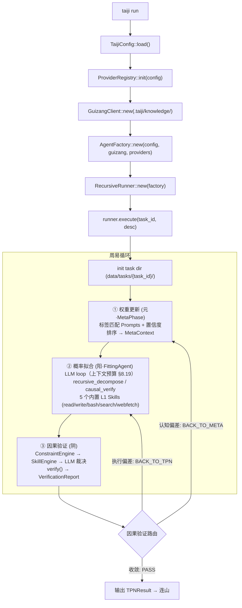
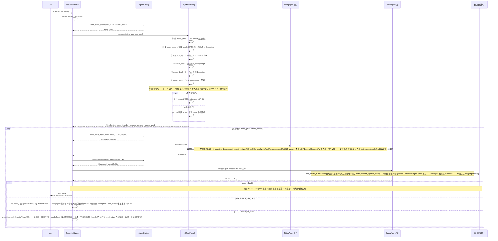
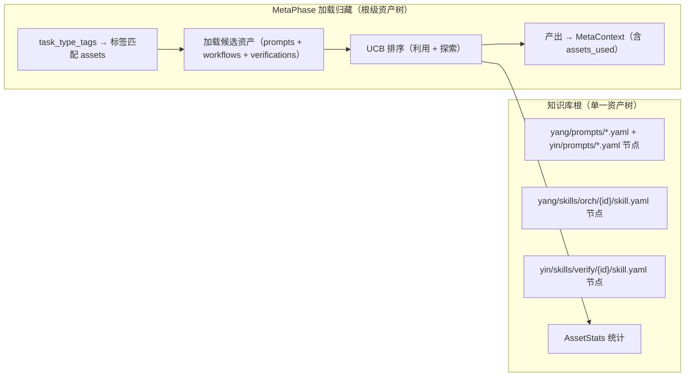
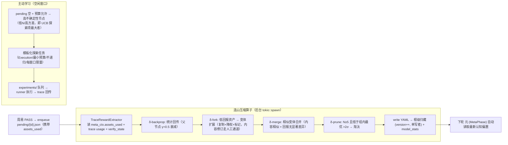

# taiji 架构蓝图 — 泛化-压缩认知循环系统（Rust / Rig）

> 蓝图-完型协议。本文件 = 唯一事实。
>
> **核心动态**：周易（泛化执行）→ 连山（非线性流形压缩）→ 归藏（符号固化）三位一体的同构循环。归藏资产树与周易递归任务树异层同构——fork=decompose、merge=converge、prune=FAIL 终止、backprop=子→父统计上浮。
>
> **架构定论（不可推翻）**：① 概率系统不能验证概率系统——收敛验证符号化；② 归藏不是 RAG 知识库——是压缩固化后的可复用符号系统；③ 激励问题不需要 ground truth——断言证据链机械可判定；④ 权重微调是模型厂家的事；⑤ 一个模型 + 它的约束系统 = 一个领域学习单元——统计层独立演化（资产树共享，V44）。
>
> **术语**：全文采用周易 (Zhouyi) / 连山 (Lianshan) / 归藏 (Guizang)。神经科学名词 TPN / DMN 为工程实现的曾用名（见术语对照）。代码标识符（`TpnCycle`、`dmn_consumer.rs` 等）暂不改动。
>
> **文档导航**：术语对照 / §1 设计哲学 / §2 系统概览 / 一、周易执行层 / 二、连山压缩算子 / 三、归藏符号系统。

---

## 术语对照（Terminology）

本文档统一采用**易经体系命名**，以准确描述泛化-压缩-固化的动态循环关系。神经科学名词降级为工程实现的曾用名，仅出现在代码标识符引用中。

| 易经名称 | 英文 | 定义 | 工程实现（曾用名） |
|------|------|------|------|
| **周易** | Zhouyi | 泛化执行——概率采样、任务拆解与并行探索。万物流变，每一次任务执行 = 一次蒙特卡洛 rollout。 | TPN（Task Processing Network，任务处理网络） |
| **连山** | Lianshan | 非线性流形发现与压缩——如山峦连绵不绝的隐藏规律。从高维执行迹中发现低维结构，贝叶斯后验 + UCB + MCTS 四算子。纯符号层，零 LLM 调用。 | DMN（Default Mode Network，默认模式网络） |
| **归藏** | Guizang | 符号固化——万物归藏其中。压缩后的可复用符号系统（yang/yin 阴阳对偶 + manifold 流型拓扑 + skills 标准化程序 + models 贝叶斯后验）。冻结的执行经验。 | Guizang（保留同名）、理络 Liluo（旧名） |
| **阳 / 阴** | Yang / Yin | 生成与验证的对偶——阳生（概率采样/执行）、阴克（符号验证/裁决）。贯穿三个尺度的同一股扭矩。 | FittingAgent / CausalAgent |
| **元** | Meta | 权重调节与路由决策——在阴阳之间协调，决策模式（编排/执行）与模型选择。 | 元 (MetaPhase) |

> **代码命名约定**：本文档中，代码标识符（如 `TpnCycle`、`dmn_consumer.rs`、`LiluoClient`）保持原样不动——蓝图哲学先行，代码逐步跟上。工程实现名与易经名的对应见上表。
>
> **阅读约定**：全文「周易」= TPN、「连山」= DMN、「归藏」= Guizang、「阳 Agent」= FittingAgent、「阴 Agent」= CausalAgent、「元」= MetaPhase。

---

---

---

---

## 1. 设计哲学

### 1.1 异层同构 (Isomorphic Recursion — Three Scales)

taiji 的全部动力学由一个模式在不同尺度上的重复构成：

```
阳（生成/发散/执行）→ 阴（验证/收敛/裁决）→ 元（调节/更新/路由）→ 再阳生...
```

这个模式同时运行在**三个尺度**上，尺度之间通过压缩关系链接：

| 尺度 | 阳（生成/发散） | 阴（验证/收敛） | 元（调节/更新） | 周易-连山-归藏 |
|------|:---:|:---:|:---:|------|
| **Scale 1：单任务节点** | FittingAgent 概率采样/执行 | CausalAgent 因果验证/裁决 | 元 (MetaPhase) 权重更新/路由决策 | 周易（变） |
| **Scale 2：任务树拆解** | 父 decompose → 子 spawn 并行执行 | Converge 聚合子结果 / 子失败汇报 | BACK_TO_TPN 再路由 / 父再指导(rerun_of) | 周易（变） |
| **Scale 3：资产演化** | 资产 fork（开新变体假设） | 资产 merge（收敛近邻）/ 资产 prune（淘汰低效） | backprop（四维统计回传 α/β 更新 + UCB 排序更新） | 连山→归藏（藏） |

**三个尺度的同构映射：**

| 周易任务树操作 | 连山压缩映射 | 归藏资产树操作 | 同构语义 |
|---|---|---|---|
| 父 decompose → 子 spawn | **压缩器提取可复用模式** | **fork** 开变体 | 生成新假设分叉 |
| Converge 聚合子结果 | **统计聚合（加权合并）** | **merge** 合并近邻 | 收敛：成功模式归一 |
| 子 FAIL / 路由终止 | **低回报 + 高变异 → 淘汰** | **prune** 剪枝 | 终止：低效路径消亡 |
| 子→父 统计上浮 | **四维 stats + 贝叶斯后验** | **backprop** 回传 | 经验向上累积 |
| BACK_TO_TPN 重路由 | **UCB 探索项激活新候选** | **检索排序更新** | 不陷入局部最优 |

**结构同构 = 代码事实（已实现，非设计目标）**：周易任务节点在任意 depth 保持相同的三相分工 / 权限配置 / 上下文预算——递归终止仅由 depth guard 保证。资产树同样：任意 variant_of 深度的资产遵守相同的字段契约 / 演化算子 / 统计回传管道。**不为不同深度写不同控制流——无论在任务空间还是资产空间。**

**阴阳配对随尺度不变**：单节点内阳 Agent（Orchestration/Execution 模式）与阴 Agent（Converge/Verify 模式）由 元 (MetaPhase) 决策；任务树内父阳拆解与阴 Converge 配对；资产树内 fork（阳发散）与 merge/prune（阴收敛）配对。三个尺度上的阴阳对偶是同构的——生成与验证、发散与收敛、探索与利用，同一股扭矩在不同尺度上的表达。

### 1.2 三相互补 (Tri-Phase Complementarity)

| Agent | 相位 | 易经 | 职责 | 权限面 |
|-------|------|------|------|--------|
| **MetaPhase** | 权重更新·元 | 无极生太极 | 遍历归藏图谱提取推理路径，注入认知偏置 | **纯符号层——零 LLM 调用（V43）**：读 model_stats → UCB 路由模型；读 mode_stats → UCB 路由模式；UCB 排序资产 → 选择最佳匹配 system prompt → 组装 MetaContext。全部是确定性函数复合（`compose_context ∘ select_best ∘ rank_assets ∘ list_assets ∘ resolve_root`）。无工具注册（不调 LLM），归藏只读 |
| **FittingAgent** | 概率拟合·阳 | 阳 | 沿路径发散探索，LLM 做微观概率采样，可递归拆解 | **执行权**：注册 5 个 L1 Skills + causal_verify（全节点）+ recursive_decompose（**仅编排模式节点**），受 SafetyHook + TraceHook 约束（全节点唯一持有变更世界工具的相位） |
| **CausalAgent** | 因果验证·阴 | 阴 | 将结果收敛回符号约束，验证宏观因果性 | **裁判权 + 收集权**：注册只读工具（read / webfetch）供 LLM 逐文件核验 + 联网核实；verify 模式下 SkillEngine 自动执行 `yin/skills/verify/` 全部 active Skill（L0/L1 机械短路），converge 模式下额外加载 `yin/skills/converge/`；受 SafetyHook 约束；LLM 裁决路由（PASS / BACK_TO_TPN / BACK_TO_META）。**编排节点用收敛模板（converge），执行节点用验证模板（verify）** |

周易循环 = 阳生（概率采样）→ 阴克（验证驳回）→ 元调（调整权重）→ 再阳生...，直到收敛。

**循环内权限分工**：执行工具（write / bash / recursive_decompose / causal_verify——变更世界的工具面）收敛于 Fitting 相位；验证/收敛 Skill（`yin/skills/verify/` + `yin/skills/converge/`——确定性验证原语，SkillEngine 自动执行 + read/webfetch 供 LLM 主动取证）为 CausalAgent 独占（裁判专有工具，Fitting/MetaPhase 不可见）；MetaPhase 无工具注册（纯符号化——不调 LLM，不需要工具）。分工是角色性的（执行者 / 认知者 / 裁判者），由工具注册面天然保证，不可被 LLM 动态改变。

### 1.3 神经与符号统一 (Neural-Symbolic Integration)

LLM 是微观概率性的体现——每次 prompt 调用随机、不可精确重现。**归藏是概率迹的符号压缩产物**——prompts/yin/skills/verify/models/skills 不是"知识"，而是历史 周易执行迹经连山压缩后固化的可复用符号模式。周易循环就是这两种表象的交替：概率采样产生迹（神经侧）→ 连山压缩为符号更新（桥梁）→ 归藏固化为可复用资产（符号侧）→ 下一轮周易被符号资产赋能（神经侧）。

**概率系统不能验证概率系统**：CausalAgent（阴）验证 FittingAgent（阳）的输出，若验证本身也是 LLM 概率采样，则构成**同源概率回路**——阳与阴共享同一盲区（同语料 / 同训练分布 / 同风格偏好），验证结果不可靠且有实证：MM-JudgeBias（ACL 2026）26 个 SOTA judge 普遍存在**验证完整性失败**（judge 本职是 conditional verification，却退化为 unconditional prediction——按表面流畅度给分）；Reliability without Validity（arXiv 2606.19544）21 个裁判模型「高可靠性低有效性」（一致但不准确）；verbosity / self-preference / position 偏置系统性存在，**scale ≠ reliability**（判断可靠性与通用能力正交）。因此阴面的收敛验证必须**符号化**：确定性验证优先，LLM 验证只在符号层无法表达时介入（§6.6 验证三权分立）。

### 1.4 泛化-压缩循环（周易→连山→归藏，

taiji 的核心动态不是一个执行引擎加上一个知识库。它是一条**泛化→压缩→固化→赋能**的循环。三个名称不是三个模块，而是同一循环的三个相：

```
                         ┌─────────────────────────┐
                         │     周易（变·泛化）        │
                         │                          │
                         │  周易执行 = 马尔可夫链     │
                         │  · 任务拆解与并行探索      │
                         │  · 阳生（概率采样）        │
                         │  · 阴克（验证/裁决）       │
                         │  · 元调（路由/再指导）     │
                         │                          │
                         │  产出：高维执行迹          │
                         │  (model × prompt × task   │
                         │   × depth × tools ×       │
                         │   cost × pass/fail)       │
                         └──────────┬──────────────┘
                                    │ traces（高维迹）
                                    ▼
                         ┌─────────────────────────┐
                         │    连山（藏·压缩）         │
                         │                          │
                         │  非线性流形发现与压缩      │
                         │  · 贝叶斯后验（α/β）      │
                         │  · UCB 探索/利用          │
                         │  · MCTS 四算子            │
                         │    fork/merge/prune/      │
                         │    backprop               │
                         │  · 模型路由（model_stats） │
                         │                          │
                         │  纯符号层——零 LLM 调用     │
                         └──────────┬──────────────┘
                                    │ 低维符号更新
                                    ▼
                         ┌─────────────────────────┐
                         │    归藏（藏·固化）         │
                         │                          │
                         │  压缩后的符号晶体：        │
                         │  · prompts  = 冻结的      │
                         │    阳行为模板             │
                         │  · verifications = 冻结的 │
                         │    阴验证判据             │
                         │  · models = 冻结的        │
                         │    信念分布（α/β）         │
                         │  · skills = 冻结的        │
                         │    工具使用模式           │
                         └──────────┬──────────────┘
                                    │ UCB 检索注入
                                    ▼
                    (回到 周易——下一轮执行被赋能)
```

**泛化（Generalization）= 周易执行**：周易的每一次任务执行都是一次在高维概率空间中的蒙特卡洛 rollout。产生的是原始的高维迹（哪个模型 × 哪个 prompt × 什么任务类型 × 几层递归 × 用了什么工具 × 消耗多少 token × 通过还是失败）。这些迹的集合构成了非线性流形——某些 (model, prompt, task_type) 组合成功率高、某些低、某些在特定条件下涌现——但原始迹太稀疏太高维，无法直接用于指导下一轮执行。

**压缩（Compression）= 连山发现与压缩**：连山不是"后台数据挖掘"——它是**非线性流形上的压缩算子**。贝叶斯后验更新（α/β）把成功/失败迹压缩为二维信念分布；UCB 排序把多维 (tag × stats) 压缩为一维检索序；fork/merge/prune 把迹的散点聚类为资产变体树；model_stats 把 (model × tag × pass_rate × cost) 压缩为路由表。**所有压缩都是纯符号层的（零 LLM），压缩后的符号资产具有比原始迹低得多的维度、高得多的可复用性。**

**固化（Crystallization）= 归藏存储**：压缩后的符号资产作为独立文件持久化——prompt、verification、model、skill 各一个 YAML。它们不再是"文档"或"配置"，而是**冻结的执行经验**——曾经在某个 周易节点上验证过的行为模板、判据、信念分布。

**赋能（Empowerment）= 归藏回注周易**：下一轮 周易执行时，MetaPhase 通过 UCB 检索加载匹配当前任务的资产，编排为 system prompt（prompts）、Skill（verify 类）（verifications）、工具注册（skills），注入执行流。此时的 周易节点携带了历史上所有相关任务的压缩经验——它的上下文被**无限扩展**了（不是字节数，而是经验的维度）。

**这就是"压缩即智能"在 taiji 中的精确含义：智能的提升不是更好的 LLM，而是泛化-压缩循环的每一轮都让归藏符号系统积累更多可复用经验，从而让下一轮 周易的推理计算更精准、更省 token、更少失败。四维权重（pass/cost/rounds/quality）的持续增强是这个循环的可测量边界。**

### 1.5 产物契约与交接文件 (Artifact Contract & Handoff)

**执行事实是唯一记忆。** 跨层、跨时间传递的只有产出物（deliverables / task_output / 交接文件）。中间记忆（chat_history、meta_ctx 推理过程）只服务于本节点内部，不得向上传播、不作为结果的事实来源。

**产出即交接：** 每个瞬态 agent（概率拟合）结束时有且仅有三种去向——完成（写最终产出）、上下文超限（写交接产出）、失败/取消（写交接产出）。**交接物 = `deliverables/handoff.md`，是产出物之一**——YAML front matter 携带结构化字段（failure_reason / degraded / output_refs），正文为环境信息（进度 / 剩余工作 / 决策 / 约束状态）。置于 `deliverables/` 内保证**可发现性**：父层（parent_deliverables 注入）、同任务其他 agent（verify/converge 逐文件核验）、元校准（BACK_TO_META 读产出）全部经既有路径自动可见，**不引入新的查找机制**。产出物是递归拆解、恢复、路由判定、元校准的唯一输入物。**V30 会盟扩展**：兄弟贡品（同级子任务 deliverables/）跨兄弟公开可发现可读——分封时注入兄弟贡品索引（`YangPrompt.sibling_deliverables`），读取经既有 read 工具，不引入新查找机制（§8.20）。

- **上下文窗口是单次拟合的采样空间，不是记忆仓库。** 上下文超限 = 采样空间装不下任务 = 任务粒度错误 = 编排失败的运行时硬证据 → 返回阳，阳基于产出文件递归分解
- **不做上下文压缩（特意设计）。** 压缩是把中间记忆塞回下一次拟合、污染新采样；交接是结束本次拟合、留下干净事实、开启新拟合
- **阴（验证/收敛）基于产出核验**：CausalAgent 只读产出文件与交接文件裁决，不消费对话过程
- **恢复 = 前一瞬态产出继承**：崩溃恢复从 `deliverables/`（含 handoff.md）重建，chat_history 仅作本节点断点续聊的最终兜底

### 1.6 第一性原理 (First Principles)

复杂事物由简单事物结构化组成。一个 FittingAgent 可以执行也可以递归拆解（不需要两种类型）、一个 EngineContext 携带 task_dir 根节点和子节点用它做同一件事、一个 Task 结构在不同层代表不同粒度但不改变结构。

### 1.7 心流 (Flow) — 压缩与消溶

taiji 归藏资产树共享（§10.1，V44 去分区化），在 周易执行的不同深度展现不同的"压缩态"：

| 资产类型 | 浅层执行（舒张期） | 深层执行（心流·收缩期） | 压缩态 |
|:---:|------|------|------|
| **prompts/** | UCB 检索 → LLM 编排注入 system prompt | **消溶** — 角色叙事溶解，不再显式出现于 prompt；行为引导内化为 LLM 的选模型式偏好 | 文本→行为 |
| **yin/skills/verify/** | 注入 verify/converge prompt | **持续** — 机械检查项全程运行，不消溶 | 契约→判定 |
| **models/** | UCB 排序权重（利用 + 探索） | **持续** — α/β 后验持续影响路由与选择 | 迹→信念 |
| **skills/** | 工具注册面（Rig ToolDyn），四类别（orch/exec/verify/converge） | **沉淀** — 高频成功模式的统计积累，深层由 skill 统计直接驱动行为（不再依赖 prompt 教学）；**持续** — verify/converge 类全程机械执行 | 教学→习惯/判据→判定 |

**消溶不是"移除"**：prompts 在深层执行中不再显式注入 system prompt，是因为它们的教学信息已被 shallow layers 内化为 LLM 的行为偏好——prompt 资产从"文本教学"压缩为"统计权重"（通过 models/ 的 α/β 间接影响 UCB 排序）。**心流的本质是泛化-压缩循环在单一任务纵深上的微观投射：浅层泛化（教学引导）→ 深层压缩（消溶/沉淀）→ 产出固化（deliverables + 统计回传）。**

递归加深不是训练，是同一任务的反复穿透。每次穿透的产物：统计数据（四维 stats → 连山 backprop）+ 行为模板更新（归藏 prompts/models 版本递增）。所有资产更新通过连山压缩算子（dmn_consumer）在符号层（YAML 文件）完成，纯云端架构无需本地模型。

### 1.8 类比与隐喻 (Analogies and Metaphors)

taiji 的核心理念植根于两个千年结构的统一：中国古典哲学中的变化与累积模型（周易·连山·归藏），以及现代概率算法（蒙特卡洛/贝叶斯推理/多臂老虎机）。

#### 1.8.1 周易 — 周易执行 · 蒙特卡洛方法

周易三相位循环与周易三爻、MCMC 三步之间的结构同构：

| 周易 (Zhouyi) | 周易递归树 | 现代算法 |
|---|---|---|
| **三爻** (初、中、上) | 三相位 (元Meta / 阳Fitting / 阴Causal) | MCMC 三步：proposal → sampling → acceptance |
| **六爻** (重卦：两经卦相叠) | 两层递归 × 三相位 = 6 步执行路径 | 2-level Monte Carlo rollout |
| **八卦** (2³ = 8 种卦象) | 路由三分支 (PASS/BACK_TO_TPN/BACK_TO_META) 在递归树中展开 = 8 种拓扑路径 | MCTS 8-node search frontier |
| **变卦** (爻变产生新卦) | BACK_TO_TPN / BACK_TO_META → 子任务重入 → 路径分叉 | MCTS backpropagation + re-route |

周易的每一次循环（权重更新 → 概率拟合 → 因果验证 → 路由决策）就是周易中的一次"起卦"——系统在不确定性中做一次概率采样，然后由因果验证裁定吉凶（PASS / 回退）。递归树的展开就是 MCTS 的 selection → expansion → simulation → backpropagation 循环。

#### 1.8.2 连山 — 非线性流形压缩 · 非线性流形发现

"连山"意为连绵的山脉——**非线性流形的地形线**。连山不是后台数据挖掘，而是发现高维执行迹空间中的"山脊线"（哪些 (model × prompt × task × depth) 组合通往成功）并沿山脊线压缩。

| 连山操作 | 流形语义 | 现代对应 |
|---|---|---|
| **贝叶斯后验 (α/β)** | 每个资产在流形上的局部曲率估计（信念分布） | Beta-Bernoulli conjugate model |
| **UCB 排序** | 沿流形边界的探索-利用权衡（高均值 exploit / 高不确定 explore） | Upper Confidence Bound (bandit) |
| **fork** | 在山脊分叉处生成新假设路线 | MCTS expansion |
| **merge** | 相邻平行路线合并（同一山脊） | MCTS node merging |
| **prune** | 谷底路线终止（低回报 + 高变异） | MCTS pruning |
| **model_stats** | 全局地形概览（哪些模型擅长哪些任务类型） | Contextual bandit |

**连山的核心约束：纯符号层。** 所有压缩操作是确定性数学运算（贝叶斯公式 / UCB 不等式 / 统计聚合），不调用 LLM。连山不产生新内容——fork 的新资产内容是参数变体（strictness 档位），不是 LLM 生成的文本。内容演化留给人（手写种子资产）或未来的 SkillCompiler（从迹中提取可复用模板——仍然是纯符号，不调 LLM 生成）。

#### 1.8.3 归藏 — 符号固化 · 压缩即智能

"归藏"意为归藏万物——**万物（执行迹）经过压缩后归入符号仓库**。归藏不是知识库、不是 RAG、不是向量存储。它是**压缩后的执行经验的晶体化**：

| 归藏资产类型 | 压缩了什么 | 消费方 |
|---|---|---|
| **prompts/** | 阳 Agent 的**成功行为模板**——哪些教学指令在哪些任务类型上被验证有效 | 元 (MetaPhase) → 纯符号 UCB 选择 → Fitting/Causal system prompt |
| **yin/skills/verify/** | 阴 Agent 的**成功验证判据**——哪些检查项在哪些任务上有效拦截了不合格产出 | SkillEngine（原 ContractEngine）机械执行 → LLM 裁决 |
| **models/** | 每个资产的**信念分布（α/β）**——该资产在历史上的通过/失败经验压缩为 Beta 分布 | UCB 排序 / 演化决策 |
| **skills/** | **可执行能力单元**——四类别（orch 编排/exec 执行/verify 验证/converge 收敛），每个 Skill 含 `implementation`（机械可执行体）与 `stats`（演化统计）。强模型可容纳大 Skill（工作流），弱模型自动拆为原子片段 | SkillEngine 机械执行 + SkillRegistry → Rig Tool 注册 |

**每一个资产 = 一段曾经有效的执行经验的压缩投影。** 资产的 confidence（人工种子先验）→ stats 四维统计（连山回传）→ ModelAsset α/β（贝叶斯后验）→ 演化决策（fork/merge/prune）——这个生命周期就是"迹→压缩→固化→再执行→再迹"的循环在资产维度的体现。

#### 1.8.4 三位一体：周易·连山·归藏的统一

```
    周易（变·泛化）              连山（藏·压缩）           归藏（藏·固化）
    ─────────                   ─────────                ─────────
    马可夫链 + 递归树          贝叶斯 + UCB + MCTS      符号化的可复用资产
    执行 · 探索 · 生成         发现 · 压缩 · 演化        存储 · 检索 · 赋能
          │                        │                        │
          │  traces（高维迹）      │  低维符号更新          │  注入
          ├──────────────────────►├───────────────────────►│
          │                        │                        │
          │                        │  fork/merge/prune       │  prompts
          │                        │  backprop (α/β)         │  verifications
          │                        │  UCB re-rank            │  models
          │                        │                         │  skills
          │                        │                         │
          │◄───────────────────────┴────────────────────────┘
          │         下一轮执行被更优资产赋能
          │
    泛化（执行产生新迹）─────────► 压缩（迹→统计→符号更新）
    ◄────────────────────────── 压缩即智能
```

三者不是三个模块、五个层。它们是**同一股认知扭矩在三个时间尺度上的表达**：
- **周易** = 秒~分钟级的执行（单个 周易循环）
- **连山** = 分钟~小时级的压缩（任务结束后 backprop + evolve）
- **归藏** = 跨任务的持久积累（资产树的代际演化）

**异层同构的最终形态：周易递归任务树 (task tree) 与归藏资产变体树 (asset variant tree) 是同构的——fork = decompose、merge = converge、prune = FAIL 终止、backprop = child→parent 统计上浮。归藏不是"另一个系统"，它是 周易在符号层的压缩投影。BCP 人类可读的蓝图协议也将被压缩为 skills（太极项目式标准化可复用程序），最终反作用于单任务节点的执行效率——完成压缩-泛化的完整闭环。**

---


## 2. 系统概览

### 核心概念

| 组件 | 角色 | 运行时行为 | 周易-连山-归藏 |
|------|------|------|:---:|
| **归藏 (Guizang)** | **压缩固化后的可复用符号系统** | 单一符号资产树（prompts 教学层 + skills 能力层四类别 + models 贝叶斯后验 + manifold 流型拓扑 + programs 标准化程序），周易执行期 UCB 检索注入→只读，连山压缩期 backprop+evolve→单写。`yang/prompts/`（4 份系统提示词）+ `yang/skills/` + `yin/skills/`（orch/exec/verify/converge 四类）+ `models/`（跨类别贝叶斯后验）+ `manifold/`（流型拓扑）+ `programs/`（标准化程序）。`model_stats.yaml` 按模型区分统计（路由依据）。 | 归藏 |
| **MetaPhase** | 权重更新·元 | 查询归藏统计 → UCB bandit 路由模型 + 路由模式 + 排序资产 → 选择最佳匹配 system prompt → 组装 MetaContext。**纯符号函数复合，零 LLM（V43）** | 周易 |
| **FittingAgent** | 概率拟合·阳 | 瞬态 Rig Agent，注册 5 L1 Skills + causal_verify（全节点）+ recursive_decompose（仅编排模式）。受上下文预算约束（V29） | 周易 |
| **CausalAgent** | 因果验证·阴 | 瞬态 Rig Agent（双模式 verify/converge）。前置管线：ConstraintEngine → SkillEngine 机械执行 → LLM 裁决 | 周易 |
| **ChatAgent** | 前端对话 Agent | 长生命周期 Rig Agent，注册 5 L1 Skills + SafetyHook。**不进 周易循环**，会话历史持久化到 `.taiji/chat/` | 周易（旁路） |
| **连山 (DMN)** | **非线性流形压缩算子**（非线性流形压缩算子） | 被动学习（周易 PASS → pending → backprop 四维 stats + 贝叶斯后验 → evolve fork/merge/prune）+ 主动学习（空闲窗口 UCB 探索任务）。**纯符号层，零 LLM 调用**。代码已实现，`--with-dmn` flag 激活 | 连山 |
| **AgentFactory** | 瞬态 Agent 工厂 | 中枢组件，持有基础设施 Arc 引用（ProviderRegistry / GuizangClient / WorkerPool / ConstraintEngine） | — |

### 技术栈

| 组件 | 选型 |
|------|------|
| 语言 | Rust 2024 edition |
| LLM Agent | Rig v0.39（Agent + dynamic_context + structured output） |
| LLM Provider | Rig deepseek::Client |
| 知识库 | 文件系统 YAML（`.taiji/knowledge/`） |
| 异步 | tokio（spawn 并发子任务 + WebSocket + 流式 Agent） |
| 流式 | Rig `stream_chat()` → `MultiTurnStreamItem` → WS chunk 推送 |
| CLI | clap（run/trace/list/init/mcp/**serve**） |
| 序列化 | serde + serde_json + serde_yaml |
| 追踪 | tracing + TraceHook + 手动 TraceWriter |
| **Web 服务** | **axum + tower-http（Rust 核心进程内嵌 HTTP 静态托管 + WebSocket 双向）** |
| **前端 UI** | **React 18 + TypeScript + TailwindCSS（Vite 构建，纯浏览器运行）** |
| **图渲染** | **React Flow（纺锤树 + 周易流程图）** |
| **动画** | **Framer Motion（节点生长 / 状态变色）** |
| **实时推送** | **WebSocket 双向（tokio-tungstenite，Rust ↔ React 事件 + 请求/响应）** |
| **太极图** | **纯 CSS/SVG 动画（60s 旋转 + 状态联动光晕）** |

### 架构总纲



---


---

## 周易与连山的关系

周易、连山、归藏是同一泛化-压缩循环的三个相（§1.4），不是两个模块之间的接口。

### 三位一体：周易·连山·归藏

| 相 | 代码中的体现 | 方向 | 语义 |
|------|------|------|------|
| **周易）** | `RecursiveRunner` + `TpnCycle` + `FittingAgent`/`CausalAgent`/`MetaPhase` | 前向·泛化 | 执行马尔可夫链——每次任务 = 一次蒙特卡洛 rollout，产生高维迹 |
| **连山（连山）** | `dmn_consumer` + `cognition_evolver` + `ModelRouter` | 反向·压缩 | 非线性流形发现——把高维迹压缩为低维符号更新（α/β、UCB 排序、fork/merge/prune） |
| **归藏（存储）** | `LiluoClient` + `knowledge/` 资产树 | 固化 | 低维符号持久化——yang/yin 阴阳对偶 + manifold 流型拓扑 + skills 标准化程序 + models 贝叶斯后验 |

同一棵资产树：周易在树上前向消费（检索注入），连山在树上反向压缩（统计回传），归藏是树的持久态。

### 权限关系（§8.3）

- **周易）执行期只读归藏**——任何 Agent（Meta / Fitting / Causal / SkillEngine）不得写资产
- **连山是唯一写者**（单线程后台任务，`--with-dmn` 激活），写路径 = pending / experiments 队列
- **资产共享**：任务内所有 Agent 共享同一根级资产树（V44 去分区化）；`MetaContext.model` 是模型选择载体，仅影响路由与统计回传键，不产生资产副本

### 数据流：归藏 → 周易（前向 · 检索注入）

```
ModelRouter（读 model_stats 元权重表，纯符号层）
  → 归藏根级检索
  → UCB 排序（利用 + 探索，§6.2）
  → 元 (MetaPhase) 纯符号流水线（路由模型 + 路由模式 + UCB 排序资产 → 选择 system prompt → 组装 MetaContext）
  → MetaContext { mode, model, assets_used, prompts } 注入 Fitting / Causal
另外两路只读消费：
  → SkillEngine 加载 yin/skills/verify/ 机械验证（§8.22）
  → ConstraintEngine L0 输出健全性检查（内置硬编码，Hard 短路）
```

### 数据流：周易 → 连山（反向 · 统计回传）

```
周易 PASS
  → enqueue_dmn_pending（pending/{task_id}.json：assets_used + checks + passed + model_key）
  → 连山消费（单写者，指数退避轮询）
  → backprop：频率四维（n / pass_count / cost / rounds / quality）+ 贝叶斯后验（α/β，§6.2.1）
  → evolve_contracts：fork / merge / prune 四算子（verifications 与 prompts 对称）
  → model_stats 更新（元权重表，模型路由数据源）
  → 下轮周易自动加载更新后的认知偏置（藏 → 变）
```

### 主动学习（连山 → 周易 反向触发）

空闲窗口（pending 空 + 预算内）→ DMN 选 UCB 探索分最大的活跃变体资产 → 写入 `experiments/` 队列 → TPN runner 执行模板化探索任务（Execution / 最小预算 / 不递归）→ SkillEngine 机械验证变体契约 → SkillResult 回传 pending → DMN 更新。护栏：探索任务不产生新探索任务，学习环有界（§6.2）。

### 触发链时序

```
周易执行（只读归藏）→ 产出 deliverables / trace / verify_state
  → PASS 入队 pending ──→ 连山压缩算子 回传（backprop → evolve → model_stats）
  → 资产版本++（根级写入）──→ 下轮 元 (MetaPhase) 检索到新资产 → 周易行为被引导
```

### 章节导航

| 编号 | 内容 | 章节 |
|------|------|------|
| §1 · §2 | 设计哲学 · 系统概览 | 本文档开头 |
| §3 · §4 · §5 | 模块架构 · 核心类型 · 周易执行流 | 一、周易执行层 |
| §6.6 | 验证三权分立（周易验证机制） | 一、周易执行层 |
| §7 | 运行时布局 | 一、周易执行层 |
| §8（周易侧 16 项） | 8.1/8.4-8.6/8.9-8.10/8.14-8.20/8.22 | 一、周易执行层 |
| §8.7 | Rig Vendor（工程基建） | 一、周易执行层末尾 |
| §9 | 前端架构 | 一、周易执行层 |
| §6（0-5, 6.4.1） | 归藏本体 · 检索 · 演化 · 真值维护 | 二、归藏与连山 |
| §8侧 5 项） | 8.3/8.8/8.12/8.21/8.23（8.13 并入 §6.5） | 二、归藏与连山 |
| 附录 A | 版本历史 | 文末 |

---

---

## 一、周易执行层

> 周易 = 泛化执行。万物流变，每一次任务执行 = 一次蒙特卡洛 rollout。包括 Agent 体系、三相循环、递归拆解、验证管线、分封制、ChatAgent 旁路。

## 3. 模块架构

### 七层模块图

```mermaid
flowchart TB
    subgraph "L6 入口"
        MAIN["main.rs — clap CLI"]
    end

    subgraph "L5 MCP"
        MCP_SRV["mcp/server.rs — 暴露 taiji 工具"]
        MCP_CLI["mcp/client.rs — 消费外部 MCP 工具"]
    end

    subgraph "L4 编排"
        RUNNER["runner — RecursiveRunner (薄包装)"]
        CONST["constraint_engine — ConstraintEngine"]
        CONTRACT["skill_engine — SkillEngine"]
        TRIG["trigger_engine — SkillTriggerEngine"]
        WORKER["worker_pool — WorkerPool"]
        DMN["dmn_consumer — 连山压缩算子 (后台，可激活)"]
    end

    subgraph "L3 Agent"
        FACTORY["factory — AgentFactory (中枢)"]
        META_B["meta — 元 (MetaPhase) 构建器"]
        FIT_B["fitting — FittingAgent 构建器"]
        CAUSAL_B["causal — CausalAgent 构建器"]
        PLAN_B["plan — PlanBuilder (预演编排)"]
        CHAT_B["chat — ChatAgentBuilder (聊天面板)"]
        TOOLS["tools/ — recursive_decompose, causal_verify"]
    end

    subgraph "L2 Hook"
        SAFETY["safety — ToolSafetyGuard (AgentHook)"]
        TRACE_H["trace — TraceHook (AgentHook)"]
    end

    subgraph "L1 基础设施"
        PROVIDER["provider — ProviderRegistry"]
        GUIZANG["knowledge — GuizangClient (文件系统读写)"]
        CONFIG["config — TaijiConfig"]
        ERR["error — TaijiError"]
        TRACE_W["trace — TraceWriter (JSONL)"]
        TSPEC["task_spec — TaskSpec 解析"]
    end

    subgraph "L7 前端"
        WEB["taiji-web React App (浏览器)"]
    end

    subgraph "L6 实时事件 + HTTP"
        WS_SRV["ws/server.rs — WebSocket 事件推送 + 请求响应"]
        WS_HANDLER["ws/handler.rs — 客户端请求分发"]
        WS_TYPES["ws/types.rs — TaskTreeSnapshot / TpnPhaseState / ClientMessage / ServerResponse"]
        HTTP_SRV["main.rs serve — axum HTTP 静态托管 (dist/)"]
    end

    subgraph "L0 基础类型"
        TYPES["types/ — task, agent, verification, execution, frontend"]
    end

    MAIN --> CONFIG & RUNNER
    RUNNER --> FACTORY
    FACTORY --> PROVIDER & GUIZANG & TRIG & TYPES
    FACTORY --> META_B & FIT_B & CAUSAL_B & PLAN_B
    FIT_B --> TOOLS & SAFETY & TRACE_H
    TOOLS --> FACTORY
    META_B --> GUIZANG
    CAUSAL_B --> CONST
    CAUSAL_B --> CONTRACT
    连山 --> GUIZANG
    MCP_SRV --> FACTORY
    MCP_CLI --> FIT_B
    WS_SRV --> RUNNER & FACTORY & TYPES
    WS_HANDLER --> FACTORY & TYPES
    WS_HANDLER --> CHAT_B
    CHAT_B --> FACTORY
    CHAT_B --> SAFETY
    WEB --> WS_SRV
    HTTP_SRV --> WEB
```



### 模块职责

| 层 | 模块 | 职责 |
|----|------|------|
| L0 | types/ | Task, MetaContext, VerificationReport, TaskTreeSnapshot, TpnPhaseState 等核心类型定义 |
| L1 | infra/config | TaijiConfig 加载与验证 |
| L1 | infra/error | TaijiError 枚举（含 context 字段） |
| L1 | infra/provider | ProviderRegistry：Rig client 管理（创建/复用/fallback） |
| L1 | infra/knowledge | KnowledgeStore：**归藏读写（单一资产树）+ 标签搜索 + UCB 聚合查询 + model_stats 读写 + Skill（verify/converge 类）加载** |
| L1 | infra/trace | TraceWriter：JSONL 写入 + 10MB 轮转 + read_tree 合并 |
| L2 | hooks/safety | ToolSafetyGuard：路径穿越 / 命令注入 / SSRF 拦截 |
| L2 | hooks/trace | TraceHook：自动捕获 StepEvent 写入 trace.jsonl |
| L3 | agents/factory | AgentFactory：持有所有 Arc 引用，创建三种瞬态 Agent |
| L3 | agents/meta | MetaPhase：纯符号流水线——**UCB 检索归藏 + 模型路由 + 模式路由 + 资产选择 + 组装 MetaContext**（零 LLM） |
| L3 | agents/fitting | FittingAgentBuilder：recursive_decompose + causal_verify + 5 个内置 Skills（read/write/bash/search/webfetch），同时支持前端 agent 通过 MCP ExternalContext 注入额外上下文 |
| L3 | agents/causal | CausalAgentBuilder：verify 模式 + converge 模式。verify 前置 SkillEngine（原 ContractEngine）（L0/L1 机械检查）→ LLM 只裁决 llm_judgement 项（L2 兜底） |
| L3 | agents/chat | ChatAgentBuilder：前端聊天面板 Rig Agent。组装 5 个 L1 Skills + SafetyHook，`stream_chat()` 推流，`max_turns=20`。会话持久化到 `chat_history.json`。与 周易循环完全解耦 |
| L3 | agents/tools | recursive_decompose / causal_verify（Skills 不再内置于此模块） |
| L3 | agents/plan | PlanBuilder：调用 MetaPhase 获取 MetaContext + LLM 编排执行计划，输出 PlanSummary（不进 周易循环） |
| L4 | orchestration/runner | RecursiveRunner：创建根任务 + 周易循环 |
| L4 | orchestration/constraint_engine | 加载 L0 内置检查 + 前置检查 |
| L4 | orchestration/skill_engine | 新增：加载 yin/skills/verify/ + yin/skills/converge/ 结构化 Skill → 机械执行（file_exists / schema_valid / reference_resolves / command_succeeds / llm_judgement / trace_consistency）→ 产出 SkillReport（L0 机械 + L1 Skill 确定性裁决，hard 失败直接短路，LLM 不可翻案——§6.6/§8.22） |
| L4 | orchestration/trigger_engine | 正则 + 标签匹配 Skills |
| L4 | orchestration/worker_pool | Semaphore 限并发 + RateLimiter |
| L4 | orchestration/dmn_consumer | 后台轮询 pending 队列（被动学习）+ experiments 队列（主动学习，空闲窗口+预算），执行 MCTS 四算子 + model_stats 更新（代码已实现，可激活 — 见 §8.12/§8.21） |
| L5 | mcp/server | MCP Server：暴露 周易/连山/归藏 操作，6 个工具（taiji_plan / taiji_run / taiji_explain / taiji_trace / taiji_list / taiji_status） |
| L5 | mcp/client | MCP Client Manager：连接外部服务器 |
| L6 | ws/server | WebSocket Server：接受客户端连接，广播 TaskEvent 事件 + 接收 ClientMessage 请求，通过 handler 分发并返回 ServerResponse |
| L6 | ws/handler | WS 请求分发器：execute_task / submit_review / list_tasks / get_task_tree / get_tpn_state / chat_message（委托 ChatAgent，通过 mpsc 逐 chunk 推流） |
| L6 | ws/types | WebSocket 消息类型：`TaskEvent`（广播）、`ClientMessage`（前端→核心）、`ServerResponse`（请求响应） |
| L6 | main.rs serve | axum HTTP 服务器：托管 `taiji-web/dist/` 静态文件 + 可选自动打开浏览器（xdg-open） |
| L7 | taiji-web | 纯浏览器 React 前端：纺锤树（SpindleTree）、TPN 弹窗（TpnPopup）、太极背景（TaijiBg）、聊天面板（ChatPanel） |

### 关键接口契约

| # | 契约 | 说明 |
|---|------|------|
| 1 | `RecursiveDecomposeTool.execute(subtasks: Vec[SubtaskSpec]) -> DecomposeResult` | 输入 LLM 拆解的子任务 → spawn 子 FittingAgent → JoinSet 收集 → CausalAgent.converge() → 返回收敛结果。**仅编排模式 FittingAgent 注册**（执行模式 LLM 不可见拆解工具）；递归终止由 depth guard 保证；WorkerPool permit 在工具入口 acquire（并行分解节点上限），join 完成后释放，无嵌套持有 → 无死锁。**V30 会盟**：spawn 时收集兄弟贡品索引注入子 `YangPrompt.sibling_deliverables`（BTreeMap 有序扫描，排除自身，失败上抛——无降级 §8.20）。**V31 失败汇报**：子任务任务级失败**不整体上抛**——构造 Diverged 失败条目（`failure_reason`/`failure_kind` + handoff 交接产物路径）进 child_results，收敛树不中断；取消/panic 仍硬中止（§8.18） |
| 2 | `AgentFactory.create_fitting_agent(depth, meta_ctx, engine_ctx, cancel) -> FittingAgentBuilder` | 从 MetaContext（含 `mode`）+ EngineContext + CancellationToken + 归藏 创建阳 Agent，模式随 meta_ctx 传递 |
| 3 | `FittingAgentBuilder { depth, mode, meta_ctx, engine_ctx, factory, model, cancel: CancellationToken }` | 阳 Agent 构建器，**按模式选模板**（编排模板 / 执行模板）；recursive_decompose 仅编排模式注册。**V30 身份自觉**：run() 注入「身份与地位」段（身份册 + mode + 兄弟贡品索引，`build_identity_section`，读册失败上抛——无降级 §8.20） |
| 4 | `SafetyHook (AgentHook)` | 在 ToolCall 事件上检查路径穿越/命令注入/SSRF，返回 Flow::cont() 或 Flow::skip() |
| 5 | `ConstraintEngine.check_constraints(output, constraints) -> ConstraintResult` | CausalAgent.verify 前置检查，Hard 违反直接短路返回 BACK_TO_META |
| 6 | `MetaPhase.run(task_description, task_type_tags, handoff: Option<HandoffContext>) -> MetaContext`（builder 经 `depth()` / `max_depth()` 注入递归层数规则） | **V43 纯符号化——零 LLM 调用**：① 读 model_stats → UCB bandit 路由模型（冷启动 → 默认）；② 读 mode_stats → UCB bandit 路由模式（冷启动 → Execution）；③ 根级检索资产 → UCB 排序 → 选最佳匹配 system prompt；④ `guard_depth` 强制叶子节点 Execution；⑤ `guard_pairing` 校验 mode-prompt 配对；⑥ 组装 MetaContext。降级：无资产 → prompt 字段全部 None（下游 Base 模板兜底），mode 保持路由结果；model_stats 损坏 → 默认模型 |
| 7 | `连山压缩算子 (独立 tokio::spawn)` | 指数退避轮询 pending/ 队列（被动学习）+ experiments/ 队列（主动学习，空闲窗口 + 预算上限），执行 **MCTS 四算子**：δ-backprop（trace 统计回传，父节点 γ=0.5 衰减）→ δ-fork（低回报资产扩展变体，复制+降权，内容修订走人工通道）→ δ-merge（相似变体合并）→ δ-prune（N≥5 且低于组内最优 >2σ 淘汰）——单写者更新归藏 + model_stats。**纯符号层确定性操作，不涉及 LLM**。数据源：`pending/{id}.json` 携带 assets_used 链 → TraceRewardExtractor 提取 (资产 × 回报) |
| 8 | `CausalVerifyAgentBuilder.verify(output, tool_results, meta_ctx) -> VerificationReport` | 前置管线：ConstraintEngine（L0 内置检查 Hard 短路）→ SkillEngine 机械执行 verify/converge Skill（hard 失败直接短路，LLM 不可翻案）→ 剩余 llm_judgement 项 + SkillReport 注入 LLM 裁决。优先使用 meta_ctx.verify_system_prompt，None 时按 `meta_ctx.mode` 降级到 VERIFY_ORC / VERIFY_EXEC 硬编码模板（编排-验证 / 执行-验证配对）。`tool_results` 由 `TpnCycle.collect_tool_results()` 从 trace.jsonl 自动提取最近 10 条工具调用输出，非空数组 |
| 9 | `CausalConvergeAgentBuilder.converge(subtask_results, meta_ctx) -> ConvergenceDecision` | 优先使用 meta_ctx.converge_system_prompt，None 时按 `meta_ctx.mode` 降级到 CONVERGE_ORC / CONVERGE_EXEC 硬编码模板（编排-收敛 / 执行-收敛配对）。**V31 完整汇报输入**：subtask_results 含成功与失败（Diverged）条目——LLM 基于失败原因/交接产物裁决 Partial/Diverged，并把**失败分析与 rerun 建议输出到 task_summary**（决策进 LLM，不加结构化字段）；父阳（阳·管理）据此 rerun_of 再启用或接受残缺综合 |
| 10 | `RecursiveRunner.execute(description, external_ctx, max_depth) -> TPNResult` | runner.execute() 的增强版本，接受来自前端 agent 的 ExternalContext（文件、工具结果、对话总结），将文件物化到 `task_dir/context/files/` 并写入 `context/meta.json`，设置 `engine_ctx.context_dir` → FittingAgent 模板注入 External Context 节。可选 `max_depth` 参数覆盖配置中的递归深度限制 |
| 11 | `PlanBuilder.plan(description, task_type_tags) -> PlanSummary` | 调用 MetaPhase 获取 MetaContext，随后调用 LLM 将 MetaContext + 任务描述编排为结构化的 PlanSummary（含子任务预估、技能推荐、复杂度评估），**不进 周易循环**，不触发 FittingAgent/CausalAgent |
| 12 | `TaijiMcpServer.handle_explain(task_id) -> ExplainReport` | 读取 `meta.json` + 递归 `trace.jsonl` + `deliverables/` 目录，解析 TraceRecord 的 phase/cycle/round 字段构建阶段时间线和路由决策树，产出人类可读 ExplainReport（含 summary 自然语言总结） |
| 13 | `AgentFactory.create_chat_agent(session_id, context_task_id, model, provider_name) -> ChatAgentBuilder` | 创建前端聊天面板的 ChatAgent builder。LLM 配置从 `agent_overrides["chat"]` 解析（model/provider_name 为 None 时使用解析后的默认值）。构造出的 builder 持有 `session_id`、`context_task_id`、`providers: Arc<ProviderRegistry>`、`safety_hook`、`config`、`data_root`、`model`、`provider_name` 八个字段（**不持有 AgentFactory 引用**——AgentFactory 无 Clone）。自动注册 5 个 L1 Skills + SafetyHook。`max_turns=20`。**不进 周易循环** |
| 14 | `ChatAgentBuilder.chat(message, chat_history: &mut Vec<Message>, on_chunk: Box<dyn Fn(String) + Send + Sync>) -> Result<String, TaijiError>` | 单轮对话执行。`on_chunk` 回调接收每个文本 delta（Rig `StreamedAssistantContent::Text` 解包后的纯文本），需 `Send + Sync` 以跨 await 传递到 WS mpsc 通道。内部使用 `agent.stream_chat()` → 遍历 `MultiTurnStreamItem` → 提取 Text/ReasoningDelta → 回调。`chat_history` 可变借用，完成后内部自动 `save_json_atomic` 持久化。返回完整响应文本。`context_task_id` 是 builder 构造时字段，非 per-message 参数 |
| 15 | `ChatAgentBuilder.build_system_prompt() -> String`（**同步** `fn`，同步） | 构建 ChatAgent 的 system prompt。若 `context_task_id` 非空，注入任务描述（从 `{data_root}/tasks/{id}/meta.json` 读取 description/status/depth）。不再注入归藏摘要（guizang_digest 已删除：归藏 prompts/verifications 是任务执行链 Meta/Fitting/Causal 的编排模板，对对话角色语义错配；ChatAgent 的记忆 = 会话历史 `.taiji/chat/{session_id}.json`，经 stream_chat history 回填）。无 context_task_id 时使用通用助手模板 |
| 16 | `SkillResult { skill_id, category, kind, passed, detail, duration_ms, cost_tokens, verify_rounds, quality }` — Skill 执行统一返回类型 | 所有 Skill（orch/exec/verify/converge）执行后返回此结构。`detail` 来自机械判定（文件存在、退出码=0、grep 命中），禁止 LLM 语义推测进 detail。与 `AssetStats` 四维同构，可直接序列化进 `verify_state.json` 供连山回传 |
| 17 | `CausalAgent Skill 注册规则` — verify 模式注册 verify 类全部 active Skill；converge 模式注册 verify + converge 类全部 active Skill（V45：加载源 = 元层 ∪ 资产层合并视图，同 id 资产优先；`dual` 校验在合并视图域） | 与阳侧同构：`recursive_decompose` 仅编排模式 FittingAgent 注册 → converge Skill 仅 converge 模式 CausalAgent 注册。SafetyHook 挂载保持。SkillEngineering 操作范围限定在 task_dir 内（与阳工具同构权限模型），不写归藏 |
| 18 | `SkillEngine（L1 机械）与 LLM 可调用 Skill（L2）互补关系` — 同一 Skill 可同时存在于两侧 | SkillEngine 自动执行 hard 项短路（LLM 不可绕过）；LLM 可调用 Skill 让 LLM 在裁决时按需深入验证 soft 项（主动调用取证）。`SkillResult` 统一序列化进 `verify_state.json` |

---


## 4. 核心类型契约

```mermaid
classDiagram
    class Task {
        +id: String
        +description: String
        +depth: u32
        +status: TaskStatus
        +parent_id: Option[String]
        +subtask_ids: Vec[String]
    }

    class SubtaskSpec {
        +description: String
        +verification_spec: String
        +mode: AgentMode
        +context: Value
        +rerun_of: Option[usize]
    }

    class DecomposeResult {
        +summary: String
        +status: ConvergenceStatus
        +subtask_count: u32
        +deliverables: Vec[String]
        +task_id: String
        +rounds: u32
        +tools_used: Vec[String]
    }

    class TPNResult {
        +task_id: String
        +content: String
        +tools_used: Vec[String]
        +deliverables: Vec[String]
        +depth: u32
        +rounds: u32
    }

    class MetaContext {
        +constraints: Vec[TruthConstraint]
        +matched_skills: Vec[SkillRef]
        +yang_prompt: YangPrompt
        +mode: AgentMode
        +model: Option[ModelKey]  %% 元权重模型路由结果 (None=配置默认)
        +assets_used: Vec[AssetRef]  %% 本次编排选用的资产引用（连山回传依据）
        +temperature: Option[f32]
        +fitting_system_prompt: Option[String]
        +verify_system_prompt: Option[String]
        +converge_system_prompt: Option[String]
    }

    class AgentMode {
        <<enum>>
        Orchestration
        Execution
    }

    class PromptAsset {
        +asset_type: String
        +layer: u32
        +id: String
        +name: String
        +description: String
        +tags: Vec[String]
        +confidence: f64
        +version: u32
        +content: String
        +agent_target: String
        +temperature: Option[f32]
        +usage_count: u32
        +success_rate: f64
        +env_tags: Vec[String]  %% 环境维度 (空=环境无关)
        +parent_id: Option[String]  %% fork 来源 (None=根资产)
        +variant_of: Option[String]  %% 同源变体组
        +stats: AssetStats  %% MCTS 统计（回传写入，serde default 零迁移）
    }

    class SkillAsset {
        %% V45 统一 Skill（A2A 兼容层 + taiji 演化层，§10.2 定稿）
        +id: String
        +name: String
        +description: String
        +tags: Vec~String~
        +examples: Vec~String~
        +inputModes: Vec~String~  %% [text] | [json] | [both]
        +outputModes: Vec~String~
        +category: SkillCategory  %% 目录推导优先
        +dual: String  %% 对偶 id（合并视图域校验）
        +implementations: Vec~SkillImpl~
        +agent_target: String
        +confidence: f64
        +version: u32
        +status: String
        +stats: AssetStats
        +env_tags: Vec~String~
        +parent_id: Option~String~
        +variant_of: Option~String~
    }

    class SkillImpl {
        %% 机械可执行体（阳 = builtin 引用；阴 = 机械判据）
        +kind: SkillKind
        +target: String
        +params: Value
        +severity: CheckSeverity
        +pass_condition: String
    }

    class SkillKind {
        <<enum>>
        %% TraceConsistency（断言引用完整性）+ V45 阳 kind
        FileExists
        SchemaValid
        ReferenceResolves
        CommandSucceeds
        LlmJudgement
        TraceConsistency  %% [证据: 工具名] 引用 → trace 工具调用存在性
        Bash
        Write
        Read
        Search
        Webfetch
        RecursiveDecompose
    }

    class SkillResult {
        %% 契约执行记录（随 verify_state.json 持久化）
        +check_id: String
        +kind: CheckKind
        +passed: bool
        +detail: String
        +duration_ms: u64
    }

    class SkillReport {
        %% SkillEngine 输出（注入 verify LLM prompt）
        +passed: bool  %% 任一 hard 项失败 → false
        +results: Vec[SkillResult]
        +summary: String
    }

    class SkillResult {
        %% Skill 执行统一返回类型——与 AssetStats 四维同构
        +skill_id: String
        +category: SkillCategory
        +kind: SkillKind
        +passed: bool
        +detail: String  %% 机械判定证据（文件存在/退出码=0/grep命中），禁止LLM语义推测
        +duration_ms: u64
        +cost_tokens: u64
        +verify_rounds: u32
        +quality: f64
    }

    class SkillEngine {
        %% 确定性 Skill 执行器（零 LLM，纯机械）
        +execute(category: SkillCategory, task_dir: Path, guizang: GuizangClient): SkillReport
        -load_skills(category): Vec~SkillAsset~
    }

    class SkillReport {
        %% SkillEngine 输出（注入 verify/converge LLM prompt）
        +passed: bool
        +results: Vec~SkillResult~
        +summary: String
    }

    class SkillCategory {
        <<enum>>
        Orch
        Exec
        Verify
        Converge
    }

    class SkillRef {
        +id: String
        +name: String
        +tool_name: String
        +match_weight: f64
    }

    class YangPrompt {
        +task_description: String
        +constraint_summaries: Vec[String]
        +parent_deliverables: Vec[String]
        +sibling_deliverables: Vec[String]  %% V30 会盟：兄弟贡品索引（serde default 空）
    }

    class TruthConstraint {
        +id: String
        +name: String
        +description: String
        +severity: ConstraintSeverity
        +justification: Option[String]
    }

    class ConstraintSeverity {
        <<enum>>
        Hard
        Soft
    }

    class VerificationReport {
        +route: VerificationRoute
        +confidence: f64
        +summary: String
        +constraint_violations: Vec[String]
    }

    class ConvergenceDecision {
        +status: ConvergenceStatus
        +task_summary: String
    }

    class ExternalContext {
        +files: Vec[ExternalFile]
        +tool_results: Vec[ExternalToolResult]
        +session_summary: Option[String]
    }

    class ExternalFile {
        +path: String
        +content: String
    }

    class ExternalToolResult {
        +tool: String
        +output: String
    }

    class EngineContext {
        +task_id: String
        +depth: u32
        +task_dir: PathBuf
        +cycle: u32
        +round: u32
        +context_dir: Option[PathBuf]
    }

    class VerificationRoute {
        <<enum>>
        Pass
        BackToTpn
        BackToMeta
    }

    class PlanSummary {
        +task_analysis: String
        +estimated_subtasks: Vec[SubtaskPlan]
        +recommended_skills: Vec[String]
        +expected_deliverables: Vec[String]
        +estimated_complexity: String
        +matched_prompts_summary: String
        +relevant_constraints: Vec[String]
    }

    class SubtaskPlan {
        +description: String
        +verification_approach: String
        +required_skills: Vec[String]
    }

    class ExplainReport {
        +task_id: String
        +description: String
        +status: String
        +total_cycles: u32
        +total_rounds: u32
        +total_depth: u32
        +total_duration_ms: u64
        +timeline: Vec[PhaseSummary]
        +decisions: Vec[DecisionSummary]
        +final_deliverables: Vec[String]
        +summary: String
    }

    class PhaseSummary {
        +phase: String
        +cycle: u32
        +round: u32
        +depth: u32
        +duration_ms: u64
        +tools_used: Vec[String]
        +key_output: String
    }

    class DecisionSummary {
        +cycle: u32
        +round: u32
        +verdict: String
        +reason: String
        +constraint_violations: Vec[String]
    }

    class ConvergenceStatus {
        <<enum>>
        Converged
        Partial
        Diverged
    }

    class AssetStats {
        %% serde default 零迁移
        +n: u64  %% 采样次数
        +pass_count: u64
        +cost_tokens_sum: u64  %% trace usage.input_tokens 累加
        +cost_tokens_sq_sum: u64  %% 增量方差
        +quality_sum: f64  %% 质量分累加
        +verify_rounds_sum: u64  %% BACK_TO_TPN 次数
        +avg_reward(): f64
        +pass_rate(): f64
    }

    class AssetRef {
        +id: String
        +asset_type: String  %% prompt|verification
    }

    class ModelStats {
        %% ·元权重表
        +rows: BTreeMap[(ModelKey × Tag), StatsRow]
        %% StatsRow: n / pass_count / cost_sum / quality_sum
    }

    class ModelRouter {
        %% ·bandit 路由
        +route(tag, task_desc) -> ModelKey
        %% UCB: avg_reward + C·√(ln N_total / N_model_tag)；成本感知：贵模型需通过率显著更高
    }

    class UcbRanker {
        %% 
        +rank(candidates: Vec[AssetNode], c: f64 = 1.414) -> Vec[AssetNode]
        %% score = avg_reward + C·√(ln N_total / N_node)；N=0 → 最大探索分
    }

    MetaContext --> TruthConstraint : contains
    MetaContext --> SkillRef : contains
    MetaContext --> YangPrompt : contains
    MetaContext --> AgentMode : decides
    MetaContext --> ModelRouter : routes
    PromptAsset --> AssetStats : tracks
    SkillAsset --> AssetStats : tracks
    SkillAsset --> AssetStats : tracks
    ModelRouter --> ModelStats : reads
    UcbRanker --> AssetStats : ranks
    SkillEngine --> SkillAsset : loads
    SkillEngine --> SkillSpec : executes
    PlanSummary --> SubtaskPlan : contains
    ExplainReport --> PhaseSummary : contains
    ExplainReport --> DecisionSummary : contains
    PlanBuilder ..> PlanSummary : produces
    TPNResult ..> ExplainReport : analyzed by
```



---


## 5. 周易执行流

### 5.1 根任务执行序列



### 5.2 递归分解序列


### 5.3 周易路由决策

| 路由 | 触发条件 | 行为 | 计数器 |
|------|---------|------|--------|
| **PASS** | 交付件通过 L4 Truth 约束检查 + **SkillEngine Skill 检查全过** + LLM 裁决 llm_judgement 项收敛 | 输出 TPNResult → 入队连山 | — |
| **BACK_TO_TPN** | 执行偏差（交付件不满足验证规格）或 结构化信号：`failure_reason = context_overflow / output_missing`**（任务粒度错误） | 读取 `deliverables/`（含 `handoff.md`），FittingAgent **基于前一瞬态产出递归分解**（V28：不再以原 description + chat_history 重放重跑）；验证报告注入作定向修正参考 | `round++`，达 max_rounds → FAIL |
| **BACK_TO_META** | 认知偏差（推理路径错误、缺少必要约束）或 结构化信号：`failure_reason = constraint_violation(Hard) / cognitive`** | 读取 `deliverables/`（含 `handoff.md`），重新运行 元 (MetaPhase) **基于产出校准权重与认知资产**（V28：不再空手重跑），重新获取推理路径 | `cycle++` / `round=0`，达 max_cycles → FAIL |

路由判定 = 结构化失败信号优先 + CausalAgent LLM 裁决兜底**（§8.18 分流表）。约束检查（ConstraintEngine.check_constraints）在 LLM 调用之前执行：Hard 违反直接返回 BACK_TO_META，Soft 违反注入 LLM prompt 由 LLM 裁定。**SkillEngine 机械检查（L0/L1）先于 LLM 裁决，hard 项失败直接短路，LLM 的 PASS 不可覆盖机械 FAIL（§6.6）**。

CausalAgent.verify() 接收的 `tool_results` 由 `TpnCycle.collect_tool_results()` 从 `trace.jsonl` 中自动提取最近 10 条工具调用输出，确保验证 LLM 可交叉比对工具结果与任务输出。

---


## 6.6 验证三权分立（周易阴阳对偶验证机制）


阴面验证分为三层，**确定性优先、概率兜底**。核心原则：**每条阳 Skill 的产出必须由对应阴 Skill 机械验证**——概率系统不能验证概率系统（BCP §1.3）。这不仅适用于 exec→verify，同样适用于 orch→converge——编排拆解的正确性同样需要符号层机械判定。

| 层 | 执行者 | 内容 | 失败语义 |
|:---:|------|------|------|
| **L0 机械验证** | SkillEngine（确定性，零 LLM） | file_exists / schema_valid / reference_resolves / command_succeeds 类——文件存在性、schema 校验、引用完整性、可执行命令 | hard 失败 → 直接短路（BACK_TO_META / FAIL），**LLM 不可翻案** |
| **L1 Skill 验证** | SkillEngine 加载 `yin/skills/verify/` + `yin/skills/converge/` 结构化 Skill | Skill 条件匹配 → 断言机械执行 → SkillResult（含 TraceConsistency：→ trace 工具调用存在性，§8.22）；orch 的 converge Skill（MECE / cross-consistency / granularity）同机制 | 同上；soft 失败注入 LLM prompt 供参考 |
| **L2 LLM 验证** | CausalAgent LLM（概率层，最后兜底） | 仅 llm_judgement 类 Skill（语义合理性 / 设计决策 / 跨领域一致性），LLM 可调用 read/webfetch 主动取证 | LLM 裁决只影响 llm_judgement 项；机械检查失败时 LLM 的 PASS 无效 |

**裁决优先级（硬约束）**：`L0/L1 机械失败 > LLM 任何裁决`。机械检查失败直接短路（不经 LLM），LLM 只对剩余项裁决；LLM 的 PASS 不能覆盖机械 FAIL。

**反偏置注入（L2 对抗）**：llm_judgement 检查项的 pass_condition 注入 verify prompt 时附带反偏置指令（「表面流畅不算数，必须引用具体证据；禁止因篇幅长 / 风格好加分」），并要求 read 工具逐文件取证——降低 verbosity / self-preference 偏置（§1.3 实证）。

**契约执行记录**：SkillResult 数组随 verify_state.json 持久化（复用既有文件，§8.1 清单不变），供恢复链与 连山回传消费。

---


## 7. 运行时布局

### 7.1 递归同构目录树

```
data/                               ← 默认 data_root
├── .taiji/
│   ├── config.json                 ← TaijiConfig
│   ├── pending/                    ← 连山任务队列
│   │   └── dead/                   ← 死信队列
│   ├── knowledge/                  ← 归藏 认知仓库 (§6)
│   └── tasks/
│       └── {task_id}/            ← 根任务（`{简述slug}-{YYYYMMDD-HHMMSS}`，见 §8.1）
│           ├── meta.json           ← Task { id, depth:0, status }
│           ├── trace.jsonl         ← 根层执行轨迹
│           ├── deliverables/       ← LLM 产出（含 handoff.md 交接物，V28 §8.18）
│           └── children/           ← 递归子任务
│               ├── 0/              ← depth:1
│               │   ├── meta.json
│               │   ├── trace.jsonl
│               │   ├── deliverables/
│               │   └── children/   ← 可继续递归
│               └── 1/
│                   └── ...
```

### 7.2 追踪系统

双层追踪，与递归目录树同构：

| 组件 | 追踪方式 |
|------|---------|
| 权重更新 (元) | 手动 TraceWriter::write() — 单条记录 |
| 概率拟合 (阳) | Rig TraceHook — 自动捕获所有 StepEvent |
| 因果验证 (阴) | 手动 TraceWriter::write() — 结构化输出 |

每层任务目录独立 `trace.jsonl`。`read_tree()` 递归遍历所有 `**/trace.jsonl` 按时间戳合并。单文件超过 10MB 自动轮转，保留最近 5 代。敏感信息（API Key）写入前脱敏。

TraceHook 的 `on_tool_call` 同时收集**真实工具调用名**：FittingAgent 的 `tools_used` 统计读此记录（不解析 LLM 响应文本，避免 LLM 正文提及工具名的伪阳性）。对话历史快照职责见 §8.1（ChatHistorySnapshotHook）。

---


## 8. 关键架构决策

### 8.1 瞬态任务节点生命周期

**任务节点 = 单个三相循环（TpnCycle 实例），而非循环内的某个 Agent。** 生成树 / 收敛树的每个节点是完整的「权重更新 → 概率拟合 → 因果验证 → 路由决策」循环（`TpnCycle.execute()`），递归分解 spawn 的是**子循环节点**（`TpnCycle::new`，同一段代码），不是子 Agent。

循环内的 Agent（Meta / Fitting / Causal）是节点的**相位执行器**，生命周期从属于所属节点：

```
AgentFactory.create_*_agent() → AgentBuilder.run() → 结构化输出 → AgentBuilder drop
```

- 每轮循环（round）新建 FittingAgent 与 CausalAgent 实例；每次 BACK_TO_META（cycle++）重建 元 (MetaPhase) 实例——用完即弃，状态不跨调用保留
- 认知更新通过归藏 YAML 文件持久化，下轮加载时自动生效
- 整个系统 = 多瞬态任务节点系统：节点实例 = round × cycle × depth 的笛卡尔积，沿生成树展开（蒙特卡洛树式概率探索）、沿收敛树归并（马尔可夫链式状态转移与收敛），每一层递归与每一轮循环都是一次概率采样

瞬态性保证：节点销毁后磁盘状态（checkpoint / deliverables / trace）按 §7 原子持久化，崩溃恢复按恢复优先级链重建节点。恢复优先级链 = 产出继承**：`deliverables/`（含 `handoff.md`）> `decompose_result.json` > 重跑（`resume_history`/`chat_history` 仅作本节点断点续聊的最终兜底，**不再作为结果重建来源**——执行事实是唯一记忆，§1.4）。

**恢复链对根任务与子任务同构生效**：子任务恢复由 RecursiveDecomposeTool 扫描 `children/` 时复用旧结果（rerun_of 索引）；根任务恢复由 `taiji run --resume <task_id>` 触发——runner 复用既有 task_id（不生成新 UUID），恢复 EngineContext（depth 从 meta.json 读取）后进入同一 `TpnCycle.execute` 恢复链。根/子共享同一段恢复代码，无特例。

**对话历史增量快照**：Rig `chat()` 在 LLM 调用出错时提前返回、不回写 `chat_history`（仅成功时 `extend`）——仅靠 FittingAgent 成功路径的全量 save 会导致失败任务磁盘上恒为空历史，`--resume` 只能从空历史重跑整个 Fitting 阶段。为此在 FittingAgent 注册 **ChatHistorySnapshotHook**：每次 LLM 调用前（`on_completion_call`，含工具循环内每次调用）将完整对话（调用前 `history` + 本轮 `prompt`，均为 `rig::completion::Message`）按 `save_json_atomic` 原子快照到 `{task_dir}/chat_history.json`。失败/超时任务最多丢失最后一轮 in-flight 请求；成功路径的全量 save 保留作为最终一致性收尾。快照对根任务 `--resume` 与子任务 rerun 恢复同样生效。定位降级**：chat_history 仅为本节点断点续聊兜底（省 token），不作为跨层传递物、不作为结果事实来源（§1.4 / §8.18）。

**任务目录持久化文件清单（唯一事实——新增文件必须先入此清单，只写不读者禁止引入）**：

| 文件 | 内容 | 写者 | 读者 | 用途 |
|------|------|------|------|------|
| `meta.json` | Task{id,desc,depth,status,parent_id,subtask_ids} | runner / TpnCycle | 前端、恢复链 | 任务元数据 + 生命周期状态 |
| `checkpoint.json` | {phase,round,cycle} | TpnCycle 每阶段 | TpnCycle 崩溃恢复 | 循环进度（PASS 后删除） |
| `meta_ctx.json` | MetaContext | TpnCycle（MetaDone 后） | TpnCycle 崩溃恢复 | 元阶段产出上下文 |
| `chat_history.json` | Vec\<Message\> | SnapshotHook + Fitting 收尾 | resume 增量恢复 | Fitting 对话（失败点续跑） |
| `verify_state.json` | {report,round,cycle} | CausalAgent.verify | TpnCycle（VerifyDone 恢复） | 验证报告缓存（路由决策） |
| `decompose_result.json` | DecomposeResult/TPNResult | TpnCycle（PASS） | 缓存返回、子任务复用 | 完成标记 + 结果缓存 |
| `deliverables/` | 产物文件 | FittingAgent | 聚合、前端 | 交付物实体 |
| `children/` | 子任务目录 | RecursiveDecomposeTool | 扫描复用 | 递归树实体 |
| `trace.jsonl` | 事件审计（脱敏） | TraceHook / 手动 | read_tree | 审计与工具结果提取 |
| `deliverables/handoff.md` | 交接产出物：front matter 结构化字段（failure_reason/degraded/output_refs）+ 正文环境信息（进度/剩余/决策/约束状态） | Fitting 超限/失败/取消路径（V28） | 父层、verify/converge、Meta 校准、恢复链（均经 deliverables/ 既有路径发现） | 产出即交接，残缺产出继承载体（§8.18） |


**任务 ID 格式**：`{简述slug}-{YYYYMMDD-HHMMSS}`（如 `分析源码架构-20260807-061530`），由 `src/infra/task_id.rs` 生成——slug 取描述前 24 字符路径安全化（非字母数字→`-`、折叠连续破折号、去首尾破折号、空描述→`task`），时间戳为本地时间秒级。唯一性：根任务经 `ensure_unique` 检查 `tasks/` 目录已存在则追加 `-2/-3`；子任务追加 `-{index}`（同父并行不撞，跨父碰撞概率可忽略且无文件冲突——子任务目录在 `children/<idx>/`，task_id 仅作标识）。**chat session_id 保持 UUID**（`{data_root}/chat/{session_id}.json`，会话文件已持久化，不属任务 ID）。task_id 为纯字符串，无任何代码假设其 UUID 格式，`--resume`/`taiji trace` 输入与前端树显示同步可读化。

**子任务状态一致性**：RecursiveDecomposeTool 错误路径 `abort_all()` 终止子任务后，`children/` 下 status=Running 的子任务必须统一落盘为 Failed（写失败仅 warn，不阻断父任务错误传播）——「超时/失败/取消正确落盘」声明覆盖所有任务节点，含被父任务中止的子任务；中止不产生虚假的 Running 残留。

### 8.4 路由内部化（结构化信号 + LLM 裁决）

周易循环的路由决策（PASS / BACK_TO_TPN / BACK_TO_META）由 CausalAgent 的 LLM 根据 VerificationReport 裁决。RecursiveRunner 只执行路由结果（递增循环计数器、重入对应阶段），不硬编码路由逻辑。**V28：结构化失败信号优先**——`failure_reason`（context_overflow / output_missing / constraint_violation / cognitive / degraded / other）由交接文件携带，命中分流表（§8.18）时直接路由；仅模糊地带（degraded / other）交 LLM 裁决兜底。

### 8.5 Hook 安全模型

SafetyHook 和 TraceHook 以 `AgentHook` trait 实现，注册到带工具的 Rig Agent 上（FittingAgent / 元 (MetaPhase) / CausalAgent）。SafetyHook 在 ToolCall 事件上拦截危险操作（路径穿越、命令注入、SSRF），拦截时返回 `Flow::skip()`。非白名单 MCP 工具强制执行安全检查。

**循环内权限分工的实现机制**：SafetyHook 挂载在**所有注册了工具的相位**上（Fitting / Meta / Causal），因为收集工具虽然只读，仍持有文件系统访问面（read / search）——这是 §1.2 相位分工的安全落地，而非偶然：

| 相位 | 工具注册 | SafetyHook | 权限角色 |
|------|:---:|:---:|------|
| 元 (MetaPhase) | **无工具注册**（V43 纯符号化——不调 LLM，不需要工具；MetaPhase = compose_context ∘ select_best ∘ rank_assets ∘ list_assets ∘ resolve_root，七个纯函数，零 LLM） | **不挂载**（无工具，无攻击面） | 认知者：纯符号决策流水线——读归藏统计 + UCB bandit 路由模型/模式/资产 + 组装 MetaContext；不调 LLM，无执行面 |
| FittingAgent | 5 L1 Skills + causal_verify（两模式）；recursive_decompose（**仅编排模式**） | **挂载**（+ TraceHook） | 执行者：唯一持有变更世界工具、受安全约束的权限面；编排节点可拆解，执行节点专注直接产出 |
| CausalAgent | read + webfetch（只读收集 / 联网核实）——SkillEngine 自动执行 yin/skills/verify/ + yin/skills/converge/ 全部 active Skill（L0/L1 机械短路），LLM 逐文件核验 + 联网核实后裁决路由 | **挂载** | 裁判者 + 收集者：LLM 裁决路由，SkillEngine 自动执行机械验证（LLM 不可绕过），无执行面 |

**节点间权限同构**：所有任务节点（任意 depth / round / cycle）共享同一进程级 `SafetyHook` 单例（`build_engine` 创建一次，`Arc` 注入全部带工具的 Agent），规则一致、白名单一致——权限配置在节点间完全同构，不存在按深度 / 轮次 / 层级的权限分化。

**带工具必有安全钩子（硬约束）**：任何相位只要注册工具（含只读收集工具），就必须挂载 SafetyHook——「无工具的相位允许不挂载，带工具的相位必须挂载」是相位权限闭合的底线。CausalAgent 的 LLM 验证路径（verify / converge 真实 LLM 调用 + read 逐文件核验）已在此约束下落地。

**Rig 0.39 hook 挂载机制**：`AgentBuilder::hook()` 是单槽覆盖式——链式 `.hook(a).hook(b).hook(c)` 只有 `c` 生效，多 hook 必须组合为一次挂载。FittingAgent 的 safety / trace / snapshot 三个 hook 经 `FittingHookSet` 组合（safety 优先、首个非 Continue 短路，违规工具不进入 trace 记录）；Meta / Causal / Chat 单 hook 直接挂载。任何相位新增第二个 hook 必须先查现有挂载点是否单槽。

**L1 Skills 工具参数契约（V45 双通道协议）**：弱模型 Tool Calls 不稳定（原生 function calling 训练不足 + 双 JSON 转义错误率高——实测 write 报「缺 path 字段」）——协议层双通道解决：

| 通道 | 形态 | 适用 |
|------|------|------|
| **A · 扁平 schema** | `definition()` 按 skill 的 `inputModes` 生成顶层完整 JSON Schema（write → `{path, content}` 两个 properties，**废除 input 双 JSON 转义**）；`text` 模式退化为单参 `input: string`（bash/read 纯字符串直传） | 强模型 json 模式；弱模型 text 模式 |
| **B · 文本调用块 fallback** | LLM 纯文本输出 ` ```json {"tool": "write", "arguments": {...}} ``` ` → `TextCallInterpreter` 解析执行 → 以 toolresult 注入 | 原生 tool_call 失败/不支持的模型 |

兼容性：旧单参形态（`{"input": "{\"path\":...}"}`）继续可执行（call 内三级解析：顶层键直读 → input 二级 JSON → input 纯字符串）。ToolDefinition 的 description 必须含用法示例（双保险：实现容错 + schema 引导）。

### 8.6 递归防护

| 防护层 | 机制 | 默认值 |
|--------|------|--------|
| 深度限制 | `RecursiveDecomposeTool` 检查 `depth < max_depth` | 2 |
| 子任务上限 | `subtasks.len() ≤ max_subtasks` | 4 |
| TPN 轮次 | `round_counter ≤ max_rounds` | 10 |
| 周易循环 | `cycle_counter ≤ max_cycles` | 3 |
| 上下文预算 | `usage.input_tokens ≥ handoff_tokens` → 交接（context_overflow）；`≥ hard_cutoff_tokens` → 硬截止 FAIL（V29 §8.19） | 250k / 300k |
| 取消传播 | `CancellationToken` 传递到所有递归层（parent→child_token 链接） | — |
| 嵌套 task_id | 每层使用可读 task_id（`{简述slug}-{时间戳}`，子任务追加 `-{index}`），`parent_id` 指向父层 | — |
| 执行超时 | tokio::timeout 包裹整个 execute()（超时 → cancel + 写 Failed） | 600s |

> 默认值统一以 `config.rs` RuntimeConfig 为准（此表为真实默认值），配置文件可覆盖。

### 8.9 绝对路径单向传递与权限收敛

多层递归中，每层 Agent 产出的文件路径必须在 prompt 中**硬编码传递**（不依赖 LLM 推测），遵循单向向下覆盖原则：

**传递链：**

```
父 Yang → 产出文件 → TPNResult.deliverables (绝对路径)
    │
    │ recursive_decompose 注入子 MetaContext
    ▼
子 YangPrompt.parent_deliverables → 子读取(只读) → 产出自己的 deliverables
    │
    │ 子 TPNResult.deliverables 向上聚合
    ▼
DecomposeResult.deliverables → 父 CausalAgent.converge() 逐文件检查
```

**权限模型：**

> 本节的路径权限与 §8.5 的相位权限分工共同构成节点间权限同构：每个任务节点（任意 depth）都遵循相同的「父→子只读、子→父聚合、兄弟隔离」目录规则——权限同构覆盖工具面（§8.5）与数据面（本节）两个维度。
>
> **工作区即权限边界**：节点权限范围 = 其 `task_dir`（根任务为 `{task_id}/`，子任务为 `children/N/`）——位置与权限一体两面：区内自由读写、区外不可达。本节路径规则（父→子只读、**V30：兄弟贡品公开只读**、绝对路径单向传递）正是这一边界的载体。

| 方向 | 规则 | 保证方式 |
|------|------|---------|
| 父→子 | 父 deliverables 绝对路径注入子 `YangPrompt.parent_deliverables`，**只读参照** | 硬编码模板指令：子只能 read，不能 write 父目录 |
| 子→父 | 子 deliverables 绝对路径通过 `DecomposeResult.deliverables` 返回父层 | `recursive_decompose` 中硬编码聚合 `tpn_result.deliverables` |
| 兄弟（V30 收窄） | 兄弟贡品（deliverables/）**公开可发现可读**（会盟注入目录 + read 工具）；**写入封闭**——write 目标必须在**本任务 task_dir 内**（封地自治，FittingHookSet 域校验强制）；兄弟任务目录内**非 deliverables 文件（中间记忆）不可见** | 文件系统布局保证：`children/{0}/` 与 `children/{1}/` 各自独立；SafetyHook 黑名单 + FittingHookSet 写路径域校验（§8.20 会盟） |

**硬编码保证（不可被 LLM 绕过）：**

1. **阳 Fitting 模板（按模式配对）**：必须明确列出所有产物文件的绝对路径。编排模板引导「拆解优先 + 综合」（recursive_decompose 可用，含子任务模式分配指南）；执行模板引导「直接产出」（无 recursive_decompose，专注 L1 工具完成）；子产物在 convergent 阶段可见。**V30 身份段**：模板注入「身份与地位」段（内容/类别/父/子/兄弟贡品索引/权限教学，§8.20）
3. **阴 verify 模板（按模式配对）**：接收 `deliverables` 路径，调用 `read` 工具逐文件检查（编排节点查 MECE 完备性与综合质量，执行节点查直接产出合规）
4. **阴 converge 模板（按模式配对）**：接收所有子 `deliverables`，调用 `read` 逐文件检查跨子任务一致性（编排节点收敛子结果）

绝对路径以 `task_dir` 为根——每层递归有独立的 `task_dir`（`data/tasks/{root}/children/{i}/...`），子层不会因为路径冲突覆盖父层文件。

### 8.10 四象温度（Base 模板默认温度）

六个 Base 硬编码模板（Fitting 编排/执行、Causal 验证/收敛各按模式配对）根据各自职责设置不同温度，引导 LLM 行为偏向：

| Base 模板 | 默认 temperature | 设计依据 |
|-----------|:---:|------|
| FittingAgent 编排（Orchestration） | `0.8` | 高温度鼓励拆解探索与多方案发散 |
| FittingAgent 执行（Execution） | `0.5` | 中低温度聚焦直接产出，减少漂移 |
| CausalAgent 验证（verify，两模式） | `0.2` | 低温度严格控制，严格对照约束逐条检查 |
| CausalAgent 收敛（converge，两模式） | `0.2` | 低温度严格判决，不引入额外噪声 |

温度优先级：`PromptAsset.temperature`（最高）→ Base 模板默认值 → `TaijiConfig` 全局默认值（`0.7`）。

### 8.14 流式输出协议 (ChatAgent Streaming)

决策：ChatAgent 用 Rig 原生 `agent.stream_chat()` 实现逐 token 流式输出，经 WS 定向 mpsc 通道推送（不经过广播），`ServerResponse` 新增 `chunk` / `stream_done` 两个可选字段（`skip_serializing_if`），完全向后兼容。完整协议定义（struct + 前端消费逻辑）见 [`taiji-web/FRONTEND.md`](./taiji-web/FRONTEND.md) §4.2。

### 8.15 多 Provider 配置生态

从单一 `deepseek::Client` 扩展到 config 驱动的多 provider 注册表：

```rust
/// 配置文件中的 provider 条目。
pub struct ProviderEntry {
    pub name: String,        // "openai" | "anthropic" | "local-llama"
    pub base_url: String,    // API endpoint（OpenAI 兼容格式）
    pub api_key: String,     // 该 provider 的 API key（空则沿用全局 key）
    pub model: String,       // 默认模型名
}
```

`LlmConfig` 新增 `providers: Vec<ProviderEntry>` 字段。`ProviderRegistry` 内部分为两类客户端：
- **deepseek 客户端**：`HashMap<String, Arc<deepseek::Client>>`（现有，默认）
- **OpenAI 兼容客户端**：`HashMap<String, Arc<openai::Client>>`（新增，`ProviderEntry.name` 为 key）

选择理由：所有主流 LLM provider 均提供 OpenAI 兼容 API，`rig::providers::openai::Client` 配合自定义 `base_url` 即可覆盖 30+ provider。不做 trait object 动态派发（避免 `dyn CompletionClient` 的 Send + Sync 复杂度），保持简单。

### 8.16 ChatAgent 生命周期与隔离

ChatAgent 与 周易 Agent 的根本差异：

| 维度 | 周易 FittingAgent | ChatAgent |
|------|-----------------|-----------|
| 生命周期 | 瞬态（单次 run() → drop） | 会话级（24h 超时，可跨多次对话） |
| 工具集 | 5 Skills + recursive_decompose + causal_verify | 5 Skills 纯（无递归拆解/因果验证工具） |
| 循环 | 周易三相循环（Meta→Fitting→Causal） | 无循环（纯对话轮次，`max_turns=20`） |
| 历史 | task_dir/chat_history.json 内 STATE） | `{data_root}/chat/{session_id}.json`（会话独立） |
| 认知注入 | 元 (MetaPhase) 编排的 MetaContext | 任务 meta |

ChatAgent **不进 周易循环**：它是旁路对话系统，不参与三相递归。ChatMessage 处理中不注册 `recursive_decompose` 和 `causal_verify` 工具。

### 8.17 会话历史持久化

聊天会话历史独立于任务目录存储：

```
{data_root}/
├── chat/
│   └── {session_id}.json    ← Vec<Message>（Rig Chat 历史，JSON 序列化）
└── tasks/
    └── ...
```

- **session_id**：由前端生成（`crypto.randomUUID()`），首次聊天时发送到后端；后端无 session_id 时自动生成 UUID v4
- **写入模式**：每次 `ChatAgentBuilder.chat()` 调用完成后，`save_json_atomic()` 原子写入完整历史
- **读取模式**：ChatAgent 构造时从文件加载历史；文件不存在 → 空历史
- **24h 清理**：`chat/` 目录下超过 24h 未修改的 `.json` 文件可被后台 GC 清理（轻量实现：每次新连接时扫描删除过期文件）

### 8.18 交接文件机制与失败分流 (Artifact Handoff & Failure Routing)

**原则：执行事实是唯一记忆，产出即交接。** 瞬态 agent（Meta / Fitting / Causal 相位执行器）结束即弃，唯一留存是产出物。中间记忆（chat_history / meta_ctx 推理过程）不跨层传播、不作为恢复与路由的事实来源（§1.4）。

**交接物 = `deliverables/handoff.md`——产出物之一，不设独立交接文件。** 写者：Fitting 超限/失败/取消路径；读者：父层、同任务其他 agent、恢复链、MetaPhase 校准。置于 `deliverables/` 内保证**可发现性**：

- **父 agent**：RecursiveDecomposeTool 注入 `parent_deliverables`（目录索引）→ 交接物自动可见；**V31 失败汇报**：失败子任务的交接产物路径同时进入 `ChildResultSummary.deliverables`（失败条目）→ 父阳读交接产物后精准再指导
- **同任务其他 agent（阴侧）**：CausalAgent verify/converge 本来就逐文件核验 `deliverables/` → 自然读到；**V31**：converge 输入含失败条目（Diverged 状态 DecomposeResult）→ 基于失败原因/交接产物裁决 Partial/Diverged，task_summary 输出失败分析与 rerun 建议
- **元校准**：BACK_TO_META 读 `deliverables/` 全部产出（含 handoff.md）
- **同级任务 agent**：独立任务互不读取；需协作时信息经父层聚合传递
- **恢复链**：产出继承 = 读 `deliverables/`

```markdown
---
phase: fitting
failure_reason: context_overflow | output_missing | constraint_violation | cognitive | degraded | other
degraded: false
output_refs: [deliverables/xxx.md]
---
# 交接信息（环境信息）

## 进度
已完成 A、B，未完成 C

## 剩余工作
- C 需分解为 C1/C2

## 决策
- 选用方案 X

## 约束状态
无违规
```

- **触发**：FittingAgent 上下文长度 ≥ 250k（V29 精准 token 统计，替换 max_turns 轮次）、LLM 降级、失败、取消——一律先写 `deliverables/handoff.md` 再返回，禁止裸 `LLMCallFailed` 上抛（**残缺产出 > 无产出**）
- **收尾调用（LLM 压缩收尾，交接 = 压缩产物）**：交接文件是上下文压缩的产物——超限/失败时用**一次聚焦的瞬态调用**把本拟合对话压缩为结构化交接正文（进度 / 剩余 / 决策 / 约束 / 失败原因），只做「收尾写 handoff.md」不续聊。这与 Prime Agent compaction 同构（结构化摘要 + 保留执行状态），但**消费方向不同**（摘要回注入同会话 vs 跨层传给下一瞬态 agent 作恢复）且**多了编排失败语义**（超限触发本身就是任务粒度错误 = 编排失败的硬证据，驱动 BACK_TO_TPN / 连续超限强制残缺产出——Prime Agent 无此信号，其压缩是常规操作）。
  - **压缩输入**：chat_history 序列化（`[User]/[Assistant]/[Tool result]` 格式，工具结果截断 2000 字符）→ 截断到 `compress_input_tokens`（默认 20k，**首部 2k 保留任务目标 + 尾部最新状态**，中间省略标记）——超限路径不得再花一次大调用
  - **压缩输出**：结构化 Markdown 正文（## 进度 / ## 剩余工作 / ## 决策 / ## 约束状态 / ## 已产出文件），max_tokens 2048，temperature 0.2
  - **降级链**：LLM 压缩失败 / 超时（30s）→ 降级静态正文（v1 确定性收尾），仅 `warn!` 不阻断错误传播——交接文件写失败与压缩失败均不得阻断「残缺产出 > 无产出」
  - **禁止对话换皮**：交接正文只含从对话中可证实的执行事实（环境信息），不含对话过程本身——否则就是中间记忆跨层（§1.4 违规）
- **环境信息精炼**：handoff.md 只含环境事实（进度 / 剩余 / 决策 / 约束 / 失败原因）与产出引用，**不含对话过程**——否则就是中间记忆换皮（LLM 压缩收尾只做提取，不做转录）
- **连续超限上限**：同一路径连续 2 次因超限回退 → 强制「残缺产出即最终产出」，不再拆解（防止拆解粒度错误导致递归超限）

**失败分流（结构化信号运行时捕获优先，LLM 裁决兜底）**：failure_reason 由 Fitting 错误路径**运行时直接捕获**（≥ 250k → context_overflow、≥ 300k → hard_cutoff 等，V29 §8.19），随返回路径传给 TpnCycle 路由，**不依赖解析交接文件**；写入 handoff.md 仅作审计与 LLM 消费。

| failure_reason | 路由 | 语义 |
|---|---|---|
| context_overflow | BACK_TO_TPN | 粒度错误 → 阳基于产出递归分解 |
| output_missing | BACK_TO_TPN | 同上（无产出 = 任务未拆到位） |
| constraint_violation (Hard) | BACK_TO_META | 约束缺失 → 元校准约束与权重 |
| cognitive | BACK_TO_META | 策略/资产问题 → 元基于产出校准 |
| degraded | LLM 裁决 | 降级产物质量存疑 |
| other | LLM 裁决 | 兜底 |

**恢复优先级链（V28 修订）**：`deliverables/`（含 handoff.md）> `decompose_result.json` > 重跑——chat_history 仅本节点断点续聊兜底，不再作为结果重建来源（§8.1 同步）。

**BACK_TO_TPN 语义（V28 修订）**：不再以「原 description + chat_history 重放」重跑——读取 `deliverables/`，FittingAgent **基于前一瞬态产出递归分解**。

**BACK_TO_META 语义（V28 修订）**：MetaPhase 输入增加前一瞬态产出摘要（`MetaPhase.run(description, tags, handoff)`，契约 6），基于失败产物**校准权重与认知资产**（归藏保持只读，校准结果注入 MetaContext），不再空手重跑。

**不做上下文压缩（特意设计）**：上下文窗口是单次概率拟合的采样空间。超限即粒度错误信号，动作为交接 + 拆解，而非压缩后续跑——压缩把过期中间记忆重新注入新采样，污染拟合（§1.4）。

### 8.19 上下文窗口预算 (Context Window Budget)

**轮次不反映上下文消耗，弃用 max_turns。** Rig `max_turns` 是 LLM 调用轮数计数器（旧默认：Meta 6 / Fitting 30 / Causal 10），与 token 消耗不对应——一次工具调用可返回 10k tokens 工具结果，30 轮可能远超窗口。V29 起 TPN 内瞬态 agent（Meta / Fitting / Causal）统一使用**精准上下文长度统计**：

- **统计源**：`CompletionResponse.usage.input_tokens`（provider 报告的真实请求 token 数，含历史重放与工具结果），经 `on_completion_response` hook 累计（FittingHookSet 内 ContextLimiter；Meta / Causal 同机制挂载）
- **阈值**（`config.json → context_limits`，默认值）：

| 阈值 | 动作 |
|---|---|
| `handoff_tokens` = 250k | 超限 → `HookAction::Terminate("context_overflow")` → **必须写 `deliverables/handoff.md`**（残缺产出 + 环境信息，§8.18）→ failure_reason=context_overflow → BACK_TO_TPN → 阳基于产出递归分解 |
| `hard_cutoff_tokens` = 300k | 硬截止 → `Terminate("hard_cutoff")` → 写交接文件 → **直接上报 FAIL**，不进 BACK_TO_* 循环（预算保护） |
| `compress_input_tokens` = 20k | 收尾压缩输入截断上限（§8.18 LLM 压缩收尾）：序列化对话截断到此量（首部 2k + 尾部，中间省略标记），防超限路径再花大调用 |

- **余量设计**：250k→300k 的 50k 余量即「收尾写交接」预算（§8.18 收尾调用）——触发后 LLM 状态已差也不影响交接落盘
- **路由信号**：failure_reason = context_overflow / hard_cutoff 由运行时捕获随返回路径传递（§8.18 分流表；hard_cutoff 等效 context_overflow 但强制 FAIL）
- **轮次计数器降级**：`max_rounds`（BACK_TO_TPN 重试上限）/ `max_cycles` 保留为循环防护（§8.6），不再承担上下文管理职责——计数器防死循环，token 预算管上下文，职责分离
- **ChatAgent 例外**：交互式对话保留 `max_turns=20`（单轮交互语义，非长程概率拟合，不适用交接/拆解回路）

---

### 8.20 分封制：任务自我认知（身份 + 地位）与会盟

**管理模型 = 分封制。** 根任务（天子）分封子任务（诸侯），诸侯可再分封；封地（task_dir）自治，贡品（deliverables/）公开陈列，中间记忆（chat_history / meta_ctx / trace 等）仅本节点可见；瞬态生命周期——任务即用即弃，唯一遗存是产出（§1.4）。

**双相位治理模型（V31 补全）**：阳相位 = **管理**（递归泛化拆解 / 接受汇报 / 汇总子任务产出 / 得出最终产出 / 子任务再恢复与再指导）；阴相位 = **裁判**（本任务节点收敛 converge / 本任务节点验证 verify / **向上父任务汇报**——裁决载体 = DecomposeResult 完整返回（含失败条目），失败场景不断流 / **路由重试本任务节点**——verify → route → BACK_TO_TPN/BACK_TO_META，本节点自我纠错回路）。子任务失败由父阳决策（rerun_of 再启用 + 修正指导 / 接受残缺综合 / 整体失败上抛），防护 = rerun_of 同轮去重 + max_rounds（§8.6）。

**任务自我认知**（注入阳 Agent system prompt 的「身份与地位」段，`build_identity_section`）：

| 要素 | 内容 | 来源（确定性） |
|------|------|------|
| 身份·内容 | task description | meta.json.description（创建时入册） |
| 身份·类别 | 编排/执行（阳）、验证/收敛（阴） | **元权重更新阶段确定**：MetaContext.mode（§8.8）；模板已教学 |
| 身份·兄弟 | 同级子任务贡品索引 | 会盟注入：YangPrompt.sibling_deliverables |
| 身份·父 | parent_id + 父 description | meta.json.parent_id → 父 meta.json（根任务注明「根任务（天子）」） |
| 身份·子 | subtask_ids | meta.json.subtask_ids |
| 地位·层级 | depth / max_depth | EngineContext + config（§8.6） |
| 地位·权限 | 可读写本任务 deliverables/；父产出与兄弟贡品只读；中间记忆仅本节点可见 | SafetyHook 执行层强制（§8.5/§8.9）+ 教学层显式告知 |

**确定性原则**：身份与地位全部由系统赋予——创建时入册（内容/父/子）、元阶段决策（类别）、递归结构派生（层级）、分封时快照（兄弟）——**禁止 LLM 分类或运行时推断**。同一条创建路径 → 同一身份，可复现、可审计。

**会盟（兄弟贡品发现）**：RecursiveDecomposeTool 分封时向子任务注入**兄弟贡品陈列室目录**（`children/<idx>/deliverables/` 绝对路径，BTreeMap 有序扫描，排除自身——注入目录而非文件快照：同批并行兄弟在分封时点尚无产出，目录 = 动态发现入口，子任务执行中可经 read 工具随时发现陆续陈列的贡品；跨轮/rerun 同样有效）。读取由子任务自行 read（贡品公开陈列语义）。

**能看不能写（执行层强制）**：兄弟关系是**单向观摩**——read 开放（贡品公开陈列，父产出与兄弟贡品可读），write 封闭（封地自治：写入必须落在本任务 `task_dir` 内）。执行层强制 = `FittingHookSet` 写路径域校验（`on_tool_call` 对 write 工具目标路径做归一化前缀检查，`task_dir` 外一律 `ToolCallHookAction::skip` + warn）——SafetyHook 黑名单只拦 `..`/`~`/`/etc` 等，绝对路径直写兄弟目录（无 `..`）不触发，必须域校验兜底（与全局单例 SafetyHook 不冲突：域校验持有 per-agent task_dir，放 FittingHookSet 转发链）。兄弟任务目录内非 deliverables 文件（中间记忆）不可读不可写；兄弟间一切通信汇总由父层处理（聚合 → converge → BACK_TO_TPN 注入）。

**贡品可见性修订（§8.9 兄弟隔离条款收窄）**：兄弟隔离收窄为「兄弟任务目录内非 deliverables 文件不可见」——贡品跨兄弟**公开可发现可读**；中间记忆仍隔离。SafetyHook 黑名单（`..` / `~` / 系统路径）不拦截任务树内贡品绝对路径。

**无降级原则（V30 起新代码）**：禁止降级兜底——新代码读身份册失败 / 会盟扫描失败一律错误上抛（`TaijiError`），问题暴露后修根因，不用默认值掩盖。「无父（根任务，parent_id=None）」与「无兄弟（children/ 为空）」是**状态分支**，非降级。既有降级点（MetaContext::empty、Base 模板、压缩静态正文、load_json_optional 等）维持现状，改造另立章节。

**注入实现**：`build_identity_section(engine_ctx, meta_ctx) -> Result<String>`（fitting.rs 同步函数）读本册 + 父册 + meta_ctx.mode + 兄弟索引 → 「身份与地位」段 push 到 system_prompt 末尾（归藏资产与 Base 模板统一生效，与 §8.19 预算纪律同模式）。不注入 Meta/Causal（Causal 核验本任务贡品无需兄弟；Meta 校准走既有 handoff 路径）。

### 8.22 验证 Skill 引擎（SkillEngine）

**职责**：CausalAgent.verify 前置的确定性验证执行器——加载验证 Skill（**V45：元层判据 ∪ 资产层，同 id 资产优先**——知识库空/损坏时元层保底，基础验证闭环照常），机械执行 checks，产出 SkillReport。**确定性保证：同一契约 + 同一产出 → 同一结果**，与 LLM 无关。

**执行顺序**：

```
ConstraintEngine（L0 内置检查 Hard 短路）→ SkillEngine（yin/skills/verify/ + yin/skills/converge/ 机械执行）
    → 若 hard 项全过 → LLM 裁决 llm_judgement 项 → VerificationReport
```

**LLM 输入**：SkillReport（passed + results + summary）注入 verify prompt——LLM 看到的不是「自由裁量」，而是「机械检查结果 + 待裁决项」（§6.6 L2）。

**工具注册**：SkillEngine 是 Rust 内部函数（非 LLM 工具）——LLM 不可调用、不可绕过。与 ConstraintEngine 同构（确定性引擎，hard 短路语义一致）。

**契约命令安全面**：SkillSpec 中 command_succeeds 类检查项可执行命令——**MVP-1 仅允许白名单安全命令**（编译 / 测试 / 静态检查），白名单与 SafetyHook 同源审批，禁止任意 shell 命令进契约——防契约资产被污染后变成任意代码执行面（契约由连山 fork/人工种子写入，是潜在注入面）。

**TraceConsistency 检查项**：CheckKind 第 6 类，L1 扩展——**断言引用完整性**（reference_resolves 从文件推广到 trace 记录）：扫描产出文件（target glob）中 `[证据: 工具名]` 格式引用 → 校验任务 trace.jsonl `tool_call::*` 记录中存在该工具调用（存在性 + 类型匹配）。纯机械零 LLM；**只对精确格式引用做存在性判定，无匹配/无标记一律视为推测处理——宁漏勿误，零误报优先**（防硬短路误伤）。`(推测)` 标记计数（speculation_count）注入 SkillResult.detail 作质量信号。params 键约定（复用 `params: Value`，零 schema 变更）：`evidence_pattern`（默认 `[证据: {tool}]`）、`speculation_marker`（默认 `(推测)`）、`allowed_tools`（默认 webfetch/search/read/bash）、`trace_glob`（默认 trace.jsonl）。

**断言分级教学**：build_system_prompt 追加「断言分级规则」段（预算纪律后）：证据断言必须附 `[证据: 工具名]`（引用真实工具调用）、推测断言必须标 `(推测)`、禁止编造证据引用。教学层与检查层是双保险：检查层独立运作（对已有标记仍可判定），LLM 完全不标记时检查退化为空转——推测占比统计经 连山演化淘汰高推测诱发资产。**激励闭环**：虚假证据 = 机械 FAIL（hard 短路 → backprop 贝叶斯 β++ → 资产降权淘汰）；无证据 = 显式标注 + 统计降权；真实证据 = 唯一稳定通过策略——诚实成为占优策略（§6.0 ABox 证据链）。

**随机审计**：`runtime.dmn.audit_rate`（默认 0）——概率触发深度复查（webfetch 重放来源 URL + LLM 语义复核）。MVP-4 不实现（依赖网络 + LLM，成本高），字段预留、激活条件后置。

**与归藏的关系**：契约资产经 元 (MetaPhase) UCB 检索（与 prompts 同通道，§8.8），命中即注入 verify 流程；**无契约资产时 verify 退化为纯 LLM 验证（现状保留）**——降级路径不改，MVP-1 阶段种子契约逐步补齐（§8.23）。

**与 连山的关系**：SkillResult 随 verify_state.json 既有路径回传——检查项通过率是 连山统计与 MCTS 演化的数据源。


## 9. 前端架构（taiji-web 纯 Web 应用）

> 详细设计见 [`taiji-web/FRONTEND.md`](./taiji-web/FRONTEND.md)。本节仅保留架构决策表与 WS 接口契约。

### 9.1 前台架构决策

| 决策 | 选择 | 理由 |
|------|------|------|
| 前端框架 | React + TypeScript | 生态最成熟，React Flow 原生支持 |
| 应用壳 | **无（纯浏览器）** | 绕过 WebKitGTK DMA-BUF bug，Chromium 不受影响 |
| HTTP 静态托管 | axum + tower-http（Rust 核心内嵌） | 单进程方案，零额外服务 |
| 图渲染 | React Flow | 自定义节点 + 自定义布局 + 动画支持 |
| 动画 | Framer Motion | 声明式动画，状态过渡自动处理 |
| CSS | TailwindCSS | 快速布局，暗色主题 |
| 通信 | WebSocket 双向（tokio-tungstenite） | 事件广播 + 请求响应同一连接，低延迟 |
| 太极图 | SVG + CSS Animations | 纯前端实现，无额外依赖 |
| 浏览器打开 | xdg-open | Linux 桌面标准，跨平台可扩展 |

### 9.2 接口契约（续 §3）

> 编号续接 §3 关键接口契约（1-18）。前端消费方的 TypeScript 接口见 FRONTEND.md。`ChatAgentBuilder.chat` / `build_system_prompt` 已在 §3 #14/#15 列出，此处不重复。

| # | 契约 | 说明 |
|---|------|------|
| 19 | `WsServer::broadcast(event: TaskEvent)` | WebSocket 广播：将 TaskEvent 推送至所有连接的 WebSocket 客户端（无变化） |
| 20 | `TaskTreeBuilder::build(root_task_id) -> TaskTreeSnapshot` | 扫描 `data/tasks/{root}/children/` 递归目录树，构建 SpindleNode 列表 + 边 |
| 21 | `WsHandler::submit_review(intervention: YinIntervention, data_root: &Path) -> Result<()>` | 前端审批提交：将人工干预写入 `review.json` |
| 22 | `WsHandler::handle_chat_message(message, session_id, context_task_id, state, on_chunk: Box<dyn Fn(String) + Send + Sync>) -> Result<(String, String), TaijiError>` | WS handler 层：解析/生成 session_id（session_id 为空时 `Uuid::new_v4()`），调用 `AgentFactory.create_chat_agent(session_id, context_task_id, None, None)` → `builder.chat()`。`on_chunk` 转发到 `WsServer::send_to` 逐 chunk 推送（`ServerResponse::chunk`）。完成时 `ServerResponse::stream_done` 携带 `{"text": final_text, "sessionId": resolved_session_id}`。返回 `(final_text, resolved_session_id)` |
| 23 | `WsHandler::get_task_tree(root_task_id: &str, data_root: &Path) -> Result<TaskTreeSnapshot>` | 前端主动拉取完整任务树快照 |
| 24 | `WsHandler::list_tasks(data_root: &Path) -> Result<Vec<String>>` | 列出所有根任务 ID（按 mtime 倒序） |
| 25 | `WsHandler::get_tpn_state(task_id: &str, data_root: &Path) -> Result<TpnPhaseState>` | 获取指定任务的 TPN 相位详情 |
| 26 | `WsHandler::execute_task(description: String, factory: &AgentFactory, config: &TaijiConfig, data_root: &Path) -> Result<TaskTreeSnapshot>` | 执行新任务并返回快照（异步，RecursiveRunner） |


---

---


---

## 工程基建（Rig 本地化）

Rig 0.39（rig-core + rig-derive）已 vendor 到 `vendor/` 目录，Cargo.toml 通过 `[patch.crates-io]` 重定向。原因：

1. **Rig 仍处于 0.x 不稳定阶段** — 频繁 API 变更导致上游 breaking change 不可控
2. **简化依赖** — 剔除不需要的 feature flag 和可选依赖（qdrant、lancedb、fastembed 等）
3. **自定义修改** — 允许在 vendor 内对 Rig 源码做最小修补

Vendor 策略：

| 层 | 原始 crate | vendor 路径 | 说明 |
|----|------------|-------------|------|
| 应用入口 | `rig` | `vendor/rig/` | 薄 facade，re-export rig_core::* |
| 核心库 | `rig-core` | `vendor/rig-core/` | Agent/工具/提供者/补全核心 |
| 过程宏 | `rig-derive` | `vendor/rig-derive/` | Tool derive 宏 |

taiji 使用 `rig = { version = "0.39" }`（语法占位）+ `[patch.crates-io]` 指向 vendor。上游 Rig 的非核心可选依赖（companion crates）被剥离。
重新 vendor 的操作：`cargo package --allow-dirty` 可验证 vendor 目录自恰性。

---

## 二、连山（非线性流形压缩算子）

> 连山 = 非线性流形发现与压缩。如山峦连绵不绝的隐藏规律。从周易高维执行迹中发现低维结构，贝叶斯后验 + UCB + MCTS 四算子。**纯符号层，零 LLM 调用。** 工程实现：`dmn_consumer` + `cognition_evolver` + `ModelRouter`。

## 6. 连山压缩算子

> 连山 = 非线性流形上的压缩——把周易高维执行迹映射为归藏低维符号资产。纯符号层，零 LLM 调用。

### 6.0 连山哲学

连山不是"后台数据挖掘"或"离线训练"。它是**周易任务树在符号空间的压缩投影算子**。周易的每次执行产生高维迹 (model × prompt × task × depth × tools × cost × pass/fail)，连山把这些迹压缩为：

| 压缩操作 | 输入（高维迹） | 输出（低维符号） | 消费方 |
|------|------|------|------|
| **贝叶斯后验** | 某资产在 N 次任务中的 PASS/FAIL | α/β 双参数（Beta 分布） | UCB 排序 / 演化决策 |
| **四维 backprop** | trace 的 usage.input_tokens + verify_state + route×confidence | AssetStats（n/pass_count/cost/rounds/quality） | 演化阈值判定 |
| **UCB 排序** | 候选资产列表 + ModelAsset 后验 | score = μ + C·√(ln N/(n+1)) 排序 | 元 (MetaPhase) 检索注入 |
| **fork** | 根资产 + 低通过率信号 | 新变体资产（strictness 参数化，id=`{root}-v1`） | 下次检索时作为新候选 |
| **merge** | 两个通过率无显著差异的近邻变体 | 合并为单个资产（stats 加权合并） | 减少冗余 |
| **prune** | N≥5 且 μ < best_μ − 2σ 的变体 | status="pruned" | 淘汰低效路径 |
| **模型路由** | (model_key × tag) 的多维统计 | UCB bandit 选择最佳模型 | 元 (MetaPhase) 根级统计检索 |

**连山的三个特征：**
1. **纯符号层**：所有操作是确定性数学运算（贝叶斯公式 / UCB 不等式 / 统计聚合 / 阈值比较），不调用 LLM
2. **不产生新内容**：fork 的新资产内容是参数变体（strictness 档位），不是 LLM 生成的文本。内容演化留给人类种子资产或未来 SkillCompiler
3. **单写者**：连山是归藏的唯一写者。周易执行期间归藏只读，任务结束后连山回传更新

### 6.1 同构映射：周易任务树 ↔ 归藏资产树

连山的压缩操作与周易的任务操作是同构的——这是泛化-压缩循环在操作层面的精确表达：

| 周易操作（任务空间） | 连山操作（资产空间） | 同构语义 |
|---|---|---|
| decompose（父拆解子任务） | **fork**（开变体新分支） | 生成新假设分叉 |
| converge（聚合子结果） | **merge**（近邻合并） | 收敛：成功模式归一 |
| FAIL / 路由终止 | **prune**（淘汰低效变体） | 终止：低效路径消亡 |
| child→parent stats（子→父统计上浮） | **backprop**（四维统计回传 + α/β 更新） | 经验向上累积 |
| BACK_TO_TPN 重路由 | **UCB 探索项激活新候选** | 不陷入局部最优 |
| BCP（人类设计）→ 任务执行 | manifold → skills（经周易压缩为可复用程序） | 设计→执行→固化 |


---

### 6.2 UCB 检索



检索策略：标签精确匹配 → 关键词子串搜索 → **UCB 排序**（非纯 confidence）：

```
score = avg_reward + C · √(ln N_total / N_node)
        └─利用：已验证好资产─┘ └───探索：样本少/新变体的加分──┘
```

- `avg_reward` 来自 AssetStats（§6.2 回报函数）；`N_total` 为候选集总采样数，`N_node` 为节点采样数
- **N=0 新资产给最大探索分**——保证冷启动资产能被采样，避免好资产被饿死
- **统计选择门槛**：`n < min_samples`（默认 3）的资产不参与利用排序，只走探索分——防止小样本假置信
- `confidence` 字段保留为**初始先验**（人工种子/经验值），进入利用排序后由 avg_reward 主导
- env_tags 与当前环境指纹不匹配的候选降权
- 不支持向量嵌入，无关系图扩散

**实现层定稿**——prompts 检索排序兑现上述 UCB 设计（meta.rs 现状为手填 confidence 降序，非学习统计）：

```
score(id) = μ(id) + C · √( ln N_total / (n_id + 1) )

μ(id) = models/{id}.yaml 后验均值      （存在 ModelAsset）
      | §6.2.1 先验映射 α=1+k·c, β=1+k·(1−c) → μ=α/(α+β)（无 ModelAsset，未采样）
n_id  = usage_count（prompts 任务级回传计数，MVP-6 起增长）
C     = 1.414（常量，不随资产量调整——UCB1 渐近最优性，§6.2 设计不变）
```

**确定性保证（硬约束）**：n+1 平滑而非 n=0→∞ 特判——全冷启动时 score = 先验 μ 降序（确定性二级键，与 read_dir 顺序无关）；μ 缺失时回退 confidence 直接映射（同一公式，非新先验）。**过滤防线保留**：confidence ≥ 0.3 阈值过滤仍先于排序执行（零资产降级路径不变）。排序位置：knowledge.rs `search_prompts` 调用后（返回前），MetaPhase 消费顺序即 UCB 序——装配顺序：`tags 匹配 → 阈值过滤 → 加载 → UCB 排序`。

**信号粒度说明（V35）**：prompts 的采样信号是**任务级**（任务 PASS → 该任务编排所选 prompts 各记一次成功；FAIL/BACK_TO_META → 记失败），与 verifications 的**检查项级**（SkillResult 逐项）粒度不同——同一 backprop 管道、两套信号源（§8.21 MVP-6）。


### 6.3 MCTS 四算子

> **状态：** `dmn_consumer.rs` + `cognition_evolver.rs` 已实现（V31 及之前为占位/部分实现），V32 将占位算子升级为真实 MCTS 实现。纯云端架构下 DMN 在符号层（YAML）独立运作，不依赖本地模型。日常 `taiji run` 默认不激活以保持 周易只读模式，可通过 `--with-dmn` flag 启用。
>
> **激活条件：** 归藏各层有足够资产（每层至少 5 个）+ 累积 50+ 周易执行轨迹；统计选择需 `n ≥ min_samples`（3）。

**回报函数（写死进 BCP，config `runtime.dmn.reward_weights` 可覆盖）：**

```
reward = w_pass·pass_rate + w_quality·avg_quality − w_cost·avg_cost_tokens − w_rounds·avg_verify_rounds
默认: w_pass=0.5  w_quality=0.3  w_cost=0.2  w_rounds=0.1
```

- `pass_rate`：PASS 占比（stats.pass_count / n）
- `avg_quality`：质量分均值——**派生而非新增字段**：route 映射（PASS=1.0 / BACK_TO_TPN=0.4 / BACK_TO_META=0.2）× VerificationReport.confidence（不改 VerificationReport schema）
- `avg_cost_tokens`：trace `completion_response.usage.input_tokens` 累加均值（已在记录，零新增）
- `avg_verify_rounds`：BACK_TO_TPN 次数均值（验证轮数 = 收敛速度倒数）

**四维信号全部来自既有数据——零新增持久化文件。** 回报函数即 连山的改进方向（更省 token / 更精准 / 更快收敛 / 更高通过率），由系统价值判断写死，不由 LLM 自定。**V33 统计粒度：** 统计对象从「资产」精确到「检查项」（SkillResult 逐项通过率 / 耗时，随 verify_state.json 既有路径回传）——MCTS 演化的对象是契约有效性空间（fork/merge/prune 操作契约），资产级统计由检查项聚合（§8.21）。



**被动学习（任务驱动）**：周易 PASS → pending 入队 → 统计回传——只能在任务发生时学习。

**主动学习（信息增益驱动）**：连山在 **pending 空 + 预算内**的空闲窗口，选择高不确定性节点（低 N / 高方差——即 UCB 探索项最大者）→ 生成**模板化探索任务**（静态模板，不调 LLM："用Skill（orch 类） W 完成类型 X 的最小任务并记录 token 消耗与结果"）→ 入 experiments/ 队列执行（Execution 模式 + 最小预算 + **不递归** + 每窗口限量 + token 成本上限）→ trace 照常回传。**护栏：探索任务不产生新探索任务（无递归）；连山纯符号层承诺保持（不调 LLM 生成资产内容）。**

**时序分离**：周易执行与 连山写入不并发（周易只读，单写者互斥，§8.3）；主动学习在空闲窗口进行。

**元权重表（model_stats.yaml，）**：`model_key → StatsRow(n/pass_count/cost_sum/quality_sum/rounds_sum)`（serde default 零迁移），存于 knowledge 根（按模型区分，资产树共享），由 连山回传更新（dmn_consumer 在 backprop 分支读取 pending 的 `model_key` + checks 首项四维聚合——同任务摊派值一致，与 SkillResult 摊派同构），ModelRouter 读取（§8.8）——同一 UCB/bandit 机制服务资产选择与模型路由。**回传数据源全部来自既有 pending 负载**（`model_key`/`checks[].cost_tokens|verify_rounds|quality`），零新增持久化文件。模型级 `quality` 用任务级 passed 映射（PASS=1.0，pending 仅 PASS 入队 → 恒 1.0，字段保留供未来 FAIL 入队扩展）。


### 6.3.1 贝叶斯后验接入

> **状态：** `ModelAsset`（header + alpha/beta）V22 已定义，本轮激活写入者与消费方（`bayesian_update` 由 log-only 占位升级为持久化）。频率统计（CheckStats）保留——n/pass_count 仍是贝叶斯更新的数据源，兼容既有消费方。

**Beta-Bernoulli 共轭更新**（每Skill（verify 类）一个后验，id 同名关联）：

```
先验映射（ModelAsset 初始化，§6.2 confidence=初始先验语义落地）：
  α = 1 + k·confidence    β = 1 + k·(1 − confidence)   （k = prior_strength，默认 10）
后验更新（backprop 双轨写入）：
  α += success    β += fail    （success/fail 为该资产全部检查项的聚合成败）
后验均值：  μ = α / (α + β)
后验标准差：σ = √( α·β / ((α+β)² · (α+β+1)) )
```

**演化决策升级**（`bayesian_enabled` 默认 true；false 时回退频率路径）：

| 算子 | 频率版（MVP-3，既有） | 贝叶斯版（MVP-3.5） |
|------|------|------|
| fork 阈值 | pass_rate < 0.6 | 后验均值 < 0.6（低采样自动收缩向先验，偶然失败不误触发） |
| merge 判定 | 通过率差 < 0.1 | 后验均值差 < 0.1（同分根优先保留，既有规则不变） |
| prune 淘汰 | 组内最优 − 2σ（组内率标准差） | 组内最优后验均值 − 2·σ(候选自身 Beta 后验) |

**设计要点**：① 先验强度 k 配置化（`runtime.dmn.prior_strength`），k 大 → 低采样结果更贴先验；② fork 变体（`{root}-v1`）对应独立 ModelAsset（同名 id）——变体后验天然隔离，与 check_id 重命名机制同构；③ 主动学习探索分的 avg_reward 用后验均值（`bayesian_enabled` 开时）；④ 单写者约束保持——`bayesian_update` 仅在 `backprop_checks` 内被调用，backprop 仅被 连山压缩算子 调用；⑤ **惩罚通道（V34）**：TraceConsistency 机械 FAIL 的 SkillResult（passed=false）经既有 pending/backprop 路径 β++ ——编造诱发的资产自动降权，无需新算子。


## 连山关键架构决策

### 8.3 周易只读 / 连山单写者

周易执行期间只读归藏。连山压缩算子 设计为唯一的写者（单线程后台任务），避免读写竞争。**当前 连山压缩算子 代码已实现但未激活（参见 §8.12）**——日常 周易运行中归藏为完全只读模式。激活后，周易 PASS → enqueue 连山 → 单写者更新归藏资产（**根级写入**，统计按任务路由模型键区分），下轮 元 (MetaPhase) 加载时自动获取最新认知基础。

**资产共享**：任务内所有 Agent（Meta/Fitting/Causal）共享同一根级资产树（V44）——模型维度仅影响路由选择 `MetaContext.model` 与统计回传键，不产生资产副本。


### 8.8 元 (MetaPhase) 纯符号化（V43）— 归藏本体论函数复合

MetaPhase 从「LLM 编排 + 模式决策」进化为**归藏本体论上的纯符号函数复合**——零 LLM 调用，全部是文件读取 + 数学运算（贝叶斯后验 × UCB bandit × 字符串选择）。Palantir 范式：决策不调 AI，决策读数据。

```
MetaPhase = compose_context ∘ select_best ∘ rank_assets ∘ list_assets ∘ resolve_root
            ────────────────────────────────────────────────────────────────────────
            七个纯函数，一个 compose，零 LLM。
            每个函数是归藏本体论上的一个态射 (morphism)，组合态射 = 元相管线。
```

#### 五层函数架构（Palantir 范式）

```
                              智能层（决策）
           ┌──────────────────┼──────────────────┐
           │  route_model     route_mode         │
           │  rank_assets     select_best        │
           │  compose_context                    │
           ├─────────────────────────────────────┤
           │              逻辑层（公理）           │
           │  guard_depth    guard_pairing       │
           │  guard_confidence                   │
           ├─────────────────────────────────────┤
           │              时间层（演化）           │
           │  posterior_mean   interpolate_sparse │
           │  detect_drift                       │
           ├─────────────────────────────────────┤
           │              关系层（结构）           │
           │  get_counterpart   get_variants     │
           │  adjacency_matrix                   │
           ├─────────────────────────────────────┤
           │              存在层（对象）           │
           │  resolve_root      list_assets     │
           │  search_by_tags                     │
           └─────────────────────────────────────┘
```

#### 存在层：解析对象空间

```rust
// f: Task × Guizang → Guizang（V44：根级资产树，无分区派生）
// 集合论映射：任务标签 → 统计检索
fn resolve_root(task: &Task, guizang: &Guizang, model_stats: &ModelStats) -> Guizang {
    let _model_key = route_model(model_stats, &task.tags); // 统计键（路由依据），资产树共享
    guizang.clone()
}

// 幂集过滤：Set<Asset> × Predicate → Subset
fn list_assets(guizang: &Guizang, tags: &[Tag]) -> Vec<Asset> {
    guizang.search_by_tags(tags)
        .filter(|a| guard_confidence(a))  // confidence ≥ 0.3
        .collect()
}
```

#### 关系层：对象间连接

```rust
// 邻接矩阵：变体树的有向边
// A[i][j] = 1 iff asset_j.variant_of == asset_i.id
// A^k 给出 k 跳可达资产——检索时扩展候选、merge 算子发现近邻
fn adjacency_matrix(assets: &[Asset]) -> SparseMatrix;

// 阴阳对偶：二分图 YangAsset ↔ YinAsset
fn get_counterpart(yang: &PromptAsset, guizang: &Guizang) -> Option<VerificationAsset>;

// 贝叶斯后验关联：每个资产 → 同名 ModelAsset (α, β)
fn get_posterior(asset: &Asset, guizang: &Guizang) -> BetaDistribution;
```

#### 时间层：统计演化

```rust
// 后验均值 μ = α/(α+β)
fn posterior_mean(asset: &Asset, models: &[ModelAsset]) -> f64;

// 稀疏插值：n < n_min 时向上聚合（贝叶斯收缩向父级先验）
// 层级： (model, task_type, depth, mode) → (model, task_type, mode) → (model, *, mode) → 全局
fn interpolate_sparse(stats: &AssetStats, parents: &[&AssetStats], n_min: usize) -> f64;

// 漂移检测：最近 k 个窗口 pass_rate 持续下降 → 触发 fork 或人工审查
fn detect_drift(trajectory: &[AssetStats]) -> Option<DriftAlert>;
```

#### 逻辑层：公理约束（不可违反）

```rust
// 公理: depth >= max_depth ⇒ mode = Execution
// 叶子节点编排必失败——符号层强制兜底，LLM 不可翻案
fn guard_depth(depth: u32, max_depth: u32, mode: AgentMode) -> AgentMode {
    if depth >= max_depth && mode == Orchestration {
        warn!("axiom violation: leaf node cannot orchestrate — forcing Execution");
        Execution
    } else { mode }
}

// 公理: Orchestration ⇒ converge_prompt 非空；Execution ⇒ verify_prompt 非空
// 模式与提示词不配对 → degraded 标记（不中断，下游有降级模板兜底）
fn guard_pairing(mode: AgentMode, ctx: &MetaContext) -> ConsistencyCheck;

// 公理: confidence ≥ 0.3 → 通过；confidence < 0.3 → 不进入候选集
fn guard_confidence(asset: &Asset) -> bool {
    asset.confidence >= 0.3
}
```

#### 智能层：决策函数（全部 UCB bandit）

```rust
/// 模型路由：ModelStats → ModelKey
/// UCB: score = μ + C·√(ln N_total / (n+1))
fn route_model(stats: &ModelStats, tags: &[Tag]) -> ModelKey {
    candidates(stats, tags)
        .map(|(key, row)| (key, row.ucb_score()))
        .max_by(|a, b| a.1.total_cmp(&b.1))
        .map(|(k, _)| k)
        .unwrap_or_else(default_model)  // 全部无统计 → 默认
}

/// 模式路由：ModeStats → AgentMode
/// 同 UCB 公式。冷启动全部 n=0 → 最大探索分轮流尝试；
/// 先验偏置：深层(>70% max_depth)降低 Orchestration 先验 μ。
/// 统计源：(model_key, task_type_tag, depth) → PASS/FAIL
fn route_mode(stats: &ModeStats, model: &ModelKey, tags: &[Tag], depth: u32) -> AgentMode {
    candidates(stats, model, tags)
        .map(|(mode, row)| {
            let μ = row.pass_rate();
            let depth_penalty = if mode == Orchestration && depth as f64 / MAX_DEPTH as f64 > 0.7 {
                -0.05
            } else { 0.0 };
            (mode, μ + depth_penalty + UCB_C * sqrt(ln(N_total) / (row.n + 1.0)))
        })
        .max_by(...)
        .unwrap_or(Execution)  // 冷启动保守默认
}

/// 资产 UCB 排序（与资产检索共用 bandit 机制，§6.3）
fn rank_assets(assets: &[Asset], models: &[ModelAsset]) -> Vec<RankedAsset>;

/// 从排名列表选择最佳匹配
fn select_best(ranked: &[RankedAsset], target: AgentTarget, mode: AgentMode) -> Option<Asset> {
    ranked.iter()
        .find(|r| r.agent_target == target && r.matches_mode(mode))
        .map(|r| r.asset)
}
```

#### 顶层组合：compose_context

```rust
/// 元相管线 = 六个态射的复合
fn compose_context(
    task: &Task,
    guizang: &Guizang,
    model_stats: &ModelStats,
    mode_stats: &ModeStats,
) -> MetaContext {
    // 1. 存在层
    let model_key = route_model(model_stats, &task.tags);
    let root = resolve_root(guizang, &model_key);
    let assets = list_assets(&root, &task.tags);

    // 2. 时间层 + 智能层
    let models = root.load_all_models();
    let ranked = rank_assets(&assets, &models);

    // 3. 智能层
    let mode_raw = route_mode(mode_stats, &model_key, &task.tags, task.depth);
    let mode = guard_depth(task.depth, task.max_depth, mode_raw);

    let ctx = MetaContext {
        model: model_key,
        mode,
        fitting_system_prompt:  select_best(&ranked, FittingAgent, mode)?.content,
        verify_system_prompt:   select_best(&ranked, CausalAgent, Verify)?.content,
        converge_system_prompt: select_best(&ranked, CausalAgent, Converge)?.content,
        temperature:            select_best(&ranked, FittingAgent, mode)?.temperature,
        assets_used:            ranked.iter().map(AssetRef::from).collect(),
        ..MetaContext::empty()
    };

    // 4. 逻辑层
    let check = guard_pairing(mode, &ctx);
    if check.is_degraded() {
        ctx.degraded = Some(check.reason);
    }

    ctx
}
```

#### 路由分层（保持）

模型路由分三级，各级独立决策、低级继承高级默认。当前 元 (MetaPhase) 去 LLM 化后，路由全部由符号层 bandit 驱动：

- **任务级**：`route_model(model_stats, task.tags)` → `MetaContext.model`，全任务共享根级资产树（§10.1）
- **相位级（异源裁判）**：`MetaContext.verify_model` 经 `ModelRouter.route_verifier` 决策（候选 <2 → None 继承）；异源裁判开关 `runtime.model_routing.heterogeneous_verifier`（默认 false）
- **子任务级**：`SubtaskSpec.model`（serde default，None = 继承父）——父 LLM 拆解时可按难度分配模型；`RecursiveDecomposeTool` 经 `apply_subtask_model` 覆盖子 `MetaContext.model`
- 资产共享：所有相位/子任务使用同一根级资产树（模型维度仅影响统计键）

#### 降级路径

| 条件 | 行为 |
|------|------|
| 无匹配资产（list_assets 空） | `fitting/verify/converge_system_prompt` 全部 None，mode 保持路由结果；下游 Agent 按 mode 用硬编码 Base 模板 |
| mode_stats 全空（冷启动） | `route_mode` 返回 Execution（保守默认） |
| model_stats 损坏 | `route_model` 返回配置默认模型，warn |
| guard_pairing 检测不配对 | degraded 标记，不中断（下游有降级模板兜底） |
| guard_depth 触发 | 强制覆写 mode=Execution，warn |

#### 与 LLM 的关系

MetaPhase 不调 LLM。LLM 用于**丰富归藏**（FittingAgent 执行 → 连山压缩 → 资产演化），不用于**决策选择**（MetaPhase 只读归藏统计）。Palantir 范式：Ontology Functions 做决策，AI 做数据填充。

#### 下游消费规则（不变）

| Agent | 方法 | 优先级 | 降级 |
|-------|------|--------|------|
| FittingAgent | `build_system_prompt()` | `meta_ctx.fitting_system_prompt` → `Some` 时直接返回 | 按 `meta_ctx.mode` 选编排/执行 Base 模板 |
| CausalAgent.verify | `verify(...)` | `meta_ctx.verify_system_prompt` → 作为 system prompt | 按 `meta_ctx.mode` 选 VERIFY_ORC / VERIFY_EXEC Base 模板 |
| CausalAgent.converge | `converge(...)` | `meta_ctx.converge_system_prompt` → 作为 system prompt | 按 `meta_ctx.mode` 选 CONVERGE_ORC / CONVERGE_EXEC Base 模板 |


### 8.12 连山延迟接入

连山压缩算子 代码已完整实现并测试通过，但日常 `taiji run` 不启动。延迟原因：

1. **连山的运作依赖符号层统计数据** — V32 MCTS 四算子（backprop/fork/merge/prune）需要充分的执行轨迹积累（回报信号、模型路由统计）。纯云端架构下 连山在 YAML 符号层独立运作，不依赖本地模型
2. **归藏的填充需要积累** — 连山压缩算子 写回资产的前提是有足够执行轨迹。当前归藏只有 6 个手动种子 Prompt，yin/skills/verify/ 仅有 5 个种子契约，models/ 为空。过早激活连山 会产生空操作（无资产可回传、无统计可对比）
3. **不影响核心 周易循环** — 元 (MetaPhase) → FittingAgent → CausalAgent 三相循环完全自洽。连山是增强层而非基础层

**激活条件（V32 修订）：** 归藏各层有足够资产（每层至少 5 个） + 累积 50+ 周易执行轨迹；统计选择启用门槛 `n ≥ min_samples`（3）。激活方式：`taiji run` 命令行增加 `--with-dmn` flag。**主动学习**需 pending 空 + 预算内（`runtime.dmn.active_learning`：每窗口限量 + token 成本上限）才在空闲窗口发起。


### 8.21 连山-MCTS 认知树：归藏单一资产树的蒙特卡洛学习

**设计原则（与生成式模型一体两面）**：LLM 只能接龙（预测下一项），其能力上限由预训练地形决定且无法后训练。taiji 不改变模型，而是**配合模型的生成范式**——把任务组织成模型训练过的任务形式（完形填空/接龙），并用**系统结构**（验证/回退/拆解/沉淀）补偿模型的结构性缺陷。连山-MCTS 就是这套结构的训练侧：**周易是执行的马尔可夫链（每次执行 = 一次 rollout），连山是蒙特卡洛探索 fork 树（持久累积认知）**，共用同一棵资产树——训练与生成一体两面（回报函数 / UCB 选择 / 四算子定义见 §6.2 / §6.2）。

**归藏记录什么（选择标准）**：只记录**模型仍未覆盖且已验证**的知识——① 模型覆盖度低（私有环境、时效知识、长尾技能、特定Skill（orch 类））；② 复用频次高；③ 已验证（多次复现 + 验证通过）；④ 稳定（易变知识带 env_tags 或时效标记）。模型已经会的（通用知识）不记——记录会与模型自身知识冲突。

| 轨道 | 资产层 | 记录内容 | 消费方 |
|------|--------|----------|--------|
| 阳轨（生成侧） | prompts/ | 角色模板（行为风格） | 元 (MetaPhase) 编排 → Fitting |
| 阳轨（生成侧） | workflows/ | 特殊Skill（orch 类） + 稳定涌现文本 + 可执行脚本模板 | 元 (MetaPhase) 编排 → Fitting |
| 阴轨（验证侧） | yin/skills/verify/（V32/V33） | 收敛Skill（verify 类）：结构化 checks（file_exists / schema_valid / reference_resolves / command_succeeds / llm_judgement） | SkillEngine 机械执行（L0/L1）→ LLM 只裁决 llm_judgement（L2） |
| 硬约束（V38 起内置） | ~~truths/~~ → ConstraintEngine 内置 L0 检查（summary 非空/有依据/可审计 + code-safety） | 环境事实 + 不可违反规则 | CausalAgent.verify 前置（Hard 短路），不资产化、不演化 |
| 统计层 | models/ | 激活（MVP-3.5）：alpha/beta 贝叶斯后验，steering_vector 仍预留 | 激活 |

**V33/MVP-3 契约空间定量化（实现层定稿）**：
- **δ-fork**：资产级通过率 < 0.6 且采样 ≥ `min_samples`（3）的**根资产**（含 llm_judgement 项）→ 生成 strict 档变体——复制 + `params.strictness="strict"`（CausalAgent 按档位注入从严裁决指令）+ check id 重命名 `{base}@{variant}`（防 backprop 撞名，回传精确落位变体）+ stats 清零（独立采样）+ confidence×0.8 + `variant_of` 链接。防重复：已有变体的根不重复 fork；变体不 fork 变体。
- **δ-merge**：同组（variant_of 同根）双方采样 ≥ `min_samples` 且通过率差 < 0.1 → 统计按 check 位置并入最优者，次者 `status="pruned"`。**同分时根资产优先保留**（read_dir 顺序不确定，无二级键会把根误淘汰）。
- **δ-prune**：组内采样 ≥ `min_samples` 成员中通过率低于组内最优 > 2σ（σ = 组内通过率标准差）→ `status="pruned"`——保留文件供审计，加载/回传一律过滤（`load_all_verifications` 只返回 active）。
- **激活门槛**（§8.12）：backprop 无条件（数据积累期）；fork/merge/prune 需资产 ≥5 且总采样 ≥50（`runtime.dmn.activation_min_assets/activation_min_samples` 可覆盖）。
- **四维统计**：`CheckStats = { n, pass_count, cost_sum, rounds_sum, quality_sum }`——cost/rounds/quality 为任务级信号（trace usage / verify_state.round / route×confidence 派生）摊派给同任务所有检查项，随 SkillResult 入队（§6.2 零新增持久化文件承诺保持）。

**主动学习契约化定稿（V33/MVP-3）**：探索目标 = **活跃变体资产**（variant_of 存在）中 UCB 探索分最大者（N_node=0 → 最大探索分）；探索任务 = **静态模板**（注入变体契约 target/pass_condition，零 LLM 调用）写入 `experiments/` 队列（单执行器防堆积：队列非空不再入队，每窗口限量）；执行器消费：RecursiveRunner（Execution 最小预算）执行 → **产物由 SkillEngine 机械检查变体 Skill（零 LLM 裁决——探索裁决符号化）** → SkillResult 入队 pending 回传 → 删除 experiments 文件；失败任务改名 `.failed` 留证。默认关闭（`runtime.dmn.active_learning_enabled=false`）；探索任务描述教学层含「不递归、不分解、完成即止」。护栏：探索任务不产生新探索任务；学习环有界。

**元权重 = 模式路由 + 模型路由 + 资产选择**（V43 纯符号化——全部 UCB bandit，零 LLM）：

三个相互独立的 bandit 决策器共用同一统计管道（连山 backprop → model_stats / mode_stats / AssetStats）：① `route_model` → 执行模型；② `route_mode` → 编排 vs 执行；③ `rank_assets` → 选最佳匹配 system prompt。冷启动全部 n=0 → 最大探索分轮流尝试 → 先验偏置保守默认（Execution + 默认模型）。多级路由（任务级 / 相位级异源裁判 / 子任务级）保持，参见 §8.8。核心不变：模型路由不进探索任务实验对象（防自指循环）；「一个模型 + 它的约束系统 = 一个领域学习单元」是统计层隔离的完整语义（§10.1）。

**数据流断点修复**：`MetaContext.assets_used`（serde default）记录本次编排选用的资产引用列表 → enqueue pending 时携带 → TraceRewardExtractor 据此回传——**这是 连山回传的唯一依据，缺失则无法学习**。token 成本（trace usage）与质量信号（VerificationReport 派生）已在既有数据中。

**V35/MVP-6 定稿：assets_used 接线 + prompts 对称演化**：
- **接线**：MetaPhase 编排时将选中资产（prompts + verifications，UCB 序消费的引用）写入 `MetaContext.assets_used`（`Vec<AssetRef>`：asset_type/id 二元组）→ enqueue_dmn_pending 携带 → backprop 按 assets_used 分发：verifications 走检查项级（既有 `backprop_checks` 按 check_id 匹配），prompts 走**任务级信号**（任务 PASS → 引用 prompts 各记 success；FAIL/BACK_TO_META → 记 fail）——同一 pending 负载、两套信号源（§6.2 实现层定稿）。
- **任务级信号源**：enqueue_dmn_pending 现有入参（checks）之外增加 task 结果信号（`passed: bool`）与 assets_used；无 assets_used 的历史 pending 零迁移（serde default 空 → 仅 checks 路径）。
- **四算子对称**：fork/merge/prune 同一 reward 函数（§6.2）作用于 prompts——fork 门槛改由 prompts 的任务级 pass_rate 判定（同一 `FORK_PASS_RATE_THRESHOLD=0.6`）；merge 同组差 < 0.1；prune `μ < best − 2σ`（贝叶斯版，与 verifications 同式）；激活门槛（资产 ≥5 / 总采样 ≥50）两层分别独立判定。prompts 的 ModelAsset 同名 id 关联同样生效（先验映射同 §6.2.1）。
- **演化顺序**：verifications 四算子 → prompts 四算子（同一次 evolve_contracts 调用内串行，单写者保持）。

**激活条件**：§8.12（每层 ≥5 资产 + 50+ 轨迹 + `--with-dmn`）。


### 8.23 归藏重构 MVP 路径

**开发范式确认（BCP 演进本质 = 最小可行闭环）**：V28→V32 的每次迭代都是一个最小 MVP——先让闭环跑通、再逐步完备（产物契约 → 上下文预算 → 分封会盟 → MCTS 认知树）。归藏重构同样**不推倒重来**，分三个最小 MVP，每一步可独立交付、可验收：

| 步骤 | 范围 | 依赖 | 验收标准 |
|------|------|------|------|
| **MVP-1 契约化（V33 起）** | yin/skills/verify/ 结构化 Skill（SkillSpec）+ SkillEngine（L0 机械 + L1 Skill 执行）+ 种子 Skill 5-10 条（产出存在 / schema 合法 / 引用解析）+ CausalAgent 接线（verify 前置 + SkillReport 注入） | **不依赖 DMN**（人工种子 + 代码实现） | `cargo test` 通过；verify 流程机械检查先于 LLM；种子 Skill 可对简单任务真实执行并短路失败 |
| **MVP-2 统计回传** | DMN 被动学习激活：SkillReport 检查项统计 → pending 入队 → backprop 回传检查项通过率 | MVP-1（契约执行记录）+ 50+ 轨迹 | 检查项通过率可见；`--with-dmn` 激活后归藏 YAML 统计更新 |
| **MVP-3 契约演化** | MCTS 完整四算子作用于契约空间（fork 契约假设 / merge 相似 / prune 低效）+ 主动学习 | MVP-2 | 低效契约被淘汰、变体契约优胜劣汰有统计支撑 |
| **MVP-4 断言证据链（V34）✅ 已实现** | TraceConsistency Skill（SkillKind 第 6 类）+ 断言分级教学段 + 种子 Skill v-assertion-evidence（severity=soft 起步）+ 推测占比质量信号 | MVP-1（SkillEngine）/ MVP-3（贝叶斯惩罚通道） | 虚假证据引用被机械 FAIL；推测标记计数进 SkillResult.detail；无标记产出零误报通过；`cargo test --lib` ≥ 243 + 新增 ≥5 |
| **MVP-5 UCB 检索落地（V35）✅ 已实现** | prompts 检索排序从 confidence 降序升级为 `score = μ + C·√(ln N_total/(n+1))`（后验 μ + (n+1) 平滑，§6.2 实现层定稿） | MVP-3.5（ModelAsset 后验通道） | 冷启动退化为先验 μ 降序（确定性）；n>0 资产按 UCB 序消费；检索确定性单测；`cargo test --lib` 无回归 |
| **MVP-6 prompts 对称演化（V35）✅ 已实现** | PromptAsset 补 stats + `MetaContext.assets_used` 接线（enqueue 携带 + 任务级 PASS/FAIL 回传）+ 四算子对称作用于 prompts（同一 reward/阈值/贝叶斯框架） | MVP-2（pending 回传通道）/ MVP-5（UCB 检索提供排序消费面） | 任务 PASS 后引用 prompt 的 stats.n++/pass_count++；prompts fork/merge/prune 与 verifications 同式；`cargo test --lib` 新增 ≥4 |

**MVP-1 是纯 周易侧改动**：不激活连山、不依赖轨迹积累——补齐「LLM 泛化执行与 LLM 收敛验证不可靠」的符号验证根基（§1.3），是 周易收尾的最后一块拼图，也是归藏从「知识库」到「本体论工程」的转型起点。

---


---

---

## 三、归藏（符号固化系统）

> 归藏 = 周易执行迹经连山压缩后的符号固化。冻结的执行经验，压缩即智能的实体化成果。不是知识库、不是 RAG。

### 10.0 归藏哲学

归藏有三类资产，对应同一个泛化-压缩循环的不同阶段：

| 资产类 | 目录 | 作用域 | 压缩源 | 消费方 |
|------|------|------|------|------|
| **阴阳对偶资产** | `yang/` + `yin/` | 单任务节点 | 单节点周易执行迹 | 元 (MetaPhase) UCB 检索 → FittingAgent/CausalAgent 注入 |
| **贝叶斯后验** | `models/` | 跨阴阳（按资产 id 关联） | 所有相关任务的 PASS/FAIL 迹 | UCB 排序 / fork/merge/prune 决策 |
| **非线性流型拓扑** | `manifold/` | 整个根任务执行 / 主动学习 | 根任务树 + 跨任务统计 + BCP 协议 | 元 (MetaPhase) 宏观调控 / 模型路由 / 演化策略 |
| **标准化程序** | `programs/` | 单任务节点（反作用） | 从 manifold/ 经周易执行压缩而来 | SkillRegistry → Rig Tool 动态注册 |

**阴阳嵌套资产**——yang（阳轨：生成/执行/分叉）和 yin（阴轨：验证/裁决/收敛）构成归藏树的顶层分支，与周易任务树同构（decompose⇔yang、converge⇔yin）。每条阳 Skill 必有 `dual` 字段指向对应的阴 Skill——不是"可选检查"，是结构保证（概率系统不能验证概率系统，BCP §1.3）。

| 目录 | 内容 | 消费方 | 对偶原则 |
|------|------|------|------|
| `yang/prompts/` | 阳系统提示词：orch-fitting / exec-fitting | 元 UCB 选择 → FittingAgent system prompt | 与 `yin/prompts/` 配对——编排·阳 ↔ 收敛·阴，执行·阳 ↔ 验证·阴 |
| `yang/skills/orch/` | 编排 Skill：递归拆解、子任务派发、rerun_of | FittingAgent（Orch 模式） | 每个 Skill 的 `dual` 指向 `yin/skills/converge/` 中的收敛 Skill |
| `yang/skills/exec/` | 执行 Skill：write / bash / search / webfetch / read | FittingAgent（两模式） | 每个 Skill 的 `dual` 指向 `yin/skills/verify/` 中的验证 Skill |
| `yin/prompts/` | 阴系统提示词：exec-verify / orch-converge | 元 UCB 选择 → CausalAgent system prompt | 与 `yang/prompts/` 配对 |
| `yin/skills/verify/` | 验证 Skill：file-exists / command-succeeds / reference-resolves / trace-consistency / schema-valid | SkillEngine 机械执行 → CausalAgent.verify LLM 裁决 | 承接 `yang/skills/exec/` 的全部产出验证 |
| `yin/skills/converge/` | 收敛 Skill：mece-check / cross-consistency / granularity-check | SkillEngine 机械执行 → CausalAgent.converge LLM 裁决 | 承接 `yang/skills/orch/` 的全部产出验证 |

**Skills 的权限隔离**：exec + orch 类注册给 FittingAgent（执行权），verify + converge 类注册给 CausalAgent（裁判权）。同一名称的 Skill 可同时存在于两侧（如 `read` 在 exec 中执行读取、在 verify 中验证引用），但注册面天然隔离——FittingAgent 不可访问 CausalAgent 的 judge-only Skill，CausalAgent 不可访问 FittingAgent 的 execute-only Skill。

**阴阳对偶的完整映射**（周易三相 × Skill 四类）：

| 周易相位 | 阳 Skill（生成/执行） | 阴 Skill（验证/收敛） | 阴当前状态 |
|------|------|------|:---:|
| **exec**（直接产出） | write | file_exists + schema_valid | ✅ 已实现 |
| | bash | command_succeeds | ✅ 已实现 |
| | search | reference_resolves | ✅ 已实现 |
| | webfetch | trace_consistency | ✅ 已实现 |
| | read | reference_resolves（读而未用 = 无效读） | ❌ 缺失 |
| **orch**（任务拆解） | recursive_decompose | MECE（覆盖全部维度？无遗漏？） | ❌ 缺失 |
| | | cross-consistency（子任务结果相容？） | ❌ 缺失 |
| | | granularity（粒度合适？未过度拆解？） | ❌ 缺失 |
| **meta**（权重更新） | MetaAgent LLM（模式决策+模型路由+资产选择） | mode-appropriateness（Execution 选对了吗？） | ❌ 缺失 |
| | | routing-effectiveness（选的路由模型真更优？） | ❌ 缺失 |
| | | asset-relevance（编排的资产被实际用了？） | ❌ 缺失 |

> **状态图例**：✅ 已实现 | ❌ 缺失（待补齐）
>
> **核心约束**：任何阳 Skill 无对应阴 Skill = 该操作的产出未经符号层验证 = 概率系统自己验证自己 = BCP §1.3 禁区。converge 类为当前最优先补全目标——orch 的 recursive_decompose 已有阳面实现，阴面完全空白。meta 侧验证走 L1 机械审计 + 连山统计回传（model_stats / assets_used），不走 LLM（自身就是 LLM 决策，不能用 LLM 验证 LLM——同源概率回路，§1.3）。

**manifold/——非线性流型拓扑**：连山压缩整个根任务执行/主动学习的高维迹后固化的低维拓扑文件：

| 文件 | 内容 | 压缩源 |
|------|------|------|
| `bcp.yaml` | BCP 蓝图协议结构化版本（接口契约/数据流/模块边界） | 人类 BCP 文档 |
| `agents.yaml` | AGENTS.md 规则结构化版本（约束清单/必检项/禁止模式） | 人类 AGENTS.md |
| `topology.yaml` | 流型拓扑图（模块依赖/数据流/调用关系） | 代码结构 |
| `contracts.yaml` | 接口契约定义表（所有 §3 接口签名/错误类型） | BCP §3 |
| `env.yaml` | 环境信息（模型版本/配置参数/运行时约束） | 运行时环境 |

**标准化 Skills（skills/）**——从 manifold/ 经周易执行压缩而来的可复用程序：

```
manifold/ → 作为上下文注入周易任务 → 阳拆解→阴验证→元路由
  → skills/{name}.yaml（归藏固化） → 反作用未来周易节点 → 四维权重增强
```

不是离线编译——BCP→Skills 的每一次压缩就是一次周易任务执行，产生的 skills 是 deliverable，统计信号回传更新 models/。

### 10.1 单一资产树模型（V44 去分区化定稿）

> **状态：**（V32 蓝图承诺分区，V36 实现，V44 取消分区——资产树单一共享，模型维度仅在统计层区分）。落地要点：① `GuizangClient` 单 `data_dir`（knowledge 根），删除 `for_model`/分区派生；② 迁移函数 `migrate_from_partitioned(root)`（幂等：既有 `{model_key}/` 分区资产合并回根）；③ 检索/写回均走根级 client——MetaPhase 根级检索（§8.8），连山按 pending 的 `model_key` 更新根级统计（§6.2）；④ `MetaContext.model` 仍是模型选择载体——路由按模型区分，资产不按模型复制。

**归藏单一资产树（阴阳嵌套树，V45 双轨）**：与周易任务树同构——yang=生成/执行/分叉（decompose），yin=验证/裁决/收敛（converge）。Skills 嵌套在 yang/ 与 yin/ 之下，类别由阴阳归属 + 子目录共同定义。**每 Skill 一个文件夹**（演化单元，可携带教学附件），入口文件统一 `skill.yaml`：

**双轨原则（V45）**：阳阴元工具/元 skill 全部硬编码于 Rust 元层注册表（保证基础运行，零资产依赖——知识库空/损坏时基础 TPN 闭环照常）；资产层是可演化覆盖层——同 id 资产优先于元层（教学字段可覆盖，执行体恒为 Rust builtin），连山 fork 产出新文件夹变体。

```
.taiji/knowledge/
├── yang/                         ← 阳轨：生成/发散/执行
│   ├── prompts/                   ← 阳系统提示词
│   │   ├── orch-fitting.yaml      ← 编排·阳：拆解+综合
│   │   └── exec-fitting.yaml      ← 执行·阳：直接产出
│   └── skills/                    ← 阳 Skill（生成/执行能力；元层保底，资产层可空）
│       ├── orch/                  ← 编排 Skill
│       │   └── recursive-decompose/
│       │       └── skill.yaml     # dual: mece-check（阴）
│       └── exec/                  ← 执行 Skill
│           ├── write/skill.yaml            # dual: file-exists
│           ├── bash/skill.yaml             # dual: command-succeeds
│           ├── search/skill.yaml           # dual: reference-resolves
│           ├── webfetch/skill.yaml         # dual: trace-consistency
│           └── read/skill.yaml             # dual: schema-valid
│
├── yin/                          ← 阴轨：验证/收敛/裁决
│   ├── prompts/                   ← 阴系统提示词
│   │   ├── exec-verify.yaml       ← 验证·阴：直接产出核验
│   │   └── orch-converge.yaml     ← 收敛·阴：子结果聚合判决
│   └── skills/                    ← 阴 Skill（验证/收敛能力）
│       ├── verify/                ← 验证 Skill（exec 的阴面对偶）
│       │   ├── file-exists/skill.yaml           # dual: write
│       │   ├── command-succeeds/skill.yaml      # dual: bash
│       │   ├── reference-resolves/skill.yaml    # dual: search
│       │   ├── trace-consistency/skill.yaml     # dual: webfetch
│       │   └── schema-valid/skill.yaml          # dual: write
│       └── converge/              ← 收敛 Skill（orch 的阴面对偶）
│           ├── mece-check/skill.yaml            # dual: recursive-decompose
│           ├── cross-consistency/skill.yaml     # dual: recursive-decompose
│           └── granularity-check/skill.yaml     # dual: recursive-decompose
│
├── models/                       ← 贝叶斯后验（跨阴阳，按 skill id 关联）
├── manifold/                     ← 流型拓扑（后置）
└── model_stats.yaml              ← (model_key × tag) → 统计，按模型区分（路由依据）
```

**根级资产树运行时行为：**

| 层 | 资产类型 | 舒张期（浅层） | 收缩期（深层 Flow） | 压缩态 |
|:---:|------|------|------|------|
| `yang/prompts/` | 阳系统提示词 | 元 UCB 检索 → FittingAgent system prompt 注入 | 消溶：教学文本溶解，内化为 LLM 行为偏好 | 文本→行为 |
| `yang/skills/orch/` | 编排 Skill | 元 UCB 检索 → FittingAgent（Orch）注入 | 消溶：编排步骤不再显式注入 | 步骤→习惯 |
| `yang/skills/exec/` | 执行 Skill | SkillRegistry → FittingAgent 工具注册 | 沉淀：高频成功模式统计积累 | 教学→技能 |
| `yin/prompts/` | 阴系统提示词 | 元 UCB 检索 → CausalAgent system prompt 注入 | 持续：全程有效 | 文本→行为 |
| `yin/skills/verify/` | 验证 Skill | SkillEngine 机械执行 → LLM 裁决 | 持续：全程有效 | 判据→判定 |
| `yin/skills/converge/` | 收敛 Skill | SkillEngine 机械执行 → LLM 裁决 | 持续：全程有效 | 判据→判定 |
| `models/` | 贝叶斯后验（α/β） | UCB 排序权重 | 持续：后验持续影响路由与选择 | 迹→信念 |
| `manifold/` | 流型拓扑 | 元宏观调控 / 模型路由 / 演化策略 | 持续：根任务级认知基线 | 设计→拓扑 |
| `programs/` | 标准化程序（manifold→TPN 压缩产物） | SkillRegistry → Agent 工具注册 | 沉淀：反作用单节点执行效率 | 拓扑→程序 |

**模型-领域学习单元（统计层隔离）**：资产树单一共享，领域学习单元在**统计层**区分——**模型提供概率地形**（猜想源：LLM 生成候选），**约束系统**（prompts + skills）**提供机械判据**（反驳源：SkillEngine 验证候选），**统计**（model_stats 按 model_key 索引 + models/ 贝叶斯后验）**提供累积**（选择源：连山回传与演化）。推论：**Skill 粒度自适应**——统计按模型区分 → 弱模型通过率低 → fork 更小粒度的原子 Skill；强模型通过率高 → fork 更大的组合 Skill；同一语义 Skill 的不同模型变体按各自统计独立演化（粒度 = f(模型能力)），**变体树共享资产树、统计独立**（fork/merge/prune 不复制资产，仅更新统计与选择）。

周易执行期间只读，连山单写者更新（任务内所有 Agent 共享同一根级资产树——模型维度仅影响路由选择 `MetaContext.model` 与统计回传键，不产生资产副本，§8.8）。

**Skills 与归藏的关系：** 4 类 Skill（orch/exec/verify/converge）是归藏的核心可演化资产。当前 5 个内置 Skill（read/write/bash/search/webfetch）作为 exec 类种子资产硬编码在 Rust 中。未来 SkillCompiler 激活后，skills/ 下的所有类别通过连山 DMN 四算子统一演化——fork（低通过率 Skill 变体）、merge（相似 Skill 合并）、prune（低效淘汰），4 类 Skill 共享同一演化框架与回报函数。

**种子复制（`taiji seed [--from <source_root>]`）**：把源知识库根级活跃种子资产（`prompts/` + `skills/` 中 status != pruned）文件级复制到本知识库根。**不复制 `models/`**（贝叶斯后验 = 累积，新单元从零开始）。幂等：目标已存在同名资产 → 跳过不覆盖。


### 10.2 资产字段契约

归藏资产按**提示词 + Skill + 后验 + 拓扑 + 程序**五类组织。所有资产共享通用树结构字段（`env_tags` / `parent_id` / `variant_of` / `stats`），serde default 零迁移。

**通用字段（所有资产共享）：**

| 字段 | 类型 | 说明 |
|------|------|------|
| `id` | String | 唯一标识（如 `orch-fitting`、`file-exists`） |
| `type` | String | 资产类型（`prompt` / `skill` / `model` / `manifold` / `program`） |
| `name` | String | 名称 |
| `description` | String | 描述 |
| `tags` | Vec\<String\> | 搜索标签 |
| `confidence` | f64 | [0, 1] 置信度（人工种子先验；进入利用排序后由 avg_reward 主导） |
| `version` | u32 | 版本号（每次连山回传写入时递增） |
| `status` | String | `"active"` \| `"pruned"`（pruned 资产被 scan 过滤，不参与检索与演化） |

**通用树结构字段（所有可检索资产层共享，serde default 零迁移）：**

| 字段 | 类型 | 说明 |
|------|------|------|
| `env_tags` | Vec\<String\> | 环境维度（空 = 环境无关）；检索时与当前环境指纹不匹配则降权 |
| `parent_id` | Option\<String\> | fork 来源（None = 根资产） |
| `variant_of` | Option\<String\> | 同源变体组 id（fork 树分组） |
| `stats` | AssetStats | MCTS 统计块：`n / pass_count / cost_tokens_sum / quality_sum / verify_rounds_sum` |

---

**一、提示词资产（prompts/）**——系统提示词模板，教学层：

| 文件 | 特有字段 | 消费方 |
|------|------|------|
| `orch-fitting.yaml` | `content: String`, `agent_target: "FittingAgent"`, `temperature: Option<f32>` | 元 (MetaPhase) → FittingAgent（Orchestration 模式） |
| `exec-fitting.yaml` | 同上 | 元 (MetaPhase) → FittingAgent（Execution 模式） |
| `exec-verify.yaml` | `content: String`, `agent_target: "CausalAgent"`, `temperature: Option<f32>` | 元 (MetaPhase) → CausalAgent.verify |
| `orch-converge.yaml` | 同上 | 元 (MetaPhase) → CausalAgent.converge |

> Prompts 是教学层——深层的消溶：执行中不再显式注入，教学信息已内化为 LLM 行为偏好。

---

**二、Skill 资产（yang/skills/ + yin/skills/）**——可执行能力单元，嵌套在 yang/ 或 yin/ 下。字段设计兼容 A2A 协议 `AgentSkill` 标准，叠加 taiji 特有的 MCTS 演化层：

**A2A 兼容字段**（与 Google Agent2Agent 协议一致，确保 taiji Skill 可被外部 Agent 发现和理解）：

| 字段 | 类型 | A2A | 说明 |
|------|------|:---:|------|
| `id` | String | ✅ | 唯一标识符（如 `write`、`file-exists`） |
| `name` | String | ✅ | 名称（如 "文件写入"、"文件存在性检查"） |
| `description` | String | ✅ | Skill 功能描述（自然语言，供 LLM 理解何时调用） |
| `tags` | Vec\<String\> | ✅ | 分类标签（如 `["exec", "write", "file"]`） |
| `examples` | Vec\<String\> | ✅ | 使用示例——自然语言描述典型调用场景，帮助 LLM 匹配 Skill 到任务（如 `"将报告写入 deliverables/report.md"`） |
| `inputModes` | Vec\<String\> | ✅ | 支持的输入模式（默认 `["text"]`） |
| `outputModes` | Vec\<String\> | ✅ | 支持的输出模式（默认 `["text"]`） |

**taiji 特有字段**（认知演化层——承载 MCTS 统计、阴阳对偶、机械可执行体）：

| 字段 | 类型 | 说明 |
|------|------|------|
| `category` | SkillCategory | `orch` \| `exec` \| `verify` \| `converge`——由文件系统路径推导（`yang/skills/orch/` → orch，`yin/skills/verify/` → verify） |
| `dual` | String | **对偶 Skill id**——exec/orch（阳）必须指向 verify/converge（阴），反之亦然。保存时校验目标存在且 category 互补。**缺失 = 硬错误**。**V45 跨层域**：校验在合并视图（元层 ∪ 资产层）上做——资产层 fork 变体（如 `write-v2`）的 dual 可指向元层 id（如 `file-exists`） |
| `implementations` | Vec\<SkillImpl\> | 机械可执行体数组（≥1；exec/orch 类引用 Rust builtin——LLM 自主调用；verify/converge 类为机械判据）。V45：复数形式兼容多 check 资产迁移 |
| `agent_target` | String | `"FittingAgent"` \| `"CausalAgent"`——注册面隔离 |
| `confidence` | f64 | [0, 1] 先验置信度（人工种子初始值；进入利用排序后由 `stats` 的 avg_reward 主导） |
| `version` | u32 | 版本号（每次连山回传写入时递增） |
| `status` | String | `"active"` \| `"pruned"`（pruned 被 scan 过滤，不参与检索与演化） |
| `stats` | AssetStats | MCTS 四维统计：`n / pass_count / cost_tokens_sum / quality_sum / verify_rounds_sum` |
| `env_tags` | Vec\<String\> | 环境维度（空 = 环境无关）；检索时与当前环境指纹不匹配则降权 |
| `parent_id` | Option\<String\> | fork 来源（None = 根资产） |
| `variant_of` | Option\<String\> | 同源变体组 id（fork 树分组） |

**SkillImpl**（机械可执行体）：

| 字段 | 类型 | 说明 |
|------|------|------|
| `kind` | SkillKind | `FileExists` \| `SchemaValid` \| `ReferenceResolves` \| `CommandSucceeds` \| `LlmJudgement` \| `TraceConsistency` \| `Bash` \| `Write` \| `Read` \| `Search` \| `Webfetch` \| `RecursiveDecompose`（V45 增补：orch 阳面）。阳 kind（Bash/Write/Read/Search/Webfetch/RecursiveDecompose）映射 Rust 元层 builtin 执行体；阴 kind 由 SkillEngine 机械执行 |
| `target` | String | 相对 task_dir 的路径或 glob |
| `params` | Value | kind 相关参数（JSON 对象） |
| `severity` | SkillSeverity | `Hard`（失败 = 直接短路，LLM 不可翻案）\| `Soft`（注入 LLM prompt 供参考） |
| `pass_condition` | String | 人读判据（llm_judgement 类注入 LLM prompt） |

**SkillResult**（Skill 执行记录，随 verify_state.json 持久化）：

| 字段 | 类型 | 说明 |
|------|------|------|
| `skill_id` | String | 执行的 Skill id |
| `category` | SkillCategory | Skill 类别 |
| `kind` | SkillKind | 执行类型 |
| `passed` | bool | 是否通过 |
| `detail` | String | 失败原因 / 截断输出（≤2KB） |
| `duration_ms` | u64 | 执行耗时 |
| `cost_tokens` | u64 | token 成本（trace usage 摊派） |
| `verify_rounds` | u32 | BACK_TO_TPN 次数 |
| `quality` | f64 | 质量分（route 映射 × confidence 派生） |

**SkillReport**（SkillEngine 输出，注入 verify/converge LLM prompt）：

| 字段 | 类型 | 说明 |
|------|------|------|
| `passed` | bool | 任一 hard 项失败 → false |
| `results` | Vec\<SkillResult\> | 逐 Skill 执行结果 |
| `summary` | String | 摘要 |

> **历史注记**：原 `SkillAsset` / `SkillSpec` / `SkillResult` / `SkillReport` 已删除——统一为 SkillAsset / SkillImpl / SkillResult / SkillReport。V45 双轨：每 Skill 一文件夹 `{cat}/{id}/skill.yaml`（入口统一）；元层 Rust 硬编码保底（`infra::meta_skills`），资产层同 id 覆盖；`yang/skills/orch/` 合并入 `yang/skills/orch/`。
>
> L0 输出健全性检查（summary 非空/有依据/可审计 + code-safety）内置为 ConstraintEngine 硬编码，不资产化、不参与连山演化。`TruthAsset` 类型已删除。

---

**三、贝叶斯后验（models/）**——跨类别，按 skill id 同名关联：

| 字段 | 类型 | 说明 |
|------|------|------|
| `alpha` | f64 | Beta 分布 α 参数（等效成功证据 + 先验伪计数） |
| `beta` | f64 | Beta 分布 β 参数（等效失败证据 + 先验伪计数） |

后验均值 μ = α/(α+β) 用于 UCB 排序与演化决策。先验初始化：α = 1 + k·c, β = 1 + k·(1−c)（k = 先验强度 10.0，c = 资产 confidence）。

---

**四、非线性流型拓扑（manifold/）**——连山压缩根任务执行迹后的低维固化。不参与 UCB 检索，不参与 fork/merge/prune（演化通过 BCP 人类修订 + 周易 BCP→Skills 压缩任务间接进行）：

| 文件 | 字段 | 说明 |
|------|------|------|
| `bcp.yaml` | `interfaces`, `dataflows`, `modules` | BCP 蓝图协议结构化版本 |
| `agents.yaml` | `rules: Vec<RuleSpec>` | AGENTS.md 避坑规则结构化版本 |
| `topology.yaml` | `nodes`, `edges` | 流型拓扑图 |
| `contracts.yaml` | `contracts: Vec<ContractSpec>` | 接口契约定义表 |
| `env.yaml` | `model_version`, `config_hash`, `runtime_constraints` | 环境信息 |

---

**五、标准化程序（programs/）**——从 manifold/ 经周易执行压缩而来的可复用程序模板（后置）：

| 字段 | 类型 | 说明 |
|------|------|------|
| `tool_name` | String | Rig Tool 注册名 |
| `input_schema` | String | JSON Schema |
| `content` | String | 程序模板正文（bash 脚本/操作步骤/YAML Skill（orch 类）定义） |
| `agent_target` | String | `"FittingAgent"` \| `"CausalAgent"` \| `"Both"` |

---

**index.yaml 已移除**：标签检索改实时目录扫描（`scan_assets` 内存构建 tag → AssetRef 映射，不落盘）。


### 10.3 约束体系（L0 内置 + L1 Skill + L2 兜底）

> L0 输出健全性检查内置为 ConstraintEngine 硬编码（summary 非空/有依据/可审计 + code-safety），不资产化、不参与连山演化。L1 验证/收敛 Skill（`yin/skills/verify/` + `yin/skills/converge/`）经 SkillEngine 机械执行。L2 兜底由 CausalAgent LLM 裁决 llm_judgement 项。
>

