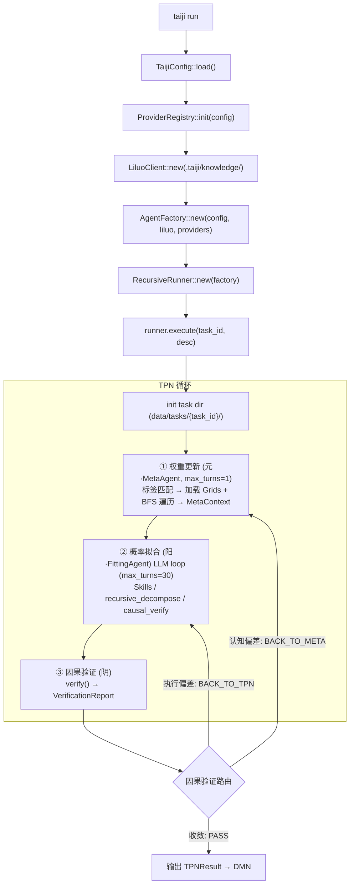
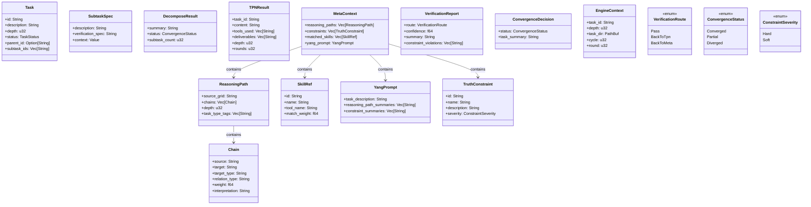
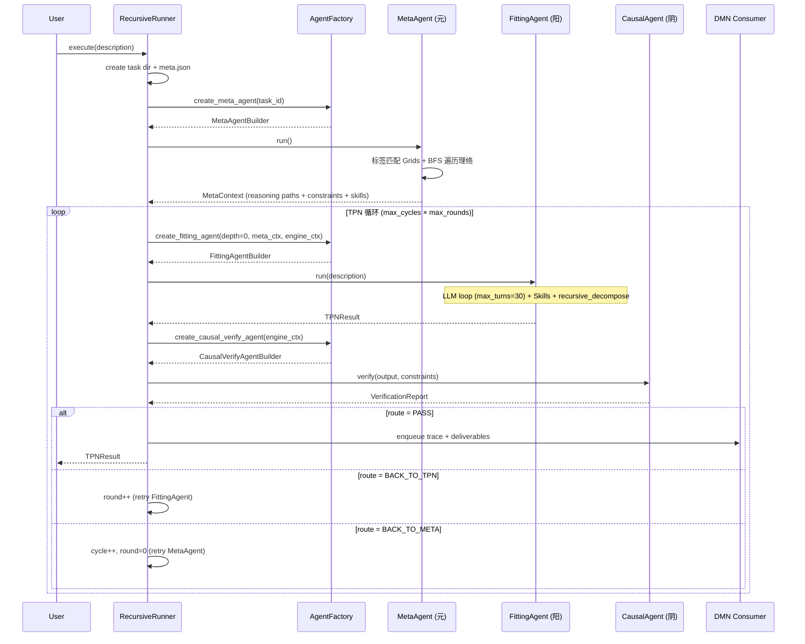
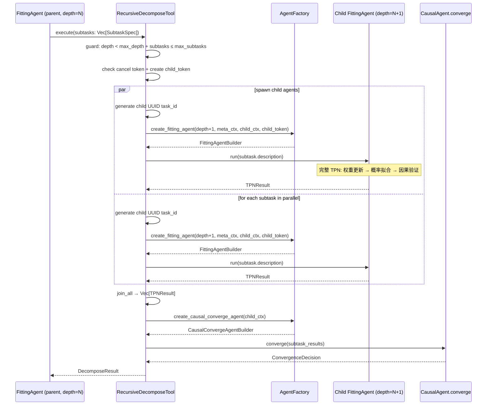
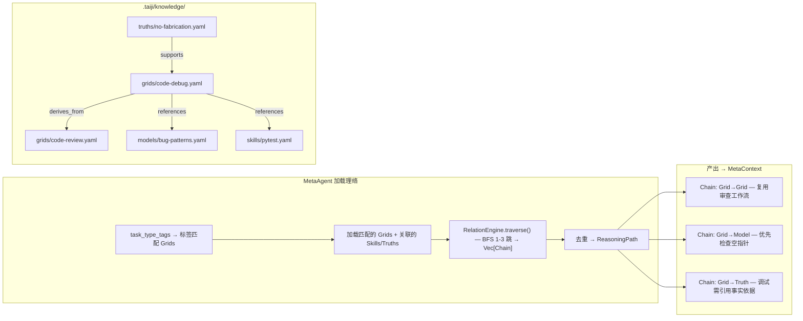
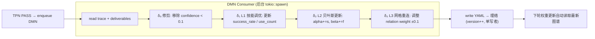

# taiji 架构蓝图 — TPN-DMN-理络 递归引擎（Rust / Rig）

> 蓝图-完型协议 V9（2026-07-14）。
>
> **本文件 = 唯一事实。** 实施约束与避坑规则见 [`AGENTS.md`](./AGENTS.md)（给 AI 自检）。
>
> **V9 变更：** 颗粒度调整——移除逐文件路径清单、trace 字段表、风险日志、路线图、演化 changelog。新增 TPN sequence 图、关键架构决策章。设计哲学压缩。

---

## 1. 设计哲学

### 1.1 异层同构 (Isomorphic Recursion)

递归树的每一层结构完全相同。depth=0 的根节点和 depth=N 的子节点执行相同的 TPN 三阶段循环、拥有相同的文件目录布局、收到相同的 system prompt 模板。唯一变量是 `depth`。由同一结构在不同深度重复应用产生复杂行为——不为不同深度写不同的控制流。

### 1.2 三相互补 (Tri-Phase Complementarity)

| Agent | 相位 | 易经 | 职责 |
|-------|------|------|------|
| **MetaAgent** | 权重更新·元 | 无极生太极 | 遍历理络图谱提取推理路径，注入认知偏置 |
| **FittingAgent** | 概率拟合·阳 | 阳 | 沿路径发散探索，LLM 做微观概率采样，可递归拆解 |
| **CausalAgent** | 因果验证·阴 | 阴 | 将结果收敛回符号约束，验证宏观因果性 |

TPN 循环 = 阳生（概率采样）→ 阴克（验证驳回）→ 元调（调整权重）→ 再阳生...，直到收敛。

### 1.3 神经与符号统一 (Neural-Symbolic Integration)

LLM 是微观概率性的体现——每次 prompt 调用随机、不可精确重现。理络是宏观因果性的体现——reasoning paths、Truth 约束形成可追溯的符号推理网络。TPN 循环就是这两层表象的交替：概率采样 → 符号验证 → 权重调整 → 再采样。

### 1.4 第一性原理 (First Principles)

复杂事物由简单事物结构化组成。一个 FittingAgent 可以执行也可以递归拆解（不需要两种类型）、一个 EngineContext 携带 task_dir 根节点和子节点用它做同一件事、一个 Task 结构在不同层代表不同粒度但不改变结构。

---

## 2. 系统概览

### 核心概念

| 组件 | 角色 | 说明 |
|------|------|------|
| **L4 Truth** | 不变约束 | 硬性规约（不编造事实），运行时加载为约束 |
| **L3 Grid** | 复合推理角色 | 含 role_prompt、workflow，关联 Skills/Models/Truths |
| **L2 Model** | 概率经验模式 | Bayesian 置信度（Beta 后验），从执行轨迹提取 |
| **L1 Skill** | 可执行工具 | 包装具体工具调用，带 success_rate 和 use_count |
| **理络 (Liluo)** | 认知仓库 | 四层 YAML 存储于 `.taiji/knowledge/` |
| **MetaAgent** | 权重更新·元 | 瞬态 Rig Agent，遍历理络图谱，`max_turns=1` |
| **FittingAgent** | 概率拟合·阳 | 瞬态 Rig Agent，L1 Skills + recursive_decompose + causal_verify，`max_turns=30` |
| **CausalAgent** | 因果验证·阴 | 瞬态 Rig Agent（双模式：verify / converge），`max_turns=3` |
| **AgentFactory** | 瞬态 Agent 工厂 | 中枢组件，持有基础设施 Arc 引用 |
| **DMN Consumer** | 反向传播 | 独立后台任务，轮询 pending 队列执行 δ₀-δ₃ 演化 |

### 技术栈

| 组件 | 选型 |
|------|------|
| 语言 | Rust 2024 edition |
| LLM Agent | Rig v0.39（Agent + dynamic_context + structured output） |
| LLM Provider | Rig deepseek::Client |
| 知识库 | 文件系统 YAML（`.taiji/knowledge/`） |
| 异步 | tokio（spawn 并发子任务） |
| CLI | clap（run/trace/list/init） |
| 序列化 | serde + serde_json + serde_yaml |
| 追踪 | tracing + TraceHook + 手动 TraceWriter |

### 架构总纲



---

## 3. 模块架构

### 七层模块图

```mermaid
flowchart TB
    subgraph "L6 入口"
        MAIN["main.rs — clap CLI"]
    end

    subgraph "L5 MCP"
        MCP_SRV["mcp/server.rs — 暴露 taiji 工具"]
        MCP_CLI["mcp/client.rs — 消费外部 MCP 工具"]
    end

    subgraph "L4 编排"
        RUNNER["runner — RecursiveRunner (薄包装)"]
        CONST["constraint_engine — ConstraintEngine"]
        TRIG["trigger_engine — SkillTriggerEngine"]
        WORKER["worker_pool — WorkerPool"]
        EVOLVER["cognition_evolver — CognitionEvolver"]
        DMN["dmn_consumer — DMN Consumer (后台)"]
    end

    subgraph "L3 Agent"
        FACTORY["factory — AgentFactory (中枢)"]
        META_B["meta — MetaAgent 构建器"]
        FIT_B["fitting — FittingAgent 构建器"]
        CAUSAL_B["causal — CausalAgent 构建器"]
        TOOLS["tools/ — recursive_decompose, causal_verify, L1 Skills"]
    end

    subgraph "L2 Hook"
        SAFETY["safety — ToolSafetyGuard (AgentHook)"]
        TRACE_H["trace — TraceHook (AgentHook)"]
    end

    subgraph "L1 基础设施"
        PROVIDER["provider — ProviderRegistry"]
        LILUO["knowledge — LiluoClient (文件系统读写)"]
        REL["relation_engine — RelationEngine (BFS→Chain)"]
        CONFIG["config — TaijiConfig"]
        ERR["error — TaijiError"]
        TRACE_W["trace — TraceWriter (JSONL)"]
        RLIMIT["rate_limiter — RateLimiter"]
        TSPEC["task_spec — TaskSpec 解析"]
    end

    subgraph "L0 基础类型"
        TYPES["types/ — task, agent, verification, execution"]
    end

    MAIN --> CONFIG & RUNNER
    RUNNER --> FACTORY
    FACTORY --> PROVIDER & LILUO & TRIG & REL & TYPES
    FACTORY --> META_B & FIT_B & CAUSAL_B
    FIT_B --> TOOLS & SAFETY & TRACE_H
    TOOLS --> FACTORY
    META_B --> LILUO
    CAUSAL_B --> CONST
    EVOLVER --> LILUO & TRACE_W
    DMN --> EVOLVER
    MCP_SRV --> FACTORY
    MCP_CLI --> FIT_B
```



### 模块职责

| 层 | 模块 | 职责 |
|----|------|------|
| L0 | types/ | Task, MetaContext, VerificationReport 等核心类型定义 |
| L1 | infra/config | TaijiConfig 加载与验证 |
| L1 | infra/error | TaijiError 枚举（含 context 字段） |
| L1 | infra/provider | ProviderRegistry：Rig client 管理（创建/复用/fallback） |
| L1 | infra/knowledge | LiluoClient：理络 文件系统读写 + 标签搜索 + BFS 遍历 |
| L1 | infra/relation_engine | BFS 遍历关系边，生成 ReasoningPath |
| L1 | infra/trace | TraceWriter：JSONL 写入 + 10MB 轮转 + read_tree 合并 |
| L1 | infra/rate_limiter | 全局 token bucket 限流 |
| L2 | hooks/safety | ToolSafetyGuard：路径穿越 / 命令注入 / SSRF 拦截 |
| L2 | hooks/trace | TraceHook：自动捕获 StepEvent 写入 trace.jsonl |
| L3 | agents/factory | AgentFactory：持有所有 Arc 引用，创建三种瞬态 Agent |
| L3 | agents/meta | MetaAgentBuilder：动态上下文注入，BFS 遍历理络 |
| L3 | agents/fitting | FittingAgentBuilder：Skills + recursive_decompose + causal_verify |
| L3 | agents/causal | CausalAgentBuilder：verify 模式 + converge 模式 |
| L3 | agents/tools | recursive_decompose / causal_verify / L1 Skills |
| L4 | orchestration/runner | RecursiveRunner：创建根任务 + TPN 循环 |
| L4 | orchestration/constraint_engine | 加载 L4 Truth 约束 + 前置检查 |
| L4 | orchestration/trigger_engine | 正则 + 标签匹配 L1 Skills |
| L4 | orchestration/worker_pool | Semaphore 限并发 + RateLimiter |
| L4 | orchestration/cognition_evolver | δ₀-δ₃ 四步认知演化 |
| L4 | orchestration/dmn_consumer | 后台轮询 pending 队列 |
| L5 | mcp/server | MCP Server：暴露 TPN/DMN/理络 操作 |
| L5 | mcp/client | MCP Client Manager：连接外部服务器 |

### 关键接口契约

| # | 契约 | 说明 |
|---|------|------|
| 1 | `RecursiveDecomposeTool.execute(subtasks: Vec[SubtaskSpec]) -> DecomposeResult` | 输入 LLM 拆解的子任务 → spawn 子 FittingAgent → join_all → CausalAgent.converge() → 返回收敛结果 |
| 2 | `AgentFactory.create_fitting_agent(depth, meta_ctx, engine_ctx, cancel) -> FittingAgentBuilder` | 从 MetaContext + EngineContext + CancellationToken + 理络 创建阳 Agent，builder.run() 后销毁 |
| 3 | `FittingAgentBuilder { depth, meta_ctx, engine_ctx, factory, model, cancel: CancellationToken }` | 阳 Agent 构建器，持有取消令牌用于递归子任务传播 |
| 4 | `SafetyHook (AgentHook)` | 在 ToolCall 事件上检查路径穿越/命令注入/SSRF，返回 Flow::cont() 或 Flow::skip() |
| 5 | `ConstraintEngine.check_constraints(output, constraints) -> ConstraintResult` | CausalAgent.verify 前置检查，Hard 违反直接短路返回 BACK_TO_META |
| 6 | `DMN Consumer (独立 tokio::spawn)` | 指数退避轮询 pending/ 队列，调用 CognitionEvolver，单写者更新理络 |

---

## 4. 核心类型契约



---

## 5. TPN 执行流

### 5.1 根任务执行序列



### 5.2 递归分解序列



### 5.3 TPN 路由决策

| 路由 | 触发条件 | 行为 | 计数器 |
|------|---------|------|--------|
| **PASS** | 交付件通过 L4 Truth 约束检查 + LLM 判定收敛 | 输出 TPNResult → 入队 DMN | — |
| **BACK_TO_TPN** | 执行偏差（交付件不满足验证规格） | 重试概率拟合（阳），LLM 调整执行策略 | `round++`，达 max_rounds → FAIL |
| **BACK_TO_META** | 认知偏差（推理路径错误、缺少必要约束） | 重新权重更新（元），重新遍历理络 | `cycle++` / `round=0`，达 max_cycles → FAIL |

路由由 CausalAgent 的 LLM 裁决，不硬编码于 RecursiveRunner。约束检查（ConstraintEngine.check_constraints）在 LLM 调用之前执行：Hard 违反直接返回 BACK_TO_META，Soft 违反注入 LLM prompt 由 LLM 裁定。

---

## 6. 理络 (Liluo) 认知仓库

### 6.1 四层资产模型

```
.taiji/knowledge/
├── truths/          ← L4 Truth（Hard/Soft 约束）
├── grids/           ← L3 Grid（推理角色 + relation 边）
├── models/          ← L2 Model（Bayesian 经验模式）
├── skills/          ← L1 Skill（可执行工具）
└── index.yaml       ← tag 反向索引（自动维护）
```

TPN 执行期间只读，DMN Consumer 单写者更新。

### 6.2 资产字段契约

**通用字段（所有层共享）：**

| 字段 | 类型 | 说明 |
|------|------|------|
| `id` | String | 唯一标识（如 `grid:code-debug`） |
| `type` | String | truth / grid / model / skill（由目录隐式确定） |
| `layer` | u32 | 1 / 2 / 3 / 4 |
| `name` | String | 名称 |
| `description` | String | 描述 |
| `tags` | Vec[String] | 搜索标签 |
| `confidence` | f64 | [0, 1] 置信度 |
| `version` | u32 | 版本号（保存时递增） |

**类型特有字段：**

| 层 | 额外字段 |
|----|---------|
| L1 Skill | `tool_name: String`, `trigger_pattern: String`, `task_type_tags: Vec[String]`, `success_count: u64`, `fail_count: u64` |
| L2 Model | `alpha: f64`, `beta: f64` |
| L3 Grid | `relations: Vec[Relation]`（每条含 target_id, target_type, relation_type, weight, interpretation） |
| L4 Truth | `severity: String`（"Hard" \| "Soft"） |

### 6.3 检索与遍历



检索策略：标签精确匹配 → 关键词子串搜索 → BFS 关系扩散 → `confidence × weight` 排序。不支持向量嵌入。

### 6.4 DMN 演化 (δ₀-δ₃)



---

## 7. 运行时布局

### 7.1 递归同构目录树

```
data/                               ← 默认 data_root
├── .taiji/
│   ├── config.json                 ← TaijiConfig
│   ├── pending/                    ← DMN 任务队列
│   │   └── dead/                   ← 死信队列
│   ├── knowledge/                  ← 理络 认知仓库 (§6)
│   └── tasks/
│       └── {root_uuid}/            ← 根任务
│           ├── meta.json           ← Task { id, depth:0, status }
│           ├── trace.jsonl         ← 根层执行轨迹
│           ├── deliverables/       ← LLM 产出
│           └── children/           ← 递归子任务
│               ├── 0/              ← depth:1
│               │   ├── meta.json
│               │   ├── trace.jsonl
│               │   ├── deliverables/
│               │   └── children/   ← 可继续递归
│               └── 1/
│                   └── ...
```

### 7.2 追踪系统

双层追踪，与递归目录树同构：

| 组件 | 追踪方式 |
|------|---------|
| 权重更新 (元) | 手动 TraceWriter::write() — 单条记录 |
| 概率拟合 (阳) | Rig TraceHook — 自动捕获所有 StepEvent |
| 因果验证 (阴) | 手动 TraceWriter::write() — 结构化输出 |

每层任务目录独立 `trace.jsonl`。`read_tree()` 递归遍历所有 `**/trace.jsonl` 按时间戳合并。单文件超过 10MB 自动轮转，保留最近 5 代。敏感信息（API Key）写入前脱敏。

---

## 8. 关键架构决策

### 8.1 瞬态 Agent 生命周期

所有 Agent 均为瞬态：`AgentFactory.create_*_agent() → AgentBuilder.run() → 结构化输出 → AgentBuilder drop`。状态不跨调用保留，认知更新通过理络 YAML 文件持久化，下轮加载时自动生效。

### 8.2 异层同构

`depth` 只改变编号，不改变目录布局、TPN 循环结构、system prompt 模板。根任务和子任务执行同一段代码。递归层间通过 `MetaContext`（推理偏置注入）和 `ConvergenceDecision`（收敛结果上浮）传递信息。

### 8.3 TPN 只读 / DMN 单写者

TPN 执行期间只读理络，DMN Consumer 是唯一的写者（单线程后台任务）。无需并发锁，避免读写竞争。

### 8.4 LLM 路由内部化

TPN 循环的路由决策（PASS / BACK_TO_TPN / BACK_TO_META）由 CausalAgent 的 LLM 根据 VerificationReport 裁决。RecursiveRunner 只执行路由结果（递增循环计数器、重入对应阶段），不硬编码路由逻辑。

### 8.5 Hook 安全模型

SafetyHook 和 TraceHook 以 `AgentHook` trait 实现，注册到 FittingAgent 的 Rig Agent 上。SafetyHook 在 ToolCall 事件上拦截危险操作（路径穿越、命令注入、SSRF），拦截时返回 `Flow::skip()`。非白名单 MCP 工具强制执行安全检查。

### 8.6 递归防护

| 防护层 | 机制 | 默认值 |
|--------|------|--------|
| 深度限制 | `RecursiveDecomposeTool` 检查 `depth < max_depth` | 3 |
| 子任务上限 | `subtasks.len() ≤ max_subtasks` | 4 |
| TPN 轮次 | `round_counter ≤ max_rounds` | 3 |
| TPN 循环 | `cycle_counter ≤ max_cycles` | 3 |
| 取消传播 | `CancellationToken` 传递到所有递归层（parent→child_token 链接） | — |
| 嵌套 task_id | 每个递归层使用独立 UUID v4，`parent_id` 指向父层 | — |
| 执行超时 | tokio::timeout 包裹整个 execute() | 600s |

### 8.7 Rig 本地化（Vendor）

Rig 0.39（rig-core + rig-derive）已 vendor 到 `vendor/` 目录，Cargo.toml 通过 `[patch.crates-io]` 重定向。原因：

1. **Rig 仍处于 0.x 不稳定阶段** — 频繁 API 变更导致上游 breaking change 不可控
2. **简化依赖** — 剔除不需要的 feature flag 和可选依赖（qdrant、lancedb、fastembed 等）
3. **自定义修改** — 允许在 vendor 内对 Rig 源码做最小修补

Vendor 策略：

| 层 | 原始 crate | vendor 路径 | 说明 |
|----|------------|-------------|------|
| 应用入口 | `rig` | `vendor/rig/` | 薄 facade，re-export rig_core::* |
| 核心库 | `rig-core` | `vendor/rig-core/` | Agent/工具/提供者/补全核心 |
| 过程宏 | `rig-derive` | `vendor/rig-derive/` | Tool derive 宏 |

taiji 使用 `rig = { version = "0.39" }`（语法占位）+ `[patch.crates-io]` 指向 vendor。上游 Rig 的非核心可选依赖（companion crates）被剥离。
重新 vendor 的操作：`cargo package --allow-dirty` 可验证 vendor 目录自恰性。
