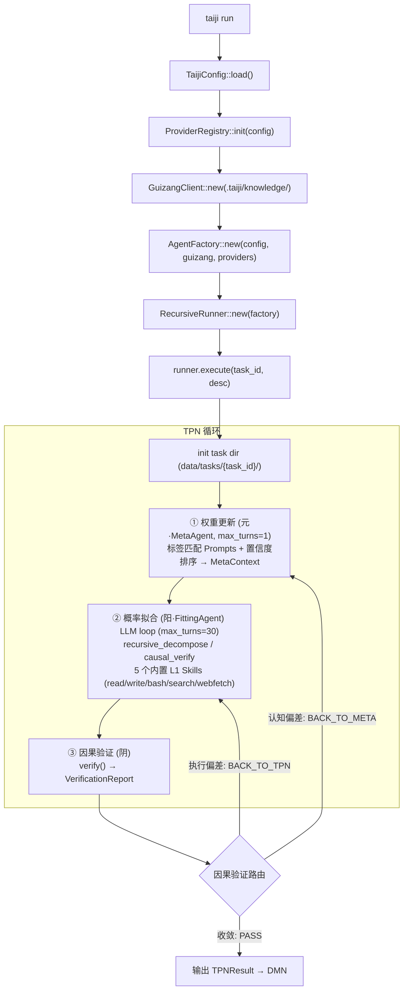
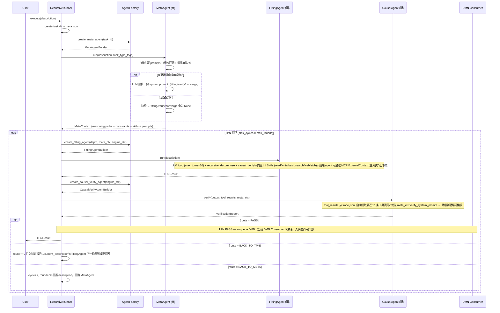
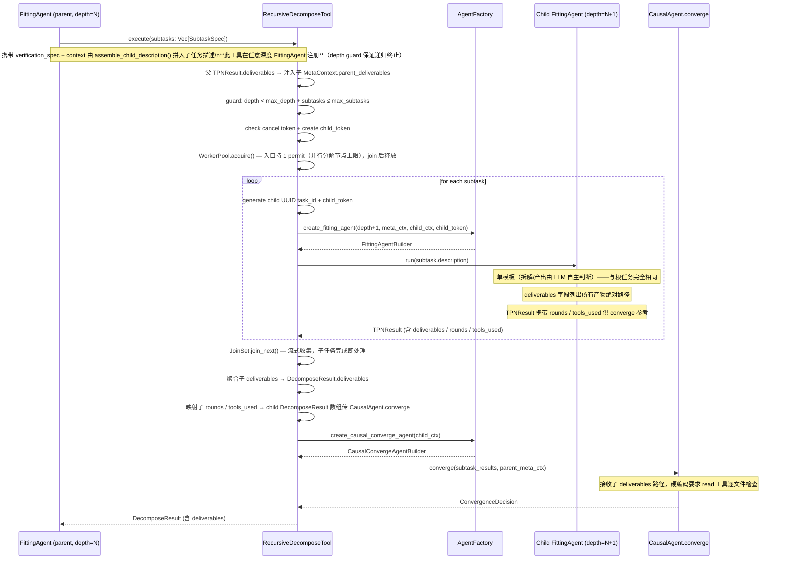
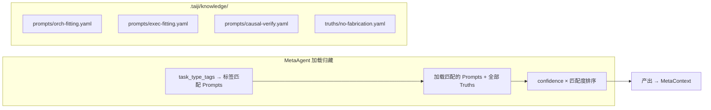
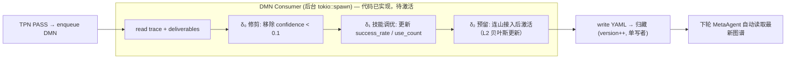

# taiji 架构蓝图 — 纯云端 MCP Agent 插件系统（Rust / Rig）

> 蓝图-完型协议 V24（2026-07-31，实现后对齐修订 2026-08-01）。
>
> **本文件 = 唯一事实。** 实施约束与避坑规则见 [`AGENTS.md`](./AGENTS.md)（给 AI 自检）。
>
> **V24 变更摘要：聊天面板升级为完整 ChatAgent。** 从"裸单轮 LLM 补全"升级为完整 Rig Agent（5 个 L1 Skills + 工具循环 + 对话记忆），新增流式输出协议（ServerResponse chunk 扩展）、多 Provider 配置生态（`providers` 列表）、会话历史持久化（`chat_history.json` 原子写入）、聊天中的任务感知（注入 task meta + 归藏摘要）。§2、§3、§8、§9.4、§9.7 相关章节更新。
>
> **2026-08-01 实现后对齐修订：** 校准 §3 契约 #13-#15、§9.9 契约 #16-#17 的签名与返回类型，补充 `guizang_digest()` 方法文档，修正 §9.7 流式渲染描述。均为实现后校准，不改变架构设计。
>
> **V25 变更摘要（2026-08-05，Meta/Causal 收集工具落地）：** Meta 与 Causal 相位从「无工具」升级为「LLM + 只读收集工具」——MetaAgent 注册 read / search / webfetch（收集任务上下文、父层 deliverables、归藏资产与网络信息后更新权重），CausalAgent 注册 read / webfetch（LLM 逐文件核验 deliverables、联网核实外部事实后裁决路由）。§1.2 权限面列、§8.2 权限同构、§8.5 Hook 安全模型更新：执行工具（write / bash / recursive_decompose / causal_verify）收敛 Fitting 相位，收集工具（read / search / webfetch）三相共有，「带工具必有安全钩子」为硬约束（Meta / Causal 均挂载 SafetyHook，webfetch 的 SSRF 检查由此生效）。§8.9 硬编码保证第 3、4 条（read 逐文件验证）由此从模板要求变为工具注册事实。

> **V26.4 变更摘要（2026-08-07，E2E 冒烟实测：hook 单槽语义修复）：** V26.1-3 修复轮收尾冒烟（真实任务 e00d70e7）暴露深层 bug——`trace.jsonl` 缺失 + `tools_used` 为空，回溯根因：Rig 0.39 `AgentBuilder::hook()` 是**单槽覆盖式**，`.hook(a).hook(b).hook(c)` 只有 `c` 生效，导致 V25 起 FittingAgent 的 SafetyHook 从未真正挂载、V26.1 加 ChatHistorySnapshotHook 后 TraceHook 也失效（V26.1-A tools_used 修复随之失效）。新增 `FittingHookSet`（safety → trace → snapshot 组合，首个非 Continue 短路，一次 `.hook()` 挂载）修复；Meta / Causal / Chat 单 hook 不受影响。冒烟复验：`trace.jsonl` 47 行记录、`TPNResult.tools_used = [write, read, causal_verify]` 真实落盘、无密钥明文。§8.5 Hook 安全模型补挂载机制说明；AGENTS.md §17 沉淀。

> **V26.3 变更摘要（2026-08-07，任务 6f95dacd 深度分析落地）：** 对 E2E 超时任务 6f95dacd（「逐一审计全部 src Rust 文件」）的完成情况与任务描述矛盾分析（结论：无虚假完成，status=Failed 诚实；但三层不一致）落地 4 项修复：① **abort 子任务状态落盘**——RecursiveDecomposeTool 错误路径 `abort_all()` 后统一把 `children/` 下 Running 子任务写 Failed（实测 8 个子任务 7 个停在 Running 且 3 个实际产出了交付物，与「超时/失败/取消正确落盘」宣称不符）；② **L1 Skills 工具参数契约对齐**——SkillTool ToolDefinition 暴露单参 `input` 但 BashTool 读 `command`、ReadTool 读 `path`，LLM 传 `{"input":"ls"}` 永远报 missing 参数，唯一活路是 input 塞 JSON 字符串（纯靠试错，每次 resume 重新踩坑）；修复为 BashTool/ReadTool 支持 `input` 键直读纯字符串 + ToolDefinition description 补用法示例（双保险）；③ **trace 脱敏精确化**——value-based 正则 `[a-zA-Z0-9_-]{40,}` 误伤 UUID/文件正文，LLM 读 config.json 等内容被整段遮蔽；收紧为仅密钥前缀匹配或仅 key-based，read/bash 输出豁免 value-based；④ **Fitting 规模感知引导**——模板提示任务过大时优先拆解分批、预算不足时明确说明覆盖范围。§8.1（子任务状态一致性）、§8.5（工具契约与 description 约定）同步更新。

> **V26.2 变更摘要（2026-08-07，持久化去冗余）：** 持久化文件审计发现 2 个只写不读的死文件并删除：① `meta_conversation.json`（内容四字段全部可推导：task_description→meta.json、llm_input/llm_response→trace.jsonl、meta_ctx→meta_ctx.json），连带删除 `MetaAgentBuilder.task_dir` 字段（仅为写它存在）；② `converge_state.json`（converge 在 RecursiveDecomposeTool 内部调用，其崩溃窗口已被「父任务失败→重跑→children/ 复用→重新 converge」幂等重放天然覆盖）。§8.1 新增任务目录持久化文件清单（唯一事实，新增文件必须先入清单）。

> **V26.1 变更摘要（2026-08-07，E2E 实测修复）：** V26 端到端验收（156 测试全绿 + 真实任务冒烟 Completed + --resume 恢复 + 超时→Failed 验证）暴露 4 个问题并修复：① `tools_used` 统计从 LLM 响应文本 contains 匹配改为 **TraceHook 真实工具调用记录**（`on_tool_call` 收集工具名），消除 LLM 正文提及工具名的伪阳性；② CausalAgent verify/converge `max_turns` 6→10（真实任务首次 causal_verify 在 6 轮上限触发 MaxTurnsError，重试 25s 成功——6 轮不足，10 轮覆盖）；③ **对话历史增量快照**：新增 ChatHistorySnapshotHook，在每次 LLM 调用前将完整对话（history + prompt）原子持久化到 `chat_history.json`——弥补 Rig `chat()` 出错即返回、不回写历史的缺陷，使 `--resume` / 子任务 rerun 可从失败点增量推进而非从空历史重跑整个 Fitting 阶段；④ 修复 `test_fitting_agent_depth_check` 污染已跟踪 `test_data/`（task_dir 改用临时目录）。§7.2、§8.1、§8.2、§8.5 同步更新。

> **V26 变更摘要（2026-08-05，异层同构收敛）：** 删除 `AgentMode`（Orchestration / Execution）分裂——此前 Execution 模式 FittingAgent 不注册 `recursive_decompose`，工具面随 depth 分化，与「权限不随 depth 变化」的异层同构声明自相矛盾。V26 起任务节点在任意深度**完全同构**：同一 FittingAgent 代码（全工具注册、单 prompt 模板、统一 max_turns=30）、同一恢复链（根任务新增 `taiji run --resume <task_id>` 恢复入口，与子任务共享同一恢复代码）、统一状态持久化（TpnCycle 统一原子写 meta.json status，超时/失败/取消正确落盘 Failed/Cancelled）。WorkerPool 信号量语义简化为「并行分解节点上限」（RecursiveDecomposeTool 入口 acquire 1 permit、join 完成后释放，子任务运行不持 permit——持 permit 者不再 acquire，无死锁路径）。CausalAgent verify/converge max_turns 3→6（T4 实测：3 轮不足，LLM 需 read 多文件才能裁决）。§1.1、§2、§4、§5.2、§6.2、§8.1、§8.2、§8.6、§8.8、§8.10 同步更新；`PromptAsset.agent_mode` 字段删除（serde 默认宽容，旧归藏 YAML 自动兼容）。递归终止仅靠 depth guard（§8.6）。
>

---

## 1. 设计哲学

### 1.1 异层同构 (Isomorphic Recursion)

递归树的每一层结构完全相同。depth=0 的根节点和 depth=N 的子节点执行相同的 TPN 三阶段循环、拥有相同的文件目录布局、相同的工具注册面、相同的 system prompt 模板、相同的 max_turns 与相同的恢复/持久化路径——**不为不同深度写不同的控制流，不引入任何 depth 特例**。递归终止仅由 §8.6 的 depth guard 保证（`depth >= max_depth` 时 decompose 工具拒绝拆解）。

**异层同构 = 结构同构 + 权限同构 + 配置同构**：任务节点（单个三相循环，见 §8.1）在任意深度保持相同的三相相位分工（Meta 认知权 / Fitting 执行权 / Causal 裁判权，见 §8.5）、相同的权限配置（同一 SafetyHook 单例、相同工具面、相同白名单）与相同的运行参数（max_turns / 温度 / 防护默认值）——**权限与配置不随 depth / round / cycle 变化，不同深度不存在任何梯度**。FittingAgent 在所有深度注册全部执行工具（5 L1 Skills + recursive_decompose + causal_verify），是否实际拆解由 LLM 依据任务描述自主判断（prompt 中说明「可用 recursive_decompose 拆解，也可直接产出」）。

**提示词来源：** FittingAgent / CausalAgent 的 system prompt 由 MetaAgent 在每次 TPN 循环的开始阶段动态编排。MetaAgent 首先查询归藏 `prompts/` 层的提示词资产（标签匹配 + 置信度排序），若有高置信度匹配则调用 LLM 将资产组合为三份完整的 system prompt（fitting、verify、converge），注入 `MetaContext` 传递到下游 Agent。无归藏匹配时降级到 4 个 Base 硬编码模板（FittingAgent 的编排/执行各一、CausalAgent 的 verify/converge 各一），下游 Agent 自动使用内置回退。

### 1.2 三相互补 (Tri-Phase Complementarity)

| Agent | 相位 | 易经 | 职责 | 权限面 |
|-------|------|------|------|--------|
| **MetaAgent** | 权重更新·元 | 无极生太极 | 遍历归藏图谱提取推理路径，注入认知偏置 | **认知权 + 收集权**：注册只读收集工具（read / search / webfetch，可联网核实），受 SafetyHook 约束；LLM 多轮收集任务上下文、父层 deliverables、归藏资产与网络信息后更新权重；归藏只读 |
| **FittingAgent** | 概率拟合·阳 | 阳 | 沿路径发散探索，LLM 做微观概率采样，可递归拆解 | **执行权**：注册 5 个 L1 Skills + recursive_decompose + causal_verify，受 SafetyHook + TraceHook 约束（全节点唯一持有变更世界工具的相位） |
| **CausalAgent** | 因果验证·阴 | 阴 | 将结果收敛回符号约束，验证宏观因果性 | **裁判权 + 收集权**：注册只读验证工具（read / webfetch，逐文件核验 + 联网核实），受 SafetyHook 约束；LLM 核验 deliverables 与外部事实后裁决路由（PASS / BACK_TO_TPN / BACK_TO_META） |

TPN 循环 = 阳生（概率采样）→ 阴克（验证驳回）→ 元调（调整权重）→ 再阳生...，直到收敛。

**循环内权限分工**：执行工具（write / bash / recursive_decompose / causal_verify——变更世界的工具面）收敛于 Fitting 相位；收集工具（read / search / webfetch——只读信息收集与网络核实）为三相共有，Meta / Causal 相位仅持有收集工具、无执行工具。分工是角色性的（执行者 / 认知者 / 裁判者），由工具注册面天然保证，不可被 LLM 动态改变。

### 1.3 神经与符号统一 (Neural-Symbolic Integration)

LLM 是微观概率性的体现——每次 prompt 调用随机、不可精确重现。归藏是宏观因果性的体现——reasoning paths、Truth 约束形成可追溯的符号推理网络。TPN 循环就是这两层表象的交替：概率采样 → 符号验证 → 权重调整 → 再采样。

### 1.4 第一性原理 (First Principles)

复杂事物由简单事物结构化组成。一个 FittingAgent 可以执行也可以递归拆解（不需要两种类型）、一个 EngineContext 携带 task_dir 根节点和子节点用它做同一件事、一个 Task 结构在不同层代表不同粒度但不改变结构。

### 1.5 心流 (Flow) — 三层+预留模型

taiji 归藏资产按三层+预留组织，形成心流收缩-舒张节律：

| 层 | 资产 | 舒张期（浅层执行） | 收缩期（深层执行 / Flow） |
|:---:|------|:---:|:---:|
| **Prompts** | 行为模板（含角色定义） | 活跃注入 MetaContext，引导 LLM 行为 | **消溶** — 角色叙事溶解，不再显式出现于 prompt |
| **Truths** | 硬约束 | 全程硬约束，TCS 前置检查 | **持续** — 作为背景基线不变 |
| **Skills** | 可执行工具（硬编码） | LLM 可调用工具 | **沉淀** — 高频模式统计积累 |

**消溶与沉淀：** 角色叙事（Prompts 中的行为引导）是浅层任务的脚手架。随着递归加深、同一任务的反复穿透（"心流"），这些显式引导逐步消溶——系统进入纯技能驱动模式：Skills 的成功率统计直接驱动行为，Truths 约束持续运行。此时不再有「我是谁」「我要做什么」的显式叙述，只剩下技能统计模式 + 硬约束。

**递归加深不是训练，是同一任务的反复穿透。** 每次穿透的产物：
1. **统计数据**（Skills 的 success_count/fail_count）→ DMN Consumer 写回归藏
2. **行为模板**（Prompts）→ 保存到归藏文件系统 → 下一次浅层执行时加载

所有资产更新通过 DMN Consumer 在符号层（YAML 文件）完成，纯云端架构无需本地模型。

### 1.6 类比与隐喻 (Analogies and Metaphors)

taiji 的核心理念植根于两个千年结构的统一：中国古典哲学（周易/归藏）中的变化与累积模型，以及现代概率算法（蒙特卡洛/知识图谱）。

#### 1.6.1 TPN / 递归树 — 周易 · 蒙特卡洛方法

TPN 三相位循环与周易三爻、MCMC 三步之间的结构同构：

| 周易 (Zhouyi) | TPN 递归树 | 现代算法 |
|---|---|---|
| **三爻** (初、中、上) | 三相位 (元Meta / 阳Fitting / 阴Causal) | MCMC 三步：proposal → sampling → acceptance |
| **六爻** (重卦：两经卦相叠) | 两层递归 × 三相位 = 6 步执行路径 | 2-level Monte Carlo rollout |
| **八卦** (2³ = 8 种卦象) | 路由三分支 (PASS/BACK_TO_TPN/BACK_TO_META) 在递归树中展开 = 8 种拓扑路径 | MCTS 8-node search frontier |
| **变卦** (爻变产生新卦) | BACK_TO_TPN / BACK_TO_META → 子任务重入 → 路径分叉 | MCTS backpropagation + re-route |

TPN 的每一次循环（权重更新 → 概率拟合 → 因果验证 → 路由决策）就是周易中的一次"起卦"——系统在不确定性中做一次概率采样，然后由因果验证裁定吉凶（PASS / 回退）。递归树的展开就是 MCTS 的 selection → expansion → simulation → backpropagation 循环：父任务选择子任务（selection）、spawn 子 Agent（expansion）、子 Agent 执行并产出收敛结果（simulation）、收敛结果上浮影响父层决策（backpropagation）。

#### 1.6.2 DMN / 归藏 — 自演进知识图谱

| 特征 | 归藏 / DMN | 现代对应 |
|---|---|---|
| **离散符号节点** | Prompts / Truths 资产 + 硬编码 Skills | Knowledge Graph 节点 |
| **因果逻辑链接** | 标签索引（index.yaml tag_index） | Knowledge Graph 有向边 + 概率权值 |
| **检索增强（TPN 执行期）** | 标签匹配 → 置信度排序 → MetaContext 注入 LLM prompt | RAG (Retrieval-Augmented Generation) |
| **从执行中学习（DMN 后台）** | DMN δ₀-δ₂ 根据 trace 反向更新认知资产（增删改权值） | **RAG 没有这步**（标准 RAG 知识库是静态的） |
| **分层沉淀（心流深层）** | Truths 持续 → Prompts 消溶 → Skills 统计沉淀 | Self-Improving Knowledge Graph |

归藏常被类比为 RAG，但这只覆盖了 **TPN 执行期的检索增强**（retrieve → augment → generate）。RAG 的核心流程是单向的：检索 → 增强 → 生成。而归藏 + DMN 形成完整闭环：**retrieve → augment → execute → evaluate → update → re-retrieve**。因此更精确的现代对应是：

- **Self-Improving Knowledge Graph**（自演进知识图谱）：知识库在检索的同时，根据执行反馈主动调整自身节点权值
- **Active RAG**（主动 RAG）：RAG + 在线学习，克服标准 RAG 只读不学的局限
- **Retrieval-Enhanced Learning**（检索增强学习）：不只是生成时检索增强，整个学习过程由结构化认知检索增强

DMN 的 δ₀-δ₂ 三步演化（修剪 → 技能调优 → 贝叶斯更新[预留]）本质上是知识图谱上的**在线贝叶斯推理**——不需要重新训练整个模型，只在符号层更新权值，下一轮 TPN 自动加载更新后的认知偏置。

#### 1.6.3 变与藏的循环

taiji 的核心认知回路由两易构成：

```
周易（变）                         归藏（藏）
┌─────────────────────────┐       ┌─────────────────────────┐
│ TPN 递归树               │       │ DMN 认知仓库             │
│                          │       │                          │
│ 动态 / 概率 / 分叉       │───→  │ 静态 / 符号 / 累积       │
│ 概率采样（阳 FittingAgent）│      │ δ₀-δ₂ 反向调权            │
│ 因果验证（阴 CausalAgent）│       │ Truth 真值维护（精简）     │
│ 路由决策（元 MetaAgent）  │◀───  │ 重新注入 MetaContext      │
│                          │       │                          │
└─────────────────────────┘       └─────────────────────────┘

   变 → 藏：TPN PASS → 执行产物入队 DMN，贝叶斯更新归藏资产
   藏 → 变：更新后的认知偏置重新注入 TPN MetaContext，引导下一轮采样
```

这个变-藏循环是 §1.3 神经与符号统一的运行根基：**周易（TPN）是神经侧的概率探索，归藏（DMN）是符号侧的认知沉淀。** 二者交替运作，形成自我改进的认知系统——不依赖外部微调，不依赖预设知识库。每个执行周期都在变中探索新可能，在藏中固化已验证，两者共同构成 taiji 的自我演化能力。

taiji 的智能来自云端 LLM（DeepSeek via Rig）的概率采样能力与归藏符号推理网络的交替运作。

---

## 2. 系统概览

### 核心概念

| 组件 | 角色 | 运行时行为 |
|------|------|------|
| **Prompts** | 行为模板（含角色定义） | MetaAgent 标签匹配 + 置信度排序 → LLM 编排 system prompt。**心流深层消溶**，不再显式出现于 prompt。|
| **Truths** | 硬约束层 | 全程硬约束，TCS 前置检查 + Hard 短路。**心流持续**，作为背景基线不变 |
| **Skills** | 可执行工具（硬编码） | 5 个内置真实工具（read/write/bash/search/webfetch）+ MCP 注入。带 success_rate/use_count。**心流深层沉淀**，统计更新写回归藏 |
| **models/** | 预留层（连山） | 连山流型系统接入前的占位。当前不参与任何运行时行为 |
| **归藏 (Guizang)** | 认知仓库 | 三层+预留 YAML 存储于 `.taiji/knowledge/`。TPN 执行期间只读，DMN Consumer 单写者 |
| **MetaAgent** | 权重更新·元 | 瞬态 Rig Agent，查询归藏 Prompts 标签匹配 + LLM 编排 system prompt（fitting/verify/converge），产出 MetaContext，`max_turns=6`（收集→提取工具循环） |
| **FittingAgent** | 概率拟合·阳 | 瞬态 Rig Agent，内置 5 个 L1 Skills + `recursive_decompose` + `causal_verify`（任意深度全量注册，V26 起无模式分化）；前端通过 MCP ExternalContext 注入额外上下文，`max_turns=30` |
| **CausalAgent** | 因果验证·阴 | 瞬态 Rig Agent（双模式：verify / converge）。verify 先跑 ConstraintEngine 前置检查（Hard 直接短路），再调 LLM 裁决路由；converge 聚合子结果判决收敛。`max_turns=10`（V26 由 3→6 仍不足，V26.1 再升至 10） |
| **AgentFactory** | 瞬态 Agent 工厂 | 中枢组件，持有基础设施 Arc 引用（ProviderRegistry / GuizangClient / WorkerPool / ConstraintEngine） |
| **ChatAgent** | 前端内嵌对话 Agent | 长生命周期 Rig Agent（24h 超时），注册 5 个 L1 Skills + SafetyHook，`max_turns=20`。`stream_chat()` 逐 token 推流到 WS 定向通道。聊天历史持久化到 `{data_root}/chat/{session_id}.json`。**与 TPN 循环完全解耦**（不进三相循环，不触发递归拆解） |
| **DMN Consumer** | 反向传播·调权 | 独立后台任务，轮询 pending 队列执行演化（δ₀ 修剪 → δ₁ 技能调优）。纯符号层 YAML 更新，无需本地模型。代码已实现，可随时激活 |

### 技术栈

| 组件 | 选型 |
|------|------|
| 语言 | Rust 2024 edition |
| LLM Agent | Rig v0.39（Agent + dynamic_context + structured output） |
| LLM Provider | Rig deepseek::Client |
| 知识库 | 文件系统 YAML（`.taiji/knowledge/`） |
| 异步 | tokio（spawn 并发子任务 + WebSocket + 流式 Agent） |
| 流式 | Rig `stream_chat()` → `MultiTurnStreamItem` → WS chunk 推送 |
| CLI | clap（run/trace/list/init/mcp/**serve**） |
| 序列化 | serde + serde_json + serde_yaml |
| 追踪 | tracing + TraceHook + 手动 TraceWriter |
| **Web 服务** | **axum + tower-http（Rust 核心进程内嵌 HTTP 静态托管 + WebSocket 双向）** |
| **前端 UI** | **React 18 + TypeScript + TailwindCSS（Vite 构建，纯浏览器运行）** |
| **图渲染** | **React Flow（纺锤树 + TPN 流程图）** |
| **动画** | **Framer Motion（节点生长 / 状态变色）** |
| **实时推送** | **WebSocket 双向（tokio-tungstenite，Rust ↔ React 事件 + 请求/响应）** |
| **太极图** | **纯 CSS/SVG 动画（60s 旋转 + 状态联动光晕）** |

### 架构总纲



---

## 3. 模块架构

### 七层模块图

```mermaid
flowchart TB
    subgraph "L6 入口"
        MAIN["main.rs — clap CLI"]
    end

    subgraph "L5 MCP"
        MCP_SRV["mcp/server.rs — 暴露 taiji 工具"]
        MCP_CLI["mcp/client.rs — 消费外部 MCP 工具"]
    end

    subgraph "L4 编排"
        RUNNER["runner — RecursiveRunner (薄包装)"]
        CONST["constraint_engine — ConstraintEngine"]
        TRIG["trigger_engine — SkillTriggerEngine"]
        WORKER["worker_pool — WorkerPool"]
        DMN["dmn_consumer — DMN Consumer (后台，可激活)"]
    end

    subgraph "L3 Agent"
        FACTORY["factory — AgentFactory (中枢)"]
        META_B["meta — MetaAgent 构建器"]
        FIT_B["fitting — FittingAgent 构建器"]
        CAUSAL_B["causal — CausalAgent 构建器"]
        PLAN_B["plan — PlanBuilder (预演编排)"]
        CHAT_B["chat — ChatAgentBuilder (聊天面板)"]
        TOOLS["tools/ — recursive_decompose, causal_verify"]
    end

    subgraph "L2 Hook"
        SAFETY["safety — ToolSafetyGuard (AgentHook)"]
        TRACE_H["trace — TraceHook (AgentHook)"]
    end

    subgraph "L1 基础设施"
        PROVIDER["provider — ProviderRegistry"]
        GUIZANG["knowledge — GuizangClient (文件系统读写)"]
        CONFIG["config — TaijiConfig"]
        ERR["error — TaijiError"]
        TRACE_W["trace — TraceWriter (JSONL)"]
        RLIMIT["rate_limiter — RateLimiter"]
        TSPEC["task_spec — TaskSpec 解析"]
    end

    subgraph "L7 前端"
        WEB["taiji-web React App (浏览器)"]
    end

    subgraph "L6 实时事件 + HTTP"
        WS_SRV["ws/server.rs — WebSocket 事件推送 + 请求响应"]
        WS_HANDLER["ws/handler.rs — 客户端请求分发"]
        WS_TYPES["ws/types.rs — TaskTreeSnapshot / TpnPhaseState / ClientMessage / ServerResponse"]
        HTTP_SRV["main.rs serve — axum HTTP 静态托管 (dist/)"]
    end

    subgraph "L0 基础类型"
        TYPES["types/ — task, agent, verification, execution, frontend"]
    end

    MAIN --> CONFIG & RUNNER
    RUNNER --> FACTORY
    FACTORY --> PROVIDER & GUIZANG & TRIG & TYPES
    FACTORY --> META_B & FIT_B & CAUSAL_B & PLAN_B
    FIT_B --> TOOLS & SAFETY & TRACE_H
    TOOLS --> FACTORY
    META_B --> GUIZANG
    CAUSAL_B --> CONST
    DMN --> GUIZANG
    MCP_SRV --> FACTORY
    MCP_CLI --> FIT_B
    WS_SRV --> RUNNER & FACTORY & TYPES
    WS_HANDLER --> FACTORY & TYPES
    WS_HANDLER --> CHAT_B
    CHAT_B --> FACTORY
    CHAT_B --> SAFETY
    WEB --> WS_SRV
    HTTP_SRV --> WEB
```



### 模块职责

| 层 | 模块 | 职责 |
|----|------|------|
| L0 | types/ | Task, MetaContext, VerificationReport, TaskTreeSnapshot, TpnPhaseState 等核心类型定义 |
| L1 | infra/config | TaijiConfig 加载与验证 |
| L1 | infra/error | TaijiError 枚举（含 context 字段） |
| L1 | infra/provider | ProviderRegistry：Rig client 管理（创建/复用/fallback） |
| L1 | infra/knowledge | GuizangClient：归藏 文件系统读写 + 标签搜索 |
| L1 | infra/trace | TraceWriter：JSONL 写入 + 10MB 轮转 + read_tree 合并 |
| L1 | infra/rate_limiter | 全局 token bucket 限流 |
| L2 | hooks/safety | ToolSafetyGuard：路径穿越 / 命令注入 / SSRF 拦截 |
| L2 | hooks/trace | TraceHook：自动捕获 StepEvent 写入 trace.jsonl |
| L3 | agents/factory | AgentFactory：持有所有 Arc 引用，创建三种瞬态 Agent |
| L3 | agents/meta | MetaAgentBuilder：动态上下文注入，查询归藏 Prompts |
| L3 | agents/fitting | FittingAgentBuilder：recursive_decompose + causal_verify + 5 个内置 Skills（read/write/bash/search/webfetch），同时支持前端 agent 通过 MCP ExternalContext 注入额外上下文 |
| L3 | agents/causal | CausalAgentBuilder：verify 模式 + converge 模式 |
| L3 | agents/chat | ChatAgentBuilder：前端聊天面板 Rig Agent。组装 5 个 L1 Skills + SafetyHook，`stream_chat()` 推流，`max_turns=20`。会话持久化到 `chat_history.json`。与 TPN 循环完全解耦 |
| L3 | agents/tools | recursive_decompose / causal_verify（Skills 不再内置于此模块） |
| L3 | agents/plan | PlanBuilder：MetaAgent + LLM 编排执行计划，输出 PlanSummary（不进 TPN 循环） |
| L4 | orchestration/runner | RecursiveRunner：创建根任务 + TPN 循环 |
| L4 | orchestration/constraint_engine | 加载 Truths 约束 + 前置检查 |
| L4 | orchestration/trigger_engine | 正则 + 标签匹配 Skills |
| L4 | orchestration/worker_pool | Semaphore 限并发 + RateLimiter |
| L4 | orchestration/dmn_consumer | 后台轮询 pending 队列，执行 δ₀ 修剪 + δ₁ 技能调优（代码已实现，可激活 — 见 §8.12） |
| L5 | mcp/server | MCP Server：暴露 TPN/DMN/归藏 操作，6 个工具（taiji_plan / taiji_run / taiji_explain / taiji_trace / taiji_list / taiji_status） |
| L5 | mcp/client | MCP Client Manager：连接外部服务器 |
| L6 | ws/server | WebSocket Server：接受客户端连接，广播 TaskEvent 事件 + 接收 ClientMessage 请求，通过 handler 分发并返回 ServerResponse |
| L6 | ws/handler | WS 请求分发器：execute_task / submit_review / list_tasks / get_task_tree / get_tpn_state / chat_message（委托 ChatAgent，通过 mpsc 逐 chunk 推流） |
| L6 | ws/types | WebSocket 消息类型：`TaskEvent`（广播）、`ClientMessage`（前端→核心）、`ServerResponse`（请求响应） |
| L6 | main.rs serve | axum HTTP 服务器：托管 `taiji-web/dist/` 静态文件 + 可选自动打开浏览器（xdg-open） |
| L7 | taiji-web | 纯浏览器 React 前端：纺锤树（SpindleTree）、TPN 弹窗（TpnPopup）、太极背景（TaijiBg）、聊天面板（ChatPanel） |

### 关键接口契约

| # | 契约 | 说明 |
|---|------|------|
| 1 | `RecursiveDecomposeTool.execute(subtasks: Vec[SubtaskSpec]) -> DecomposeResult` | 输入 LLM 拆解的子任务 → spawn 子 FittingAgent → JoinSet 收集 → CausalAgent.converge() → 返回收敛结果。**任意深度 FittingAgent 注册**（V26 无模式分化）；递归终止由 depth guard 保证；WorkerPool permit 在工具入口 acquire（并行分解节点上限），join 完成后释放，无嵌套持有 → 无死锁 |
| 2 | `AgentFactory.create_fitting_agent(depth, meta_ctx, engine_ctx, cancel) -> FittingAgentBuilder` | 从 MetaContext + EngineContext + CancellationToken + 归藏 创建阳 Agent，builder.run() 后销毁 |
| 3 | `FittingAgentBuilder { depth, meta_ctx, engine_ctx, factory, model, cancel: CancellationToken }` | 阳 Agent 构建器，单模板（V26 无 mode 字段），是否拆解由 LLM 自主判断 |
| 4 | `SafetyHook (AgentHook)` | 在 ToolCall 事件上检查路径穿越/命令注入/SSRF，返回 Flow::cont() 或 Flow::skip() |
| 5 | `ConstraintEngine.check_constraints(output, constraints) -> ConstraintResult` | CausalAgent.verify 前置检查，Hard 违反直接短路返回 BACK_TO_META |
| 6 | `MetaAgentBuilder.run(task_description, task_type_tags) -> MetaContext` | 查询归藏 Prompts 标签匹配 → 置信度排序 → LLM 编排三份 system prompt（fitting/verify/converge）→ 注入 MetaContext；无归藏资产时降级返回 MetaContext::empty() |
| 7 | `DMN Consumer (独立 tokio::spawn)` | 指数退避轮询 pending/ 队列，执行 δ₀ 修剪 + δ₁ 技能调优，单写者更新归藏。δ₂ 预留（连山接入后激活） |
| 8 | `CausalVerifyAgentBuilder.verify(output, tool_results, meta_ctx, mode) -> VerificationReport` | 优先使用 meta_ctx.verify_system_prompt，None 时降级到 mode 对应的硬编码模板。`tool_results` 由 `TpnCycle.collect_tool_results()` 从 trace.jsonl 自动提取最近 10 条工具调用输出，非空数组 |
| 9 | `CausalConvergeAgentBuilder.converge(subtask_results, meta_ctx, mode) -> ConvergenceDecision` | 优先使用 meta_ctx.converge_system_prompt，None 时降级到 mode 对应的硬编码模板 |
| 10 | `RecursiveRunner.execute(description, external_ctx, max_depth) -> TPNResult` | runner.execute() 的增强版本，接受来自前端 agent 的 ExternalContext（文件、工具结果、对话总结），将文件物化到 `task_dir/context/files/` 并写入 `context/meta.json`，设置 `engine_ctx.context_dir` → FittingAgent 模板注入 External Context 节。可选 `max_depth` 参数覆盖配置中的递归深度限制 |
| 11 | `PlanBuilder.plan(description, task_type_tags) -> PlanSummary` | 运行 MetaAgent（权重更新+提示词编排）获取 MetaContext，随后调用 LLM 将 MetaContext + 任务描述编排为结构化的 PlanSummary（含子任务预估、技能推荐、复杂度评估），**不进 TPN 循环**，不触发 FittingAgent/CausalAgent |
| 12 | `TaijiMcpServer.handle_explain(task_id) -> ExplainReport` | 读取 `meta.json` + 递归 `trace.jsonl` + `deliverables/` 目录，解析 TraceRecord 的 phase/cycle/round 字段构建阶段时间线和路由决策树，产出人类可读 ExplainReport（含 summary 自然语言总结） |
| 13 | `AgentFactory.create_chat_agent(session_id, context_task_id, model, provider_name) -> ChatAgentBuilder` | 创建前端聊天面板的 ChatAgent builder。LLM 配置从 `agent_overrides["chat"]` 解析（model/provider_name 为 None 时使用解析后的默认值）。构造出的 builder 持有 `session_id`、`context_task_id`、`providers: Arc<ProviderRegistry>`、`safety_hook`、`config`、`data_root`、`model`、`provider_name` 八个字段（**不持有 AgentFactory 引用**——AgentFactory 无 Clone）。自动注册 5 个 L1 Skills + SafetyHook。`max_turns=20`。**不进 TPN 循环** |
| 14 | `ChatAgentBuilder.chat(message, chat_history: &mut Vec<Message>, on_chunk: Box<dyn Fn(String) + Send + Sync>) -> Result<String, TaijiError>` | 单轮对话执行。`on_chunk` 回调接收每个文本 delta（Rig `StreamedAssistantContent::Text` 解包后的纯文本），需 `Send + Sync` 以跨 await 传递到 WS mpsc 通道。内部使用 `agent.stream_chat()` → 遍历 `MultiTurnStreamItem` → 提取 Text/ReasoningDelta → 回调。`chat_history` 可变借用，完成后内部自动 `save_json_atomic` 持久化。返回完整响应文本。`context_task_id` 是 builder 构造时字段，非 per-message 参数 |
| 15 | `ChatAgentBuilder.build_system_prompt() -> String`（`async fn`） | 构建 ChatAgent 的 system prompt。若 `context_task_id` 非空，注入任务描述（从 `{data_root}/tasks/{id}/meta.json` 读取 description/status/depth）+ 归藏知识摘要（内部调用 `async fn guizang_digest(&self) -> Option<String>`：使用 `LiluoClient::new_sparse` 降级扫描 `prompts/` 目录按 confidence 降序取 top-3 Prompts + `load_active_truths` 取前 5，拼接 "## 归藏知识摘要" 段落；knowledge 目录缺失或任何步骤失败时 warn + 返回 None 降级）。无 context_task_id 时使用通用助手模板 |

---

## 4. 核心类型契约

```mermaid
classDiagram
    class Task {
        +id: String
        +description: String
        +depth: u32
        +status: TaskStatus
        +parent_id: Option[String]
        +subtask_ids: Vec[String]
    }

    class SubtaskSpec {
        +description: String
        +verification_spec: String
        +context: Value
    }

    class DecomposeResult {
        +summary: String
        +status: ConvergenceStatus
        +subtask_count: u32
        +deliverables: Vec[String]
        +task_id: String
        +rounds: u32
        +tools_used: Vec[String]
    }

    class TPNResult {
        +task_id: String
        +content: String
        +tools_used: Vec[String]
        +deliverables: Vec[String]
        +depth: u32
        +rounds: u32
    }

    class MetaContext {
        +constraints: Vec[TruthConstraint]
        +matched_skills: Vec[SkillRef]
        +yang_prompt: YangPrompt
        +temperature: Option[f32]
        +fitting_system_prompt: Option[String]
        +verify_system_prompt: Option[String]
        +converge_system_prompt: Option[String]
    }

    class PromptAsset {
        +asset_type: String
        +layer: u32
        +id: String
        +name: String
        +description: String
        +tags: Vec[String]
        +confidence: f64
        +version: u32
        +content: String
        +agent_target: String
        +temperature: Option[f32]
        +usage_count: u32
        +success_rate: f64
    }

    class SkillRef {
        +id: String
        +name: String
        +tool_name: String
        +match_weight: f64
    }

    class YangPrompt {
        +task_description: String
        +constraint_summaries: Vec[String]
        +parent_deliverables: Vec[String]
    }

    class TruthConstraint {
        +id: String
        +name: String
        +description: String
        +severity: ConstraintSeverity
        +justification: Option[String]
    }

    class ConstraintSeverity {
        <<enum>>
        Hard
        Soft
    }

    class VerificationReport {
        +route: VerificationRoute
        +confidence: f64
        +summary: String
        +constraint_violations: Vec[String]
    }

    class ConvergenceDecision {
        +status: ConvergenceStatus
        +task_summary: String
    }

    class ExternalContext {
        +files: Vec[ExternalFile]
        +tool_results: Vec[ExternalToolResult]
        +session_summary: Option[String]
    }

    class ExternalFile {
        +path: String
        +content: String
    }

    class ExternalToolResult {
        +tool: String
        +output: String
    }

    class EngineContext {
        +task_id: String
        +depth: u32
        +task_dir: PathBuf
        +cycle: u32
        +round: u32
        +context_dir: Option[PathBuf]
    }

    class VerificationRoute {
        <<enum>>
        Pass
        BackToTpn
        BackToMeta
    }

    class PlanSummary {
        +task_analysis: String
        +estimated_subtasks: Vec[SubtaskPlan]
        +recommended_skills: Vec[String]
        +expected_deliverables: Vec[String]
        +estimated_complexity: String
        +matched_prompts_summary: String
        +relevant_constraints: Vec[String]
    }

    class SubtaskPlan {
        +description: String
        +verification_approach: String
        +required_skills: Vec[String]
    }

    class ExplainReport {
        +task_id: String
        +description: String
        +status: String
        +total_cycles: u32
        +total_rounds: u32
        +total_depth: u32
        +total_duration_ms: u64
        +timeline: Vec[PhaseSummary]
        +decisions: Vec[DecisionSummary]
        +final_deliverables: Vec[String]
        +summary: String
    }

    class PhaseSummary {
        +phase: String
        +cycle: u32
        +round: u32
        +depth: u32
        +duration_ms: u64
        +tools_used: Vec[String]
        +key_output: String
    }

    class DecisionSummary {
        +cycle: u32
        +round: u32
        +verdict: String
        +reason: String
        +constraint_violations: Vec[String]
    }

    class ConvergenceStatus {
        <<enum>>
        Converged
        Partial
        Diverged
    }

    MetaContext --> TruthConstraint : contains
    MetaContext --> SkillRef : contains
    MetaContext --> YangPrompt : contains
    PlanSummary --> SubtaskPlan : contains
    ExplainReport --> PhaseSummary : contains
    ExplainReport --> DecisionSummary : contains
    PlanBuilder ..> PlanSummary : produces
    TPNResult ..> ExplainReport : analyzed by
```


```

---

## 5. TPN 执行流

### 5.1 根任务执行序列


 
```
━━━━━━━━━━━━━━━━━━━━━━━━━━━━━━━━━━━━━━━
```
 
### 5.2 递归分解序列



```

━━━━━━━━━━━━━━━━━━━━━━━━━━━━━━━━━━━━━━━

```

### 5.3 TPN 路由决策

| 路由 | 触发条件 | 行为 | 计数器 |
|------|---------|------|--------|
| **PASS** | 交付件通过 L4 Truth 约束检查 + LLM 判定收敛 | 输出 TPNResult → 入队 DMN | — |
| **BACK_TO_TPN** | 执行偏差（交付件不满足验证规格） | 将 CausalAgent 验证报告（`report.summary` + `constraint_violations`）注入 `current_description`，传回 FittingAgent 重试。FittingAgent 知晓上一轮被拒原因，定向修正 | `round++`，达 max_rounds → FAIL |
| **BACK_TO_META** | 认知偏差（推理路径错误、缺少必要约束） | 重置 `current_description` 为原始任务描述，重新运行 MetaAgent 获取推理路径 | `cycle++` / `round=0`，达 max_cycles → FAIL |

路由由 CausalAgent 的 LLM 裁决，不硬编码于 RecursiveRunner。约束检查（ConstraintEngine.check_constraints）在 LLM 调用之前执行：Hard 违反直接返回 BACK_TO_META，Soft 违反注入 LLM prompt 由 LLM 裁定。

CausalAgent.verify() 接收的 `tool_results` 由 `TpnCycle.collect_tool_results()` 从 `trace.jsonl` 中自动提取最近 10 条工具调用输出，确保验证 LLM 可交叉比对工具结果与任务输出。

---

## 6. 归藏 (Guizang) 认知仓库

### 6.1 三层+预留资产模型

> **V22 变更：** 五层精简为三层+预留。原 L5 Prompt 与 L3 Grid 合并为统一的 Prompts 层——Grid 的 role_prompt/workflow 本质就是行为模板，与 Prompt 的 content 说的是同一件事（「告诉 Agent 你是谁、怎么做事」）。删除了 Grid 的 relations 关系图（边的权重缺实证基础，空集运行无意义）。L4 Truth 保留但移除 TMS 依赖链。

```
.taiji/knowledge/
├── prompts/          ← Prompts（行为模板——含角色定义、工作流、执行参数。标签匹配 + 置信度排序 → LLM 编排 system prompt。心流深层消溶）
├── truths/           ← Truths（硬约束——severity + justification。心流全程持续）
├── models/           ← 预留层（待连山流型系统接入——当前为空目录）
└── index.yaml        ← tag 反向索引（自动维护）
```

**三层+预留符号通道运行时行为：**

| 层 | 资产 | 舒张期（浅层 TPN 循环） | 收缩期（深层 Flow） | 落点 |
|:---:|------|------|------|------|
| **Prompts** | 行为模板 | MetaAgent 查询 → LLM 编排 → MetaContext 注入 | 消溶：角色叙事溶解，不显式出现于 prompt | 归藏文件系统（下次浅层加载） |
| **Truths** | 硬约束 | ConstraintEngine 前置检查 → Hard 短路 | 持续：背景基线，全程运行 | 归藏文件系统 |
| **models/** | 预留 | 无 | 预留：连山流型发现的落点 | 预留（未来：模型权重） |
| **Skills** | 可执行工具（硬编码） | LLM 工具调用 | 沉淀：统计更新写回归藏，success_rate 更新 | 归藏文件系统 |

TPN 执行期间只读，DMN Consumer 单写者更新。

**Skills 与归藏的关系：** 5 个内置 Skill（read/write/bash/search/webfetch）在 Rust 中硬编码注册到 FittingAgent，**不读取** `skills/` 目录。归藏中的技能统计（success_rate/use_count）作为元数据由 DMN Consumer 维护。

### 6.2 资产字段契约

**通用字段（所有层共享）：**

| 字段 | 类型 | 说明 |
|------|------|------|
| `id` | String | 唯一标识（如 `prompt:orch-fitting`） |
| `type` | String | prompt / truth（由目录隐式确定） |
| `layer` | u32 | 4 / 5（沿用原层号，目录为 prompts/truths） |
| `name` | String | 名称 |
| `description` | String | 描述 |
| `tags` | Vec[String] | 搜索标签 |
| `confidence` | f64 | [0, 1] 置信度 |
| `version` | u32 | 版本号（保存时递增） |

**类型特有字段：**

| 层 | 额外字段 |
|----|---------|
| Prompts | `content: String`（行为模板正文，含角色定义 + 工作流）, `agent_target: String`（"FittingAgent" \| "CausalAgent"）, `temperature: Option<f32>`（可选温度覆盖，None 时使用 Base 模板默认值）, `usage_count: u32`, `success_rate: f64` |
| Truths | `severity: String`（"Hard" \| "Soft"）; `justification: Option<String>`（此约束为什么成立——供审计，不参与运行时传播） |
| models/ | **预留层** — 待连山流型系统接入。未来字段：`alpha: f64`, `beta: f64`（Bayesian 后验），`steering_vector: Option<Vec<f32>>`（介入向量）。当前归藏 `models/` 目录为空 |

> **V22 移除：** `relations`（Grid 关系边）、`justification_depends_on`（TMS 依赖链）、`dependency_index`（index.yaml 反向索引）——全部删除。index.yaml 仅保留 tag 反向索引。

### 6.3 检索



检索策略：标签精确匹配 → 关键词子串搜索 → confidence × 匹配度排序。不支持向量嵌入，无关系图扩散。

### 6.4 DMN 演化 (δ₀-δ₂) — 可激活

> **状态：** 代码已实现（`dmn_consumer.rs` + `cognition_evolver.rs`），单元测试通过。纯云端架构下 DMN 在符号层（YAML）独立运作，不依赖本地模型。日常 `taiji run` 默认不激活以保持 TPN 只读模式，可通过 `--with-dmn` flag 启用。
>
> **激活条件：** 归藏各层有足够资产（每层至少 5 个）+ 累积 50+ TPN 执行轨迹。激活后 DMN Consumer 轮询 pending 队列执行 δ₀-δ₂ 演化，所有操作均为归藏 YAML 文件的确定性字段更新（不涉及 LLM）。



δ₀-δ₂ 演化器归属藏文件系统的硬编码字段更新（不涉及 LLM），通过 DMN Consumer 单写者安全更新。δ₃ 网格重连已移除（无 Grid 层不再需要）。

### 6.5 真值维护 (Truth Maintenance — 精简版)

> **V22 变更：** 移除 TMS 依赖传播（PROPAGATE/dependency_index/stale 标记）——当前 L4 Truths 目录为空集运行，依赖传播引擎从未被真实触发，其复杂性未经验证。连山接入或 Truths 资产累积后再评估恢复。

**保留的机制：**

```
ASSERT:  写入新 Truth 资产 → 标记 active → ConstraintEngine 下次加载可见
RETRACT: 手动标记 truth 为 retracted → ConstraintEngine 不再加载
```

**与 ConstraintEngine 的关系：** ConstraintEngine 只加载 `active` 状态的 Truth。`retracted` 或 `stale` 的 Truth 不参与前置检查，防止过时约束错误拒绝合法输出。状态持久化于 YAML `status` 字段。

**移除的机制：** `justification_depends_on` 依赖链、`dependency_index` 反向索引、PROPAGATE BFS 传播、跨层权重几何平均聚合。`justification` 字段保留作为审计信息。

---

## 7. 运行时布局

### 7.1 递归同构目录树

```
data/                               ← 默认 data_root
├── .taiji/
│   ├── config.json                 ← TaijiConfig
│   ├── pending/                    ← DMN 任务队列
│   │   └── dead/                   ← 死信队列
│   ├── knowledge/                  ← 归藏 认知仓库 (§6)
│   └── tasks/
│       └── {root_uuid}/            ← 根任务
│           ├── meta.json           ← Task { id, depth:0, status }
│           ├── trace.jsonl         ← 根层执行轨迹
│           ├── deliverables/       ← LLM 产出
│           └── children/           ← 递归子任务
│               ├── 0/              ← depth:1
│               │   ├── meta.json
│               │   ├── trace.jsonl
│               │   ├── deliverables/
│               │   └── children/   ← 可继续递归
│               └── 1/
│                   └── ...
```

### 7.2 追踪系统

双层追踪，与递归目录树同构：

| 组件 | 追踪方式 |
|------|---------|
| 权重更新 (元) | 手动 TraceWriter::write() — 单条记录 |
| 概率拟合 (阳) | Rig TraceHook — 自动捕获所有 StepEvent |
| 因果验证 (阴) | 手动 TraceWriter::write() — 结构化输出 |

每层任务目录独立 `trace.jsonl`。`read_tree()` 递归遍历所有 `**/trace.jsonl` 按时间戳合并。单文件超过 10MB 自动轮转，保留最近 5 代。敏感信息（API Key）写入前脱敏。

TraceHook 的 `on_tool_call` 同时收集**真实工具调用名**（V26.1 起）：FittingAgent 的 `tools_used` 统计改读此记录，不再对 LLM 响应文本做 contains 子串匹配（消除 LLM 正文提及工具名的伪阳性）。对话历史快照职责见 §8.1（ChatHistorySnapshotHook）。

---

## 8. 关键架构决策

### 8.1 瞬态任务节点生命周期

**任务节点 = 单个三相循环（TpnCycle 实例），而非循环内的某个 Agent。** 生成树 / 收敛树的每个节点是完整的「权重更新 → 概率拟合 → 因果验证 → 路由决策」循环（`TpnCycle.execute()`），递归分解 spawn 的是**子循环节点**（`TpnCycle::new`，同一段代码），不是子 Agent。

循环内的 Agent（Meta / Fitting / Causal）是节点的**相位执行器**，生命周期从属于所属节点：

```
AgentFactory.create_*_agent() → AgentBuilder.run() → 结构化输出 → AgentBuilder drop
```

- 每轮循环（round）新建 FittingAgent 与 CausalAgent 实例；每次 BACK_TO_META（cycle++）重建 MetaAgent 实例——用完即弃，状态不跨调用保留
- 认知更新通过归藏 YAML 文件持久化，下轮加载时自动生效
- 整个系统 = 多瞬态任务节点系统：节点实例 = round × cycle × depth 的笛卡尔积，沿生成树展开（蒙特卡洛树式概率探索）、沿收敛树归并（马尔可夫链式状态转移与收敛），每一层递归与每一轮循环都是一次概率采样

瞬态性保证：节点销毁后磁盘状态（checkpoint / chat_history / trace / deliverables）按 §7 原子持久化，崩溃恢复按恢复优先级链重建节点（`resume_history` > `decompose_result.json` > `checkpoint.json`）。

**恢复链对根任务与子任务同构生效**：子任务恢复由 RecursiveDecomposeTool 扫描 `children/` 时复用旧结果（rerun_of 索引）；根任务恢复由 `taiji run --resume <task_id>` 触发——runner 复用既有 task_id（不生成新 UUID），恢复 EngineContext（depth 从 meta.json 读取）后进入同一 `TpnCycle.execute` 恢复链。根/子共享同一段恢复代码，无特例。

**对话历史增量快照（V26.1）**：Rig `chat()` 在 LLM 调用出错时提前返回、不回写 `chat_history`（仅成功时 `extend`）——仅靠 FittingAgent 成功路径的全量 save 会导致失败任务磁盘上恒为空历史，`--resume` 只能从空历史重跑整个 Fitting 阶段。为此在 FittingAgent 注册 **ChatHistorySnapshotHook**：每次 LLM 调用前（`on_completion_call`，含工具循环内每次调用）将完整对话（调用前 `history` + 本轮 `prompt`，均为 `rig::completion::Message`）按 `save_json_atomic` 原子快照到 `{task_dir}/chat_history.json`。失败/超时任务最多丢失最后一轮 in-flight 请求；成功路径的全量 save 保留作为最终一致性收尾。快照对根任务 `--resume` 与子任务 rerun 恢复同样生效。

**任务目录持久化文件清单（V26.2，唯一事实——新增文件必须先入此清单，只写不读者禁止引入）**：

| 文件 | 内容 | 写者 | 读者 | 用途 |
|------|------|------|------|------|
| `meta.json` | Task{id,desc,depth,status,parent_id,subtask_ids} | runner / TpnCycle | 前端、恢复链 | 任务元数据 + 生命周期状态 |
| `checkpoint.json` | {phase,round,cycle} | TpnCycle 每阶段 | TpnCycle 崩溃恢复 | 循环进度（PASS 后删除） |
| `meta_ctx.json` | MetaContext | TpnCycle（MetaDone 后） | TpnCycle 崩溃恢复 | 元阶段产出上下文 |
| `chat_history.json` | Vec\<Message\> | SnapshotHook + Fitting 收尾 | resume 增量恢复 | Fitting 对话（失败点续跑） |
| `verify_state.json` | {report,round,cycle} | CausalAgent.verify | TpnCycle（VerifyDone 恢复） | 验证报告缓存（路由决策） |
| `decompose_result.json` | DecomposeResult/TPNResult | TpnCycle（PASS） | 缓存返回、子任务复用 | 完成标记 + 结果缓存 |
| `deliverables/` | 产物文件 | FittingAgent | 聚合、前端 | 交付物实体 |
| `children/` | 子任务目录 | RecursiveDecomposeTool | 扫描复用 | 递归树实体 |
| `trace.jsonl` | 事件审计（脱敏） | TraceHook / 手动 | read_tree | 审计与工具结果提取 |

> V26.2 已删除：`meta_conversation.json`（信息全部可推导）、`converge_state.json`（converge 幂等重放天然覆盖）。恢复链 `resume_history > decompose_result.json > checkpoint.json` 不受影响（死文件本无消费者）。

**子任务状态一致性（V26.3）**：RecursiveDecomposeTool 错误路径 `abort_all()` 终止子任务后，`children/` 下 status=Running 的子任务必须统一落盘为 Failed（写失败仅 warn，不阻断父任务错误传播）——「超时/失败/取消正确落盘」声明覆盖所有任务节点，含被父任务中止的子任务；中止不产生虚假的 Running 残留。

### 8.2 异层同构（V26：单一模式，无分化）

`depth` 只改变编号，不改变目录布局、TPN 循环结构、工具注册面、prompt 模板、max_turns 与恢复路径。根任务和子任务执行**同一段代码、同一套配置**（V26 起无 AgentMode，此前 Orchestration/Execution 双模式分化已删除——模式分化导致工具面随 depth 变化，与异层同构声明矛盾）。

- 单 FittingAgent 模板：prompt 同时包含「拆解优先 + 执行优先」融合引导（「可用 recursive_decompose 拆解，也可直接产出，由你判断」），是否拆解由 LLM 依据任务描述自主判断
- 单 max_turns：Meta 6 / Fitting 30 / Causal verify·converge 10（V26 提升至 6：T4 实测 3 轮不足；V26.1 再升至 10：真实任务 6 轮仍溢出）
- 递归层间通过 `MetaContext`（推理偏置注入）和 `ConvergenceDecision`（收敛结果上浮）传递信息
- 递归终止仅靠 depth guard：`depth >= max_depth` 时 RecursiveDecomposeTool 拒绝拆解（MaxDepthExceeded）

**权限同构（异层同构的权限维度）**：任务节点在任意深度保持相同的三相分工与权限配置——每个子循环节点与根节点一样：Fitting 相位持有全部执行工具（含 recursive_decompose）并受同一 SafetyHook 约束、Meta / Causal 相位持有只读收集工具（read / search / webfetch）且无执行工具。**权限模式与配置不随 depth 变化，权限边界随位置（task_dir）变化**（见 §8.9 工作区即权限边界）——不同深度不存在任何权限梯度。

### 8.3 TPN 只读 / DMN 单写者

TPN 执行期间只读归藏。DMN Consumer 设计为唯一的写者（单线程后台任务），避免读写竞争。**当前 DMN Consumer 代码已实现但未激活（参见 §8.12）**——日常 TPN 运行中归藏为完全只读模式。激活后，TPN PASS → enqueue DMN → 单写者更新归藏资产，下轮 MetaAgent 加载时自动获取最新认知基础。

### 8.4 LLM 路由内部化

TPN 循环的路由决策（PASS / BACK_TO_TPN / BACK_TO_META）由 CausalAgent 的 LLM 根据 VerificationReport 裁决。RecursiveRunner 只执行路由结果（递增循环计数器、重入对应阶段），不硬编码路由逻辑。

### 8.5 Hook 安全模型

SafetyHook 和 TraceHook 以 `AgentHook` trait 实现，注册到带工具的 Rig Agent 上（FittingAgent / MetaAgent / CausalAgent）。SafetyHook 在 ToolCall 事件上拦截危险操作（路径穿越、命令注入、SSRF），拦截时返回 `Flow::skip()`。非白名单 MCP 工具强制执行安全检查。

**循环内权限分工的实现机制**：SafetyHook 挂载在**所有注册了工具的相位**上（Fitting / Meta / Causal），因为收集工具虽然只读，仍持有文件系统访问面（read / search）——这是 §1.2 相位分工的安全落地，而非偶然：

| 相位 | 工具注册 | SafetyHook | 权限角色 |
|------|:---:|:---:|------|
| MetaAgent | read + search + webfetch（只读收集 / 联网核实） | **挂载** | 认知者 + 收集者：LLM 收集任务上下文 / 父层 deliverables / 归藏资产与网络信息后更新权重，无执行面 |
| FittingAgent | 5 L1 Skills + recursive_decompose + causal_verify | **挂载**（+ TraceHook） | 执行者：唯一持有变更世界工具、受安全约束的权限面 |
| CausalAgent | read + webfetch（只读验证 / 联网核实） | **挂载** | 裁判者 + 收集者：LLM 逐文件核验 deliverables、联网核实外部事实后裁决路由，无执行面 |

**节点间权限同构**：所有任务节点（任意 depth / round / cycle）共享同一进程级 `SafetyHook` 单例（`build_engine` 创建一次，`Arc` 注入全部带工具的 Agent），规则一致、白名单一致——权限配置在节点间完全同构，不存在按深度 / 轮次 / 层级的权限分化。

**带工具必有安全钩子（硬约束）**：任何相位只要注册工具（含只读收集工具），就必须挂载 SafetyHook——「无工具的相位允许不挂载，带工具的相位必须挂载」是相位权限闭合的底线。CausalAgent 的 LLM 验证路径（verify / converge 真实 LLM 调用 + read 逐文件核验）已在此约束下落地。

**Rig 0.39 hook 挂载机制（V26.4 实测修正）**：`AgentBuilder::hook()` 是单槽覆盖式——链式 `.hook(a).hook(b).hook(c)` 只有 `c` 生效，多 hook 必须组合为一次挂载。FittingAgent 的 safety / trace / snapshot 三个 hook 经 `FittingHookSet` 组合（safety 优先、首个非 Continue 短路，违规工具不进入 trace 记录）；Meta / Causal / Chat 单 hook 直接挂载。任何相位新增第二个 hook 必须先查现有挂载点是否单槽。

**L1 Skills 工具参数契约（V26.3）**：SkillTool 是单参 `input` 包装（Rig ToolDefinition 暴露 `input: string`，`call` 内对 input 值做二级 JSON 解析——JSON 字符串解析为对象，失败保留原文）。各内置工具的参数键必须与 LLM 可用的传参形式兼容：BashTool 读 `command`、ReadTool 读 `path`，**必须同时支持 `input` 键直读**（`args.get("input")` 为纯字符串时直接当命令/路径）——否则 LLM 按 schema 传 `{"input":"ls"}` 永远报 missing 参数，被迫试错摸索 `{"input":"{\"command\":\"ls\"}"}`（每次 resume 重跑重新踩坑，系统性吞噬预算）。ToolDefinition 的 description 必须包含用法示例（双保险：实现容错 + schema 引导）。write/search/webfetch 参数键同理自查。

### 8.6 递归防护

| 防护层 | 机制 | 默认值 |
|--------|------|--------|
| 深度限制 | `RecursiveDecomposeTool` 检查 `depth < max_depth` | 2 |
| 子任务上限 | `subtasks.len() ≤ max_subtasks` | 4 |
| TPN 轮次 | `round_counter ≤ max_rounds` | 10 |
| TPN 循环 | `cycle_counter ≤ max_cycles` | 3 |
| 取消传播 | `CancellationToken` 传递到所有递归层（parent→child_token 链接） | — |
| 嵌套 task_id | 每个递归层使用独立 UUID v4，`parent_id` 指向父层 | — |
| 执行超时 | tokio::timeout 包裹整个 execute()（超时 → cancel + 写 Failed） | 600s |

> V26 变更：删除「模式约束」行（AgentMode 已删除，递归终止仅靠深度限制）。默认值统一以 `config.rs` RuntimeConfig 为准（此表为真实默认值），配置文件可覆盖。

### 8.7 Rig 本地化（Vendor）

Rig 0.39（rig-core + rig-derive）已 vendor 到 `vendor/` 目录，Cargo.toml 通过 `[patch.crates-io]` 重定向。原因：

1. **Rig 仍处于 0.x 不稳定阶段** — 频繁 API 变更导致上游 breaking change 不可控
2. **简化依赖** — 剔除不需要的 feature flag 和可选依赖（qdrant、lancedb、fastembed 等）
3. **自定义修改** — 允许在 vendor 内对 Rig 源码做最小修补

Vendor 策略：

| 层 | 原始 crate | vendor 路径 | 说明 |
|----|------------|-------------|------|
| 应用入口 | `rig` | `vendor/rig/` | 薄 facade，re-export rig_core::* |
| 核心库 | `rig-core` | `vendor/rig-core/` | Agent/工具/提供者/补全核心 |
| 过程宏 | `rig-derive` | `vendor/rig-derive/` | Tool derive 宏 |

taiji 使用 `rig = { version = "0.39" }`（语法占位）+ `[patch.crates-io]` 指向 vendor。上游 Rig 的非核心可选依赖（companion crates）被剥离。
重新 vendor 的操作：`cargo package --allow-dirty` 可验证 vendor 目录自恰性。

### 8.8 动态提示词编排

所有 Agent 的 system prompt 不再硬编码在 `src/agents/*.rs` 中，而是由 MetaAgent 在每次 TPN 循环开始时动态编排：

1. **查询归藏** — 根据 `task_type_tags` 标签匹配 `prompts/` 层的 PromptAsset，按 `confidence` 降序排列
2. **置信度过滤** — 仅保留 `confidence >= 0.3` 的高置信度资产
3. **LLM 编排** — 将匹配的 prompt 资产和任务描述一起传给 LLM，组合三份完整 system prompt（`fitting_system_prompt`、`verify_system_prompt`、`converge_system_prompt`）
3. **温度提取** — 从最高置信度的匹配 PromptAsset 提取 `temperature` 字段；若未设置，回退到 Base 模板默认温度（见 §8.10）；注入 `MetaContext.temperature`
4. **注入 MetaContext** — 三份提示词作为 `Option<String>` 字段注入 MetaContext，同时注入 `temperature`，传递到下游 Agent
5. **降级路径** — 无归藏资产或 LLM 编排失败时，全部设为 `None`，下游 Agent 自动使用内置硬编码模板

**下游消费规则：**

| Agent | 方法 | 优先级 | 降级 |
|-------|------|--------|------|
| FittingAgent | `build_system_prompt()` | `meta_ctx.fitting_system_prompt` → `Some` 时直接返回，不编译模板；`meta_ctx.temperature` → `Some` 时覆盖默认温度 | 单一 Base 模板 + Base 温度默认值 |
| CausalAgent.verify | `verify(output, ..., meta_ctx)` | `meta_ctx.verify_system_prompt` → 作为 system prompt | `VERIFY_SYSTEM_PROMPT` 常量 |
| CausalAgent.converge | `converge(results, ..., meta_ctx)` | `meta_ctx.converge_system_prompt` → 作为 system prompt | `CONVERGE_SYSTEM_PROMPT` 常量 |

### 8.9 绝对路径单向传递与权限收敛

多层递归中，每层 Agent 产出的文件路径必须在 prompt 中**硬编码传递**（不依赖 LLM 推测），遵循单向向下覆盖原则：

**传递链：**

```
父 Yang → 产出文件 → TPNResult.deliverables (绝对路径)
    │
    │ recursive_decompose 注入子 MetaContext
    ▼
子 YangPrompt.parent_deliverables → 子读取(只读) → 产出自己的 deliverables
    │
    │ 子 TPNResult.deliverables 向上聚合
    ▼
DecomposeResult.deliverables → 父 CausalAgent.converge() 逐文件检查
```

**权限模型：**

> 本节的路径权限与 §8.5 的相位权限分工共同构成节点间权限同构：每个任务节点（任意 depth）都遵循相同的「父→子只读、子→父聚合、兄弟隔离」目录规则——权限同构覆盖工具面（§8.5）与数据面（本节）两个维度。
>
> **工作区即权限边界**：节点权限范围 = 其 `task_dir`（根任务为 `{task_id}/`，子任务为 `children/N/`）——位置与权限一体两面：区内自由读写、区外不可达。本节路径规则（父→子只读、兄弟隔离、绝对路径单向传递）正是这一边界的载体。

| 方向 | 规则 | 保证方式 |
|------|------|---------|
| 父→子 | 父 deliverables 绝对路径注入子 `YangPrompt.parent_deliverables`，**只读参照** | 硬编码模板指令：子只能 read，不能 write 父目录 |
| 子→父 | 子 deliverables 绝对路径通过 `DecomposeResult.deliverables` 返回父层 | `recursive_decompose` 中硬编码聚合 `tpn_result.deliverables` |
| 兄弟隔离 | 子节点不可见兄弟目录 | 文件系统布局保证：`children/{0}/` 与 `children/{1}/` 各自独立 |

**硬编码保证（不可被 LLM 绕过）：**

1. **阳 Fitting 模板（单模板，V26）**：必须明确列出所有产物文件的绝对路径；prompt 同时引导「拆解优先 + 执行优先」，是否拆解由 LLM 自主判断；子产物在 convergent 阶段可见
3. **阴 verify 模板**：接收 `deliverables` 路径，调用 `read` 工具逐文件检查
4. **阴 converge 模板**：接收所有子 `deliverables`，调用 `read` 逐文件检查跨子任务一致性

绝对路径以 `task_dir` 为根——每层递归有独立的 `task_dir`（`data/tasks/{root}/children/{i}/...`），子层不会因为路径冲突覆盖父层文件。

### 8.10 四象温度（Base 模板默认温度）

四个 Base 硬编码模板根据各自职责设置不同温度，引导 LLM 行为偏向：

| Base 模板 | 默认 temperature | 设计依据 |
|-----------|:---:|------|
| FittingAgent（单模板，V26 统一） | `0.7` | 中高温度平衡拆解探索与直接产出（原 ORC 0.8 / EXEC 0.5 合并） |
| CausalAgent 验证 | `0.2` | 低温度严格控制，严格对照约束逐条检查 |
| CausalAgent 收敛 | `0.2` | 低温度严格判决，不引入额外噪声 |

温度优先级：`PromptAsset.temperature`（最高）→ Base 模板默认值 → `TaijiConfig` 全局默认值（`0.7`）。

### 8.11 心流三层+预留通道 (Flow Channel)

三层+预留资产全部运行在符号通道（归藏文件系统）。TPN 循环操作符号通道：Prompts（行为模板）是引导脚手架，在深层执行中消溶；Skills 的统计信息通过 DMN Consumer 在 YAML 中维护和更新。纯云端架构下所有资产更新限于归藏文件系统，不涉及模型权重。

**选择理由：** Prompts（含原 L5 叙事 + L3 角色定义）是提示词层面的软引导——它们在任务开始时提供方向，但深层执行需要精准的、无干扰的纯技能驱动。消溶不是"移除"，而是"不再显式注入 prompt"——角色和叙事的信息密度已达到饱和，转为背景知识。

**前提条件：**
- DMN Consumer 激活（δ₁ 维护 Skills 统计数据）
- 充足执行轨迹（Skills success_count > 阈值）

### 8.12 DMN 延迟接入 (DMN Deferral)

DMN Consumer 代码已完整实现并测试通过，但日常 `taiji run` 不启动。延迟原因：

1. **DMN 的运作依赖符号层统计数据** — δ₀-δ₂ 演化（修剪 → 技能调优 → 贝叶斯更新）需要充分的执行轨迹积累。纯云端架构下 DMN 在 YAML 符号层独立运作，不依赖本地模型
2. **归藏的填充需要积累** — DMN Consumer 写回资产的前提是有足够执行轨迹。当前归藏只有 6 个手动种子 Prompt，Truths 层为空，models/ 预留。过早激活 DMN 会产生空操作（δ₀ 无可修剪，δ₁ 无统计数据）
3. **不影响核心 TPN 循环** — MetaAgent → FittingAgent → CausalAgent 三相循环完全自洽。DMN 是增强层而非基础层

**激活条件：** 归藏各层有足够资产（每层至少 5 个） + 累积 50+ TPN 执行轨迹。激活方式：`taiji run` 命令行增加 `--with-dmn` flag。

### 8.13 真值维护精简 (Truth Maintenance — Simplified)

> **V22 变更：** 原 TMS（ASSERT/RETRACT/PROPAGATE + `justification_depends_on` 依赖链 + `dependency_index` 反向索引）已从蓝图移除。移除理由：
> - **空集运行** — L4 Truths 目录当前为空，TMS 传播引擎从未被真实数据触发，复杂性未经验证
> - **与 ConstraintEngine 职责重叠** — ConstraintEngine 已通过 Hard/Soft severity + active/retracted 状态过滤实现核心校验，TMS 的依赖传播是叠加的增量收益
> - **连山接入后重新评估** — 若未来 Truths 资产累积且需要跨约束依赖推理，再恢复 PROPAGATE 机制

**保留的机制：**
- `justification` 字段保留在 TruthConstraint 类型中，作为审计信息（为什么成立）
- ConstraintEngine 只加载 `active` 状态的 Truth，`retracted`/`stale` 不参与前置检查

**实现策略：**
- `TruthConstraint` 类型中移除 `justification_depends_on` 字段（代码同步时执行）
- `PropagationEngine`、`GridRewireEngine`、`RelationEngine` 模块标记为弃用，代码同步时移除

### 8.14 流式输出协议 (ChatAgent Streaming)

ChatAgent 使用 Rig 原生的 `agent.stream_chat()` API 实现真正的逐 token 流式输出：

```
agent.stream_chat(message, chat_history) → StreamingPromptRequest
    → Stream<MultiTurnStreamItem>
        → StreamAssistantItem::Text(text_delta)   → WS chunk 推送
        → StreamAssistantItem::ToolCallDelta(...)  → Agent 内部工具路由
        → FinalResponse { response, content }      → 最终完整响应
```

**WS 流式协议扩展（定向 mpsc 通道）：**

`ServerResponse` 新增两个可选字段，复用现有点对点 mpsc 通道（不经过广播），仅请求方收到 chunk：

```rust
pub struct ServerResponse {
    pub request_id: String,
    pub ok: bool,
    pub data: Option<serde_json::Value>,    // 最终完整响应（兼容旧版）
    pub error: Option<String>,
    // V24 新增流式字段（均 skip_serializing_if = "Option::is_none"）
    pub chunk: Option<String>,              // 逐文本 delta
    pub stream_done: Option<bool>,          // true = 流结束
}
```

**前端消费逻辑：**
1. `requestId` 存在 → `ServerResponse`，与现有 Promise 匹配
2. `chunk` 为 `Some(text)` 且 `streamDone` 不为 `true` → 追加到累积缓冲，实时渲染
3. `chunk` 为 `Some("")` 且 `streamDone: true` → 流结束，resolve Promise
4. `data` 非空且无 `chunk` → 完整响应（向后兼容，非流式路径）

流式通道不改变 `WsServerMessage` untagged 枚举结构，完全向后兼容。

### 8.15 多 Provider 配置生态

从单一 `deepseek::Client` 扩展到 config 驱动的多 provider 注册表：

```rust
/// 配置文件中的 provider 条目。
pub struct ProviderEntry {
    pub name: String,        // "openai" | "anthropic" | "local-llama"
    pub base_url: String,    // API endpoint（OpenAI 兼容格式）
    pub api_key: String,     // 该 provider 的 API key（空则沿用全局 key）
    pub model: String,       // 默认模型名
}
```

`LlmConfig` 新增 `providers: Vec<ProviderEntry>` 字段。`ProviderRegistry` 内部分为两类客户端：
- **deepseek 客户端**：`HashMap<String, Arc<deepseek::Client>>`（现有，默认）
- **OpenAI 兼容客户端**：`HashMap<String, Arc<openai::Client>>`（新增，`ProviderEntry.name` 为 key）

选择理由：所有主流 LLM provider 均提供 OpenAI 兼容 API，`rig::providers::openai::Client` 配合自定义 `base_url` 即可覆盖 30+ provider。不做 trait object 动态派发（避免 `dyn CompletionClient` 的 Send + Sync 复杂度），保持简单。

### 8.16 ChatAgent 生命周期与隔离

ChatAgent 与 TPN Agent 的根本差异：

| 维度 | TPN FittingAgent | ChatAgent |
|------|-----------------|-----------|
| 生命周期 | 瞬态（单次 run() → drop） | 会话级（24h 超时，可跨多次对话） |
| 工具集 | 5 Skills + recursive_decompose + causal_verify | 5 Skills 纯（无递归拆解/因果验证工具） |
| 循环 | TPN 三相循环（Meta→Fitting→Causal） | 无循环（纯对话轮次，`max_turns=20`） |
| 历史 | task_dir/chat_history.json（TPN 内 STATE） | `{data_root}/chat/{session_id}.json`（会话独立） |
| 认知注入 | MetaAgent 编排的 MetaContext | 任务 meta + 归藏摘要（直接注入 system prompt） |

ChatAgent **不进 TPN 循环**：它是旁路对话系统，不参与三相递归。ChatMessage 处理中不注册 `recursive_decompose` 和 `causal_verify` 工具。

### 8.17 会话历史持久化

聊天会话历史独立于任务目录存储：

```
{data_root}/
├── chat/
│   └── {session_id}.json    ← Vec<Message>（Rig Chat 历史，JSON 序列化）
└── tasks/
    └── ...
```

- **session_id**：由前端生成（`crypto.randomUUID()`），首次聊天时发送到后端；后端无 session_id 时自动生成 UUID v4
- **写入模式**：每次 `ChatAgentBuilder.chat()` 调用完成后，`save_json_atomic()` 原子写入完整历史
- **读取模式**：ChatAgent 构造时从文件加载历史；文件不存在 → 空历史
- **24h 清理**：`chat/` 目录下超过 24h 未修改的 `.json` 文件可被后台 GC 清理（轻量实现：每次新连接时扫描删除过期文件）


---

## 9. 前端架构（taiji-web 纯 Web 应用）

### 9.1 设计哲学

前端是 TPN-DMN 认知过程在拓扑学上的真实投影，而非独立看板。设计原则：

- **宏观-中观-微观三层同构**：背景太极图（宏观系统态）→ 纺锤递归树（中观拓扑）→ TPN 弹窗（微观状态机）
- **可视化即交互界面**：点击节点即操作，审批输入框直连因果验证路由
- **数据驱动 UI**：`data/tasks/` 文件系统 = 天然状态机，WebSocket 双向通信即 UI 更新
- **纯浏览器运行**：无桌面壳依赖，Rust 核心进程提供 HTTP 静态托管 + WS 双向通信，浏览器直连

### 9.2 项目结构

```
taiji-web/                          ← 独立前端项目（与 taiji 核心平级）
├── package.json                    ← React
├── index.html                      ← 入口 HTML
├── vite.config.ts                  ← Vite 配置（端口 1420 strictPort，build outDir dist）
├── src/                            ← React 前端
│   ├── App.tsx                     ← 根组件（太极背景 + 纺锤树 + 聊天面板布局）
│   ├── components/
│   │   ├── TaijiBg.tsx             ← 背景太极图（CSS 动画 + 状态联动光晕）
│   │   ├── SpindleTree.tsx         ← 纺锤状递归树（React Flow 自定义布局）
│   │   ├── SpindleNode.tsx         ← 单个树节点（状态色 + 点击展开）
│   │   ├── TpnPopup.tsx            ← TPN 三相流程弹窗
│   │   ├── PhaseDetail.tsx         ← 弹窗内单相详情面板
│   │   ├── YinIntervene.tsx        ← 阴极审批输入框（驳回 + 建议注入）
│   │   ├── ChatPanel.tsx           ← 侧边栏前端 Agent 聊天面板
│   │   └── GuizangGraph.tsx        ← 归藏星云图（3D 力导向，备选）
│   ├── hooks/
│   │   ├── useWebSocket.ts         ← WebSocket 连接 + 事件分发 + 请求/响应
│   │   ├── useTaskTree.ts          ← 任务树状态管理（TaskTreeSnapshot → React Flow 节点）
│   │   └── useTpnState.ts          ← TPN 三相状态订阅
│   ├── types/
│   │   └── index.ts               ← TypeScript 类型（与 Rust ws/types + frontend 对应）
│   ├── lib/
│   │   └── wsClient.ts            ← WebSocket 请求-响应客户端封装（send + await response）
│   └── styles/
│       └── index.css               ← Tailwind + 太极动画 CSS
└── dist/                           ← Vite 构建产物（Rust serve 命令托管此目录）
```

### 9.3 数据流（纯 Web）

```
┌──────────┐  WebSocket 双向   ┌──────────────┐  React State   ┌──────────────┐
│ taiji 核心│ ←──────────────→ │ useWebSocket  │ ────────────→ │ SpindleTree   │
│ (Rust)   │ TaskEvent (广播)  │ hook          │               │ + TpnPopup    │
│          │ ClientMessage →   │ + wsClient    │               │ + TaijiBg     │
│          │ ← ServerResponse  │               │               │ ChatPanel     │
│          │                   │               │               │ YinIntervene  │
│          │ HTTP GET dist/*   │               │               │               │
│          │ ──────────────→   │ 浏览器        │               │               │
└──────────┘                   └──────────────┘               └──────────────┘
```

**通信方式：** 前端与核心之间 100% 通过 WebSocket 进行。WebSocket 承载两种消息：

| 方向 | 消息类型 | 说明 |
|------|---------|------|
| 核心 → 前端（广播） | `TaskEvent` | 所有已连接前端均收到（事件推送） |
| 核心 → 前端（定向） | `ServerResponse` | 仅发起请求的前端收到（请求响应） |
| 前端 → 核心 | `ClientMessage` | 操作请求（执行任务、审批、查询等） |

### 9.4 WebSocket 协议扩展

#### 9.4.1 客户端请求（ClientMessage）

```rust
/// 前端 → 核心的请求消息。
#[derive(Debug, Clone, Serialize, Deserialize)]
#[serde(tag = "type", content = "data", rename_all_fields = "camelCase")]
pub enum ClientMessage {
    /// 执行新任务（/run 命令）。
    ExecuteTask { request_id: String, description: String, max_depth: Option<u32> },
    /// 阴极审批提交。
    SubmitReview { request_id: String, intervention: YinIntervention },
    /// 列出所有根任务 ID。
    ListTasks { request_id: String },
    /// 获取指定根任务的任务树快照。
    GetTaskTree { request_id: String, root_task_id: String },
    /// 获取指定任务的 TPN 相位详情。
    GetTpnState { request_id: String, task_id: String },
    /// 内嵌 Agent 聊天（完整 Rig Agent + 流式输出）。
    ChatMessage { request_id: String, message: String, session_id: Option<String>, context_task_id: Option<String> },
}
```

#### 9.4.2 服务端响应（ServerResponse）

```rust
/// 核心 → 前端 的定向响应（仅发起请求的客户端收到）。
///
/// # V24 流式扩展
///
/// `chunk` + `stream_done` 字段支持逐 token 流式推送。
/// 流式模式下：每个文本 delta 通过 mpsc 通道发送一帧，前端累积渲染。
/// 最后一帧设置 `stream_done: true`，前端 resolve Promise。
/// 非流式请求（ExecuteTask、ListTasks 等）不受影响——`chunk` 字段为 None，
/// 前端沿用现有 `data` 解析逻辑。
#[derive(Debug, Clone, Serialize, Deserialize)]
#[serde(rename_all = "camelCase")]
pub struct ServerResponse {
    pub request_id: String,
    pub ok: bool,
    #[serde(skip_serializing_if = "Option::is_none")]
    pub data: Option<serde_json::Value>,
    #[serde(skip_serializing_if = "Option::is_none")]
    pub error: Option<String>,
    /// V24: 流式文本 chunk（增量 delta）。
    #[serde(skip_serializing_if = "Option::is_none")]
    pub chunk: Option<String>,
    /// V24: 流式传输是否结束。
    #[serde(skip_serializing_if = "Option::is_none")]
    pub stream_done: Option<bool>,
}
```

**前端鉴别方式：** JSON 消息中若存在 `requestId` 字段 → `ServerResponse`（含可能的流式 chunk）；否则 → `TaskEvent`（广播事件）。

**流式处理逻辑（V24 新增）：**
```
收到 ServerResponse:
  if msg.chunk != null && msg.streamDone != true:
      accumulate += msg.chunk; render(accumulate)
  else if msg.streamDone == true:
      resolve({ ok: true, data: accumulate })
  else:
      现有逻辑：resolve({ ok: msg.ok, data: msg.data, error: msg.error })
```

#### 9.4.3 请求-响应处理流程

```
前端 wsClient.send(ClientMessage) → WS 连接 → Rust handle_connection 读循环
    → 解析 ClientMessage → ws/handler.rs 分发到对应处理函数
    → 处理函数执行（可能 spawn 异步任务） → 构造 ServerResponse
    → 通过 mpsc 通道发回 → handle_connection 写循环 → 前端 wsClient resolve Promise
```

每个 WebSocket 连接在 `handle_connection` 中持有：
- `broadcast::Receiver<TaskEvent>` — 接收广播事件（现有）
- `mpsc::UnboundedReceiver<ServerResponse>` — 接收定向响应（新增）

`select!` 同时监听广播事件、定向响应、客户端消息三个流。

### 9.5 serve 命令设计

#### 9.5.1 CLI 接口

```
taiji serve [--port PORT] [--no-open]
```

- `--port`：HTTP 静态托管端口，默认 `8080`。
- `--no-open`：禁止自动打开浏览器（CI / headless 场景）。

#### 9.5.2 启动流程

```
1. load_config() → TaijiConfig
2. build_engine(config) → Arc<AgentFactory>（复用 cmd_run 初始化链）
3. 构造 ServeState { factory, config, data_root }
4. 启动 WsServer（127.0.0.1:17890，固定端口）→ 初始化 event_bus
5. 启动 axum HTTP server（0.0.0.0:PORT）：
   - GET /          → 重定向到 /index.html
   - GET /*         → tower_http::services::ServeDir("taiji-web/dist/")
   - GET /ws        → WebSocket upgrade → handle_connection
6. 若未指定 --no-open：xdg-open http://localhost:PORT
7. tokio::signal::ctrl_c() 等待优雅退出
```

#### 9.5.3 核心新增类型

```rust
/// serve 命令的共享状态（注入 axum 和 WS handler）。
pub struct ServeState {
    pub factory: Arc<AgentFactory>,
    pub config: TaijiConfig,
    pub data_root: PathBuf,
    pub ws_server: Arc<WsServer>,
}
```

### 9.6 三个核心视图

#### 9.6.1 太极背景图（TaijiBg）

- **形态**：极淡线框太极图 `rgba(255,255,255,0.05)`，位于页面最底层 `z-index: 0`
- **动画**：CSS `@keyframes rotate` 60 秒匀速旋转一圈，象征系统"呼吸"
- **状态联动**：
  - 阳鱼：当 TPN 在 Fitting 相（发散）时，泛起暖色光晕（淡黄/淡红，`opacity 0→0.15` 渐变）
  - 阴鱼：当 TPN 在 Causal 相（收敛）时，泛起冷色光晕（淡蓝/淡绿，`opacity 0→0.15` 渐变）
  - 常态：无光晕，仅为背景水印
- **实现**：纯 SVG `<path>` 描边太极图，CSS transition 控制光晕透明度

#### 9.6.2 纺锤状递归树（SpindleTree）

**布局算法（SpindleLayout）**：

```
// 伪代码
fn spindle_layout(nodes: Vec<SpindleNode>) -> Vec<PositionedNode> {
    let by_depth: BTreeMap<u32, Vec<SpindleNode>> = group_by(nodes, |n| n.depth);
    let max_depth = by_depth.keys().max();
    // Y 轴：depth 线性映射  depth=0→top(8%)  max_depth/2→center(50%)  max_depth→bottom(85%)
    // X 轴：depth 越大→越宽（纺锤上半），超过半高→收窄（纺锤下半）
    // spread = sin(π * depth / max_depth) * MAX_SPREAD(容器宽度 70%)
    // 每层内节点均匀分布
}
```

**节点视觉**：
- 每个 `SpindleNode` 渲染为圆角矩形卡片
- 颜色由 `status` 决定：绿（`#4ade80`）/ 黄（`#facc15`）/ 红（`#f87171`）
- 状态过渡使用 Framer Motion `animate` 颜色渐变
- 叶子节点（children_count=0）右下角有小圆点指示器

**连线**：
- 父子连线为贝塞尔曲线，颜色与子节点状态一致
- 动画：新建连线有"生长"效果（Framer Motion `pathLength` 动画）

**交互**：
- 鼠标悬停：节点放大 1.05x，显示 tooltip（描述 + 轮次 + 工具）
- 点击节点：弹出 TpnPopup 模态框
- 双击空白区：重置视图（zoom to fit）
- 滚轮：缩放

#### 9.6.3 TPN 三相流程弹窗（TpnPopup）

**布局**：

```
┌──────────────────────────────────────────────┐
│  任务: "实现并发网页爬虫"  [depth=1]  🟡 Fitting  │  ← 标题栏（状态徽章 + 关闭按钮）
├──────────────────┬───────────────────────────┤
│   ┌──────────┐   │  详情面板                  │
│   │ ① 元 (Meta)│   │  (根据选中的相动态切换)    │
│   │  ✅ 完成   │   │  • trace.jsonl 最近 8 条   │
│   └────┬───────┘   │  • deliverables/ 文件列表 │
│        │           │  • 工具调用摘要            │
│   ┌────▼───────┐   │  • 当前 LLM 输出预览      │
│   │ ② 阳 (Fitting)│ │                           │
│   │  🔄 进行中  │   │                           │
│   └────┬───────┘   │                           │
│        │           │                           │
│   ┌────▼───────┐   │                           │
│   │ ③ 阴 (Causal)│  │                           │
│   │  ⏳ 等待    │   │                           │
│   └───────────┘   │                           │
├──────────────────┴───────────────────────────┤
│  阴极干预区                                    │
│  ┌─────────────────────────────────────────┐ │
│  │ 输入建议（如"缺少超时机制，请重试"）       │ │  ← TextArea
│  └─────────────────────────────────────────┘ │
│  [✅ 批准收敛]  [❌ 驳回重试]  [❌ 驳回改道]   │  ← 按钮组
└──────────────────────────────────────────────┘
```

**三相流程图（左侧）**：
- 垂直排列的三个卡片：元（Meta）→ 阳（Fitting）→ 阴（Causal）
- 卡片间有箭头连线
- 当前执行中相有脉冲动画（`@keyframes pulse` + 黄色光晕）
- 已完成相显示 ✅ 绿色勾，失败相显示 ❌ 红色叉
- 点击任一相卡片，右侧详情面板切换为该相的 trace 信息

**详情面板（右侧）**：
- 根据左侧选中的相显示对应内容
- Meta 相：推理路径摘要、归藏资产列表、编排的 prompt 预览
- Fitting 相：工具调用日志、LLM 输出片段、子任务 spawn 状态
- Causal 相：验证报告（CausalVerdict）、约束违反列表、置信度

**阴极干预区（底部）**：
- 仅在节点 `status = AwaitingHumanReview` 或 `phase = Causal` 时激活
- TextArea 输入框（placeholder："给阴的建议——会注入下一轮 TPN 循环"）
- 三个按钮：**✅ 批准收敛** / **❌ 驳回重试** / **❌ 驳回改道**

### 9.7 前端 Agent 聊天面板（ChatAgent）

侧边栏内嵌的完整 Rig Agent，通过 WebSocket 与核心双向通信：

**后端 ChatAgent（`src/agents/chat.rs`）：**
- 完整 Rig Agent：注册 5 个 L1 Skills（read/write/bash/search/webfetch）+ SafetyHook
- 工具循环：`max_turns=20`，LLM 可在多轮中自主调用工具完成复杂任务
- 流式输出：`agent.stream_chat()` → `MultiTurnStreamItem` → 提取 `Text` delta → WS chunk 推送
- 对话记忆：`Chat::chat()` 语义，history 传入传出，跨轮次保持上下文
- 会话持久化：`chat_history.json` 原子写入 `{data_root}/chat/{session_id}.json`
- 任务感知：`context_task_id` 非空时注入 task description + 归藏知识摘要（标签匹配 top-3 Prompts + 全部 active Truths）

**前端 ChatPanel（`ChatPanel.tsx`）：**
- 输入：自然语言聊天消息（如"帮我写一个并发爬虫"）
- 命令解析：`/run <描述>` → `ClientMessage::ExecuteTask`（不变）；`/plan <描述>` → 规划模式（待上线）
- 普通消息：发送 `ClientMessage::ChatMessage { requestId, message, contextTaskId? }` → 核心 ChatAgent
- **流式渲染**：wsClient 按 requestId 匹配，`chunk` 字段存在时追加文本并直接累积渲染（非打字机效果；打字机仅用于 `/run` 等非流式命令的模拟回显）
- 上下文：可引用当前纺锤树中选中节点作为 context_task_id

**会话管理：**
- sessionId：前端生成 UUID（`crypto.randomUUID()`），首次消息时发送；后端无 sessionId 或为空时自动生成 UUID v4，经 `stream_done` 帧的 `data.sessionId` 返回前端
- 历史加载：ChatAgent 构造时从 `{data_root}/chat/{sessionId}.json` 加载
- 清空：前端 `/clear` 命令（`ChatPanel.tsx`）重置 `sessionId` 为新 UUID + 清空消息列表

### 9.8 前台架构决策

| 决策 | 选择 | 理由 |
|------|------|------|
| 前端框架 | React + TypeScript | 生态最成熟，React Flow 原生支持 |
| 应用壳 | **无（纯浏览器）** | 绕过 WebKitGTK DMA-BUF bug，Chromium 不受影响 |
| HTTP 静态托管 | axum + tower-http（Rust 核心内嵌） | 单进程方案，零额外服务 |
| 图渲染 | React Flow | 自定义节点 + 自定义布局 + 动画支持 |
| 动画 | Framer Motion | 声明式动画，状态过渡自动处理 |
| CSS | TailwindCSS | 快速布局，暗色主题 |
| 通信 | WebSocket 双向（tokio-tungstenite） | 事件广播 + 请求响应同一连接，低延迟 |
| 太极图 | SVG + CSS Animations | 纯前端实现，无额外依赖 |
| 浏览器打开 | xdg-open | Linux 桌面标准，跨平台可扩展 |

### 9.9 新增接口契约

| # | 契约 | 说明 |
|---|------|------|
| 13 | `WsServer::broadcast(event: TaskEvent)` | WebSocket 广播：将 TaskEvent 推送至所有连接的 WebSocket 客户端（无变化） |
| 14 | `TaskTreeBuilder::build(root_task_id) -> TaskTreeSnapshot` | 扫描 `data/tasks/{root}/children/` 递归目录树，构建 SpindleNode 列表 + 边 |
| 15 | `WsHandler::submit_review(intervention: YinIntervention, data_root: &Path) -> Result<()>` | 前端审批提交：将人工干预写入 `review.json` |
| 16 | `ChatAgentBuilder.chat(message, chat_history: &mut Vec<Message>, on_chunk: Box<dyn Fn(String) + Send + Sync>) -> Result<String, TaijiError>` | **V24 新增**。创建 Rig Agent（5 Skills + SafetyHook，`max_turns=20`），`stream_chat()` 遍历 `MultiTurnStreamItem`，提取 `Text` delta 逐 delta 回调 `on_chunk`。`chat_history` 可变借用，内部 `run_stream()` 完成后自动将本轮 user + assistant + tool 消息追加到历史，`save_json_atomic` 持久化。`context_task_id` 是 Builder 构造时的字段（非 per-message 参数）。不注册 recursive_decompose/causal_verify。返回最终响应文本 |
| 17 | `WsHandler::handle_chat_message(message, session_id, context_task_id, state, on_chunk: Box<dyn Fn(String) + Send + Sync>) -> Result<(String, String), TaijiError>` | WS handler 层：解析/生成 session_id（session_id 为空时 `Uuid::new_v4()`），调用 `AgentFactory.create_chat_agent(session_id, context_task_id, None, None)` → `builder.chat()`。`on_chunk` 转发到 `WsServer::send_to` 逐 chunk 推送（`ServerResponse::chunk`）。完成时 `ServerResponse::stream_done` 携带 `{"text": final_text, "sessionId": resolved_session_id}`。返回 `(final_text, resolved_session_id)` |
| 18 | `WsHandler::get_task_tree(root_task_id: &str, data_root: &Path) -> Result<TaskTreeSnapshot>` | 前端主动拉取完整任务树快照 |
| 19 | `WsHandler::list_tasks(data_root: &Path) -> Result<Vec<String>>` | 列出所有根任务 ID（按 mtime 倒序） |
| 20 | `WsHandler::get_tpn_state(task_id: &str, data_root: &Path) -> Result<TpnPhaseState>` | 获取指定任务的 TPN 相位详情 |
| 21 | `WsHandler::execute_task(description: String, factory: &AgentFactory, config: &TaijiConfig, data_root: &Path) -> Result<TaskTreeSnapshot>` | 执行新任务并返回快照（异步，RecursiveRunner） |

### 9.10 最小可行产品（MVP）范围

- ✅ 纺锤状递归树可视化 + 节点状态颜色
- ✅ TPN 三相流程弹窗（含详情面板 + 阴极审批输入框）
- ✅ 背景太极图（静态旋转 + 状态联动光晕）
- ✅ WebSocket 双向通信（事件广播 + 请求响应）
- ✅ 纯浏览器运行（核心进程 `taiji serve` 启动 HTTP + WS + 自动开浏览器）
- ✅ 前端 Agent 聊天面板（完整 Rig Agent：5 Skills + 工具循环 + 流式输出 + 对话记忆 + 任务感知）
- ❌ 归藏星云图 3D 可视化（延迟到 V2）
- ❌ 多任务并行视图（MVP 单任务聚焦）

---
