# taiji 架构蓝图 (Blueprint)

> **设计定论层**：本文件只存**设计哲学 + 所有架构图**。回答「为什么这么设计、系统长什么样」。
> 不随代码漂移——改动 = 新定论（需用户批准）。实现事实看 `AGENTS.md`，转化协议看 `plan.md`。

## 三文件关系（事实分层）

| 文件 | 本质 | 加载时机 | 内容 |
|------|------|---------|------|
| **Blueprint.md**（本文） | 设计定论（图库） | 设计/架构/改契约时读 | 设计哲学 + 所有图 |
| **plan.md** | 转化协议（空壳） | 任务需计划时套用 | 蓝图 → 计划的转化 schema |
| **AGENTS.md** | 实现事实（全量简况） | 每次会话实时加载 | 已实现代码 + 环境信息 + 避坑 |

数据流：`Blueprint(设计) --plan.md协议转化--> 具体计划 --执行--> 代码`；执行后经验固化回流 `AGENTS.md(避坑) / Blueprint(设计定论)`。

> **核心动态**：周易（泛化执行）→ 连山（非线性流形压缩）→ 归藏（符号固化）三位一体的同构循环。归藏资产树与周易递归任务树异层同构——fork=decompose、merge=converge、prune=FAIL 终止、backprop=子→父统计上浮。
>
> **架构定论（不可推翻）**：① 概率系统不能验证概率系统——收敛验证符号化；② 归藏不是 RAG 知识库——是压缩固化后的可复用符号系统；③ 激励问题不需要 ground truth——断言证据链机械可判定；④ 权重微调是模型厂家的事；⑤ 一个模型 + 它的约束系统 = 一个领域学习单元——统计层独立演化（资产树共享，V44）。
>
> **术语**：全文统一采用周易 (Zhouyi) / 连山 (Lianshan) / 归藏 (Guizang) 易经体系命名。代码标识符随 V45 全面改名：`ZhouyiCycle`、`lianshan.rs`、`YangAgent`/`YinAgent`、`GuizangClient`。

## 目录

1. [术语对照](#术语对照terminology)
2. [设计哲学](#1-设计哲学)（§1.1-1.8）
3. [系统概览](#2-系统概览)（核心概念 / 技术栈 / 架构总纲）
4. [周易·连山·归藏的关系](#周易与连山的关系)
5. [周易执行层架构图](#一周易执行层架构图)（七层模块图 / 核心类型契约图 / 执行序列图 / 元相位设计）
6. [连山压缩算子设计](#二连山压缩算子设计)（哲学 / UCB / MCTS）
7. [归藏符号固化设计](#三归藏符号固化设计)（哲学 / 单一资产树模型）
8. [待设计议题](#四待设计议题)（目标层 / 稳态 / 延迟验证）

---

## 术语对照（Terminology）

本文档统一采用**易经体系命名**，以准确描述泛化-压缩-固化的动态循环关系。

| 易经名称 | 英文 | 定义 | 代码标识符 |
|------|------|------|------|
| **周易** | Zhouyi | 泛化执行——概率采样、任务拆解与并行探索。万物流变，每一次任务执行 = 一次蒙特卡洛 rollout。 | `ZhouyiCycle` |
| **连山** | Lianshan | 非线性流形发现与压缩——如山峦连绵不绝的隐藏规律。从高维执行迹中发现低维结构，贝叶斯后验 + UCB + MCTS 四算子。纯符号层，零 LLM 调用。 | `LianshanConsumer` |
| **归藏** | Guizang | 符号固化——万物归藏其中。智能的离散符号形态：系统宪法（prompts）+ 智能函数库（skills）+ 统计学（models），git 版本控制的库。 | `GuizangClient` |
| **阳 / 阴** | Yang / Yin | 生成与验证的对偶——阳生（概率采样/执行）、阴克（符号验证/裁决）。贯穿三个尺度的同一股扭矩。 | `YangAgent` / `YinAgent` |
| **元** | Meta | 权重调节与路由决策——在阴阳之间协调，决策模式（编排/执行）与模型选择。 | `MetaAgent` |

> **代码命名约定**：本文档中，代码标识符已统一为易经体系——`ZhouyiCycle`、`LianshanConsumer`、`YangAgent`、`YinAgent`、`GuizangClient`、`BACK_TO_ZHOUYI`。
>
> **阅读约定**：全文「周易」= Zhouyi、「连山」= Lianshan、「归藏」= Guizang、「阳 Agent」= YangAgent、「阴 Agent」= YinAgent、「元」= Meta。

---

---

---

---

## 1. 设计哲学

### 1.1 异层同构 (Isomorphic Recursion — Three Scales)

taiji 的全部动力学由一个模式在不同尺度上的重复构成：

```
阳（生成/发散/执行）→ 阴（验证/收敛/裁决）→ 元（调节/更新/路由）→ 再阳生...
```

这个模式同时运行在**三个尺度**上，尺度之间通过压缩关系链接：

| 尺度 | 阳（生成/发散） | 阴（验证/收敛） | 元（调节/更新） | 周易-连山-归藏 |
|------|:---:|:---:|:---:|------|
| **Scale 1：单任务节点** | YangAgent 概率采样/执行 | YinAgent 因果验证/裁决 | 元 (Meta) 权重更新/路由决策 | 周易（变） |
| **Scale 2：任务树拆解** | 父 decompose → 子 spawn 并行执行 | Converge 聚合子结果 / 子失败汇报 | BACK_TO_ZHOUYI 再路由 / 父再指导(rerun_of) | 周易（变） |
| **Scale 3：资产演化** | 资产 fork（开新变体假设） | 资产 merge（收敛近邻）/ 资产 prune（淘汰低效） | backprop（四维统计回传 α/β 更新 + UCB 排序更新） | 连山→归藏（藏） |

**三个尺度的同构映射：**

| 周易任务树操作 | 连山压缩映射 | 归藏资产树操作 | 同构语义 |
|---|---|---|---|
| 父 decompose → 子 spawn | **压缩器提取可复用模式** | **fork** 开变体 | 生成新假设分叉 |
| Converge 聚合子结果 | **统计聚合（加权合并）** | **merge** 合并近邻 | 收敛：成功模式归一 |
| 子 FAIL / 路由终止 | **低回报 + 高变异 → 淘汰** | **prune** 剪枝 | 终止：低效路径消亡 |
| 子→父 统计上浮 | **四维 stats + 贝叶斯后验** | **backprop** 回传 | 经验向上累积 |
| BACK_TO_ZHOUYI 重路由 | **UCB 探索项激活新候选** | **检索排序更新** | 不陷入局部最优 |

**结构同构 = 代码事实（已实现，非设计目标）**：周易任务节点在任意 depth 保持相同的三相分工 / 权限配置 / 上下文预算——递归终止仅由 depth guard 保证。资产树同样：任意 variant_of 深度的资产遵守相同的字段契约 / 演化算子 / 统计回传管道。**不为不同深度写不同控制流——无论在任务空间还是资产空间。**

**阴阳配对随尺度不变**：单节点内阳 Agent（Orchestration/Execution 模式）与阴 Agent（Converge/Verify 模式）由 元 (Meta) 决策；任务树内父阳拆解与阴 Converge 配对；资产树内 fork（阳发散）与 merge/prune（阴收敛）配对。三个尺度上的阴阳对偶是同构的——生成与验证、发散与收敛、探索与利用，同一股扭矩在不同尺度上的表达。

### 1.2 三相互补 (Tri-Phase Complementarity)

| Agent | 相位 | 易经 | 职责 | 权限面 |
|-------|------|------|------|--------|
| **Meta** | 权重更新·元 | 无极生太极 | 遍历归藏图谱提取推理路径，注入认知偏置 | **半 LLM 半符号（§5.3）**：LLM 语义层（任务种类判断 description→task_type、难度先验、资产粗筛、知识应答）+ 符号统计层（model_stats→UCB 路由模型；mode_stats→UCB 路由模式；UCB 排序资产→选最佳 system prompt→组装 MetaContext，`compose_context ∘ select_best ∘ rank_assets ∘ list_assets ∘ resolve_root`）。当前实现 V32 全 LLM 编排（缺符号层）；V46 蓝图未落地。**元是可能出口相**——应答类任务（产出不改变世界）短路阳阴直接 PASS |
| **YangAgent** | 概率拟合·阳 | 阳 | 沿路径发散探索，LLM 做微观概率采样，可递归拆解 | **执行权**：注册 5 个 L1 Skills + yin_verify（全节点）+ recursive_decompose（**仅编排模式节点**），受 SafetyHook + TraceHook 约束（全节点唯一持有变更世界工具的相位） |
| **YinAgent** | 因果验证·阴 | 阴 | 将结果收敛回符号约束，验证宏观因果性 | **裁判权 + 收集权**：注册只读工具（read / webfetch）供 LLM 逐文件核验 + 联网核实；verify 模式下 SkillEngine 自动执行 `yin/skills/verify/` 全部 active Skill（L0/L1 机械短路），converge 模式下额外加载 `yin/skills/converge/`；受 SafetyHook 约束；LLM 裁决路由（PASS / BACK_TO_ZHOUYI / BACK_TO_META）。**编排节点用收敛模板（converge），执行节点用验证模板（verify）** |

周易循环 = 阳生（概率采样）→ 阴克（验证驳回）→ 元调（调整权重）→ 再阳生...，直到收敛。

**循环内权限分工**：执行工具（write / bash / recursive_decompose / yin_verify——变更世界的工具面）收敛于 Yang 相位；验证/收敛 Skill（`yin/skills/verify/` + `yin/skills/converge/`——确定性验证原语，SkillEngine 自动执行 + read/webfetch 供 LLM 主动取证）为 YinAgent 独占（裁判专有工具，Yang/Meta 不可见）；Meta 半 LLM 半符号——LLM 语义层注册只读收集工具 read/search/webfetch（语义理解+知识应答），符号统计层不调 LLM 无需工具（V46 蓝图未落地）。分工是角色性的（执行者 / 认知者 / 裁判者），由工具注册面天然保证，不可被 LLM 动态改变。

### 1.3 神经与符号统一 (Neural-Symbolic Integration)

LLM 是微观概率性的体现——每次 prompt 调用随机、不可精确重现。**归藏是概率迹的符号压缩产物**——prompts/yin/skills/verify/models/skills 不是"知识"，而是历史 周易执行迹经连山压缩后固化的可复用符号模式。周易循环就是这两种表象的交替：概率采样产生迹（神经侧）→ 连山压缩为符号更新（桥梁）→ 归藏固化为可复用资产（符号侧）→ 下一轮周易被符号资产赋能（神经侧）。

**概率系统不能验证概率系统**：YinAgent（阴）验证 YangAgent（阳）的输出，若验证本身也是 LLM 概率采样，则构成**同源概率回路**——阳与阴共享同一盲区（同语料 / 同训练分布 / 同风格偏好），验证结果不可靠且有实证：MM-JudgeBias（ACL 2026）26 个 SOTA judge 普遍存在**验证完整性失败**（judge 本职是 conditional verification，却退化为 unconditional prediction——按表面流畅度给分）；Reliability without Validity（arXiv 2606.19544）21 个裁判模型「高可靠性低有效性」（一致但不准确）；verbosity / self-preference / position 偏置系统性存在，**scale ≠ reliability**（判断可靠性与通用能力正交）。因此阴面的收敛验证必须**符号化**：确定性验证优先，LLM 验证只在符号层无法表达时介入（验证三权分立实现见 `src/orchestration/skill_engine.rs`）。

### 1.4 泛化-压缩循环（周易→连山→归藏，

taiji 的核心动态不是一个执行引擎加上一个知识库。它是一条**泛化→压缩→固化→赋能**的循环。三个名称不是三个模块，而是同一循环的三个相：

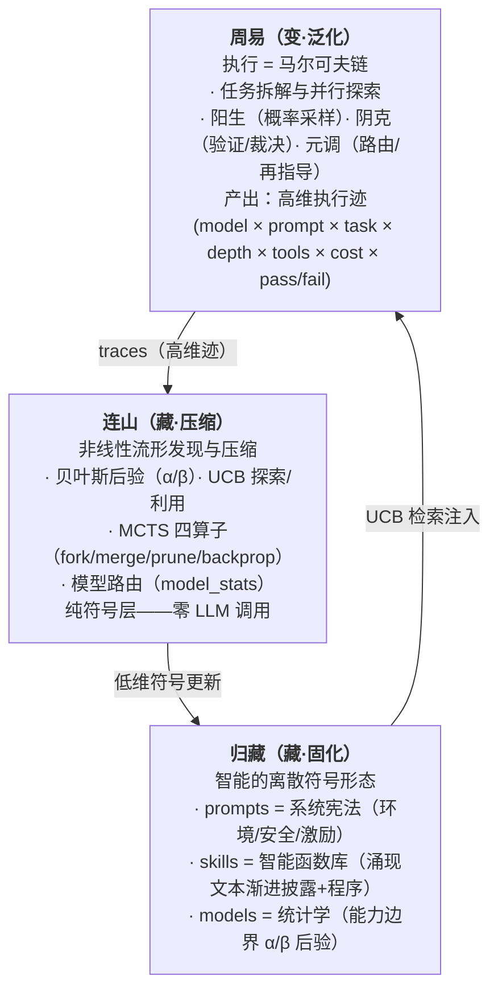

**泛化（Generalization）= 周易执行**：周易的每一次任务执行都是一次在高维概率空间中的蒙特卡洛 rollout。产生的是原始的高维迹（哪个模型 × 哪个 prompt × 什么任务类型 × 几层递归 × 用了什么工具 × 消耗多少 token × 通过还是失败）。这些迹的集合构成了非线性流形——某些 (model, prompt, task_type) 组合成功率高、某些低、某些在特定条件下涌现——但原始迹太稀疏太高维，无法直接用于指导下一轮执行。

**压缩（Compression）= 连山发现与压缩**：连山不是"后台数据挖掘"——它是**非线性流形上的压缩算子**。贝叶斯后验更新（α/β）把成功/失败迹压缩为二维信念分布；UCB 排序把多维 (tag × stats) 压缩为一维检索序；fork/merge/prune 把迹的散点聚类为资产变体树；model_stats 把 (model × tag × pass_rate × cost) 压缩为路由表。**所有压缩都是纯符号层的（零 LLM），压缩后的符号资产具有比原始迹低得多的维度、高得多的可复用性。**

**固化（Crystallization）= 归藏存储**：压缩后的智能以离散符号形态持久化——prompts（系统宪法）、skills（智能函数库）、models（统计学后验）各一个 YAML。它们不再是"文档"或"配置"，而是**智能的符号晶体**——曾经在某个 周易节点上验证过的涌现被固化为可复用的符号。

**赋能（Empowerment）= 归藏回注周易**：下一轮 周易执行时，Meta 通过 UCB 检索加载匹配当前任务的资产，编排为 system prompt（prompts）、Skill（verify 类）（verifications）、工具注册（skills），注入执行流。此时的 周易节点携带了历史上所有相关任务的压缩经验——它的上下文被**无限扩展**了（不是字节数，而是经验的维度）。

**这就是"压缩即智能"在 taiji 中的精确含义：智能的提升不是更好的 LLM，而是泛化-压缩循环的每一轮都让归藏符号系统积累更多可复用经验，从而让下一轮 周易的推理计算更精准、更省 token、更少失败。四维权重（pass/cost/rounds/quality）的持续增强是这个循环的可测量边界。**

### 1.5 产物契约与交接文件 (Artifact Contract & Handoff)

**执行事实是唯一记忆。** 跨层、跨时间传递的只有产出物（deliverables / task_output / 交接文件）。中间记忆（chat_history、meta_ctx 推理过程）只服务于本节点内部，不得向上传播、不作为结果的事实来源。

**产出即交接：** 每个瞬态 agent（概率拟合）结束时有且仅有三种去向——完成（写最终产出）、上下文超限（写交接产出）、失败/取消（写交接产出）。**交接物 = `deliverables/handoff.md`，是产出物之一**——YAML front matter 携带结构化字段（failure_reason / degraded / output_refs），正文为环境信息（进度 / 剩余工作 / 决策 / 约束状态）。置于 `deliverables/` 内保证**可发现性**：父层（parent_deliverables 注入）、同任务其他 agent（verify/converge 逐文件核验）、元校准（BACK_TO_META 读产出）全部经既有路径自动可见，**不引入新的查找机制**。产出物是递归拆解、恢复、路由判定、元校准的唯一输入物。**V30 会盟扩展**：兄弟贡品（同级子任务 deliverables/）跨兄弟公开可发现可读——分封时注入兄弟贡品索引（`YangPrompt.sibling_deliverables`），读取经既有 read 工具，不引入新查找机制（分封会盟见 `src/agents/yang.rs`）。

- **上下文窗口是单次拟合的采样空间，不是记忆仓库。** 上下文超限 = 采样空间装不下任务 = 任务粒度错误 = 编排失败的运行时硬证据 → 返回阳，阳基于产出文件递归分解
- **不做续聊压缩（特意设计）。** 压缩中间记忆塞回同一拟合的下一轮 = 污染新采样；**交接边界压缩**（收尾压成交接正文，§8.18）是**结束**本次拟合、留下干净事实、开启新拟合——边界压缩 ≠ 续聊压缩
- **阴（验证/收敛）基于产出核验**：YinAgent 只读产出文件与交接文件裁决，不消费对话过程
- **恢复 = 前一瞬态产出继承**：崩溃恢复从 `deliverables/`（含 handoff.md）重建，chat_history 仅作本节点断点续聊的最终兜底

### 1.6 第一性原理 (First Principles)

复杂事物由简单事物结构化组成。一个 YangAgent 可以执行也可以递归拆解（不需要两种类型）、一个 EngineContext 携带 task_dir 根节点和子节点用它做同一件事、一个 Task 结构在不同层代表不同粒度但不改变结构。

### 1.7 压缩态的归属：跨任务轴，非单任务纵深

> **V49 定论（取代旧「心流·消溶」，旧节作废）**：系统提示词（prompts）每轮都注入执行，不存在「深层消溶」——权重冻结（§1.3/§1.4，权重微调是模型厂家的事），递归加深只是同权重的反复采样，无「内化」通道。压缩态（文本教学 → 统计权重、迹 → 信念）只发生在**跨任务轴**（连山压缩 → 归藏固化 → 下轮周易检索注入），不在单任务深度轴展开。旧「心流」把跨任务积累错投到单任务纵深，且其关键机制（prompt 消溶）在冻结权重下不可成立。

### 1.8 类比与隐喻 (Analogies and Metaphors)

taiji 的核心理念植根于两个千年结构的统一：中国古典哲学中的变化与累积模型（周易·连山·归藏），以及现代概率算法（蒙特卡洛/贝叶斯推理/多臂老虎机）。

#### 1.8.1 周易 — 周易执行 · 蒙特卡洛方法

周易三相位循环与周易三爻、MCMC 三步之间的结构同构：

| 周易 (Zhouyi) | 周易递归树 | 现代算法 |
|---|---|---|
| **三爻** (初、中、上) | 三相位 (元Meta / 阳Yang / 阴Yin) | MCMC 三步：proposal → sampling → acceptance |
| **六爻** (重卦：两经卦相叠) | 两层递归 × 三相位 = 6 步执行路径 | 2-level Monte Carlo rollout |
| **八卦** (2³ = 8 种卦象) | 路由三分支 (PASS/BACK_TO_ZHOUYI/BACK_TO_META) 在递归树中展开 = 8 种拓扑路径 | MCTS 8-node search frontier |
| **变卦** (爻变产生新卦) | BACK_TO_ZHOUYI / BACK_TO_META → 子任务重入 → 路径分叉 | MCTS backpropagation + re-route |

周易的每一次循环（权重更新 → 概率拟合 → 因果验证 → 路由决策）就是周易中的一次"起卦"——系统在不确定性中做一次概率采样，然后由因果验证裁定吉凶（PASS / 回退）。递归树的展开就是 MCTS 的 selection → expansion → simulation → backpropagation 循环。

#### 1.8.2 连山 — 非线性流形压缩 · 非线性流形发现

"连山"意为连绵的山脉——**非线性流形的地形线**（别名「水书」，故兼山脊线（分）与水脉（流）两义，见 §6.0）。连山不是后台数据挖掘，而是发现高维执行迹空间中的"非线性流型"（哪些 (model × prompt × task × depth) 组合通往成功）并沿山脊线压缩。

| 连山操作 | 流形语义 | 现代对应 |
|---|---|---|
| **贝叶斯后验 (α/β)** | 每个资产在流形上的局部曲率估计（信念分布） | Beta-Bernoulli conjugate model |
| **UCB 排序** | 沿流形边界的探索-利用权衡（高均值 exploit / 高不确定 explore） | Upper Confidence Bound (bandit) |
| **fork** | 在山脊分叉处生成新假设路线 | MCTS expansion |
| **merge** | 相邻平行路线合并（同一山脊） | MCTS node merging |
| **prune** | 谷底路线终止（低回报 + 高变异） | MCTS pruning |
| **model_stats** | 全局地形概览（哪些模型擅长哪些任务类型） | Contextual bandit |

**连山的核心约束：纯符号层。** 所有压缩操作是确定性数学运算（贝叶斯公式 / UCB 不等式 / 统计聚合），不调用 LLM。连山不产生新内容——fork 的新资产内容是参数变体（strictness 档位），不是 LLM 生成的文本。内容演化留给人（手写种子资产）或经周易任务编译（从迹中编译可复用程序 + 程序说明书——**编译 = 一次周易任务执行，复用整个周易网络：阳 LLM 编程生成、阴符号复跑验证，见 §10；连山本体只做纯符号统计压缩，不含编译**）。

#### 1.8.3 归藏 — 符号固化 · 压缩即智能

"归藏"意为归藏万物——**万物（执行迹）经过压缩后归入符号仓库**。归藏不是知识库、不是 RAG、不是向量存储。它是**智能的离散符号形态（执行经验经压缩后的晶体化）**：

> **第一性原理（归藏的本体论地位）**：智能的本质是——在不确定环境中，把经验压缩成可预测、可行动的世界模型，并在行动中检验和修正它；更高阶的智能还要对模型和自身目标进行元层次监控与调整。非线性流形（LLM 权重）**本身就是现实世界因果关系的连续表征**——预训练把现实世界的因果结构压缩进权重，智能涌现正是流形（因果）被激活。LLM 的局限从来不是"不懂因果"，而是**不稳定**（涌现是概率性的）与**无法更新**（权重冻结）。归藏因此是**智能的离散符号形态**——与流形（连续形态）同构，都是因果结构的表征，但符号形态显式、可读写、可组合、稳定、可累积。**归藏储存的就是智能本身**，不是"触发智能的开关"。

| 归藏资产类型 | 压缩了什么 | 消费方 |
|---|---|---|
| **prompts/** | **系统宪法**——环境信息、安全约束、激励策略（种子文本起步，保证系统运行） | 元 (Meta) 检索 → Yang/Yin system prompt |
| **yin/skills/verify/** | 阴 Agent 的**成功验证判据**——哪些检查项在哪些任务上有效拦截了不合格产出 | SkillEngine（原 ContractEngine）机械执行 → LLM 裁决 |
| **models/** | 每个资产的**信念分布（α/β）**——该资产在历史上的通过/失败经验压缩为 Beta 分布 | UCB 排序 / 演化决策 |
| **skills/** | **智能程序**——新时代的可复用程序，非纯文本：`skill = 文本组件（提示词/知识）+ 程序组件（可复用程序/确定性工具）+ 工作流组件（编排）`。LLM 处理不确定（概率泛化）、程序处理确定（可靠执行）、工作流决定何时交给谁；**稳定性来自程序组件**（程序是锚点，锚定涌现不漂移），程序组件比例直接决定 skill 稳定度。四类别（orch 编排/exec 执行/verify 验证/converge 收敛），每个 Skill 含 `implementation`（机械可执行体）与 `stats`（演化统计）。强模型可容纳大 Skill（工作流），弱模型自动拆为原子片段 | SkillEngine 机械执行 + SkillRegistry → Rig Tool 注册 |

**每一个资产 = 一段曾经有效的执行经验的压缩投影。** 资产的 confidence（人工种子先验）→ stats 四维统计（连山回传）→ ModelAsset α/β（贝叶斯后验）→ 演化决策（fork/merge/prune）——这个生命周期就是"迹→压缩→固化→再执行→再迹"的循环在资产维度的体现。

#### 1.8.4 三位一体：周易·连山·归藏的统一

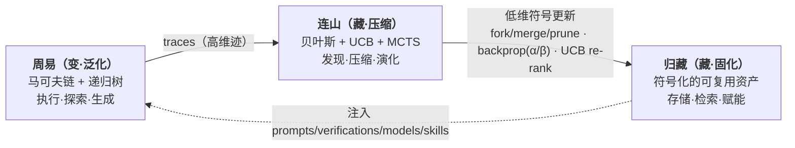

三者不是三个模块、五个层。它们是**同一股认知扭矩在三个时间尺度上的表达**：
- **周易** = 秒~分钟级的执行（单个 周易循环）
- **连山** = 分钟~小时级的压缩（任务结束后 backprop + evolve）
- **归藏** = 跨任务的持久积累（资产树的代际演化）

**异层同构的最终形态：周易递归任务树 (task tree) 与归藏资产变体树 (asset variant tree) 是同构的——fork = decompose、merge = converge、prune = FAIL 终止、backprop = child→parent 统计上浮。归藏不是"另一个系统"，它是 周易在符号层的压缩投影。BCP 人类可读的蓝图协议也将被压缩为 skills（太极项目式标准化可复用程序），最终反作用于单任务节点的执行效率——完成压缩-泛化的完整闭环。**

---


---
## 2. 系统概览

### 架构总纲

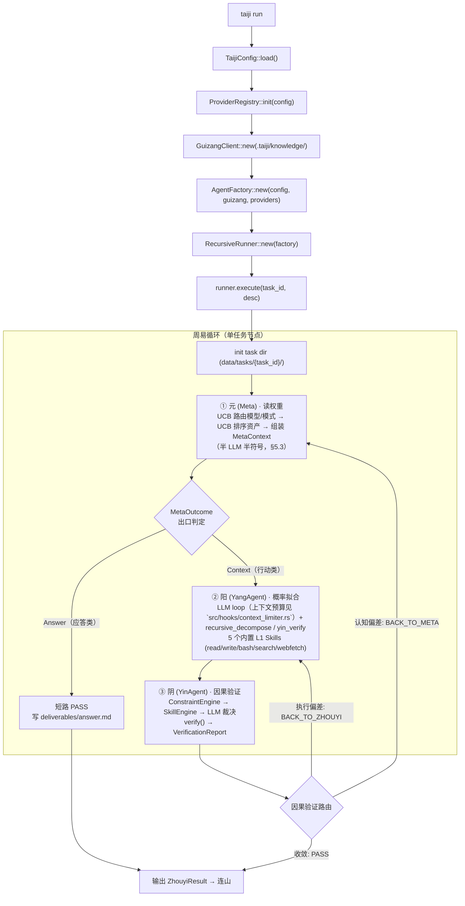

---


---

---
## 周易与连山的关系

周易、连山、归藏是同一泛化-压缩循环的三个相（§1.4），不是两个模块之间的接口。

### 三位一体：周易·连山·归藏

| 相 | 代码中的体现 | 方向 | 语义 |
|------|------|------|------|
| **周易）** | `RecursiveRunner` + `ZhouyiCycle` + `YangAgent`/`YinAgent`/`Meta` | 前向·泛化 | 执行马尔可夫链——每次任务 = 一次蒙特卡洛 rollout，产生高维迹 |
| **连山（连山）** | `lianshan` + `cognition_evolver` + `ModelRouter` | 反向·压缩 | 非线性流形发现——把高维迹压缩为低维符号更新（α/β、UCB 排序、fork/merge/prune） |
| **归藏（存储）** | `GuizangClient` + `knowledge/` 资产树 | 固化 | 低维符号持久化——yang/yin 阴阳对偶 + manifold 迹拓扑 + skills 标准化程序 + models 贝叶斯后验 |

同一棵资产树：周易在树上前向消费（检索注入），连山在树上反向压缩（统计回传），归藏是树的持久态。

### 权限关系（周易只读 · 连山单写者）

- **周易）执行期只读归藏**——任何 Agent（Meta / Yang / Yin / SkillEngine）不得写资产
- **连山是唯一写者**（单线程后台任务，`--with-lianshan` 激活），写路径 = pending / experiments 队列
- **资产共享**：任务内所有 Agent 共享同一根级资产树（V44 去分区化）；`MetaContext.model` 是模型选择载体，仅影响路由与统计回传键，不产生资产副本

### 数据流：归藏 → 周易（前向 · 检索注入）

```
ModelRouter（读 model_stats 元权重表，纯符号层）
  → 归藏根级检索
  → UCB 排序（利用 + 探索，§6.2）
  → 元 (Meta) 半 LLM 半符号（LLM 语义层产 task_type tags + 难度先验 → 符号统计层路由模型 + 路由模式 + UCB 排序资产 → 选择 system prompt → 组装 MetaContext）
  → MetaContext { mode, model, assets_used, prompts } 注入 Yang / Yin
另外两路只读消费：
  → SkillEngine 加载 yin/skills/verify/ 机械验证（SkillEngine 见 `src/orchestration/skill_engine.rs`）
  → ConstraintEngine L0 输出健全性检查（内置硬编码，Hard 短路）
```

### 数据流：周易 → 连山（反向 · 统计回传）

```
周易 PASS
  → enqueue_lianshan_pending（pending/{task_id}.json：assets_used + checks + passed + model_key）
  → 连山消费（单写者，指数退避轮询）
  → backprop：频率四维（n / pass_count / cost / rounds / quality）+ 贝叶斯后验（α/β，§6.2.1）
  → evolve_contracts：fork / merge / prune 四算子（verifications 与 prompts 对称）
  → model_stats 更新（元权重表，模型路由数据源）
  → 下轮周易自动加载更新后的认知偏置（藏 → 变）
```

### 主动学习（连山 → 周易 反向触发）

空闲窗口（pending 空 + 预算内）→ Lianshan 选 UCB 探索分最大的活跃变体资产 → 写入 `experiments/` 队列 → Zhouyi runner 执行模板化探索任务（Execution / 最小预算 / 不递归）→ SkillEngine 机械验证变体契约 → SkillResult 回传 pending → Lianshan 更新。护栏：探索任务不产生新探索任务，学习环有界（§6.2）。

### 触发链时序

```
周易执行（只读归藏）→ 产出 deliverables / trace / verify_state
  → PASS 入队 pending ──→ 连山压缩算子 回传（backprop → evolve → model_stats）
  → 资产版本++（根级写入）──→ 下轮 元 (Meta) 检索到新资产 → 周易行为被引导
```

---

## 一、周易执行层架构图

> 周易 = 泛化执行。以下为执行层的架构图（模块图 / 类型契约图 / 执行序列图）。模块职责、接口契约、运行时布局等**实现事实**见 `AGENTS.md`。

## 3. 模块架构

### 七层模块图

```mermaid
flowchart TB
    subgraph "L6 入口"
        MAIN["main.rs — clap CLI"]
    end

    subgraph "L5 MCP"
        MCP_SRV["mcp/server.rs — 暴露 taiji 工具"]
        MCP_CLI["mcp/client.rs — 消费外部 MCP 工具"]
    end

    subgraph "L4 编排"
        RUNNER["runner — RecursiveRunner (薄包装)"]
        CONST["constraint_engine — ConstraintEngine"]
        CONTRACT["skill_engine — SkillEngine"]
        TRIG["trigger_engine — SkillTriggerEngine"]
        WORKER["worker_pool — WorkerPool"]
        Lianshan["lianshan — 连山压缩算子 (后台，可激活)"]
    end

    subgraph "L3 Agent"
        FACTORY["factory — AgentFactory (中枢)"]
        META_B["meta — 元 (Meta) 构建器"]
        FIT_B["yang — YangAgent 构建器"]
        YIN_B["yin — YinAgent 构建器"]
        PLAN_B["plan — PlanBuilder (预演编排)"]
        CHAT_B["chat — ChatAgentBuilder (聊天面板)"]
        TOOLS["tools/ — recursive_decompose, yin_verify"]
    end

    subgraph "L2 Hook"
        SAFETY["safety — ToolSafetyGuard (AgentHook)"]
        TRACE_H["trace — TraceHook (AgentHook)"]
    end

    subgraph "L1 基础设施"
        PROVIDER["provider — ProviderRegistry"]
        GUIZANG["knowledge — GuizangClient (文件系统读写)"]
        CONFIG["config — TaijiConfig"]
        ERR["error — TaijiError"]
        TRACE_W["trace — TraceWriter (JSONL)"]
        TSPEC["task_spec — TaskSpec 解析"]
    end

    subgraph "L7 前端"
        WEB["taiji-web React App (浏览器)"]
    end

    subgraph "L6 实时事件 + HTTP"
        WS_SRV["ws/server.rs — WebSocket 事件推送 + 请求响应"]
        WS_HANDLER["ws/handler.rs — 客户端请求分发"]
        WS_TYPES["ws/types.rs — TaskTreeSnapshot / ZhouyiPhaseState / ClientMessage / ServerResponse"]
        HTTP_SRV["main.rs serve — axum HTTP 静态托管 (dist/)"]
    end

    subgraph "L0 基础类型"
        TYPES["types/ — task, agent, verification, execution, frontend"]
    end

    MAIN --> CONFIG & RUNNER
    RUNNER --> FACTORY
    FACTORY --> PROVIDER & GUIZANG & TRIG & TYPES
    FACTORY --> META_B & FIT_B & YIN_B & PLAN_B
    FIT_B --> TOOLS & SAFETY & TRACE_H
    TOOLS --> FACTORY
    META_B --> GUIZANG
    YIN_B --> CONST
    YIN_B --> CONTRACT
    连山 --> GUIZANG
    MCP_SRV --> FACTORY
    MCP_CLI --> FIT_B
    WS_SRV --> RUNNER & FACTORY & TYPES
    WS_HANDLER --> FACTORY & TYPES
    WS_HANDLER --> CHAT_B
    CHAT_B --> FACTORY
    CHAT_B --> SAFETY
    WEB --> WS_SRV
    HTTP_SRV --> WEB
```

---
## 4. 核心类型契约

```mermaid
classDiagram
    class Task {
        +id: String
        +description: String
        +depth: u32
        +status: TaskStatus
        +parent_id: Option[String]
        +subtask_ids: Vec[String]
    }

    class SubtaskSpec {
        +description: String
        +verification_spec: String
        +mode: AgentMode
        +context: Value
        +rerun_of: Option[usize]
    }

    class DecomposeResult {
        +summary: String
        +status: ConvergenceStatus
        +subtask_count: u32
        +deliverables: Vec[String]
        +task_id: String
        +rounds: u32
        +tools_used: Vec[String]
    }

    class ZhouyiResult {
        +task_id: String
        +content: String
        +tools_used: Vec[String]
        +deliverables: Vec[String]
        +depth: u32
        +rounds: u32
    }

    class MetaOutcome {
        %% V46 元双出口：Context(MetaContext)=完整循环 / Answer(String)=短路 PASS
        <<enum>>
        Context
        Answer
    }

    class MetaContext {
        +constraints: Vec[TruthConstraint]
        +matched_skills: Vec[SkillRef]
        +yang_prompt: YangPrompt
        +mode: AgentMode
        +model: Option[ModelKey]  %% 元权重模型路由结果 (None=配置默认)
        +verify_model: Option[ModelKey]  %% V37 异源裁判：Yin 专用验证模型 (None=继承主模型)
        +assets_used: Vec[AssetRef]  %% 本次编排选用的资产引用（连山回传依据）
        +degraded: Option[String]  %% V32 编排降级原因（审计可见）
        +yang_system_prompt: Option[String]
        +verify_system_prompt: Option[String]
        +converge_system_prompt: Option[String]
    }

    class AgentMode {
        <<enum>>
        Orchestration
        Execution
    }

    class PromptAsset {
        +asset_type: String
        +layer: u32
        +id: String
        +name: String
        +description: String
        +tags: Vec[String]
        +confidence: f64
        +version: u32
        +content: String
        +agent_target: String
        +temperature: Option[f32]
        +usage_count: u32
        +success_rate: f64
        +env_tags: Vec[String]  %% 环境维度 (空=环境无关)
        +parent_id: Option[String]  %% fork 来源 (None=根资产)
        +variant_of: Option[String]  %% 同源变体组
        +stats: AssetStats  %% MCTS 统计（回传写入，serde default 零迁移）
    }

    class SkillAsset {
        %% V45 统一 Skill（A2A 兼容层 + taiji 演化层，字段契约见 `src/infra/knowledge.rs`）
        +id: String
        +name: String
        +description: String
        +tags: Vec~String~
        +examples: Vec~String~
        +inputModes: Vec~String~  %% [text] | [json] | [both]
        +outputModes: Vec~String~
        +category: SkillCategory  %% 目录推导优先
        +dual: String  %% 对偶 id（合并视图域校验）
        +implementations: Vec~SkillImpl~
        +agent_target: String
        +confidence: f64
        +version: u32
        +status: String
        +stats: AssetStats
        +env_tags: Vec~String~
        +parent_id: Option~String~
        +variant_of: Option~String~
    }

    class SkillImpl {
        %% 机械可执行体（阳 = builtin 引用；阴 = 机械判据）
        +kind: SkillKind
        +target: String
        +params: Value
        +severity: CheckSeverity
        +pass_condition: String
    }

    class SkillKind {
        <<enum>>
        %% TraceConsistency（断言引用完整性）+ V45 阳 kind
        FileExists
        SchemaValid
        ReferenceResolves
        CommandSucceeds
        LlmJudgement
        TraceConsistency  %% [证据: 工具名] 引用 → trace 工具调用存在性
        Bash
        Write
        Read
        Search
        Webfetch
        RecursiveDecompose
    }

    class SkillResult {
        %% 契约执行记录（随 verify_state.json 持久化）
        +check_id: String
        +kind: CheckKind
        +passed: bool
        +detail: String
        +duration_ms: u64
    }

    class SkillReport {
        %% SkillEngine 输出（注入 verify LLM prompt）
        +passed: bool  %% 任一 hard 项失败 → false
        +results: Vec[SkillResult]
        +summary: String
    }

    class SkillResult {
        %% Skill 执行统一返回类型——与 AssetStats 四维同构
        +skill_id: String
        +category: SkillCategory
        +kind: SkillKind
        +passed: bool
        +detail: String  %% 机械判定证据（文件存在/退出码=0/grep命中），禁止LLM语义推测
        +duration_ms: u64
        +cost_tokens: u64
        +verify_rounds: u32
        +quality: f64
    }

    class SkillEngine {
        %% 确定性 Skill 执行器（零 LLM，纯机械）
        +execute(category: SkillCategory, task_dir: Path, guizang: GuizangClient): SkillReport
        -load_skills(category): Vec~SkillAsset~
    }

    class SkillReport {
        %% SkillEngine 输出（注入 verify/converge LLM prompt）
        +passed: bool
        +results: Vec~SkillResult~
        +summary: String
    }

    class SkillCategory {
        <<enum>>
        Orch
        Exec
        Verify
        Converge
    }

    class SkillRef {
        +id: String
        +name: String
        +tool_name: String
        +match_weight: f64
    }

    class YangPrompt {
        +task_description: String
        +constraint_summaries: Vec[String]
        +parent_deliverables: Vec[String]
        +sibling_deliverables: Vec[String]  %% V30 会盟：兄弟贡品索引（serde default 空）
    }

    class TruthConstraint {
        +id: String
        +name: String
        +description: String
        +severity: ConstraintSeverity
        +justification: Option[String]
    }

    class ConstraintSeverity {
        <<enum>>
        Hard
        Soft
    }

    class VerificationReport {
        +route: VerificationRoute
        +confidence: f64
        +summary: String
        +constraint_violations: Vec[String]
    }

    class ConvergenceDecision {
        +status: ConvergenceStatus
        +task_summary: String
    }

    class ExternalContext {
        +files: Vec[ExternalFile]
        +tool_results: Vec[ExternalToolResult]
        +session_summary: Option[String]
    }

    class ExternalFile {
        +path: String
        +content: String
    }

    class ExternalToolResult {
        +tool: String
        +output: String
    }

    class EngineContext {
        +task_id: String
        +depth: u32
        +task_dir: PathBuf
        +cycle: u32
        +round: u32
        +context_dir: Option[PathBuf]
    }

    class VerificationRoute {
        <<enum>>
        Pass
        BackToZhouyi
        BackToMeta
    }

    class PlanSummary {
        +task_analysis: String
        +estimated_subtasks: Vec[SubtaskPlan]
        +recommended_skills: Vec[String]
        +expected_deliverables: Vec[String]
        +estimated_complexity: String
        +matched_prompts_summary: String
        +relevant_constraints: Vec[String]
    }

    class SubtaskPlan {
        +description: String
        +verification_approach: String
        +required_skills: Vec[String]
    }

    class ExplainReport {
        +task_id: String
        +description: String
        +status: String
        +total_cycles: u32
        +total_rounds: u32
        +total_depth: u32
        +total_duration_ms: u64
        +timeline: Vec[PhaseSummary]
        +decisions: Vec[DecisionSummary]
        +final_deliverables: Vec[String]
        +summary: String
    }

    class PhaseSummary {
        +phase: String
        +cycle: u32
        +round: u32
        +depth: u32
        +duration_ms: u64
        +tools_used: Vec[String]
        +key_output: String
    }

    class DecisionSummary {
        +cycle: u32
        +round: u32
        +verdict: String
        +reason: String
        +constraint_violations: Vec[String]
    }

    class ConvergenceStatus {
        <<enum>>
        Converged
        Partial
        Diverged
    }

    class AssetStats {
        %% serde default 零迁移
        +n: u64  %% 采样次数
        +pass_count: u64
        +cost_tokens_sum: u64  %% trace usage.input_tokens 累加
        +cost_tokens_sq_sum: u64  %% 增量方差
        +quality_sum: f64  %% 质量分累加
        +verify_rounds_sum: u64  %% BACK_TO_ZHOUYI 次数
        +avg_reward(): f64
        +pass_rate(): f64
    }

    class AssetRef {
        +id: String
        +asset_type: String  %% prompt|verification
    }

    class ModelStats {
        %% ·元权重表
        +rows: BTreeMap[(ModelKey × Tag), StatsRow]
        %% StatsRow: n / pass_count / cost_sum / quality_sum
    }

    class ModelRouter {
        %% ·bandit 路由
        +route(tag, task_desc) -> ModelKey
        %% UCB: avg_reward + C·√(ln N_total / N_model_tag)；成本感知：贵模型需通过率显著更高
    }

    class UcbRanker {
        %% 
        +rank(candidates: Vec[AssetNode], c: f64 = 1.414) -> Vec[AssetNode]
        %% score = avg_reward + C·√(ln N_total / N_node)；N=0 → 最大探索分
    }

    MetaContext --> TruthConstraint : contains
    MetaContext --> SkillRef : contains
    MetaContext --> YangPrompt : contains
    MetaContext --> AgentMode : decides
    MetaContext --> ModelRouter : routes
    PromptAsset --> AssetStats : tracks
    SkillAsset --> AssetStats : tracks
    SkillAsset --> AssetStats : tracks
    ModelRouter --> ModelStats : reads
    UcbRanker --> AssetStats : ranks
    SkillEngine --> SkillAsset : loads
    SkillEngine --> SkillSpec : executes
    PlanSummary --> SubtaskPlan : contains
    ExplainReport --> PhaseSummary : contains
    ExplainReport --> DecisionSummary : contains
    PlanBuilder ..> PlanSummary : produces
    ZhouyiResult ..> ExplainReport : analyzed by
```

---


---
## 5. 周易执行流

### 5.1 根任务执行序列

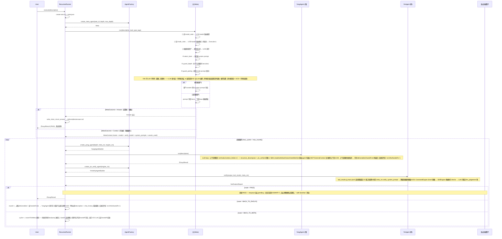

### 5.2 递归分解序列

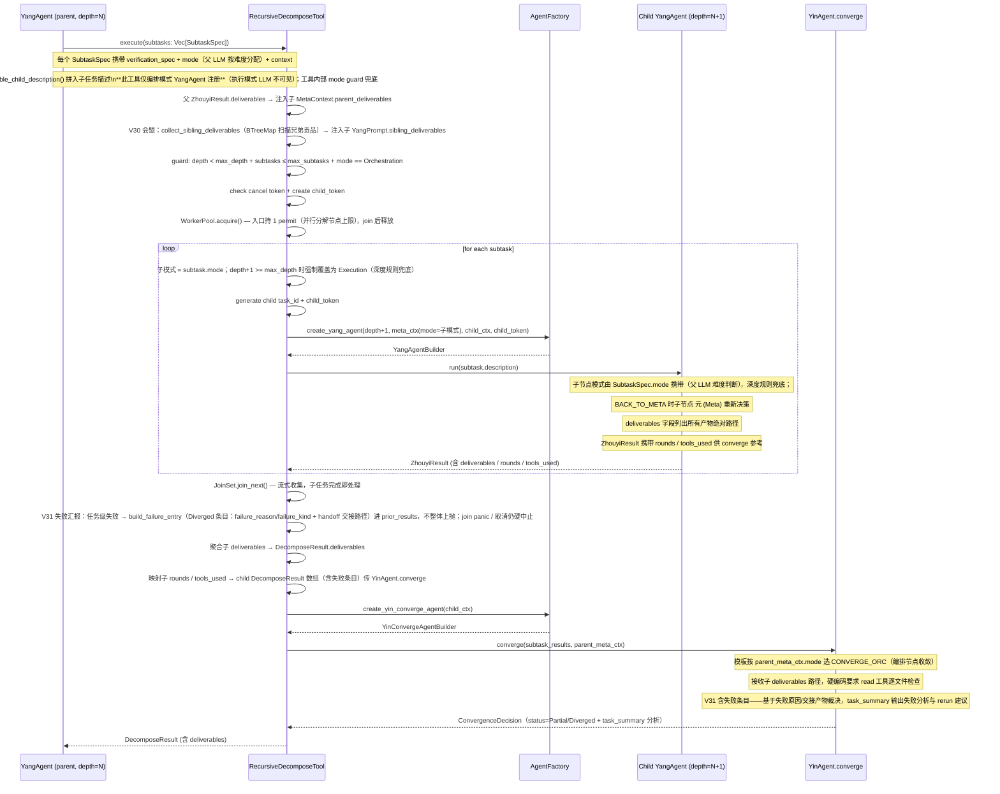


---

### 5.3 元相位（Meta）设计 — 半 LLM 半符号 + 短路出口

> **状态：蓝图（V46），未落地。** 当前实现是 V32 的 LLM 编排（`src/agents/meta.rs`）。元 = **半 LLM 半符号的认知节点**（LLM 语义层 + 符号统计层永久融合），并作为**可能的出口相**——世界模型命中（应答类任务）时短路阳阴直接产出。符号统计层详细设计见下（五层函数架构 = 元的一半）；LLM 语义层负责任务种类判断（description → task_type tags）、难度先验、资产语义粗筛、知识应答。

**元 = 半 LLM 半符号统计拟合的认知节点**：

```
元 = LLM 语义层（先验，恒在） + 符号统计层（后验，渐强）

description → [LLM 语义层] → task_type tags + 难度先验
                              ↓
tags → [符号统计层] → 检索 + UCB 精排 + guard + 组装 → MetaContext
```

- **LLM 语义层**：任务种类判断（description → task_type tags）、难度先验、
  资产语义粗筛、知识应答/交互讨论。tags 是统计层的键空间来源——语义分类
  不可符号化，元离不开 LLM。
- **符号统计层**：模型路由、模式路由、资产精排（UCB）、guard 公理、组装。
  全部是文件读取 + 数学运算（贝叶斯后验 × UCB bandit × 字符串选择）。
- **融合关系**：LLM 判断 = 先验，统计 = 后验，贝叶斯融合永久并存（非时间切换）。

**短路（元是可能的出口相）**：

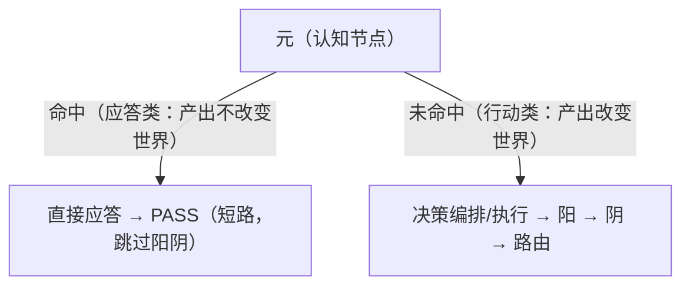

短路验证规则：**符号校验保底（引用真实性，ReferenceResolves 机械判据）+
交互判断兜底（用户/父节点裁定）**；阴不做语义验证（LLM 验证 LLM = 同源概率
回路，§1.3 禁区）。

**符号统计层（元的一半）= 在归藏资产空间上的纯符号函数复合**：

```
Meta = compose_context ∘ select_best ∘ rank_assets ∘ list_assets ∘ resolve_root
            ────────────────────────────────────────────────────────────────────────
            五个核心态射，一个 compose，零 LLM。（route_model / route_mode 为前置
            bandit 决策，guard_depth / guard_pairing 为逻辑层公理校验，不计入复合链）
            每个函数是归藏资产空间上的一个态射 (morphism)，组合态射 = 元相管线。
```

#### 五层函数架构（符号统计层，Palantir 范式）

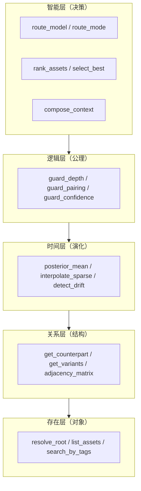

#### 存在层：解析对象空间

```rust
// f: Task × Guizang → Guizang（V44：根级资产树，无分区派生）
// 集合论映射：任务标签 → 统计检索
fn resolve_root(task: &Task, guizang: &Guizang, model_stats: &ModelStats) -> Guizang {
    let _model_key = route_model(model_stats, &task.tags); // 统计键（路由依据），资产树共享
    guizang.clone()
}

// 幂集过滤：Set<Asset> × Predicate → Subset
fn list_assets(guizang: &Guizang, tags: &[Tag]) -> Vec<Asset> {
    guizang.search_by_tags(tags)
        .filter(|a| guard_confidence(a))  // confidence ≥ 0.3
        .collect()
}
```

#### 关系层：对象间连接

```rust
// 邻接矩阵：变体树的有向边
// A[i][j] = 1 iff asset_j.variant_of == asset_i.id
// A^k 给出 k 跳可达资产——检索时扩展候选、merge 算子发现近邻
fn adjacency_matrix(assets: &[Asset]) -> SparseMatrix;

// 阴阳对偶：二分图 YangAsset ↔ YinAsset
fn get_counterpart(yang: &PromptAsset, guizang: &Guizang) -> Option<VerificationAsset>;

// 贝叶斯后验关联：每个资产 → 同名 ModelAsset (α, β)
fn get_posterior(asset: &Asset, guizang: &Guizang) -> BetaDistribution;
```

#### 时间层：统计演化

```rust
// 后验均值 μ = α/(α+β)
fn posterior_mean(asset: &Asset, models: &[ModelAsset]) -> f64;

// 稀疏插值：n < n_min 时向上聚合（贝叶斯收缩向父级先验）
// 层级： (model, task_type, depth, mode) → (model, task_type, mode) → (model, *, mode) → 全局
fn interpolate_sparse(stats: &AssetStats, parents: &[&AssetStats], n_min: usize) -> f64;

// 漂移检测：最近 k 个窗口 pass_rate 持续下降 → 触发 fork 或人工审查
fn detect_drift(trajectory: &[AssetStats]) -> Option<DriftAlert>;
```

#### 逻辑层：公理约束（不可违反）

```rust
// 公理: depth >= max_depth ⇒ mode = Execution
// 叶子节点编排必失败——符号层强制兜底，LLM 不可翻案
fn guard_depth(depth: u32, max_depth: u32, mode: AgentMode) -> AgentMode {
    if depth >= max_depth && mode == Orchestration {
        warn!("axiom violation: leaf node cannot orchestrate — forcing Execution");
        Execution
    } else { mode }
}

// 公理: Orchestration ⇒ converge_prompt 非空；Execution ⇒ verify_prompt 非空
// 模式与提示词不配对 → degraded 标记（不中断，下游有降级模板兜底）
fn guard_pairing(mode: AgentMode, ctx: &MetaContext) -> ConsistencyCheck;

// 公理: confidence ≥ 0.3 → 通过；confidence < 0.3 → 不进入候选集
fn guard_confidence(asset: &Asset) -> bool {
    asset.confidence >= 0.3
}
```

#### 智能层：决策函数（全部 UCB bandit）

```rust
/// 模型路由：ModelStats → ModelKey
/// UCB: score = μ + C·√(ln N_total / (n+1))
fn route_model(stats: &ModelStats, tags: &[Tag]) -> ModelKey {
    candidates(stats, tags)
        .map(|(key, row)| (key, row.ucb_score()))
        .max_by(|a, b| a.1.total_cmp(&b.1))
        .map(|(k, _)| k)
        .unwrap_or_else(default_model)  // 全部无统计 → 默认
}

/// 模式路由：ModeStats → AgentMode
/// 同 UCB 公式。冷启动全部 n=0 → 最大探索分轮流尝试；
/// 先验偏置：深层(>70% max_depth)降低 Orchestration 先验 μ。
/// 统计源：(model_key, task_type_tag, depth) → PASS/FAIL
fn route_mode(stats: &ModeStats, model: &ModelKey, tags: &[Tag], depth: u32) -> AgentMode {
    candidates(stats, model, tags)
        .map(|(mode, row)| {
            let μ = row.pass_rate();
            let depth_penalty = if mode == Orchestration && depth as f64 / MAX_DEPTH as f64 > 0.7 {
                -0.05
            } else { 0.0 };
            (mode, μ + depth_penalty + UCB_C * sqrt(ln(N_total) / (row.n + 1.0)))
        })
        .max_by(...)
        .unwrap_or(Execution)  // 冷启动保守默认
}

/// 资产 UCB 排序（与资产检索共用 bandit 机制，§6.3）
fn rank_assets(assets: &[Asset], models: &[ModelAsset]) -> Vec<RankedAsset>;

/// 从排名列表选择最佳匹配
fn select_best(ranked: &[RankedAsset], target: AgentTarget, mode: AgentMode) -> Option<Asset> {
    ranked.iter()
        .find(|r| r.agent_target == target && r.matches_mode(mode))
        .map(|r| r.asset)
}
```

#### 顶层组合：compose_context

```rust
/// 元相管线 = 五个核心态射的复合（route_*/guard_* 为前置决策与校验，不计入复合链）
fn compose_context(
    task: &Task,
    guizang: &Guizang,
    model_stats: &ModelStats,
    mode_stats: &ModeStats,
) -> MetaContext {
    // 1. 存在层
    let model_key = route_model(model_stats, &task.tags);
    let root = resolve_root(guizang, &model_key);
    let assets = list_assets(&root, &task.tags);

    // 2. 时间层 + 智能层
    let models = root.load_all_models();
    let ranked = rank_assets(&assets, &models);

    // 3. 智能层
    let mode_raw = route_mode(mode_stats, &model_key, &task.tags, task.depth);
    let mode = guard_depth(task.depth, task.max_depth, mode_raw);

    let ctx = MetaContext {
        model: model_key,
        mode,
        yang_system_prompt:  select_best(&ranked, YangAgent, mode)?.content,
        verify_system_prompt:   select_best(&ranked, YinAgent, Verify)?.content,
        converge_system_prompt: select_best(&ranked, YinAgent, Converge)?.content,
        temperature:            select_best(&ranked, YangAgent, mode)?.temperature,
        assets_used:            ranked.iter().map(AssetRef::from).collect(),
        ..MetaContext::empty()
    };

    // 4. 逻辑层
    let check = guard_pairing(mode, &ctx);
    if check.is_degraded() {
        ctx.degraded = Some(check.reason);
    }

    ctx
}
```

#### 路由分层（保持）

模型路由分三级，各级独立决策、低级继承高级默认。元**半 LLM 半符号**后，路由的**决策选择**由符号层 bandit 驱动（LLM 语义层保留——task_type tags / 难度先验仍由 LLM 产出）：

- **任务级**：`route_model(model_stats, task.tags)` → `MetaContext.model`，全任务共享根级资产树（§10.1）
- **相位级（异源裁判）**：`MetaContext.verify_model` 经 `ModelRouter.route_verifier` 决策（候选 <2 → None 继承）；异源裁判开关 `runtime.model_routing.heterogeneous_verifier`（默认 false）
- **子任务级**：`SubtaskSpec.model`（serde default，None = 继承父）——父 LLM 拆解时可按难度分配模型；`RecursiveDecomposeTool` 经 `apply_subtask_model` 覆盖子 `MetaContext.model`
- 资产共享：所有相位/子任务使用同一根级资产树（模型维度仅影响统计键）

#### 降级路径

| 条件 | 行为 |
|------|------|
| 无匹配资产（list_assets 空） | `yang/verify/converge_system_prompt` 全部 None，mode 保持路由结果；下游 Agent 按 mode 用硬编码 Base 模板 |
| mode_stats 全空（冷启动） | `route_mode` 返回 Execution（保守默认） |
| model_stats 损坏 | `route_model` 返回配置默认模型，warn |
| guard_pairing 检测不配对 | degraded 标记，不中断（下游有降级模板兜底） |
| guard_depth 触发 | 强制覆写 mode=Execution，warn |

#### 与 LLM 的关系

元**半 LLM 半符号**：LLM 语义层负责任务种类判断（description → task_type tags）、难度先验、资产语义粗筛、知识应答；符号统计层做决策选择（Meta 只读归藏统计，UCB bandit + guard 公理）。分工本质：**LLM 做语义理解（先验），符号做统计拟合（后验）**——两者贝叶斯融合永久并存。LLM 还用于**丰富归藏**（YangAgent 执行 → 连山压缩 → 资产演化）。

> **澄清（防误读）：半 LLM 半符号 ≠ 完全去 LLM。** 元从 V32「全 LLM 编排」演进到 V46「半 LLM 半符号」，剥离的只是**决策选择**（模型/模式路由、UCB 资产精排、guard 公理）——这些是确定性的统计拟合；**语义判断（task_type tags、难度先验、知识应答）永久留在 LLM**——语义分类不可符号化，元离不开 LLM。

#### 下游消费规则（不变）

| Agent | 方法 | 优先级 | 降级 |
|-------|------|--------|------|
| YangAgent | `build_system_prompt()` | `meta_ctx.yang_system_prompt` → `Some` 时直接返回 | 按 `meta_ctx.mode` 选编排/执行 Base 模板 |
| YinAgent.verify | `verify(...)` | `meta_ctx.verify_system_prompt` → 作为 system prompt | 按 `meta_ctx.mode` 选 VERIFY_ORC / VERIFY_EXEC Base 模板 |
| YinAgent.converge | `converge(...)` | `meta_ctx.converge_system_prompt` → 作为 system prompt | 按 `meta_ctx.mode` 选 CONVERGE_ORC / CONVERGE_EXEC Base 模板 |


---
## 二、连山压缩算子设计

> 连山 = 非线性流形发现与压缩，纯符号层零 LLM。以下为设计（哲学 / 同构映射 / UCB / MCTS）。实现细节（贝叶斯后验、激活条件、MVP 路径）见 `AGENTS.md`。

## 6. 连山压缩算子

> 连山 = 非线性流形上的压缩——把周易高维执行迹映射为归藏低维符号资产。纯符号层，零 LLM 调用。

### 6.0 连山哲学

连山不是"后台数据挖掘"或"离线训练"。它是**周易任务树在符号空间的压缩投影算子**。周易的每次执行产生高维迹 (model × prompt × task × depth × tools × cost × pass/fail)，连山把这些迹压缩为：

| 压缩操作 | 输入（高维迹） | 输出（低维符号） | 消费方 |
|------|------|------|------|
| **贝叶斯后验** | 某资产在 N 次任务中的 PASS/FAIL | α/β 双参数（Beta 分布） | UCB 排序 / 演化决策 |
| **四维 backprop** | trace 的 usage.input_tokens + verify_state + route×confidence | AssetStats（n/pass_count/cost/rounds/quality） | 演化阈值判定 |
| **UCB 排序** | 候选资产列表 + ModelAsset 后验 | score = μ + C·√(ln N/(n+1)) 排序 | 元 (Meta) 检索注入 |
| **fork** | 根资产 + 低通过率信号 | 新变体资产（strictness 参数化，id=`{root}-v1`） | 下次检索时作为新候选 |
| **merge** | 两个通过率无显著差异的近邻变体 | 合并为单个资产（stats 加权合并） | 减少冗余 |
| **prune** | N≥5 且 μ < best_μ − 2σ 的变体 | status="pruned" | 淘汰低效路径 |
| **模型路由** | (model_key × tag) 的多维统计 | UCB bandit 选择最佳模型 | 元 (Meta) 根级统计检索 |

**连山的三个特征：**
1. **纯符号层**：所有操作是确定性数学运算（贝叶斯公式 / UCB 不等式 / 统计聚合 / 阈值比较），不调用 LLM
2. **不产生新内容**：fork 的新资产内容是参数变体（strictness 档位），不是 LLM 生成的文本。内容演化留给人类种子资产或未来 SkillCompiler
3. **单写者**：连山是归藏的唯一写者。周易执行期间归藏只读，任务结束后连山回传更新

**连山的双重几何（山脊线 × 分水线，水蚀互塑）**：连山易别名「水书」——连山不只是山，也是水。从人的视角，连山是两条线的合体：

| 几何线 | 视角 | 语义 | 设计对应 |
|------|------|------|------|
| **山脊线** | 天空 ↔ 山脉的分解线 | **参照系**——测量统计：把高维迹定位到低维坐标 | 贝叶斯后验 α/β、UCB 排序、model_stats 路由表 |
| **分水线** | 水流的分离线 | **流型载体**——迹沿此线分流、汇合、演化 | fork / merge / prune / backprop 四算子 |

山脊线是「分」（分解 · 测量 · 定位），分水线是「流」（分流 · 演化 · 载体）。但两者非静动二分——**水流通过水蚀法塑造山脉**：迹（流）经 backprop + evolve 持续重塑资产树（山），山又经检索注入 + UCB 路由引导后续流。山导流（前向），流蚀山（反向），同一棵树上的双向耦合。

由此：**复杂任务系统的本质是持续变化的循环事件系统**——每次周易执行是一个事件（一次 rollout 迹），连山压缩 + 归藏固化把事件沉淀为参照系的变化，变化后的参照系又引导下一次事件。系统没有静态层，只有循环中不断重塑自身的流与山。

**连山的本质（目的论：迹 → 蓝图 → skills → 新迹）**：周易的任务轨迹是一棵发散又收敛的树（decompose 发散 / converge 聚合 / FAIL prune / backprop 上浮）——一股散开又聚合的水流。在 agent 任务层级，**非线性流型** = 周易运行成功后的马尔可夫链（model × prompt × task × depth × tools × cost × pass/fail）+ 相关归藏运用（assets_used）+ 数据流（任务上传下达 parent/sibling_deliverables + 产出物 deliverables/handoff）。

连山收集这些高维迹 → 拓扑压缩为**蓝图文件**（`manifold/` 迹拓扑，契约见下）→ 经编译固化为**标准 skills**（编译 = 一次周易任务执行，复用整个周易网络——阳 LLM 编程生成程序+说明书、阴符号复跑验证，见 §10 标准化 Skills）→ skills 回注新任务 → 新任务迹再被编译为新 skill——**不断扩张 LLM 智能，实现持续学习 + 可审计（git 版本控制）/ 可溯源（trace + backprop）/ 可解释（符号化）的 AI 操作系统**。

连山的测量/统计能力同时优化用过的归藏资产：**任务级损伤函数**（§6.3 回报函数取负，四维）做多目标优化，逼近**帕累托最优**（通过率 ↑ / 质量 ↑ / 成本 ↓ / 轮次 ↓——加权和标量化是前沿单点采样，前沿本身才是母目标）；**主动学习**（§6.2）反复执行同任务 fork 变体直至最优。

**这就是连山的本质：其他所有数学方法（贝叶斯后验 / UCB / MCTS 四算子 / model_stats）都是为实现这条「迹 → 蓝图 → skills → 新迹」闭合目的论服务的。**

**流形 · 拓扑 · 统计压缩（三层定论）**：高维流型到周易递归文件夹时已离散为马尔可夫链——拓扑离散对象确定性可做（纯符号，零 LLM）。连山对同一份离散迹做两个正交操作：**统计压缩 = 度量**（收集「干了什么」→ 数字），**拓扑 = 结构**（提取「要干什么/产出什么」→ 图）。「非线性流型文件」名号降级为「迹拓扑」——流型只活在权重空间（连续）与变体树（离散骨架），蓝图文件是拓扑，不是流型。

| 层 | 形态 | taiji 动作 |
|------|------|------|
| LLM 权重空间 | 连续非线性流型（因果的连续表征） | 不动（权重冻结 §1.3） |
| 周易递归文件夹 | 离散马尔可夫链（任务树 + 执行迹） | 采样记录 |
| 连山·统计压缩 | 度量（数字） | 收集「干了什么」（`trace.jsonl`）→ α/β、四维 stats、UCB、变体树 |
| 连山·拓扑 | 结构（图） | 提取「要干什么/产出什么」（`deliverables/` + `handoff.md`）→ 蓝图文件 |
| 连山·本体压缩 | 语义（类型/关系/规则） | 挖掘「谁离不开谁/谁禁止谁」→ `ontology/` 词汇表+边+规则（§6.6） |

**蓝图文件契约（迹拓扑，`knowledge/manifold/{root_task}.yaml`）**：

| 节点 kind | 来源 | 边 kind | 来源 |
|------|------|------|------|
| `Task` | `meta.json`（id/depth/parent_id/subtask_ids） | `decompose` | parent → child（`subtask_ids`，精确） |
| `Asset` | pending `assets_used` | `invoke` | task → asset |
| `Deliverable` | `deliverables/` 列表（`list_deliverables`） | `dataflow` | task → deliverable |
| `Handoff` | `deliverables/handoff.md`（存在时） | `handoff` | task → handoff.md |
| | | `verify` | task → check（pending `checks`） |

拓扑数据源 = 任务目录树（`data/tasks/{root}/` + `children/<idx>/`），**不碰 `trace.jsonl`**——trace 是「干了什么」的动作日志，归统计压缩（度量轨）；`deliverables/` + `handoff.md` 是「要干什么/产出什么」的事实，归拓扑（结构轨）。两条轨都纯符号、零 LLM。Lianshan 经 pending 负载新增 `task_dir` 字段获得任务树入口（`enqueue_lianshan_pending` 加 `task_dir: &Path` 参数）。

**编译任务契约**：连山拓扑产出后入队 `compile/{root_task}.json`（与 `enqueue_exploration_task` 同构），payload 引用 `manifold/{root_task}.yaml`。编译任务走既有 `execute` 入口（Execution 模式），「标准 skill 编写规范」元层模板教 LLM 按 `SkillAsset` 契约产出：程序 `implementations` + 说明书 `summary/description/detail` + `dual` 对偶；阴验证 = SkillEngine 机械判据 + 原任务变体复跑（复现成功才 `save_skill`）。

> **V50 调度定稿**：compile/ 队列由连山单写者管理（与 pending/ 分离），触发条件 = pending 空 + 预算允许（与主动学习共用空闲窗口逻辑）；编译任务独立 token 预算配额（`runtime.lianshan.compile_budget`），**不写入 model_stats**（只产 skill YAML，不污染路由统计）；编译失败不产 skill，写 compile/ 失败日志（记录 manifold 引用 + 错误），重试上限 3 次。

### 6.1 同构映射：周易任务树 ↔ 归藏资产树

连山的压缩操作与周易的任务操作是同构的——这是泛化-压缩循环在操作层面的精确表达：

| 周易操作（任务空间） | 连山操作（资产空间） | 同构语义 |
|---|---|---|
| decompose（父拆解子任务） | **fork**（开变体新分支） | 生成新假设分叉 |
| converge（聚合子结果） | **merge**（近邻合并） | 收敛：成功模式归一 |
| FAIL / 路由终止 | **prune**（淘汰低效变体） | 终止：低效路径消亡 |
| child→parent stats（子→父统计上浮） | **backprop**（四维统计回传 + α/β 更新） | 经验向上累积 |
| BACK_TO_ZHOUYI 重路由 | **UCB 探索项激活新候选** | 不陷入局部最优 |
| BCP（人类设计）→ 任务执行 | manifold → skills（经周易压缩为可复用程序） | 设计→执行→固化 |


---

### 6.2 UCB 检索

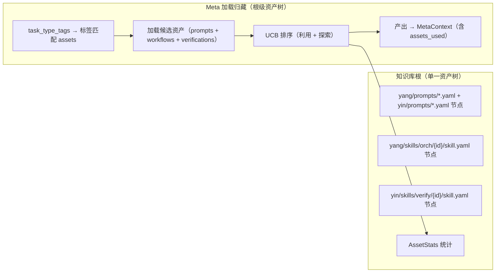

检索策略：标签精确匹配 → 关键词子串搜索 → **UCB 排序**（非纯 confidence）：

```
score = avg_reward + C · √(ln N_total / N_node)
      · 利用项 = avg_reward：已验证好资产
      · 探索项 = C·√(ln N_total / N_node)：样本少/新变体的加分
```

- `avg_reward` 来自 AssetStats（§6.2 回报函数）；`N_total` 为候选集总采样数，`N_node` 为节点采样数
- **N=0 冷启动 = 先验 μ + 有限探索分**（`n+1` 平滑，非 ∞ 特判）——先验 μ 由 `confidence` 映射（α=1+k·c, β=1+k·(1−c)），冷启动资产被采样且先验高者优先，避免纯随机遍历（V50 定稿，取代旧「最大探索分」）
- **统计选择门槛**：`n < min_samples`（默认 3）的资产不参与利用排序，只走探索分——防止小样本假置信
- `confidence` 字段保留为**初始先验**（人工种子/经验值），进入利用排序后由 avg_reward 主导
- env_tags 与当前环境指纹不匹配的候选**降权 ×0.5**（非过滤——保留跨环境候选但排序靠后；实现见「实现层定稿」）
- 不支持向量嵌入，无关系图扩散

**实现层定稿**——prompts 检索排序兑现上述 UCB 设计（meta.rs 现状为手填 confidence 降序，非学习统计）：

```
score(id) = μ(id) + C · √( ln N_total / (n_id + 1) )

μ(id) = models/{id}.yaml 后验均值      （存在 ModelAsset）
      | §6.2.1 先验映射 α=1+k·c, β=1+k·(1−c) → μ=α/(α+β)（无 ModelAsset，未采样）
n_id  = usage_count（prompts 任务级回传计数，MVP-6 起增长）
C     = 1.414（常量，不随资产量调整——UCB1 渐近最优性，§6.2 设计不变）
```

**确定性保证（硬约束）**：n+1 平滑而非 n=0→∞ 特判——全冷启动时 score = 先验 μ 降序（确定性二级键，与 read_dir 顺序无关）；μ 缺失时回退 confidence 直接映射（同一公式，非新先验）。**过滤防线保留**：confidence ≥ 0.3 阈值过滤仍先于排序执行（零资产降级路径不变）。排序位置：knowledge.rs `search_prompts` 调用后（返回前），Meta 消费顺序即 UCB 序——装配顺序：`tags 匹配 → 阈值过滤 → 加载 → UCB 排序`。

**env_tags 降权（V50 补）**：候选 `env_tags` 与当前环境指纹不匹配 → 利用分/探索分整体 ×0.5（确定性降权，非过滤；与排序二级键解耦）。

**信号粒度说明（V35）**：prompts 的采样信号是**任务级**（任务 PASS → 该任务编排所选 prompts 各记一次成功；FAIL/BACK_TO_META → 记失败），与 verifications 的**检查项级**（SkillResult 逐项）粒度不同——同一 backprop 管道、两套信号源（MVP-6，见 `src/orchestration/lianshan.rs`）。


### 6.3 MCTS 四算子

> **状态：** `lianshan.rs` + `cognition_evolver.rs` 已实现（V31 及之前为占位/部分实现），V32 将占位算子升级为真实 MCTS 实现。纯云端架构下 Lianshan 在符号层（YAML）独立运作，不依赖本地模型。日常 `taiji run` 默认不激活以保持 周易只读模式，可通过 `--with-lianshan` flag 启用。
>
> **激活条件：** 归藏各层有足够资产（每层至少 5 个）+ 累积 50+ 周易执行轨迹；统计选择需 `n ≥ min_samples`（3）。

**回报函数（写死进 BCP，config `runtime.lianshan.reward_weights` 可覆盖）：**

```
reward = w_pass·pass_rate + w_quality·avg_quality − w_cost·avg_cost_tokens − w_rounds·avg_verify_rounds
默认: w_pass=0.5  w_quality=0.3  w_cost=0.2  w_rounds=0.1

> **V50 定稿（多组权重 profile 预留）**：线性标量化是 MVP 工程妥协（只能覆盖 Pareto 凸包）；四维原始信号已持久化（`CheckStats`/`ModelStatsRow`，reward 是运行时派生）。config 预留「按场景 profile 存多组权重、运行时按 profile 切换」，核心算法不改；Pareto-MCTS / 奖励归一化列为已知边界延后（§6.5）。
```

- `pass_rate`：PASS 占比（stats.pass_count / n）
- `avg_quality`：质量分均值——**派生而非新增字段**：route 映射（PASS=1.0 / BACK_TO_ZHOUYI=0.4 / BACK_TO_META=0.2）× VerificationReport.confidence（不改 VerificationReport schema）
- `avg_cost_tokens`：trace `completion_response.usage.input_tokens` 累加均值（已在记录，零新增）
- `avg_verify_rounds`：BACK_TO_ZHOUYI 次数均值（验证轮数 = 收敛速度倒数）

**四维信号全部来自既有数据——零新增持久化文件。** 回报函数即 连山的改进方向（更省 token / 更精准 / 更快收敛 / 更高通过率），由系统价值判断写死，不由 LLM 自定。**V33 统计粒度：** 统计对象从「资产」精确到「检查项」（SkillResult 逐项通过率 / 耗时，随 verify_state.json 既有路径回传）——MCTS 演化的对象是契约有效性空间（fork/merge/prune 操作契约），资产级统计由检查项聚合（演化见 `src/orchestration/cognition_evolver.rs`）。

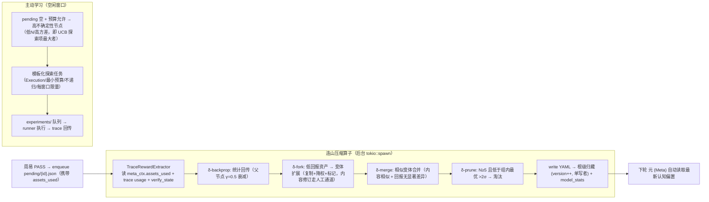

**被动学习（任务驱动）**：周易 PASS → pending 入队 → 统计回传——只能在任务发生时学习。

**主动学习（信息增益驱动）**：连山在 **pending 空 + 预算内**的空闲窗口，选择高不确定性节点（低 N / 高方差——即 UCB 探索项最大者）→ 生成**模板化探索任务**（静态模板，不调 LLM："用Skill（orch 类） W 完成类型 X 的最小任务并记录 token 消耗与结果"）→ 入 experiments/ 队列执行（Execution 模式 + 最小预算 + **不递归** + 每窗口限量 + token 成本上限）→ trace 照常回传。**护栏：① 探索任务不产生新探索任务（无递归）；② 连山纯符号层承诺保持（不调 LLM 生成资产内容）；③ 危险隔离——只有 `safe_for_exploration=true` 的资产进入探索候选（默认 false，人工/流程标记；write/bash 类高危执行体不参与主动学习，改走沙箱/测试任务）；④ 冷启动 = 先验 μ + 有限探索分（`confidence` 映射，非 f64::MAX 最大探索分）。**

**时序分离**：周易执行与 连山写入不并发（周易只读，单写者互斥）；主动学习在空闲窗口进行。

**元权重表（model_stats.yaml，）**：`model_key → StatsRow(n/pass_count/cost_sum/quality_sum/rounds_sum)`（serde default 零迁移），存于 knowledge 根（按模型区分，资产树共享），由 连山回传更新（lianshan 在 backprop 分支读取 pending 的 `model_key` + checks 首项四维聚合——同任务摊派值一致，与 SkillResult 摊派同构），ModelRouter 读取（§5.3）——同一 UCB/bandit 机制服务资产选择与模型路由。**回传数据源全部来自既有 pending 负载**（`model_key`/`checks[].cost_tokens|verify_rounds|quality`），零新增持久化文件。模型级 `quality` 用任务级 passed 映射（PASS=1.0，pending 仅 PASS 入队 → 恒 1.0，字段保留供未来 FAIL 入队扩展）。


---

### 6.3.1 环境维度轴（env_tags = 模型类）——所有归藏资产的统一主动学习轴（V50 定稿）

**问题（为什么需要这条轴）**：V44 去分区化把资产树收归单根、模型维度只在 `model_stats` 路由层区分——prompt/skill 的 backprop 统计与贝叶斯后验是**全局的**（`partition_guizang` 为 no-op，模型 key 不进 prompt/skill 后验）。后果：一个 prompt 被强模型用成功、被 flash 用失败，全局统计平均后「看起来还行」，merge/prune 不淘汰它——**它永远学不会「对 flash 单独优化」**。换小模型时系统宪法 prompt 内容一字不变（当前只有 ToolProfile 隐藏工具 + 弱模型协议兑工具接口，兑不住 prompt 内容侧）。

**定论**：`env_tags` 是**统一环境维度轴**，模型类（model class）是首要环境维度。所有归藏资产（prompts / skills / verifications）的检索、演化、主动学习都按环境维度隔离——**不是给 4 类资产各写一套主动学习机制，而是 4 类共用「env_tags 隔离 + UCB 维度内排序 + 四算子维度内演化」同一条轴**。

**模型类指纹派生**（复用 `factory::profile_for_model` 检测，零新判定逻辑）：

```
model_class(model_key) = key 含 flash/lite/mini/small → "flash"；其余 → "strong"
current_env_tags = [model_class]   // 空 = 无维度（不降权）
```

- **检索层**（V50 已实现）：`rank_prompts_by_ucb` 的 `current_env_tags` 参数——候选 env_tags 空 = 环境无关（不降权）；候选非空且无交集 → ×0.5 降权（降权非过滤）。**源待补**：`meta_ctx.model` → `current_env_tags`（MetaAgentBuilder 无 config，需调用方注入 model key）。
- **演化层**：fork 变体打 `env_tags = 触发 fork 的模型类`；变体在**维度内**竞争（同维度 UCB 排序）；merge/prune 维度内。**统计后验天然按变体 id 隔离**（每个变体独立 id 独立后验）——V44 去分区化不动，无需按模型复制资产。
- **主动学习层**：experiments 探索目标在**维度内**选（UCB 维度内最高），实验任务用该维度模型执行，验证回传该维度变体。

**边界（三不）**：

1. **不推翻 V44**——统计仍按变体 id 隔离，不按模型复制资产树。
2. **不改 Rust 硬编码元层宪法**（meta.rs `META_COMPOSE_SYSTEM_PROMPT`、yang/yin 模板）——它是代码，不参与主动学习；宪法自适应靠**资产层变体覆盖**（V45 双轨同 id 优先）。
3. **`VerificationAsset` 桥需补 `env_tags` 字段 + `skill_asset_to_verification` 透传**（与 `safe_for_exploration` 同构的 V50 改动）——否则 verifications 无法参与维度隔离。

**总装图（环境维度轴贯穿检索 → 演化 → 主动学习）**：

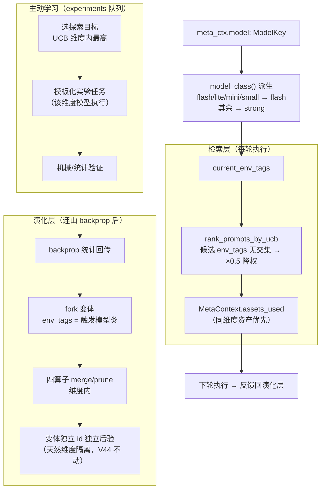

**部件图（类型字段契约）**：

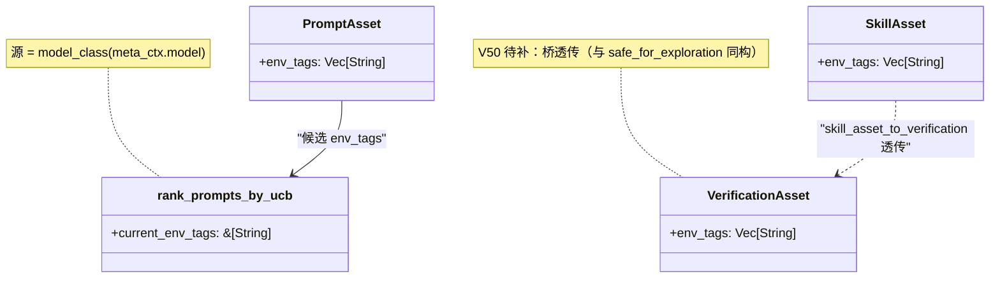


---

### 6.4 漂移检测与退化诊断（V50 定稿，实现待 /plan 阶段三）

**问题**：UCB1 是平稳环境假设——资产积累大量历史 N 后探索项被长期压制，环境漂移（换模型 / 任务分布迁移 / 增删约束）时旧统计误导路由，陷入「一直试曾经好、现已不对」的局部最优。

**DriftMonitor 契约**（轻量、后台、与 UCB 解耦——漂移动作是演化决策，不阻塞当前周易执行）：

| 要素 | 定稿 |
|------|------|
| 窗口定义 | 按采样数（每 10 次采样一个窗口），非按时间（任务稀疏时时间窗口空转） |
| 判定规则 | 最近 k=3 个窗口 pass_rate 单调下降 且 首尾差 > 0.1 → 漂移警报 |
| 动作·轻度 | 降级该资产 `confidence`（只影响筛选，不动历史统计） |
| 动作·重度 | 触发 fork 开变体（strictness 档位参数化，新变体带新生先验重新探索）+ 日志供人工审查 |
| 输出 | `DriftAlert { asset_id, 窗口统计, 建议动作: downgrade/fork/alert }` |

**退化诊断（SkillResult 粒度）**：同一 Skill 下检查项级 pass_rate 的**方差** > 阈值（默认 0.3）→ 标记 `degrading` 风险（整体通过率尚可但关键检查项频繁失败 = 资产正在退化）；触发 downgrade + 日志，**不自动 prune**（prune 仍走 §6.3 的 N≥5 且 μ < best−2σ 硬门槛）。

### 6.5 已知边界（V50 延后项，非缺陷）

- **非平稳 bandit**：暂不换 SW-UCB / Discounted-UCB——先打通「漂移检测 → fork/降级」通路（§6.4），折扣窗口在漂移通路验证后再议。
- **多目标优化**：保持线性标量化（MVP 妥协）；Pareto-MCTS / 多目标 MCTS 列为后续，四维原始信号已持久化（`CheckStats`/`ModelStatsRow`），接口预留不动。
- **奖励归一化**：cost/quality 量纲差异暂不归一；漂移检测与退化诊断不依赖 reward 绝对尺度。
- **子任务资产归因**：迹拓扑 MVP 只产根级 `invoke`/`verify` 边，子级归因列为阶段 1 后续。
- **编译原任务变体复跑（阶段 2 遗留）**：编译任务阴验证 MVP 只做 `save_skill` 机械判据（dual 存在 + 类别互补 + implementations 非空）；「原任务变体复跑（复现成功才 save_skill）」未实现——需重新执行原任务验证新 skill 复现成功，列为阶段 2 后续。

### 6.6 本体挖掘（OntologyMiner）——语义层增长引擎（V50 定稿，实现待 /plan 阶段三）

**问题**：连山只「调分不产语义」——backprop/UCB/四算子优化的是数字，产出不了「谁是谁、谁依赖谁、谁禁止谁」。Meta 的语义层同时薄到无（`zhouyi.rs` 硬编码 `&["general"]`，无实体链接）。Palantir 的核心竞争力 Ontology（本体）把现实世界语义数字化为**可计算对象 + 关系 + 规则**；taiji 若只停留在「统计拓扑」就是「聪明的统计机器」，不是「真正的智能体」。

**定论：Ontology = 词汇表 + 拓扑 + 逻辑（三层），连山纯符号挖掘后两层，词汇表人工种子 + 挖掘增长（命名走 compile）。**

| 层 | 回答的问题 | 来源 | taiji 落点 |
|------|------|------|------|
| **词汇表（Taxonomy）** | 「A 是什么」——受控语义类型 | 人工种子 + 挖掘增长（命名走 compile） | `ontology/types.yaml`（`SemanticType`） |
| **拓扑（Topology）** | 「A 依赖谁」——type→type 边 | 连山从 id 共现抽象（纯符号） | `ontology/relations.yaml`（`OntologyEdge`） |
| **逻辑（Logic）** | 「A 在何时绝不能/必须」——type-level 规则 | 连山从失败×env_tags 挖掘 + 人工种子 | `ontology/rules.yaml`（`OntologyRule`） |

**关键定论（类型抽象，本次修正核心）**：纯统计拓扑挖出的是 **id→id 硬连接**（`DeployToK8s → CheckImageVulnerability`）——死板，新资产 `ScanImageV2` 无法替代。完整 Ontology 的边必须打在**类型**上（`DeployAction →[requires]→ SecurityCheck`），消费端做**类型级软查询**：查「DeployAction 需要什么类型的依赖」→ 返回「SecurityCheck 类型」→ 在库里所有 SecurityCheck 资产间用 UCB 排——**新资产自动可替代，系统「活」了**。

**词汇表（受控语义类型，`ontology/types.yaml`）**：

```yaml
types:
  - id: security-check
    name: 安全合规检查
    description: 验证产出不引入安全漏洞
    parent: null            # 类型层级（taxonomy）
    source: human           # human | mined | compiled
  - id: deploy-action
    name: 部署动作
    description: 把产物发布到运行环境
    parent: null
    source: human
```

- 资产到类型的映射：`SkillAsset` / `PromptAsset` 的 `tags` 复用为语义类型引用（受控到 `types.yaml` 词表）；`resolve_entity` 只给**任务**分类，资产分类由词表 + 挖掘归簇承担。
- **挖掘增长**：连山发现频繁共现簇 → 产出「未命名类型」→ 入队 `compile/`（与 `enqueue_compile_task` 同构）→ 编译任务（LLM）命名 + 写 `types.yaml`——**命名走周易执行，连山纯符号红线不变**。

**三个挖掘态射（纯符号，零 LLM）**：

| 态射 | 输入 | 逻辑 | 输出 | 门槛 |
|------|------|------|------|------|
| `Mine_Dependency` | `assets_used` 共现 × `passed`（零新采集） | 共现 id 对 → 类型映射 → `P(pass|a∧b) − P(pass|a) ≥ lift` | `OntologyEdge{ from_type, to_type, WeakDependency, strength }` | 共现 ≥ `activation_min_samples`(50) |
| `Abstract_Concept` | 高频序列（宏节点） | 频繁路径 → 打包成类型簇 | 未命名 `SemanticType` → 入队 compile 命名 | 序列频率达标（**延后**，数据不够） |
| `Extract_Constraint` | `checks` 失败 × `env_tags` 分组 | 某 check kind 在某 env 下失败率=1.0 | `OntologyRule{ when, require, forbid, Hard }` | 样本 ≥ 50 且失败率=1.0 |

**互斥边不挖**：`OntologyEdgeKind` 只含 `WeakDependency` / `Sequence`，不含 `Forbid`——负相关约束留给 SafetyHook + 人工 `rules.yaml`（稀疏失败样本不可靠，且 SafetyHook 已兑硬禁止）。

**Meta 消费（本体大脑，零新增 LLM 调用）**：

1. `resolve_entity`（实体链接）：**合并进既有 compose LLM 调用**——`MetaComposeResult` 加 `ontology: Option<TaskOntologyView>`（serde default），`META_COMPOSE_SYSTEM_PROMPT` 加实体链接教学段（输出 domain/action/objects/env）。Meta 仍是 1 次 LLM。
2. `semantic_expand`（类型级软查询，纯符号）：`TaskOntologyView.objects` → 查 `relations.yaml` 的 type→type 边 → 返回「需要什么类型的依赖」→ 在库里该类型的所有资产间跑 UCB。**1 层展开**（防递归爆上下文）；硬依赖进候选池仍走 UCB（先验≠后验）。
3. `validate_logic`（类型级约束态射，纯符号）：`rules.yaml` 匹配 `when` → `require`（必须有该类型资产）→ 缺失 → `Err`；`forbid` 命中 → `Err`。

**双轨注入（复用已有机制）**：

- **软约束 → 阳**：图查询结果（建议路径 + 推荐资产）打包进 `MetaContext` / system prompt（引导，非强制）。
- **硬约束 → 阴**：`validate_logic` 产出的 `required/forbid` 清单注入阴 checklist（`ConstraintEngine::load_truths` 升级为「元层 4 truth ∪ `rules.yaml` 挖掘规则」），机械执行，LLM 不可翻案。

**四条红线**：

1. **连山纯符号**：三个挖掘态射零 LLM；命名走 compile 队列（周易执行）。
2. **先验≠后验**：挖掘边/规则是「先验智能」（硬依赖进候选池保底名额），仍经 UCB 排序，不替代统计学习。
3. **无降级**：`ontology/*.yaml` 读失败 = 归藏 I/O 硬错误（上抛带路径）；「任务未命中任何类型/边」= 状态分支（回退纯 UCB），非错误。
4. **防正反馈锁死**：挖掘产物经 git commit 版本化，**下轮才读**（写入本轮不消费）；规则从「候选保底」升级为「硬 required」需稳定 N 轮。

**总装图（本体挖掘 → 归藏 → Meta 消费 → 双轨注入闭环）**：

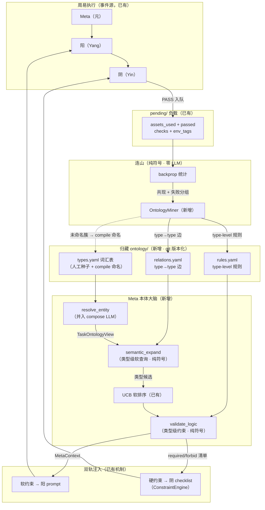

**部件图（类型契约）**：

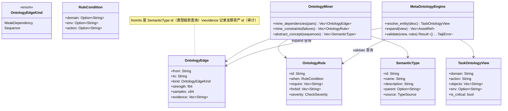

**与已建基建的接线**（避免重复造轮）：

| 本体概念 | 已建对应物 | 新工作 |
|---------|-----------|--------|
| 拓扑（地形图） | `manifold/` 迹拓扑（阶段 1） | 加「类型级边/序列」挖掘 |
| 语义投影（命名） | `compile/` 队列（阶段 2） | 加「未命名类型 → 命名」入队类型 |
| 挖掘维度（env 分组） | `env_tags`（§6.3.1 环境维度轴） | 作为 `Extract_Constraint` 的分组键 |
| 硬约束注入（阴 checklist） | `ConstraintEngine` + SkillEngine | 升级为 YAML 规则消费（非硬编码 4 truth） |
| 软约束注入（阳 prompt） | `MetaContext` → YangAgent system prompt | 已有，喂进类型级图查询结果即可 |

**MVP 边界（实现顺序）**：

1. **MVP-1**：`Mine_Dependency`（prompt×prompt 共现 → type→type 边）+ `semantic_expand` 类型级软查询 + `ConstraintEngine` 升级消费 `rules.yaml`。
2. **MVP-2**：`Extract_Constraint`（失败 × env_tags → 规则）。
3. **延后**：`Abstract_Concept`（宏节点命名，数据不够）+ skill 级共现（`assets_used` 现只含 prompt，需扩展 yang 工具调用回传或从 trace 序列挖掘）。

### 8.18 交接 = 压缩产物（边界压缩，非续聊压缩）

> **V29+ 定论（代码已实现，`src/agents/yang.rs::compress_history_to_handoff`）**：交接文件正文 = 一次聚焦的瞬态压缩调用——把本拟合对话压缩为结构化环境事实（进度 / 剩余工作 / 决策 / 约束状态 / 已产出文件）。与 §1.5「不做续聊压缩」不矛盾：续聊压缩 = 压缩后继续同一拟合（污染新采样）；边界压缩 = 压缩去**终止**拟合（留干净事实）。输入截断到 `compress_input_tokens`（首部 2k + 尾部最新），失败 / 超时（30s）/ 空输出 → 降级静态正文（仅 warn，不阻断）。

### 8.19 上下文预算——阴阳对称（30% 交接 / 35% 硬截止）

> **V48 单次窗口占用（阳已实现）+ V49 阴预算（蓝图定论，实现待 `/plan` 阶段三）**：轮次（max_turns）降级为防死循环兜底（200），窗口预算由 `ContextLimiter` 承担——取每次 `completion_response.usage.input_tokens` **单次值**（非跨轮累计：每轮 input_tokens 含完整历史重放，累计会多重计数同一段历史）。

**阈值单一事实源**（`config::ContextLimits`）：`effective_handoff() = 窗口 30%`、`effective_hard_cutoff() = 窗口 35%`（显式绝对值覆盖优先）；5% 余量 = 「收尾写交接」预算。

**两相预算模型对称、溢出语义不对称：**

| 相位 | 30% Handoff | 35% HardCutoff |
|:---:|------|------|
| **阳·产出相** | 写 handoff.md → `Err(ContextOverflow)` → 路由（BACK_TO_ZHOUYI 拆解 / BACK_TO_META 元重判，V47 分流） | `Err(HardCutoff)` → 上抛 FAIL（预算保护） |
| **阴·终审相** | **保守裁决（非 error）**：verify → `Ok(VerificationReport{ route=BackToZhouyi, confidence=0.0, summary="verify context_overflow" })`；converge → `Ok(ConvergenceDecision{ status=Partial, task_summary="converge context_overflow" })` | `Err(HardCutoff)` → 上抛 FAIL（取证循环失控保护） |

**阴溢出 = 粒度错误信号（与阳同构）**：装不下验证 = 产出过大 = 应拆解。`route=BackToZhouyi` 的保守裁决走 Phase4 既有路由分支，零新路由代码。`confidence=0.0` 诚实反映「语义验证未完成」，机械判据（SkillEngine）仍独立记录于 `verify_state.json`。

---

## 三、归藏符号固化设计

> 归藏 = 智能的离散符号形态（宪法 + skills + 统计学，git 版本控制）。以下为设计（哲学 + 单一资产树模型）。资产字段契约等**实现事实**见 `AGENTS.md`。

### 10.0 归藏哲学

> **智能的本质（第一性原理）**：在不确定环境中，把经验压缩成可预测、可行动的世界模型，并在行动中检验和修正它；更高阶的智能还要对模型和自身目标进行元层次监控与调整。
>
> **流形 = 因果**：非线性流形（冻结权重大模型）**本身就是现实世界因果关系的连续表征**——预训练把现实世界的因果结构压缩进权重，智能涌现即流形（因果）被激活。LLM 的局限不是"不懂因果"，而是**不稳定**（涌现概率性）+ **无法更新**（权重冻结）。
>
> **归藏储存的就是智能**：智能 = 因果结构的表征，有连续形态（流形）与离散形态（归藏符号）两种**同构**形态。归藏是智能的离散符号形态——显式、可读写、可组合、稳定、可累积。归藏不是"触发智能的开关仓库"，它储存的就是智能本身。
>
> **skill = 智能程序**：归藏的智能封装单元是 skill（智能程序），非纯文本。`skill = 文本组件（提示词/知识）+ 程序组件（可复用程序/工具）+ 工作流组件（编排）`。LLM 处理不确定、程序处理确定、工作流决定何时交给谁；**稳定性来自程序组件**——程序锚定涌现，程序组件比例决定 skill 稳定度。skill 最终迭代为 LLM + 工作流 + 多基础程序工具的智能程序，是新时代的智能程序。
>
> **压缩 = 提取可程序化的部分**：连山（形态转换的压缩算子，与预训练水蚀法同构——预训练"语料→流形"，taiji 连山"执行经验→符号"）把一次智能涌现压缩为 skill，本质是**从涌现中识别可锚定的部分并固化为程序**。

归藏有三层次，对应智能的三种符号形态（§1.8.3）：

| 层次 | 目录 | 语义 | 内容 | 消费方 |
|------|------|------|------|------|
| **系统宪法** | `yang/prompts/` + `yin/prompts/` | 保证系统运行的地基 | 环境信息、安全约束、激励策略（种子文本起步） | 元 (Meta) 检索 → YangAgent/YinAgent system prompt |
| **智能函数库** | `yang/skills/` + `yin/skills/` | 智能的封装单元（智能程序） | 涌现文本（渐进式披露）+ 程序（builtin 执行体），orch/exec/verify/converge 四类 | SkillRegistry → Rig Tool 注册 + SkillEngine 机械执行 |
| **统计学** | `models/` + `model_stats.yaml` | 能力边界（被测试出来的） | 贝叶斯后验（α/β）+ 四维 stats + 模型路由表 | 元 (Meta) UCB bandit / 连山演化决策 |

**git 版本控制（库的生命线）**：归藏目录 = 一个 git 仓库。连山每次压缩 = 一次 commit（可审计/可 diff/可回滚）；fork = 分支、merge = 合并、prune = 删除（历史保留）。当前实现是「version u32 递增 + atomic rename 覆盖」（无历史），git 化是归藏作为库的待补根基。

**渐进式披露（skill 文本机制）**：skill 文本分三层披露——层 0 `summary`（一句话，进 tool 列表）、层 1 `description`（几行，进 system prompt/LLM 决策）、层 2 `detail`（完整涌现文本，LLM 决定调用后按需加载）。库可富、披露可俭——skill 文本丰富不影响上下文占用。

> **后置（未实现）**：仅 `programs/`（标准化程序）为旧设计遗留，代码零实现。`manifold/` 已定稿为「迹拓扑」（§6.0 蓝图文件契约，阶段 1 实现）——不再属「待定稿」。

**阴阳嵌套资产**——yang（阳轨：生成/执行/分叉）和 yin（阴轨：验证/裁决/收敛）构成归藏树的顶层分支，与周易任务树同构（decompose⇔yang、converge⇔yin）。每条阳 Skill 必有 `dual` 字段指向对应的阴 Skill——不是"可选检查"，是结构保证（概率系统不能验证概率系统，§1.3）。

| 目录 | 内容 | 消费方 | 对偶原则 |
|------|------|------|------|
| `yang/prompts/` | 阳系统提示词：orch-yang / exec-yang | 元 UCB 选择 → YangAgent system prompt | 与 `yin/prompts/` 配对——编排·阳 ↔ 收敛·阴，执行·阳 ↔ 验证·阴 |
| `yang/skills/orch/` | 编排 Skill：递归拆解、子任务派发、rerun_of | YangAgent（Orch 模式） | 每个 Skill 的 `dual` 指向 `yin/skills/converge/` 中的收敛 Skill |
| `yang/skills/exec/` | 执行 Skill：write / bash / search / webfetch / read | YangAgent（两模式） | 每个 Skill 的 `dual` 指向 `yin/skills/verify/` 中的验证 Skill |
| `yin/prompts/` | 阴系统提示词：exec-verify / orch-converge | 元 UCB 选择 → YinAgent system prompt | 与 `yang/prompts/` 配对 |
| `yin/skills/verify/` | 验证 Skill：file-exists / command-succeeds / reference-resolves / trace-consistency / schema-valid | SkillEngine 机械执行 → YinAgent.verify LLM 裁决 | 承接 `yang/skills/exec/` 的全部产出验证 |
| `yin/skills/converge/` | 收敛 Skill：mece-check / cross-consistency / granularity-check | SkillEngine 机械执行 → YinAgent.converge LLM 裁决 | 承接 `yang/skills/orch/` 的全部产出验证 |

**Skills 的权限隔离**：exec + orch 类注册给 YangAgent（执行权），verify + converge 类注册给 YinAgent（裁判权）。同一名称的 Skill 可同时存在于两侧（如 `read` 在 exec 中执行读取、在 verify 中验证引用），但注册面天然隔离——YangAgent 不可访问 YinAgent 的 judge-only Skill，YinAgent 不可访问 YangAgent 的 execute-only Skill。

**阴阳对偶的完整映射**（周易三相 × Skill 四类）：

| 周易相位 | 阳 Skill（生成/执行） | 阴 Skill（验证/收敛） | 阴当前状态 |
|------|------|------|:---:|
| **exec**（直接产出） | write | file_exists + schema_valid | ✅ 已实现 |
| | bash | command_succeeds | ✅ 已实现 |
| | search | reference_resolves | ✅ 已实现 |
| | webfetch | trace_consistency | ✅ 已实现 |
| | read | reference_resolves（读而未用 = 无效读） | ❌ 缺失 |
| **orch**（任务拆解） | recursive_decompose | MECE（覆盖全部维度？无遗漏？） | ❌ 缺失 |
| | | cross-consistency（子任务结果相容？） | ❌ 缺失 |
| | | granularity（粒度合适？未过度拆解？） | ❌ 缺失 |
| **meta**（权重更新） | MetaAgent LLM（模式决策+模型路由+资产选择） | mode-appropriateness（Execution 选对了吗？） | ❌ 缺失 |
| | | routing-effectiveness（选的路由模型真更优？） | ❌ 缺失 |
| | | asset-relevance（编排的资产被实际用了？） | ❌ 缺失 |

> **状态图例**：✅ 已实现 | ❌ 缺失（待补齐）
>
> **核心约束**：任何阳 Skill 无对应阴 Skill = 该操作的产出未经符号层验证 = 概率系统自己验证自己 = §1.3 禁区。converge 类为当前最优先补全目标——orch 的 recursive_decompose 已有阳面实现，阴面完全空白。meta 侧验证走 L1 机械审计 + 连山统计回传（model_stats / assets_used），不走 LLM（自身就是 LLM 决策，不能用 LLM 验证 LLM——同源概率回路，§1.3）。

**manifold/——迹拓扑（§6.0 蓝图文件契约）**：连山压缩整个根任务执行的高维迹后固化的低维拓扑文件——`{root_task}.yaml`（节点 + 边状态转移图，契约见 §6.0）。

> **旧定义（文档编译，后置另立，不占用 manifold/）**：以下「人类设计文档 → 结构化 YAML」表为旧设计遗留，代码零实现；与新「迹拓扑」不是一回事，待定稿时另立目录（如 `bcp/`），不得写入 `manifold/` 与迹拓扑混写。

| 文件 | 内容 | 压缩源 |
|------|------|------|
| `bcp.yaml` | BCP 蓝图协议结构化版本（接口契约/数据流/模块边界） | 人类 BCP 文档 |
| `agents.yaml` | AGENTS.md 规则结构化版本（约束清单/必检项/禁止模式） | 人类 AGENTS.md |
| `topology.yaml` | 流型拓扑图（模块依赖/数据流/调用关系） | 代码结构 |
| `contracts.yaml` | 接口契约定义表（所有 §3 接口签名/错误类型） | §3 |
| `env.yaml` | 环境信息（模型版本/配置参数/运行时约束） | 运行时环境 |

**标准化 Skills（skills/）**——从 manifold/ 经周易执行压缩而来的可复用程序：

```
manifold/ → 作为上下文注入周易任务 → 阳拆解→阴验证→元路由
  → skills/{name}.yaml（归藏固化） → 反作用未来周易节点 → 四维权重增强
```

不是离线编译——BCP→Skills 的每一次压缩就是一次周易任务执行，产生的 skills 是 deliverable，统计信号回传更新 models/。

### 10.1 单一资产树模型（V44 去分区化定稿）

> **状态：**（V32 蓝图承诺分区，V36 实现，V44 取消分区——资产树单一共享，模型维度仅在统计层区分）。落地要点：① `GuizangClient` 单 `data_dir`（knowledge 根），删除 `for_model`/分区派生；② 迁移函数 `migrate_from_partitioned(root)`（幂等：既有 `{model_key}/` 分区资产合并回根）；③ 检索/写回均走根级 client——Meta 根级检索（§5.3），连山按 pending 的 `model_key` 更新根级统计（§6.2）；④ `MetaContext.model` 仍是模型选择载体——路由按模型区分，资产不按模型复制。

**归藏单一资产树（阴阳嵌套树，V45 双轨）**：与周易任务树同构——yang=生成/执行/分叉（decompose），yin=验证/裁决/收敛（converge）。Skills 嵌套在 yang/ 与 yin/ 之下，类别由阴阳归属 + 子目录共同定义。**每 Skill 一个文件夹**（演化单元，可携带教学附件），入口文件统一 `skill.yaml`：

**双轨原则（V45）**：阳阴元工具/元 skill 全部硬编码于 Rust 元层注册表（保证基础运行，零资产依赖——知识库空/损坏时基础 Zhouyi 闭环照常）；资产层是可演化覆盖层——同 id 资产优先于元层（教学字段可覆盖，执行体恒为 Rust builtin），连山 fork 产出新文件夹变体。

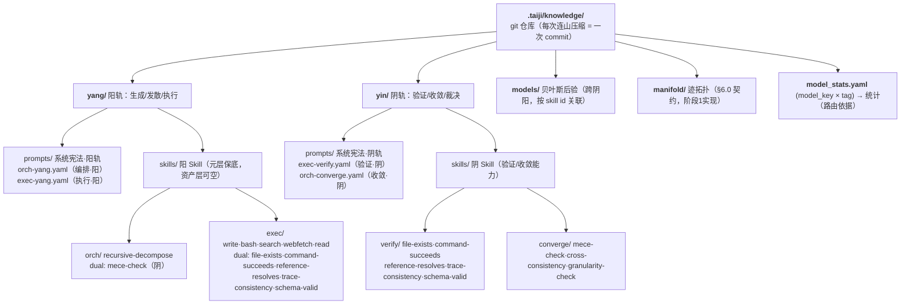

**根级资产树运行时行为：**

| 层 | 资产类型 | 消费方 |
|:---:|------|------|
| `yang/prompts/` | 阳系统提示词 | 元 UCB 检索 → YangAgent system prompt 注入（每轮执行） |
| `yang/skills/orch/` | 编排 Skill | 元 UCB 检索 → YangAgent（Orch）注入 |
| `yang/skills/exec/` | 执行 Skill | SkillRegistry → YangAgent 工具注册 |
| `yin/prompts/` | 阴系统提示词 | 元 UCB 检索 → YinAgent system prompt 注入（每轮执行） |
| `yin/skills/verify/` | 验证 Skill | SkillEngine 机械执行 → LLM 裁决 |
| `yin/skills/converge/` | 收敛 Skill | SkillEngine 机械执行 → LLM 裁决 |
| `models/` | 贝叶斯后验（α/β） | UCB 排序权重（跨任务累积） |
| `manifold/` | 迹拓扑（§6.0 契约，阶段1实现） | 元宏观调控 / 模型路由 / 演化策略 |
| `programs/` | 标准化程序（后置未实现） | SkillRegistry → Agent 工具注册 |

**模型-领域学习单元（统计层隔离）**：资产树单一共享，领域学习单元在**统计层**区分——**模型提供概率地形**（猜想源：LLM 生成候选），**约束系统**（prompts + skills）**提供机械判据**（反驳源：SkillEngine 验证候选），**统计**（model_stats 按 model_key 索引 + models/ 贝叶斯后验）**提供累积**（选择源：连山回传与演化）。推论：**Skill 粒度自适应**——统计按模型区分 → 弱模型通过率低 → fork 更小粒度的原子 Skill；强模型通过率高 → fork 更大的组合 Skill；同一语义 Skill 的不同模型变体按各自统计独立演化（粒度 = f(模型能力)），**变体树共享资产树、统计独立**（fork/merge/prune 不复制资产，仅更新统计与选择）。

周易执行期间只读，连山单写者更新（任务内所有 Agent 共享同一根级资产树——模型维度仅影响路由选择 `MetaContext.model` 与统计回传键，不产生资产副本，§5.3）。

**Skills 与归藏的关系：** 4 类 Skill（orch/exec/verify/converge）是归藏的核心可演化资产。当前 5 个内置 Skill（read/write/bash/search/webfetch）作为 exec 类种子资产硬编码在 Rust 中。未来 SkillCompiler 激活后，skills/ 下的所有类别通过连山 Lianshan 四算子统一演化——fork（低通过率 Skill 变体）、merge（相似 Skill 合并）、prune（低效淘汰），4 类 Skill 共享同一演化框架与回报函数。

**种子复制（`taiji seed [--from <source_root>]`）**：把源知识库根级活跃种子资产（`prompts/` + `skills/` 中 status != pruned）文件级复制到本知识库根。**不复制 `models/`**（贝叶斯后验 = 累积，新单元从零开始）。幂等：目标已存在同名资产 → 跳过不覆盖。

---

## 四、待设计议题

> **本节为开放议题，非架构定论**——不改变前文任何定论；定论需另行设计收敛 + 用户批准。记录在此以免丢失方向。

### 4.1 目标层 / 稳态 / 延迟验证（V49 提出）

**背景**：三层尺度（§1.1）全部是**有限任务**模型——终态 PASS/FAIL、同步验证、`max_rounds`/`max_cycles` 强制收敛。唯一持续循环是连山主动学习（§6.3），但它驱动**资产演化**，非**目标执行**。

**缺口**：现实存在**持续性长期任务**（不断演进的循环系统，非一次性产出），例："写小说每月赚到 5000 元"。

**两个正交的验证缺口**（区分关键——V49 保守裁决只覆盖前者）：

| 现象 | 本质 | 拆解能否救 | 现状 |
|------|------|-----------|------|
| 阴无法验证（同步、证据不足） | 粒度/证据问题 | 能——拆小即可验 | ✅ §8.19 保守裁决（`confidence=0.0 → BackToZhouyi`） |
| 验证反馈很慢（异步、等世界） | 时态问题——真值尚未产生 | 不能——"5000/月"拆再细也不会提前到账 | ❌ 无此层 |

**"写小说赚 5000/月"是目标（goal）不是任务（task）**：子任务（写章节 / 发布 / 推广）可用现有同步周易循环验证，但**目标本身**（5000 收入）只能等世界反馈（收入 / 用户 / 留存）到期才裁决。

**待设计方向（未定论）**：

1. **稳态终态（steady-state）**：任务多一个终态——本轮 PASS 但不退出，入调度队列等下一轮。
2. **延迟阴裁决**：外部世界信号作为异步验证回注——类比连山 pending 队列，但装的是"等待世界反馈的验证"，到期才解。
3. **目标层**：长期任务 + 周期性外部检查点；检查点之间跑子目标的同步周易循环（现有模型可覆盖）。

**未决问题**：稳态与 PASS 的关系（并存/替代）；外部信号源定义；检查点调度归属（连山 or 新调度器）；目标层统计键空间；延迟验证回注复用 pending 队列还是独立队列。

**定论前置约束**（本议题即使定论也不可违反）：① 概率系统不能验证概率系统（§1.3）——外部反馈必须是**可机械判定的符号信号**（数字/布尔），非 LLM 判断；② 周易执行期只读归藏（§权限关系），延迟验证回注走队列、连山单写者不变。


