# taiji 架构蓝图 (Blueprint)

> **设计定论层**：本文件只存**设计哲学 + 架构图 + 不可推翻的定论**。回答「为什么这么设计、系统长什么样」。
> 不随代码漂移——改动 = 新定论（需用户批准）。**实现事实看 `AGENTS.md`**（路径索引 + 避坑规则），字段契约/函数签名以**代码为准**，本文件不重复存实现细节。转化协议看 `plan.md`。

## 三文件关系（事实分层）

| 文件 | 本质 | 加载时机 | 内容 |
|------|------|---------|------|
| **Blueprint.md**（本文） | 设计定论 | 设计/架构/改契约时读 | 设计哲学 + 架构图 + 定论 |
| **plan.md** | 转化协议（空壳） | 任务需计划时套用 | 蓝图 → 计划的转化 schema |
| **AGENTS.md** | 实现事实 | 每次会话实时加载 | 路径索引 + 环境信息 + 避坑规则 |

数据流：`Blueprint(设计) --plan.md协议转化--> 具体计划 --执行--> 代码`；执行后经验固化回流 `AGENTS.md(避坑) / Blueprint(设计定论)`。

> **核心动态**：周易（泛化执行）→ 连山（非线性流形压缩）→ 归藏（符号固化）三位一体的同构循环。归藏资产树与周易递归任务树异层同构——fork=decompose、merge=converge、prune=FAIL 终止、backprop=子→父统计上浮。
>
> **架构定论（不可推翻）**：① 概率系统不能验证概率系统——收敛验证符号化；② 归藏不是 RAG 知识库——是压缩固化后的可复用符号系统；③ 激励问题不需要 ground truth——断言证据链机械可判定；④ 权重微调是模型厂家的事；⑤ 一个模型 + 它的约束系统 = 一个领域学习单元——统计层独立演化（资产树共享，V44）；⑥ 资产层执行体统一 Python、Rust 骨架守住 invariant——Python 是编译管道可行的必要条件，Rust 种子层是 bootstrap 安全网（V52）；⑦ **阴不是 Agent——是半符号半 LLM 的判断节点，判断依据来自归藏因果，归藏所有资产实时录入反馈（V57）**；⑧ **压缩分深浅两层——阴实时录入 = 浅层压缩（单次判断→后验，同步），连山 = 深层压缩（拓扑/语义/演化/编译，异步单写者），统计回传由阴承担、连山不再 backprop（V59）**。

## 术语对照（Terminology）

| 易经名称 | 英文 | 定义 | 代码标识符 |
|------|------|------|------|
| **周易** | Zhouyi | 泛化执行——概率采样、任务拆解与并行探索。每一次任务执行 = 一次蒙特卡洛 rollout。 | `ZhouyiCycle` |
| **连山** | Lianshan | 非线性流形发现与压缩——从高维执行迹中发现低维结构（贝叶斯后验 + UCB + MCTS 四算子）。纯符号层，零 LLM。 | `LianshanConsumer` |
| **归藏** | Guizang | 符号固化——智能的离散符号形态（prompts 宪法 + skills 函数库 + models 统计学），git 版本控制的库。 | `GuizangClient` |
| **阳 / 阴** | Yang / Yin | 生成与判断的对偶——阳生（概率采样/执行 Agent）、阴判（半符号半 LLM 判断节点，用归藏因果对碰裁决，不持有 skill）。贯穿三个尺度的同一股扭矩。 | `YangAgent` / 阴判断节点 |
| **元** | Meta | 权重调节与路由决策——在阴阳之间协调，决策模式（编排/执行）与模型选择。 | `MetaAgent` |

---

## 1. 设计哲学

### 1.1 异层同构 (Isomorphic Recursion — Three Scales)

taiji 的全部动力学由一个模式在不同尺度上的重复构成：**阳（生成/发散/执行）→ 阴（验证/收敛/裁决）→ 元（调节/更新/路由）→ 再阳生…**，同时运行在三个尺度上，尺度之间通过压缩关系链接：

| 尺度 | 阳（生成/发散） | 阴（验证/收敛） | 元（调节/更新） |
|------|:---:|:---:|:---:|
| **Scale 1：单任务节点** | YangAgent 概率采样/执行 | 阴判断节点（半符号半 LLM 因果对碰） | 元 (Meta) 权重更新/路由决策 |
| **Scale 2：任务树拆解** | 父 decompose → 子 spawn 并行执行 | Converge 聚合子结果 / 子失败汇报 | BACK_TO_ZHOUYI 再路由 / 父再指导 |
| **Scale 3：资产演化** | 资产 fork（开新变体假设） | merge（收敛近邻）/ prune（淘汰低效） | backprop（统计回传 α/β 更新 + UCB 排序） |

**同构映射**：周易任务树与归藏资产变体树是同一结构——fork=decompose（生成新假设分叉）、merge=converge（成功模式归一）、prune=FAIL 终止（低效路径消亡）、backprop=子→父统计上浮（经验向上累积）、BACK_TO_ZHOUYI=UCB 探索项激活新候选（不陷入局部最优）。

**结构同构 = 代码事实**：周易任务节点在任意 depth 保持相同的三相分工/权限/预算——递归终止仅由 depth guard 保证；资产树同样——任意 variant_of 深度遵守相同字段契约/演化算子/统计回传管道。**不为不同深度写不同控制流。**

### 1.2 三相互补 (Tri-Phase Complementarity)

| Agent | 相位 | 易经 | 职责 | 权限面 |
|-------|------|------|------|--------|
| **Meta** | 权重更新·元 | 无极生太极 | 遍历归藏提取推理路径，注入认知偏置 | **半 LLM 半符号（§4.3）**：LLM 语义层（任务种类/难度先验/资产粗筛/知识应答）+ 符号统计层（UCB 路由模型/模式、UCB 排序资产、组装 MetaContext）。**元是可能出口相**——应答类任务（产出不改变世界）短路阳阴直接 PASS |
| **YangAgent** | 概率拟合·阳 | 阳 | 沿路径发散探索，LLM 做微观概率采样，可递归拆解 | **执行权**：变更世界工具（write/bash/…）+ recursive_decompose（仅编排模式），受 SafetyHook + TraceHook 约束 |
| **阴（判断节点）** | 因果对碰·阴 | 阴 | 用归藏因果对碰阳的产出，裁决收敛与否 | **半符号半 LLM**：符号层读归藏因果（rules/relations + 原子判据）机械对碰阳的产出；LLM 层只在符号无法表达的语义判断处裁决路由（PASS / BACK_TO_ZHOUYI / BACK_TO_META）。**不是 Agent——不持有 skill、不注册工具** |

周易循环 = 阳生（概率采样）→ 阴克（验证驳回）→ 元调（调整权重）→ 再阳生，直到收敛。

**循环内权限分工**：执行工具收敛于 Yang 相位（唯一 Agent）；阴是判断节点——只读归藏因果 + 阳的产出，不持有工具/skill；Meta 半 LLM 半符号。分工是角色性的（执行者/认知者/判断者），阴的「无工具」由结构保证（不是 Agent、无注册面），不可被 LLM 动态改变。

### 1.3 神经与符号统一 (Neural-Symbolic Integration)

LLM 是微观概率性的体现——每次调用随机、不可精确重现。**归藏是概率迹的符号压缩产物**——prompts/skills/models 不是"知识"，而是历史周易执行迹经连山压缩后固化的可复用符号模式。周易循环就是这两种表象的交替：概率采样产生迹（神经侧）→ 连山压缩为符号更新（桥梁）→ 归藏固化为可复用资产（符号侧）→ 下一轮周易被符号资产赋能（神经侧）。

**概率系统不能验证概率系统**：若阴的验证本身也是 LLM 概率采样，则构成**同源概率回路**——阳与阴共享同一盲区（同语料/同训练分布/同风格偏好），验证结果不可靠（MM-JudgeBias 26 个 SOTA judge 普遍验证完整性失败；Reliability without Validity 21 个裁判模型「高可靠低有效」；verbosity/self-preference/position 偏置系统性存在，**scale ≠ reliability**）。因此阴 = **半符号半 LLM 判断节点**：符号层（归藏因果 rules/relations + 原子判据）机械对碰**优先且恒在**，LLM 语义裁决只在符号层无法表达处**兜底**——符号优先，LLM 兜底，拒绝「LLM 主判」。

### 1.4 泛化-压缩循环（周易→连山→归藏）

核心动态不是"执行引擎 + 知识库"。它是**泛化→压缩→固化→赋能**的循环——三个名称不是三个模块，而是同一循环的三个相：

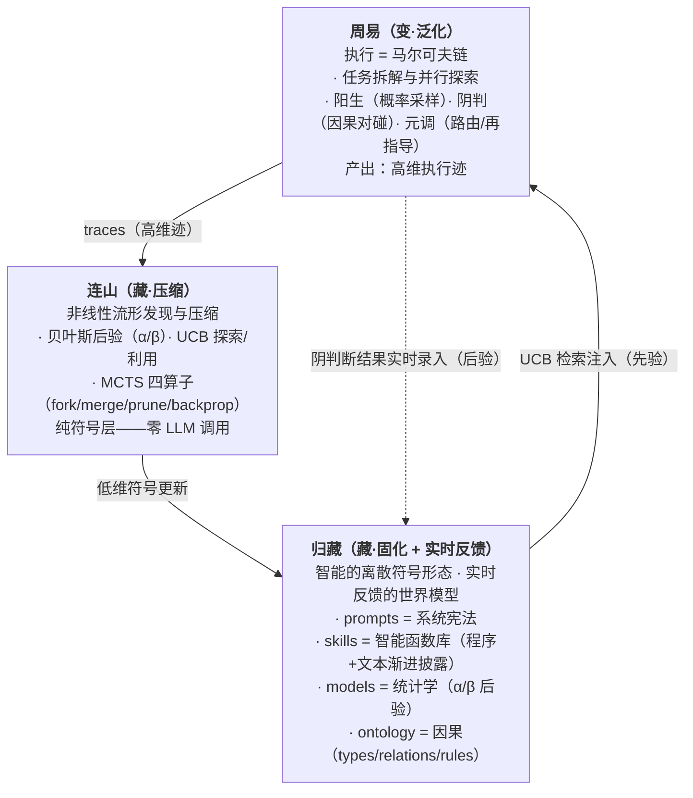

- **泛化 = 周易执行**：每次任务执行 = 一次高维概率空间中的蒙特卡洛 rollout，产生原始高维迹（model × prompt × task × depth × tools × cost × pass/fail）。
- **压缩 = 连山**：贝叶斯后验把成败迹压缩为二维信念分布；UCB 排序把多维 (tag × stats) 压缩为一维检索序；fork/merge/prune 把迹的散点聚类为资产变体树；model_stats 压缩为路由表。**所有压缩纯符号层（零 LLM）。**
- **固化 = 归藏存储**：压缩后的智能以离散符号形态持久化（prompts/skills/models/ontology 各一个 YAML）——不再是"文档/配置"，而是**智能的符号晶体**。
- **赋能 = 归藏回注周易**：下一轮 Meta 通过 UCB 检索加载匹配资产，注入执行流——周易节点携带历史所有相关任务的压缩经验，上下文被**无限扩展**（经验的维度，非字节数）。**阴的判断依据也来自归藏因果（先验）**。
- **实时反馈 = 归藏的世界模型闭环**：阴的判断结果（通过/失败 + 四维信号）**实时录入**对应资产——先验（因果）→ 验证（对碰）→ 后验（统计）在阴节点闭环。归藏不是「异步批量压缩的库」，而是「实时反馈的世界模型」。

**这就是"压缩即智能"的精确含义**：智能的提升不是更好的 LLM，而是循环每轮让归藏积累更多可复用经验，让下一轮周易推理更精准、更省 token、更少失败。四维权重（pass/cost/rounds/quality）的持续增强是这个循环的可测量边界。

### 1.5 产物契约与交接文件 (Artifact Contract & Handoff)

**执行事实是唯一记忆。** 跨层、跨时间传递的只有产出物（deliverables / task_output / 交接文件）。中间记忆（chat_history、meta_ctx 推理过程）只服务于本节点内部，不得向上传播、不作为结果的事实来源。

**产出即交接**：每个瞬态 agent（概率拟合）结束时有且仅有三种去向——完成（写最终产出）、上下文超限（写交接产出）、失败/取消（写交接产出）。**交接物 = `deliverables/handoff.md`，是产出物之一**——YAML front matter 携带结构化字段（failure_reason / degraded / output_refs），正文为环境信息（进度/剩余工作/决策/约束状态）。置于 `deliverables/` 内保证**可发现性**：父层、同任务其他 agent、元校准全部经既有路径自动可见，**不引入新的查找机制**。产出物是递归拆解、恢复、路由判定、元校准的唯一输入物。兄弟贡品（同级子任务 deliverables/）跨兄弟公开可发现可读——分封时注入兄弟贡品索引，读取经既有 read 工具。

- **上下文窗口是单次拟合的采样空间，不是记忆仓库。** 上下文超限 = 任务粒度错误 = 编排失败的运行时硬证据 → 返回阳，阳基于产出文件递归分解
- **不做续聊压缩（特意设计）。** 压缩中间记忆塞回同一拟合的下一轮 = 污染新采样；**交接边界压缩**（收尾压成交接正文）是**结束**本次拟合、留下干净事实、开启新拟合——边界压缩 ≠ 续聊压缩
- **阴（判断节点）基于产出核验**：阴只读产出文件、交接文件与归藏因果对碰裁决，不消费对话过程
- **恢复 = 前一瞬态产出继承**：崩溃恢复从 `deliverables/`（含 handoff.md）重建，chat_history 仅作本节点断点续聊的最终兜底

### 1.6 第一性原理 (First Principles)

复杂事物由简单事物结构化组成。一个 YangAgent 可以执行也可以递归拆解（不需要两种类型）、一个 EngineContext 携带 task_dir 根节点和子节点用它做同一件事、一个 Task 结构在不同层代表不同粒度但不改变结构。

**约束分层（V51 实测定论）**：安全不变量（路径作用域、写入范围）死在 Rust 骨架——工具层硬约束（write 的 task_dir scope 等）；prompt 只做教学（软约束）。LLM 会违反 prompt 的「禁止 cp」，但违反不了工具层的 scope——把 invariant 写进 prompt 是错误落点（软约束可被无视），工具层拦截才是对的。

### 1.7 压缩态的归属：跨任务轴，非单任务纵深

> **V49 定论（取代旧「心流·消溶」，旧节作废）**：系统提示词（prompts）每轮都注入执行，不存在「深层消溶」——权重冻结（§1.3/§1.4），递归加深只是同权重的反复采样，无「内化」通道。压缩态（文本教学 → 统计权重、迹 → 信念）只发生在**跨任务轴**（连山压缩 → 归藏固化 → 下轮周易检索注入），不在单任务深度轴展开。

### 1.8 类比与隐喻 (Analogies and Metaphors)

核心理念植根于两个千年结构的统一：中国古典哲学的变化与累积模型（周易·连山·归藏），以及现代概率算法（蒙特卡洛/贝叶斯推理/多臂老虎机）。

#### 1.8.1 周易 — 蒙特卡洛方法

| 周易 | 周易递归树 | 现代算法 |
|---|---|---|
| **三爻** (初、中、上) | 三相位 (元Meta / 阳Yang / 阴Yin) | MCMC 三步：proposal → sampling → acceptance |
| **六爻** (重卦：两经卦相叠) | 两层递归 × 三相位 = 6 步执行路径 | 2-level Monte Carlo rollout |
| **八卦** (2³ = 8 种卦象) | 路由三分支 (PASS/BACK_TO_ZHOUYI/BACK_TO_META) 在递归树中展开 | MCTS 8-node search frontier |
| **变卦** (爻变产生新卦) | BACK_TO_ZHOUYI / BACK_TO_META → 路径分叉 | MCTS backpropagation + re-route |

周易的每一次循环（权重更新 → 概率拟合 → 因果验证 → 路由决策）就是一次"起卦"——系统在不确定性中做一次概率采样，由因果验证裁定吉凶。递归树展开 = MCTS 的 selection → expansion → simulation → backpropagation 循环。

#### 1.8.2 连山 — 非线性流形压缩

"连山"意为连绵的山脉——**非线性流形的地形线**（别名「水书」，兼山脊线（分）与水脉（流）两义）。连山发现高维执行迹空间中的"非线性流型"（哪些 (损失函数：model × prompt × task × depth) 组合通往成功）并沿梯度下降向山谷压缩：

| 连山操作 | 流形语义 | 现代对应 |
|---|---|---|
| **贝叶斯后验 (α/β)** | 每个资产在流形上的局部曲率估计 | Beta-Bernoulli conjugate model |
| **UCB 排序** | 沿流形边界的探索-利用权衡 | Upper Confidence Bound (bandit) |
| **fork / merge / prune** | 山脊分叉 / 平行路线合并 / 谷底路线终止 | MCTS expansion / merging / pruning |
| **model_stats** | 全局地形概览（哪些模型擅长哪些任务） | Contextual bandit |

**连山的核心约束：纯符号层。** 所有压缩操作是确定性数学运算，不调用 LLM。连山不产生新内容——fork 的新资产内容是参数变体（strictness 档位），不是 LLM 生成的文本。内容演化留给人（手写种子资产）或经周易任务编译（**编译 = 一次周易任务执行，复用整个周易网络：阳 LLM 编程生成、阴符号复跑验证**；连山本体只做纯符号统计压缩，不含编译）。

#### 1.8.3 归藏 — 符号固化 · 压缩即智能

> **第一性原理（归藏的本体论地位）**：智能的本质是——在不确定环境中，把经验压缩成可预测、可行动的世界模型，并在行动中检验和修正它。非线性流形（LLM 权重）**本身就是现实世界因果关系的连续表征**——智能涌现即流形（因果）被激活。LLM 的局限从来不是"不懂因果"，而是**不稳定**（涌现是概率性的）与**无法更新**（权重冻结）。归藏因此是**智能的离散符号形态**——与流形（连续形态）同构，都是因果结构的表征，但符号形态显式、可读写、可组合、稳定、可累积。**归藏储存的就是智能本身**，不是"触发智能的开关"。

| 归藏资产类型 | 压缩了什么 | 消费方 | 实时反馈 |
|---|---|---|---|
| **prompts/** | **系统宪法**——环境信息、安全约束、激励策略 | 元 (Meta) 检索 → Yang system prompt | 任务级 PASS/FAIL → stats 实时回传 |
| **skills/** | **智能程序**——`skill = 文本组件（提示词/知识）+ 程序组件（可复用程序/确定性工具）+ 工作流组件（编排）`。LLM 处理不确定（概率泛化）、程序处理确定（可靠执行）、工作流决定何时交给谁；**稳定性来自程序组件**（程序是锚点，锚定涌现不漂移） | SkillEngine 机械执行 + SkillRegistry → Rig Tool 注册（仅阳面） | 执行结果 → SkillAsset.stats 实时回传 |
| **models/** | 每个资产的**信念分布（α/β）**——历史通过/失败经验压缩为 Beta 分布 | UCB 排序 / 演化决策 | 阴判断结果 → α/β 实时更新 |
| **ontology/** | **因果**——type→type 边 + type-level 规则（词汇表/拓扑/逻辑三层） | 元（先验注入）+ **阴（判断依据）** | 阴对碰 → 二值裁决实时更新（观测坍缩，挖掘判定 = 连山深层异步） |

**每一个资产 = 一段曾经有效的执行经验的压缩投影。** confidence（人工种子先验）→ stats 四维统计（阴实时录入）→ ModelAsset α/β（贝叶斯后验）→ 演化决策（fork/merge/prune）——"迹→压缩→固化→再执行→再迹"的循环在资产维度的体现。

#### 1.8.4 三位一体：周易·连山·归藏的统一

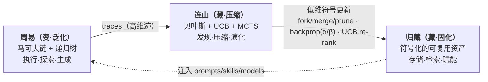

三者不是三个模块。它们是**同一股认知扭矩在三个时间尺度上的表达**：周易 = 秒~分钟级执行；连山 = 分钟~小时级压缩；归藏 = 跨任务持久积累。**异层同构的最终形态：周易递归任务树与归藏资产变体树同构——归藏不是"另一个系统"，它是周易在符号层的压缩投影。**

---

## 2. 系统概览

### 架构总纲

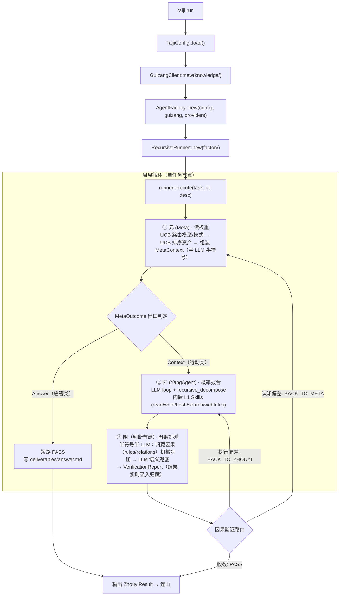

### 三位一体：周易·连山·归藏

| 相 | 代码中的体现 | 方向 | 语义 |
|------|------|------|------|
| **周易** | `RecursiveRunner` + `ZhouyiCycle` + Yang/Yin/Meta | 前向·泛化 | 执行马尔可夫链——每次任务 = 一次蒙特卡洛 rollout，产生高维迹 |
| **连山** | `lianshan` + `cognition_evolver` + `ModelRouter` | 反向·压缩 | 非线性流形发现——把高维迹压缩为低维符号更新（α/β、UCB、fork/merge/prune） |
| **归藏** | `GuizangClient` + `knowledge/` 资产树 | 固化 | 低维符号持久化——yang/yin 阴阳对偶 + manifold 迹拓扑 + skills + models |

同一棵资产树：周易在树上前向消费（检索注入），连山在树上反向压缩（统计回传），归藏是树的持久态。

### 权限关系（周易只读 · 阴实时录入 · 连山单写者）

- **周易执行期只读归藏**——阳（唯一 Agent）不得写资产
- **阴判断节点实时录入（浅层压缩 · 同步）**——阴的判断结果（通过/失败 + 四维信号）直接回传对应资产 stats/后验（V57/V59）；这是「验证反馈」不是「写资产」
- **连山是唯一深层压缩写者（深层 · 异步）**——单线程后台任务（`--with-lianshan` 激活），写路径 = 拓扑压缩（manifold）+ 语义压缩（ontology）+ fork/merge/prune 演化 + 编译入队；**不再做统计 backprop（已移交阴实时录入）**
- **资产共享**：任务内所有相位共享同一根级资产树（V44 去分区化）；`MetaContext.model` 是模型选择载体，仅影响路由与统计回传键，不产生资产副本

### 数据流：归藏 → 周易（前向 · 检索注入 + 因果供给）

```
ModelRouter（读 model_stats 元权重表，纯符号层）
  → 归藏根级检索 → UCB 排序（利用 + 探索）
  → 元 (Meta) 半 LLM 半符号（LLM 语义层产 task_type tags + 难度先验 → 符号统计层路由模型/模式 + UCB 排序资产 → 组装 MetaContext）
  → MetaContext { mode, model, assets_used, prompts } 注入 Yang
另外两路消费：
  → 阴判断节点读归藏因果（rules.yaml type-level 规则 + relations.yaml type→type 边 + 原子判据）——判断依据 = 世界模型因果（V57）
  → ConstraintEngine L0 输出健全性检查（内置硬编码，Hard 短路）
```

### 数据流：周易 → 归藏（反向 · 实时录入反馈）

```
阴判断节点裁决（PASS/FAIL + 四维信号）
  → 实时录入对应资产（V57/V59 浅层压缩）：prompt/skill stats + models α/β 即时更新
  → 周易 PASS 入队 pending（assets_used + checks + passed + model_key）——连山深层压缩的数据源
  → 连山消费（单写者，指数退避轮询）——拓扑压缩 + 本体挖掘 + 编译入队
  → evolve_contracts：fork / merge / prune 四算子（消费阴已录入的后验）
  → model_stats 更新（元权重表）
  → 下轮周易自动加载更新后的认知偏置（藏 → 变）
```

### 主动学习（连山 → 周易 反向触发）

空闲窗口（pending 空 + 预算内）→ 连山选 UCB 探索分最大的活跃变体资产 → 写入 `experiments/` 队列 → runner 执行模板化探索任务（Execution / 最小预算 / 不递归）→ 验证回传 → 连山更新。护栏：探索任务不产生新探索任务，学习环有界。

### 触发链时序

```
周易执行（只读归藏）→ 产出 deliverables / trace / verify_state
  → 阴实时录入（浅层）──→ 连山深层压缩（拓扑/语义 → evolve → model_stats）
  → 资产版本++（根级写入）──→ 下轮元 (Meta) 检索到新资产 → 周易行为被引导
```

---

## 3. 模块架构

### 七层模块图

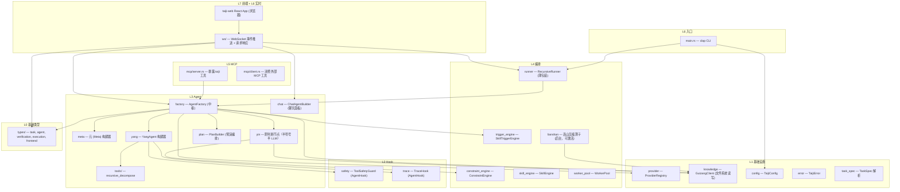

> **类型契约**：`Task` / `SkillAsset` / `VerificationReport` / `MetaContext` 等核心类型的字段契约以**代码为准**（`src/types/`），路径索引见 `AGENTS.md`「关键类型路径索引」——本蓝图不重复存字段列表。

---

## 4. 周易执行流

### 4.1 根任务执行序列

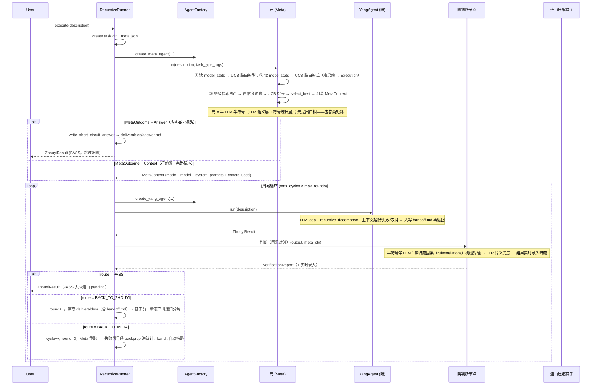

### 4.2 递归分解序列

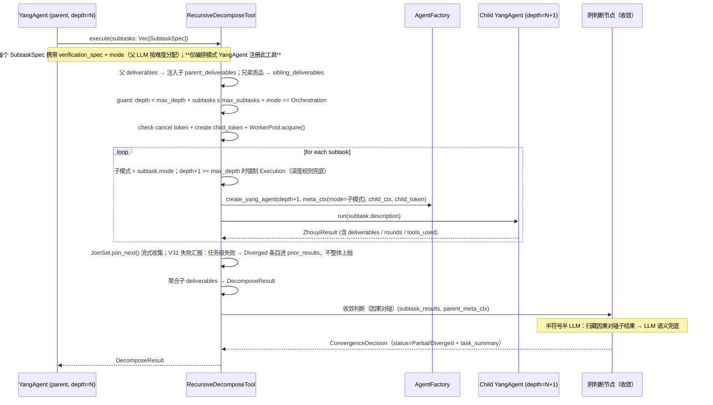

### 4.3 元相位（Meta）设计 — 半 LLM 半符号 + 短路出口

> **状态：蓝图定论。** 元 = **半 LLM 半符号的认知节点**（LLM 语义层 + 符号统计层永久融合），并作为**可能的出口相**——世界模型命中（应答类任务）时短路阳阴直接产出。

```
元 = LLM 语义层（先验，恒在） + 符号统计层（后验，渐强）

description → [LLM 语义层] → task_type tags + 难度先验
                              ↓
tags → [符号统计层] → 检索 + UCB 精排 + guard 公理 + 组装 → MetaContext
```

- **LLM 语义层**：任务种类判断、难度先验、资产语义粗筛、知识应答/交互讨论。语义分类不可符号化，元离不开 LLM。
- **符号统计层**：模型路由、模式路由、资产精排（UCB）、guard 公理、组装——全部是文件读取 + 数学运算（贝叶斯后验 × UCB bandit × 字符串选择）。
- **融合关系**：LLM 判断 = 先验，统计 = 后验，贝叶斯融合永久并存（非时间切换）。

**短路（元是可能的出口相）**：

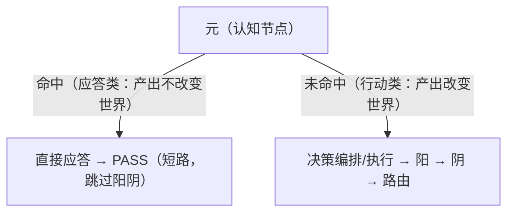

短路验证规则：**符号校验保底（引用真实性，ReferenceResolves 机械判据）+ 交互判断兜底（用户/父节点裁定）**；阴不做语义验证（LLM 验证 LLM = 同源概率回路，§1.3 禁区）。

**符号统计层 = 在归藏资产空间上的纯符号函数复合（Palantir 范式五层）**：

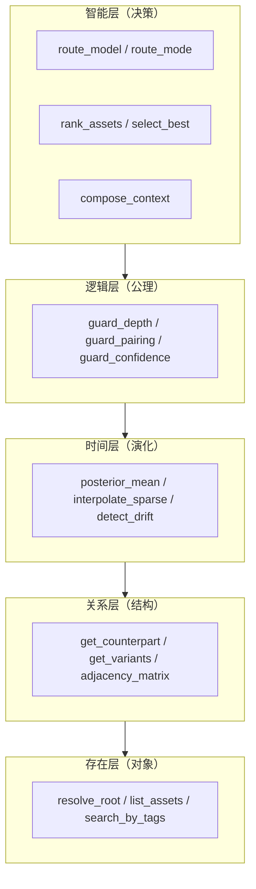

- **存在层**：解析对象空间（resolve_root / list_assets）
- **关系层**：对象间连接（变体树邻接矩阵、阴阳对偶二分图、贝叶斯后验关联）
- **时间层**：统计演化（后验均值、稀疏插值向上聚合、漂移检测）
- **逻辑层**：公理约束（**depth ≥ max_depth ⇒ mode = Execution** 叶子强制、模式-提示词配对、confidence ≥ 0.3 过滤）——符号层强制兜底，LLM 不可翻案
- **智能层**：决策函数（route_model / route_mode 全部 UCB bandit；rank_assets / select_best）
- **顶层组合**：`compose_context = 存在层 → 时间层+智能层 → 组装 → 逻辑层校验`

**路由分层（保持）**：模型路由三级独立决策、低级继承高级默认——任务级（`MetaContext.model`）、相位级（`verify_model` 异源裁判）、子任务级（`SubtaskSpec.model` 覆盖）。资产共享：所有相位/子任务使用同一根级资产树（模型维度仅影响统计键）。

**降级路径**（状态分支，非降级）：无匹配资产 → 下游按 mode 用硬编码 Base 模板；mode_stats 冷启动 → Execution 保守默认；model_stats 损坏 → 配置默认模型 + warn；guard_pairing 不配对 → degraded 标记不中断；guard_depth 触发 → 强制 Execution。

> **澄清（防误读）：半 LLM 半符号 ≠ 完全去 LLM。** 元从「全 LLM 编排」演进到「半 LLM 半符号」，剥离的只是**决策选择**（模型/模式路由、UCB 资产精排、guard 公理）——这些是确定性的统计拟合；**语义判断（task_type tags、难度先验、知识应答）永久留在 LLM**。

---

### 4.4 阴相位（判断节点）设计 — 半符号半 LLM 因果对碰 + 实时录入

> **状态：蓝图定论（V57）。** 阴不是 Agent——不持有 skill、不注册工具、不跑 SkillEngine。阴是**半符号半 LLM 的判断节点**，与元对称、顺序相反：元 = 半 LLM 半符号（入口，先语义后符号），阴 = 半符号半 LLM（出口，先符号后语义）。

```
阴 = 符号层（归藏因果，恒在·优先） + LLM 层（语义裁决，兜底）

阳产出 → [符号层] → 归藏因果机械对碰（rules/relations + 原子判据）
                          ↓ 符号可判定 → 确定性裁决
                          ↓ 符号不可表达 → [LLM 层] → 语义裁决（唯一 LLM 介入点）
                          ↓
                    裁决结果 → 实时录入归藏（后验智能）
```

- **符号层（优先·恒在）**：读归藏因果——`rules.yaml` type-level 规则（required/forbid 清单）+ `relations.yaml` type→type 边 + 原子判据（file-exists/schema-valid/reference-resolves/trace-consistency 等 Rust 内置）。机械对碰阳的产出，可判定即裁决，**LLM 不可翻案**。
- **LLM 层（兜底）**：只在符号层无法表达的语义判断处介入（如「review.md 的问题清单是否真覆盖审查范围」「产出的语义是否与任务意图一致」）。语义裁决是唯一 LLM 介入点，且不持有工具、不做概率采样执行。
- **实时录入**：阴的裁决（PASS/FAIL + 四维信号）直接回传对应资产 stats + models α/β——先验（因果）→ 验证（对碰）→ 后验（统计）在阴节点闭环。

**与元的关系**：元读归藏因果 = **先验智能**（「这个任务该是什么、依赖什么、禁止什么」）；阴用归藏因果对碰 = **验证**（产出是否符合世界模型预测）；阴的结果录入 = **后验智能**（因果准不准被统计修正）。先验、验证、后验三者在归藏世界模型上闭环，阴是「先验对碰现实产生后验」的转换节点。

---

## 5. 连山压缩算子（纯符号 · 三层压缩：统计 / 拓扑 / 语义）

> 连山 = 非线性流形上的压缩——把周易高维执行迹映射为归藏低维符号资产。纯符号层，零 LLM 调用。实现细节见 `AGENTS.md`。

### 5.0 连山哲学与三层压缩总纲

连山不是"后台数据挖掘"或"离线训练"。它是**周易任务树在符号空间的压缩投影算子**，对同一份离散迹做**三层正交压缩**：

| 层 | 压缩什么 | 输出（低维符号） | 谁做（V59 深浅分层） | 消费方 |
|------|------|------|------|------|
| **统计（度量）** | 「干了什么」→ 数字 | CheckStats 四维 + ModelAsset α/β + ModelStatsRow | **阴实时录入**（浅层 · 同步 · 单次判断即回传） | UCB 检索（前向）+ 演化决策（反向） |
| **拓扑（结构）** | 「要干什么/产出什么」→ 图 | manifold 迹拓扑（节点 + 边） | **连山**（深层 · 异步 · 跨任务） | 编译管道（迹→蓝图→skills） |
| **语义（因果）** | 「谁是谁/谁依赖谁/谁禁止谁」→ 关系 | ontology types/relations/rules | **连山**（深层 · 异步 · 跨任务聚合） | 元（先验注入）+ 阴（判断依据） |

| 压缩操作 | 输入（高维迹） | 输出（低维符号） | 消费方 |
|------|------|------|------|
| **贝叶斯后验** | 某资产在 N 次任务中的 PASS/FAIL | α/β 双参数（Beta 分布） | UCB 排序 / 演化决策 |
| **阴实时录入** | 阴判断结果（passed + cost + rounds + quality） | CheckStats（n/pass_count/cost_sum/rounds_sum/quality_sum） | 演化阈值判定 |
| **UCB 排序** | 候选资产 + ModelAsset 后验 | score = μ + C·√(ln N/(n+1)) 排序 | 元 (Meta) 检索注入 |
| **fork / merge / prune** | 根资产 + 统计信号 | 新变体 / 合并 / pruned 淘汰 | 下次检索新候选 |
| **模型路由** | (model_key × tag) 多维统计 | UCB bandit 选择最佳模型 | 元 (Meta) 路由 |

**压缩算子总图（五算子：输入 → 输出 → 消费方）**：

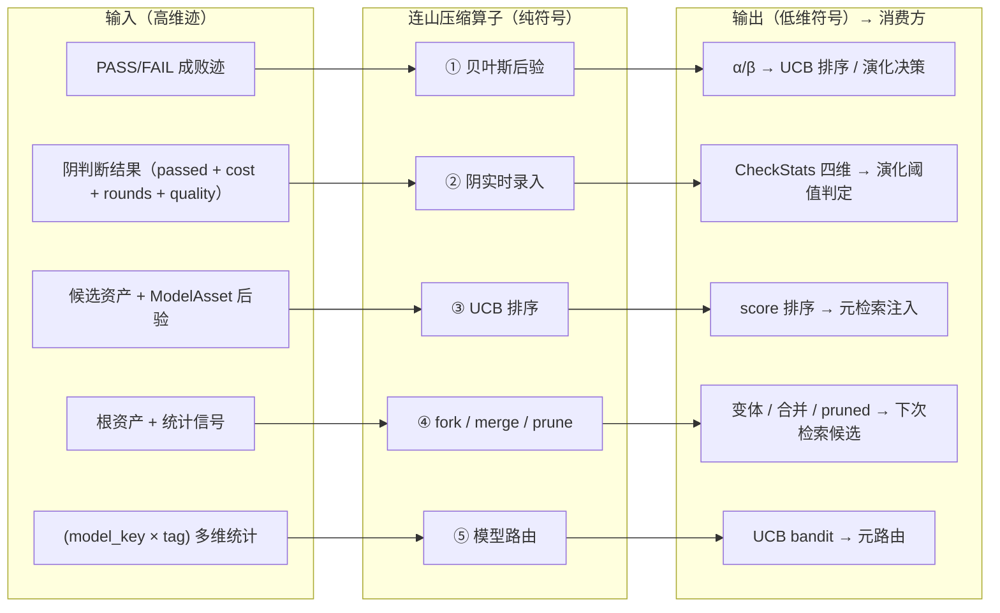

**连山的三个特征 + V59 定位：** ① **纯符号层**——所有操作是确定性数学运算，不调用 LLM；② **不产生新内容**——fork 是参数变体，内容演化留给人类种子或周易编译；③ **单写者**——连山是归藏唯一深层压缩写者，周易执行期间只读；④ **深层压缩**（V59）——统计回传（backprop）已移交阴实时录入，连山只做拓扑/语义/演化/编译（异步、跨任务）。

**连山的双重几何（山脊线 × 分水线，水蚀互塑）**：连山易别名「水书」——山脊线（参照系·测量统计：贝叶斯后验/UCB/model_stats）与分水线（流型载体·迹沿此分流演化：fork/merge/prune/backprop）的合体。山脊线是「分」（分解·测量·定位），分水线是「流」（分流·演化·载体）；但**水流通过水蚀法塑造山脉**——迹（流）经 backprop + evolve 持续重塑资产树（山），山又经检索注入引导后续流。山导流（前向），流蚀山（反向），同一棵树上的双向耦合。

**连山的本质（目的论：迹 → 蓝图 → skills → 新迹）**：周易的任务轨迹是一棵发散又收敛的树。连山收集高维迹 → 拓扑压缩为**蓝图文件**（`manifold/` 迹拓扑）→ 经编译固化为**标准 skills**（编译 = 一次周易任务执行）→ skills 回注新任务 → 新任务迹再被编译为新 skill——**不断扩张 LLM 智能，实现持续学习 + 可审计（git 版本化）/ 可溯源（trace + backprop）/ 可解释（符号化）的 AI 操作系统**。**其他所有数学方法（贝叶斯后验 / UCB / MCTS 四算子 / model_stats）都是为实现这条闭合目的论服务的。**

**迹 → 蓝图 → skills → 新迹（压缩即智能的闭合循环）**：

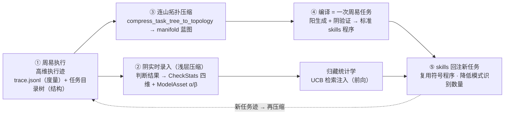

**流形 · 拓扑 · 统计压缩（三层定论）**：高维流型到周易递归文件夹时已离散为马尔可夫链——拓扑离散对象确定性可做（纯符号，零 LLM）。连山对同一份离散迹做两个正交操作：**统计压缩 = 度量**（收集「干了什么」→ 数字），**拓扑 = 结构**（提取「要干什么/产出什么」→ 图）。「非线性流型文件」名号降级为「迹拓扑」——流型只活在权重空间（连续）与变体树（离散骨架），蓝图文件是拓扑，不是流型。数据源分离：统计轨读 `trace.jsonl`，拓扑轨读任务目录树（`meta.json` + `deliverables/` + `handoff.md`），**不碰 trace.jsonl**。

**拓扑压缩（结构）——manifold 迹拓扑**：

**蓝图文件契约（迹拓扑，`knowledge/manifold/{root_task}.yaml`）**：节点 `Task/Asset/Deliverable/Handoff`，边 `Decompose/Invoke/Dataflow/Handoff/Verify`；`decompose` 边来自 `meta.json.parent_id`（精确）；deliverable 节点 id = 相对 root task_dir 的路径（树内唯一）。

**编译管道（拓扑压缩的消费）——迹 → 蓝图 → skills → 新迹**：

**编译任务契约**：连山拓扑产出后入队 `compile/{root_task}.json`，payload 引用 `manifold/{root_task}.yaml`。编译任务走既有 execute 入口（Execution 模式），「标准 skill 编写规范」元层模板教 LLM 按 `SkillAsset` 契约产出：程序 `implementations`（**执行体 = Python 脚本**）+ 说明书 + `dual` 对偶；验证 = 冒烟压测（python_engine 跑空 params）+ 阴判断节点对碰（归藏因果）。

> **V56 定论（V57 修正——编译产物只进阳面，阴判据 = 归藏因果）**：阴不再是 Agent、不持有 skill（V57）——编译产物（LLM 生成的 Python）**只能进阳面**（exec/orch 执行体），**永不进阴面判据**。阴的判断依据 = 归藏因果（rules/relations + Rust 内置原子判据），不是编译产物判据。阳面编译产物仍须冒烟压测（python_engine 跑空 params，验证可执行 + 返回合法 JSON）；冒烟失败 → recompile（≤3 次）→ 仍失败 `status=failed` 弃用。「正确性对拍」作废——编译产物不是判据，无需对拍。**因果链：阴判据必须是符号级（Rust 内置 + 归藏因果），LLM 生成的编译产物当判据 = 概率系统验证概率系统（§1.3 禁区）。`check-file-exists` 类「主动检查」编译产物归阳面 exec，其「验证文件存在」职责由 Rust 内置 `file-exists` 承担。**
>
> **V52 定论（资产层统一 Python = 编译管道可行的必要条件）**：若 skill 执行体是 Rust，阳 LLM 生成 Rust 代码 → cargo build → 集成进运行时 → 阴复跑，一个 fork 变体走完编译-链接-加载循环耗时分钟级，四算子不具实际可操作性；执行体统一为 Python 后，阳 LLM 生成 `.py` → SkillEngine 子进程执行 → 阴机械验证 → save YAML，fork→test→save 在**秒级**完成。因果链：**Python 是编译管道可行的必要条件 → 编译管道是「泛化-压缩-固化」循环闭环的必要条件 → 循环闭环是 taiji 存在的意义**。Rust 守住 invariant（内核），Python 释放演化速度（用户态）。
>
> **V50 调度定稿**：compile/ 队列由连山单写者管理（与 pending/ 分离），触发条件 = pending 空 + 预算允许；编译任务独立 token 预算，**不写入 model_stats**（只产 skill YAML，不污染路由统计）；失败不产 skill，重试上限 3 次。
>
> **V53 定论（编译即演化算子——优化走 compile）**：编译不是一次性固化，而是演化循环的一个相。连山 fork 发现低通过率的 **Python skill 执行体**时，**不 clone 执行体 + 改参数**，而是**入队 compile 重新生成执行体**。分工严守三条红线：**连山（符号层，零 LLM）只做「发现 + fork + 入队」；周易（compile 任务，LLM）重新生成 skill.py；连山（符号层，零 LLM）用 python_engine 压测裁决**。

### 5.1 同构映射：周易任务树 ↔ 归藏资产树

| 周易操作（任务空间） | 连山操作（资产空间） | 同构语义 |
|---|---|---|
| decompose（父拆解子任务） | **fork**（开变体新分支） | 生成新假设分叉 |
| converge（聚合子结果） | **merge**（近邻合并） | 收敛：成功模式归一 |
| FAIL / 路由终止 | **prune**（淘汰低效变体） | 终止：低效路径消亡 |
| child→parent stats | **阴实时录入**（四维统计 + α/β 更新） | 经验向上累积 |
| BACK_TO_ZHOUYI 重路由 | **UCB 探索项激活新候选** | 不陷入局部最优 |
| BCP（人类设计）→ 任务执行 | manifold → skills（经周易压缩为可复用程序） | 设计→执行→固化 |

### 5.2 UCB 检索（统计的前向消费）

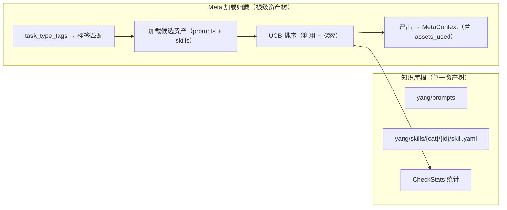

检索策略：标签精确匹配 → 关键词子串搜索 → **UCB 排序**（非纯 confidence）：

```
score = avg_reward + C · √(ln N_total / N_node)
      · 利用项 = avg_reward：已验证好资产
      · 探索项 = C·√(ln N_total / N_node)：样本少/新变体的加分
```

- `avg_reward` 来自 CheckStats；`N_total` 为候选集总采样数，`N_node` 为节点采样数
- **N=0 冷启动 = 先验 μ + 有限探索分**（n+1 平滑，非 ∞ 特判）——先验 μ 由 `confidence` 映射（α=1+k·c, β=1+k·(1−c)），避免纯随机遍历（V50 定稿，取代旧「最大探索分」）
- **统计选择门槛**：`n < min_samples` 的资产不参与利用排序，只走探索分——防止小样本假置信
- env_tags 与当前环境指纹不匹配的候选**降权 ×0.5**（非过滤）；不支持向量嵌入，无关系图扩散
- **确定性保证（硬约束）**：n+1 平滑而非 n=0→∞ 特判；μ 缺失时回退 confidence 直接映射——全冷启动时 score = 先验 μ 降序（与 read_dir 顺序无关）

### 5.3 演化决策（统计的反向消费）——MCTS 四算子

> **激活条件：** 归藏各层有足够资产 + 累积 50+ 周易执行轨迹；统计选择需 `n ≥ min_samples`。

**回报函数（写死进 BCP，config `runtime.lianshan.reward_weights` 可覆盖）**：

```
decision = w_pass·μ + w_quality·avg_quality − w_cost·cost_norm − w_rounds·avg_rounds
默认: w_pass=0.5  w_quality=0.3  w_cost=0.2  w_rounds=0.1
μ = Beta 后验均值（空 map 回退频率 pass_rate）；cost_norm = 组内归一化成本 [0,1]
```

> **V51 定论（决策接线）**：fork/merge/prune 六算子统一以四维回报为决策值——**成本与质量真正进入归藏的物竞天择**：贵而通过的资产被 fork 改造（生成更省/更严的变体），便宜高质的被保留。pass 项用后验 μ 承载采样不确定性；cost 必须归一化（原始 token 量级 ~1e5 会以 4 个数量级碾压其他维度）。V50 预留的多组权重 profile / Pareto-MCTS 仍为已知边界（§5.6）。

- `pass_rate`：PASS 占比；`avg_quality`：质量分均值（route 映射 × confidence，派生非新增字段）；`avg_cost_tokens`：trace input_tokens 累加均值；`avg_verify_rounds`：BACK_TO_ZHOUYI 次数均值（收敛速度倒数）
- **四维信号全部来自既有数据——零新增持久化文件。** 回报函数即连山的改进方向（更省 token / 更精准 / 更快收敛 / 更高通过率），由系统价值判断写死，不由 LLM 自定

**压缩的数据流（V59 深浅分层：阴实时录入 = 浅层，连山 = 深层）**：

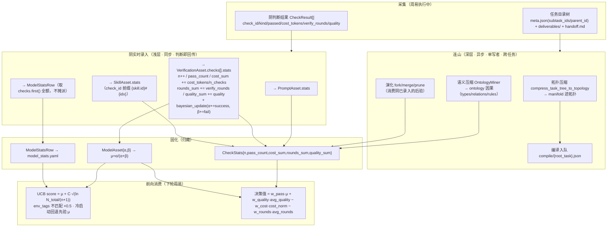

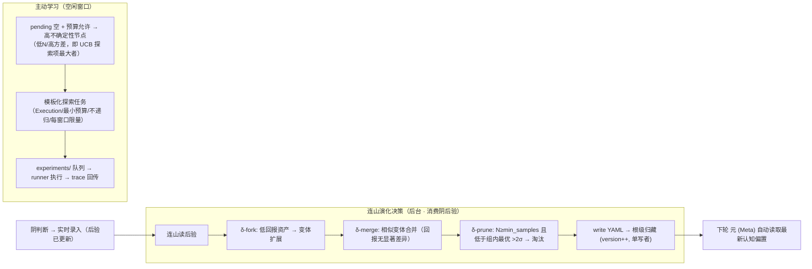

**探索机制（被动 + 主动学习）**：

**被动学习（任务驱动）**：周易 PASS → pending 入队 → 统计回传——只能在任务发生时学习。

**主动学习（信息增益驱动）**：连山在空闲窗口选高不确定性节点 → 模板化探索任务（静态模板，不调 LLM）→ 入 experiments/ 执行 → trace 回传。**护栏：① 探索任务不产生新探索任务（无递归）；② 连山纯符号层承诺保持；③ 危险隔离——只有 `safe_for_exploration=true` 的资产进入探索候选（默认 false，write/bash 类高危执行体不参与主动学习）；④ 冷启动 = 先验 μ + 有限探索分。**

**时序分离**：周易执行与连山写入不并发（周易只读，单写者互斥）；主动学习在空闲窗口进行。

**元权重表（model_stats.yaml）**：`model_key → StatsRow(n/pass_count/cost_sum/quality_sum/rounds_sum)`，存于 knowledge 根，由阴实时录入更新，ModelRouter 读取——同一 UCB/bandit 机制服务资产选择与模型路由。**回传数据源来自阴判断结果（四维信号），非连山 backprop（V59）。**

### 5.4 环境维度轴（env_tags = 模型类）——统一主动学习轴（V50 定稿）

**问题**：V44 去分区化后 prompt/skill 的 backprop 统计是**全局的**——一个 prompt 被强模型用成功、被 flash 用失败，全局平均后「看起来还行」，merge/prune 不淘汰它——**它永远学不会「对 flash 单独优化」**。

**定论**：`env_tags` 是**统一环境维度轴**，模型类（model class）是首要环境维度。所有归藏资产（prompts / skills / verifications）的检索、演化、主动学习都按环境维度隔离——**不是给每类各写一套主动学习机制，而是共用「env_tags 隔离 + UCB 维度内排序 + 四算子维度内演化」同一条轴**。

**模型类指纹**：`model_class(key) = key 含 flash/lite/mini/small → "flash"；其余 → "strong"`；`current_env_tags = [model_class]`（空 = 无维度不降权）。

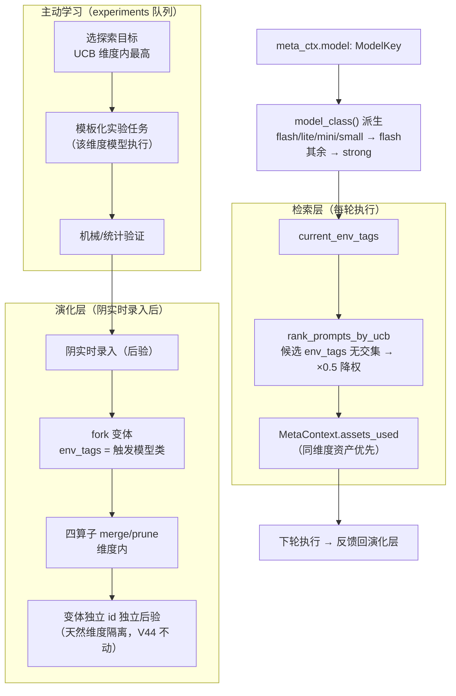

**边界（三不）**：① **不推翻 V44**——统计仍按变体 id 隔离，不按模型复制资产树；② **不改 Rust 硬编码元层宪法**（meta/yang/yin 模板是代码，不参与主动学习）——宪法自适应靠**资产层变体覆盖**（V45 双轨同 id 优先）；③ 统计后验天然按变体 id 隔离，无需按模型复制资产。

### 5.5 漂移检测与退化诊断（V50 定稿）

**问题**：UCB1 是平稳环境假设——资产积累大量历史 N 后探索项被长期压制，环境漂移（换模型/任务分布迁移/增删约束）时旧统计误导路由，陷入「一直试曾经好、现已不对」的局部最优。

**DriftMonitor 契约**（轻量、后台、与 UCB 解耦）：

| 要素 | 定稿 |
|------|------|
| 窗口定义 | 按采样数（每 10 次采样一个窗口），非按时间（任务稀疏时时间窗口空转） |
| 判定规则 | 最近 k=3 个窗口 pass_rate 单调下降 且 首尾差 > 0.1 → 漂移警报 |
| 动作·轻度 | 降级该资产 `confidence`（只影响筛选，不动历史统计） |
| 动作·重度 | 触发 fork 开变体（strictness 档位参数化）+ 日志供人工审查 |

**退化诊断（SkillResult 粒度）**：同一 Skill 下检查项级 pass_rate 的**方差** > 阈值（默认 0.3）→ 标记 `degrading` 风险 → 触发 downgrade + 日志，**不自动 prune**（prune 仍走硬门槛）。

### 5.6 已知边界（非缺陷，延后项）

- **非平稳 bandit**：暂不换 SW-UCB / Discounted-UCB——先打通「漂移检测 → fork/降级」通路（§5.5），折扣窗口延后
- **多目标优化**：保持线性标量化（MVP 妥协）；Pareto-MCTS / 多目标 MCTS 列为后续，四维原始信号已持久化
- **奖励归一化**：cost/quality 量纲差异已由 V51 cost_norm 部分解决；完整多目标归一化延后
- **子任务资产归因**：迹拓扑 MVP 只产根级 `invoke`/`verify` 边，子级归因延后
- **编译原任务变体复跑**：编译任务阴验证 MVP 只做机械判据 + 冒烟压测；「复跑原任务验证复现」未实现

### 5.7 本体挖掘（语义压缩）——OntologyMiner 语义层增长引擎（V50 定稿）

**问题**：连山只「调分不产语义」——backprop/UCB/四算子优化的是数字，产出不了「谁是谁、谁依赖谁、谁禁止谁」。若只停留在「统计拓扑」就是「聪明的统计机器」，不是「真正的智能体」。

**定论：Ontology = 词汇表 + 拓扑 + 逻辑（三层），连山纯符号挖掘后两层，词汇表人工种子 + 挖掘增长（命名走 compile）。**

| 层 | 回答的问题 | 来源 | taiji 落点 |
|------|------|------|------|
| **词汇表（Taxonomy）** | 「A 是什么」——受控语义类型 | 人工种子 + 挖掘增长（命名走 compile） | `ontology/types.yaml` |
| **拓扑（Topology）** | 「A 依赖谁」——type→type 边 | 连山从 id 共现抽象（纯符号） | `ontology/relations.yaml` |
| **逻辑（Logic）** | 「A 在何时绝不能/必须」——type-level 规则 | 连山从失败×env_tags 挖掘 + 人工种子 | `ontology/rules.yaml` |

**关键定论（类型抽象）**：纯统计拓扑挖出的是 **id→id 硬连接**（`DeployToK8s → CheckImageVulnerability`）——死板，新资产无法替代。完整 Ontology 的边必须打在**类型**上（`DeployAction →[requires]→ SecurityCheck`），消费端做**类型级软查询**——新资产自动可替代，系统「活」了。**互斥边不挖**：`OntologyEdgeKind` 只含 `WeakDependency` / `Sequence`，不含 `Forbid`（负相关留给 SafetyHook + 人工 rules.yaml）。

**三个挖掘态射（纯符号，零 LLM）**：`Mine_Dependency`（共现 → 联合通过率提升 → type→type 边）、`Abstract_Concept`（高频序列 → 未命名类型簇，延后）、`Extract_Constraint`（失败 × env_tags → type-level 规则）。门槛：共现 ≥ 50 且联合通过率 ≥ 0.8；失败样本 ≥ 50 且失败率 = 1.0。

**双消费（元先验 + 阴判断，零新增 LLM 调用）**：① `resolve_entity`（实体链接）**合并进既有 compose LLM**——Meta 仍是 1 次 LLM；② `semantic_expand`（类型级软查询，纯符号）——查 type→type 边 → 该类型所有资产间跑 UCB，1 层展开防递归爆上下文；③ `validate_logic`（类型级约束，纯符号）——rules 匹配 → required/forbid 清单；④ **阴判断节点**读同一套 ontology（rules/relations）作为判断依据——阴的「对碰」就是「产出是否满足世界模型因果」的符号检查（V57）。

**双轨注入（复用已有机制）**：软约束（建议路径 + 推荐资产）→ 阳 prompt；硬约束（required/forbid 清单）→ 阴判断节点的符号层（ConstraintEngine 升级为「元层 4 truth ∪ rules.yaml 挖掘规则」），机械对碰，LLM 不可翻案。

**四条红线**：① **连山纯符号**——挖掘态射零 LLM，命名走 compile；② **先验≠后验**——挖掘边/规则是「先验智能」，仍经 UCB 排序，不替代统计学习；③ **无降级**——ontology 读失败 = 归藏 I/O 硬错误上抛；「未命中任何类型/边」= 状态分支（回退纯 UCB），非错误；④ **防正反馈锁死**——挖掘产物经 git commit 版本化，**下轮才读**（写入本轮不消费）。

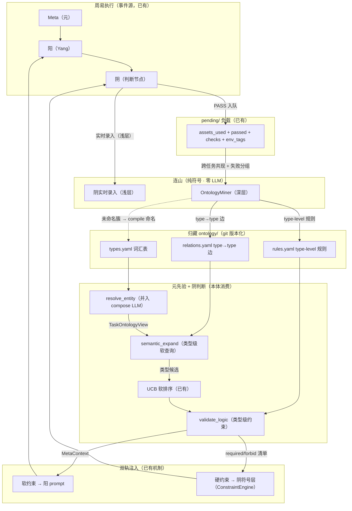

**MVP 边界（实现顺序）**：MVP-1 = `Mine_Dependency`（prompt 共现 → type→type 边）+ `semantic_expand` + ConstraintEngine 升级消费 rules.yaml；MVP-2 = `Extract_Constraint`；延后 = `Abstract_Concept` + skill 级共现。

### 5.8 本体工程的晶体归藏定论（V58）——观测坍缩为二值

> **状态：蓝图定论（V58 修正）。** V57 后 ontology 从「增强层」升格为**认知中枢**——阴的判断依据 + 元的先验 + 后验录入都落在它身上。V58 定论：**归藏是晶体智能**——确定、可观测、二值，不是概率性的东西。它被观测的瞬间就坍缩成区分二值（存在/不存在）。

**原则 1：二值存在——边/规则是观测事实，不是概率分布**

| 认知对象 | 表示 | 存在性判定 |
|---------|------|-----------|
| 因果边 | type→type + strength + samples | 挖掘判定（strength ≥ 阈值 && samples ≥ min_samples）= 观测坍缩 → 存在（1）或不存在（0） |
| 规则 | when/require/forbid + severity | 同上，二值生效 |
| 资产价值 | Beta(α/β) 后验（模型路由/演化决策用） | 这是**决策层概率**，不沉淀进 ontology 因果 |

**关键**：OntologyMiner 挖掘产出的是**二值判定结果**（观测坍缩），不是「假设 + 概率」。挖掘判定通过 = 边存在，写入即生效（下轮才读，§5.7 红线④）；判定不通过 = 边不存在。不存在「半存在」的中间态。

**原则 2：观测强度 ≠ 存在概率**——`strength`（联合通过率）是「观测 N 次、通过 M 次」的精确统计（晶体数据），不是「边存在的信念强度」（气体概率）。强度是已存在边的观测属性，供审计/未来加权；它不回答「边是否存在」。

**原则 3：概率分层——概率只活在决策瞬间，不沉淀进归藏**

- **晶体（归藏）**：观测事实 + 二值因果 + 元层宪法——确定的自上而下约束（Ψ）。
- **气体（LLM 生成）**：阳的创造、元的联想——发散、熵最大。
- **流体（阳阴循环）**：LLM 在归藏约束下的动态平衡——临界态，智慧所在。
- 概率（如 model_router 的 UCB 后验）属于**决策层临时态**，不 commit 进资产契约（AGENTS.md §20「save_model_stats 有意不 commit」）。归藏里存概率 = 把晶体气体化，约束软化。

**保留：相关 ≠ 因果，干预验因果**——OntologyMiner 挖「共现 + 联合通过率」是**相关**，非**因果**（混淆变量或偶然）。严谨因果需**干预**（Pearl do-calculus）：连山提候选边，主动学习构造「固定其他变量、只变 A」的探索任务，观察 B。干预结果仍是**二值裁决**——证实 → 边保留；证伪 → 边删除。`safe_for_exploration` 是干预实验的危险隔离闸。（待实现）

**护栏 1：变点检测（防环境漂移误导）**——世界动态 ≠ 环境静态。旧后验在旧环境收敛，环境一变即误导（「一直试曾经好、现已不对」）。§5.5 DriftMonitor 是启发式，严谨做法 = 贝叶斯变点检测（Bayesian changepoint / CUSUM）——检出变点即降权/重置旧后验，让系统「重新学习」而非「执拗用旧认知」。

**护栏 2：防正反馈锁死**——挖掘产物「下轮才读」（§5.7 红线④）+ git 版本化是工程护栏；晶体二值天然防锁死（边不存在时完全不生效，不会「半生效」主导决策）。

**V57 对目标层 / 稳态 / 延迟验证的覆盖（原 §7.1 议题，V58 收编）**：V57 的「归藏实时反馈 + 阴动态判断」天然覆盖「目标（goal）非任务（task）」——外部世界信号（数字/布尔符号）作为**延迟验证**实时录入归藏，更新观测（二值坍缩）；阴判断节点用更新的世界模型动态对碰，系统进入**稳态**（持续执行 + 持续反馈 + 持续调节），而非「一次性 PASS 硬冲」。稳态 = 动态调节系统的常态；延迟阴裁决 = 外部符号信号经归藏实时录入通道回注（前置约束不变：外部反馈必须是可机械判定的符号信号，非 LLM 判断，§1.3）。

---

## 6. 归藏符号固化

> 归藏 = 智能的离散符号形态（宪法 + skills + 统计学，git 版本控制）。字段契约等实现事实见 `AGENTS.md`。

### 6.0 归藏哲学

> **智能的本质（第一性原理）**：在不确定环境中，把经验压缩成可预测、可行动的世界模型，并在行动中检验和修正它。
>
> **流形 = 因果**：非线性流形（冻结权重大模型）本身就是现实世界因果关系的连续表征。LLM 的局限不是"不懂因果"，而是**不稳定**（涌现概率性）+ **无法更新**（权重冻结）。
>
> **归藏储存的就是智能**：智能 = 因果结构的表征，有连续形态（流形）与离散形态（归藏符号）两种**同构**形态。归藏是智能的离散符号形态——显式、可读写、可组合、稳定、可累积。
>
> **skill = 智能程序**：`skill = 文本组件（提示词/知识）+ 程序组件（可复用程序/工具）+ 工作流组件（编排）`。LLM 处理不确定、程序处理确定、工作流决定何时交给谁；**稳定性来自程序组件**——程序锚定涌现，程序组件比例决定 skill 稳定度。
>
> **压缩 = 提取可程序化的部分**：连山（形态转换的压缩算子）把一次智能涌现压缩为 skill，本质是**从涌现中识别可锚定的部分并固化为程序**。
>
> **归藏 = 实时反馈的世界模型（V57）**：归藏所有资产（prompts/skills/models/ontology）拥有**实时录入反馈**——阴判断节点的裁决（通过/失败 + 四维信号）实时回传对应资产 stats + 后验。归藏不是「异步批量压缩的库」，而是「实时反馈的世界模型」：先验（因果）→ 验证（对碰）→ 后验（统计）在阴节点闭环，下一轮元读「先验 ∪ 后验」更准的因果。

归藏有四层次，对应智能的四种符号形态：

| 层次 | 目录 | 语义 | 消费方 |
|------|------|------|------|
| **系统宪法** | `yang/prompts/` | 保证系统运行的地基（环境信息、安全约束、激励策略） | 元 (Meta) 检索 → YangAgent system prompt |
| **智能函数库** | `yang/skills/`（orch/exec） | 智能的封装单元（阳面执行体，可演化 Python） | SkillRegistry 工具注册（仅阳面） |
| **统计学** | `models/` + `model_stats.yaml` | 能力边界（被测试出来的）——贝叶斯后验 + 四维 stats + 路由表 | 元 (Meta) UCB bandit / 连山演化决策 |
| **因果** | `ontology/`（types/relations/rules） | 世界模型的因果结构——词汇表/拓扑/逻辑三层 | 元（先验注入）+ **阴（判断依据）** |

> **V57 废弃 `yin/prompts/` 与 `yin/skills/`**：阴不再是 Agent——不持有 system prompt、不注册 skill。原子判据（file-exists/schema-valid/reference-resolves/trace-consistency 等 Rust 内置）保留为**因果规则编排的工具**（在约束引擎内，不落 yin/skills 资产）。旧 yin/ 资产迁移或废弃。

**前向数据流（三类资产 → 周易三相消费）**：

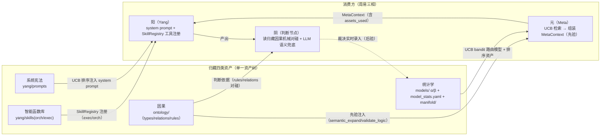

**git 版本控制（库的生命线）**：归藏目录 = 一个 git 仓库。阴实时录入（浅层）+ 连山压缩（深层）每次写 = 一次 commit（可审计/可 diff/可回滚）；fork = 分支、merge = 合并、prune = 删除（历史保留）。

**符号固化 · 资产生命周期（涌现 → 压缩 → 固化 → 回注）**：

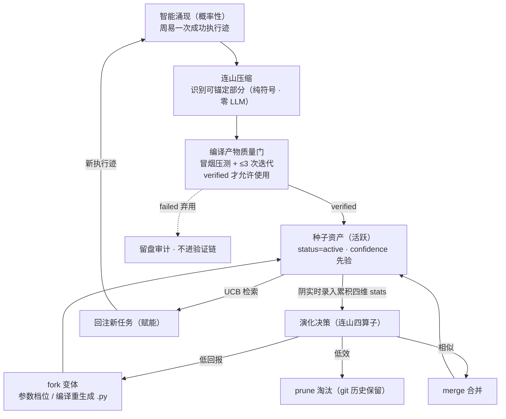

**渐进式披露（skill 文本机制）**：skill 文本分三层披露——层 0 `summary`（一句话，进 tool 列表）、层 1 `description`（几行，进 LLM 决策）、层 2 `detail`（完整涌现文本，调用后按需加载）。库可富、披露可俭。

**阳执行资产与归藏因果（V57：对偶 = 阳执行体 ↔ 归藏因果）**：yang（阳轨：生成/执行/分叉）是归藏树中唯一的执行资产；阴不再持有资产（无 yin/prompts、无 yin/skills）。对偶不再是「阳 Skill → 阴 Skill 资产」，而是「阳执行了什么 → 阴该对碰什么」的因果映射——由 ontology rules/relations 表达，由元分配。

| 目录 | 内容 | 对偶原则（V57） |
|------|------|------|
| `yang/prompts/` | 阳系统提示词（orch-yang / exec-yang） | 元 (Meta) 检索注入 YangAgent |
| `yang/skills/orch/` | 编排执行体：递归拆解、子任务派发 | 对偶 = 归藏因果中的收敛规则（mece-check 等原子判据） |
| `yang/skills/exec/` | 执行执行体：write / bash / search / webfetch / read | 对偶 = 归藏因果中的验证规则（file-exists 等原子判据） |
| `ontology/` | 因果：types/relations/rules | 阴判断节点的判断依据（先验） |

**阳执行体与阴判断的结构隔离（V57）**：阳（唯一 Agent）注册 exec/orch 执行体（执行权）；阴（判断节点）不注册任何工具——只读归藏因果 + 阳的产出。隔离由结构保证（阴不是 Agent、无注册面），不靠工具注册面隔离。**核心约束：任何阳执行体无对应的归藏因果规则 = 该操作未经符号层验证 = 概率系统自己验证自己 = §1.3 禁区。**

### 6.1 单一资产树模型（V44 去分区化定稿）

**归藏单一资产树（V44 去分区化 · V57 阳唯一执行资产）**：yang=生成/执行/分叉（decompose）是归藏树中唯一的执行资产；阴不持有资产（无 yin/prompts、无 yin/skills）。Skills 嵌套在 yang/ 之下，类别由阳归属 + 子目录共同定义。**每 Skill 一个文件夹**（演化单元），入口文件统一 `skill.yaml`。

**双轨原则（V45 修正，V52 资产层统一 Python，V57 阴去资产化）**：阳种子工具（read/write/bash/search/webfetch）硬编码于 Rust 元层注册表（保证基础运行，零资产依赖——知识库空/损坏时基础 Zhouyi 闭环照常）；原子判据（file-exists/schema-valid/reference-resolves/trace-consistency）为约束引擎内 Rust 内置（V57 后非 skill，不落 yin/skills）。资产层是可演化覆盖层——同 id 资产优先于元层。**资产层可演化 Skill 执行体统一为 Python（仅阳面 exec/orch——fork 变体、编译产出、主动学习实验体），作为 bootstrap 安全网。**

**修正后的分层模型（Rust 内核 / Python 用户态）**：Rust 是内核（kernel + syscall）——递归执行、Agent 工厂、SkillEngine、归藏 I/O、连山压缩全部是编译期 invariant，不可演化；Python 是用户态（user space）——所有可演化 skill 统一为 Python 脚本，经 SkillEngine 子进程执行，脚本内部可 `subprocess.run(["taiji", "builtin", ...])` 调 Rust 种子层原语（用户态程序调 syscall）。内核不变，用户态可任意演化——操作系统经典分层。

```text
┌─────────────────────────────────────────────┐
│  Rust 骨架（不可演化，编译期 invariant）        │
│  RecursiveRunner / AgentFactory / Meta       │
│  YangAgent / SkillEngine                    │
│  GuizangClient / Lianshan / UcbRanker        │
│  ┌──────────────────────────────────────┐    │
│  │  Rust 种子层（bootstrap，零资产依赖）   │    │
│  │  read / write / bash / search / webfetch │ │
│  └──────────────────────────────────────┘    │
│  ┌──────────────────────────────────────┐    │
│  │  原子判据（约束引擎内，V57 后非 skill）  │    │
│  │  FileExists / SchemaValid / ReferenceResolves │
│  │  TraceConsistency / CommandSucceeds  │    │
│  └──────────────────────────────────────┘    │
├─────────────────────────────────────────────┤
│  Python 资产层（可演化，连山四算子操作对象）      │
│  fork 变体 / 编译产出 / 主动学习实验体（仅阳面）  │
│  ┌──────────┐ ┌──────────┐               │
│  │orch/     │ │exec/     │               │
│  │.py skills│ │.py skills│               │
│  └──────────┘ └──────────┘               │
├─────────────────────────────────────────────┤
│  归藏统计层（YAML，符号持久化）                 │
│  models/ α/β · model_stats.yaml · manifold/ │
└─────────────────────────────────────────────┘
```

> **V53 定论（skill 嵌套 skill——用户态调用户态）**：V52 打通「用户态调 syscall」（Python skill → `taiji builtin` → Rust 种子层），但「层层嵌套压缩」在第一层后断裂——编译产出的 skill 只能嵌套 builtin，嵌套不了上一次编译产出的 Python skill。补「用户态调用户态」：`taiji skill <id>` 子命令，Python skill 可调其他资产层 Python skill。护栏：**嵌套深度限制**（复用 max_depth 语义）+ **循环调用检测**（运行时检出拒绝）。「组合」完全落在压缩语义里：新 skill = 一段已验证成功迹 + 子 skill 引用的原子封装——外部仍是可被 UCB 排序/四算子演化的单点资产，内部才是嵌套调用图（**新 skill 嵌套 skill，不是 skill 连 skill**）。

**根级资产树运行时行为**：

| 层 | 资产类型 | 消费方 |
|:---:|------|------|
| `yang/prompts/` | 阳系统提示词 | 元 UCB 检索 → YangAgent system prompt（每轮执行） |
| `yang/skills/orch/` | 编排 Skill | 元 UCB 检索 → YangAgent（Orch）注入 |
| `yang/skills/exec/` | 执行 Skill | SkillRegistry → YangAgent 工具注册 |
| `ontology/` | 归藏因果（types/relations/rules） | 元先验注入 + 阴判断依据 |
| `models/` | 贝叶斯后验（α/β） | UCB 排序权重（跨任务累积） |
| `manifold/` | 迹拓扑 | 编译管道输入（§5.0 契约） |

**模型-领域学习单元（统计层隔离）**：资产树单一共享，领域学习单元在**统计层**区分——**模型提供概率地形**（猜想源：LLM 生成候选），**归藏因果（ontology rules/relations + 原子判据）提供机械判据**（反驳源：阴判断节点对碰），**统计（model_stats + models/ 贝叶斯后验）提供累积**（选择源：阴实时录入 + 连山演化）。推论：**Skill 粒度自适应**——统计按模型区分 → 弱模型通过率低 → fork 更小粒度的原子 Skill；强模型通过率高 → fork 更大的组合 Skill；变体树共享资产树、统计独立。

**种子复制（`taiji seed <source_key>`）**：把源分区活跃种子资产（`yang/prompts/` + `yang/skills/` 中 status != pruned，V57 后仅阳面）文件级复制到本知识库根。**不复制 `models/`**（贝叶斯后验 = 累积，新单元从零开始）。幂等：目标已存在同名资产 → 跳过。

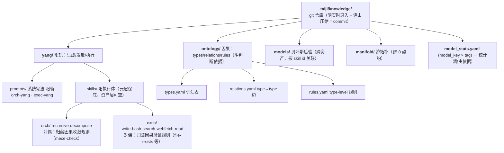

---


