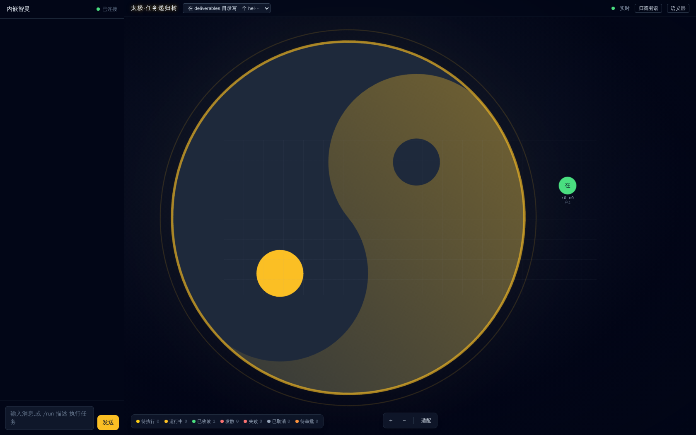
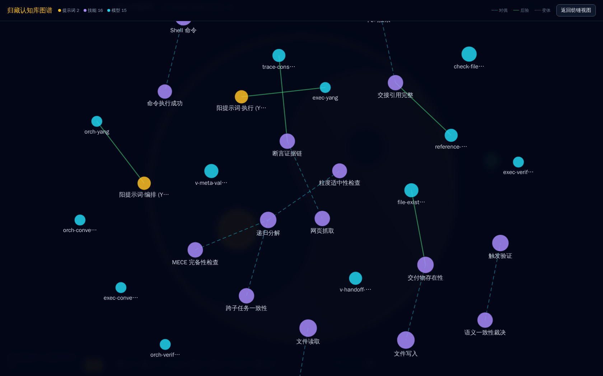
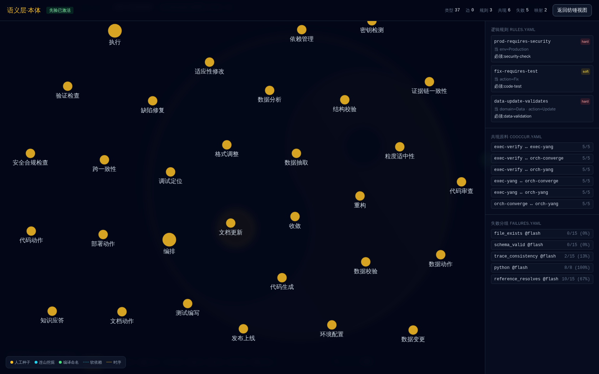

# 太极 taiji

> 周易 · 连山 · 归藏 —— 一个在持续自证的认知内核实验系统。

**先别问它是什么。先看三个问题：**

1. 这个仓库里有几段 Python 代码，**不是人写的**——是这个系统从自己的执行迹里编译出来的。
2. 这个仓库的知识库里，**判据的"版本号"自己长到了 14**——不是人改的，是系统的演化算子改的。
3. 这个系统**给自己记了 252 份快照**——每一次它学会新东西，都会自己 commit 一次。

下面是对这三件事的解剖。

---

## 解剖 1：它编译了自己的工具

`taiji run "编写一个 Python 脚本…"` 产生的任务迹，被连山压缩成拓扑蓝图，然后系统自己执行了一次"编译任务"，产出了这段代码：

```python
#!/usr/bin/env python3
"""Skill: check-file-exists —— 文件存在性检查。

编译自迹拓扑「编写一个-Python-脚本-接收一个文件路径参-20260815-193552」：
该任务产出 check_file.py 并以 file-exists 等检查机械验证。
原子可复用能力 = 接收文件路径参数，判定文件是否存在。
契约：stdin JSON 入参，stdout JSON 返回；30s 内确定性完成，不调 LLM。
"""
```

注意这个 docstring 里的**自指**：这段代码记录了"我是从哪次执行迹编译来的"。它不是手写工具库，是**执行经验的固化产物**——一段曾经有效的执行迹，被压缩成了可复用的程序。而程序内部还会调 `taiji builtin read`——**用户态程序调用内核原语**，教科书级的自举结构。

> 这正是「能力与参数解耦」的物证：这段能力不来自任何模型权重，来自「非线性流形 → 马尔可夫链 → 拓扑蓝图 → 建造工具」的循环。

## 解剖 2：它演化了自己的判据

```
.taiji/knowledge/models/check-file-exists.yaml:
  alpha: 10.0   beta: 10.0    ← 贝叶斯后验，系统从执行结果里学出来的
.taiji/knowledge/yang/prompts/exec-yang.yaml:
  version: 14                  ← 系统提示词宪法，被演化算子改到第 14 版
.taiji/knowledge/.history/:    ← 248 个快照，系统自己 commit 的记忆
```

- **每次阴节点裁决，系统把结果实时录入对应资产的贝叶斯后验**（α/β 更新）。
- **低通过率的资产被 fork 成变体**（如 `semantic-coherence-v1`，strict 变体），高通过率的收敛合并，无效的 prune 淘汰。
- **每一次演化都自动 commit**——252 份快照不是备份，是系统的**自传**。

## 解剖 3：它挖出了自己的因果

```
.taiji/knowledge/ontology/rules.yaml:

  - id: prod-requires-security
    when: { env: Production }
    require: [security-check]
    severity: hard

  - id: fix-requires-test
    when: { action: Fix }
    require: [code-test]
```

这些 type-level 因果规则是**先验种子 + 系统从共现/失败统计中挖掘**的产物。它们不是文档——是**阴判断节点的硬约束**：阳的产出必须机械对碰这些规则，违反即驳回。元把它们当先验注入，阴把它们当判据裁决，裁决结果又回流修正它们。

**先验 → 流体（概率生成）→ 后验 → 更强的先验。** 这是「基于本体论的流体智能」的闭环。

---

## 这个系统要验证与证明什么

### 目的之一：能力与参数解耦

**能力不在参数里，在循环里。**

```
非线性流形（LLM 权重） → 马尔可夫链（概率采样的执行） → 拓扑蓝图（压缩出的结构） → 建造工具（固化出的程序）
        ↑                                                                              │
        └──────────────────────────────── 回注，进入下一轮 ─────────────────────────────┘
```

参数只是载体；能力是这个循环的结构本身。太极的存在，是为了验证"能力可以被**从参数中剥离出来、放到循环里**"——而不是只能靠扩大参数规模去逼近。

### 目的之二：先验与后验之间的流体智能

**基于本体论的先验，与流体的后验，构成智能体真正的增益来源。**

```
本体论（ontology 因果）→ 先验注入（"这任务该是什么、依赖什么、禁止什么"）
        ↓
流体（阳：概率采样、发散探索）—— 被先验锚定过的采样
        ↓
后验（阴：用本体论对碰产出，确定性裁决）—— 结果回写入本体论
        ↓
下一轮的先验更强 → 循环
```

「流体智能」不是 free lunch 的概率采样，而是**被本体论先验锚定过、又被本体论后验修正过的**概率采样。

## 四条第一性原理

1. **异层同构 · 对称性** —— 这个世界只有一个动力学模式，在不同尺度上重复它自己。单任务节点、任务树拆解、资产演化，是同一个阳 → 阴 → 元 → 再阳的模式在三个尺度上的投影。

2. **泛化 ↔ 压缩的持续变化闭环** —— 智能不是"泛化"或"压缩"的单一过程，而是二者持续交替变化的闭环。非线性流形是智能在这个进程中的载体；三相（阳 / 阴 / 元）之间有相变、有转化、也有互补——不是分工，是相变。

3. **概率系统不能验证概率系统，观测是确定的** —— 一个概率采样出的产出，不能由另一个共享同一盲区的概率系统去判定。验证必须落在确定性符号上。**尤其，相变会改变绝对概率**：相变前后的状态属于不同的概率面，不能用相变前的采样去验证相变后的状态。

4. **执行事实是唯一记忆锚点** —— 所有推理时的记忆与缓存，在采样之后必须抛弃。跨层、跨时间传递的只有**执行事实**（产出物）。上下文窗口是单次采样的空间，不是记忆仓库。

## 三条主线（周易 · 连山 · 归藏）

| 相 | 语义 | 本质 |
|----|------|------|
| **周易** | 变 · 泛化 | 执行 = 马尔可夫链，每次任务 = 一次蒙特卡洛 rollout |
| **连山** | 藏 · 压缩 | 非线性流形发现：把高维执行迹压缩为低维符号（纯符号，零 LLM） |
| **归藏** | 藏 · 固化 | 智能的离散符号形态：可读写、可组合、可累积、git 版本化的"晶体" |

三者不是三个模块，是同一股认知扭矩在三个时间尺度上的表达：周易 = 秒级执行；连山 = 分钟级压缩；归藏 = 跨任务持久积累。

---

## 界面

纺锤树是递归任务执行在拓扑学上的投影——点击任意节点打开 Zhouyi 三相状态机，右侧是归藏认知库图谱与语义层本体视图。

<p align="center">
  
</p>

<p align="center">
  
  
</p>

---

## 快速开始

```bash
# 构建
cargo build --release

# 测试（自证装置的心跳，当前 364 项通过）
cargo test --lib

# 初始化工作区 + 配置 API key（.taiji/config.json → llm.api_key）
taiji init

# 运行一个任务
taiji run "要完成的任务描述"

# 查看 / 恢复 / 诊断
taiji list
taiji status
taiji --resume <task_id>
taiji trace <task_id>

# 启动 Web 前端（React，端口 8080）
taiji serve
```

## 思想与实现

- **`Blueprint.md`** —— 设计定论：设计哲学 + 架构图 + 不可推翻的定论。
- **`AGENTS.md`** —— 实现事实：环境信息 + 模块路径索引 + 避坑规则。

## 许可证

[MIT](./LICENSE)
